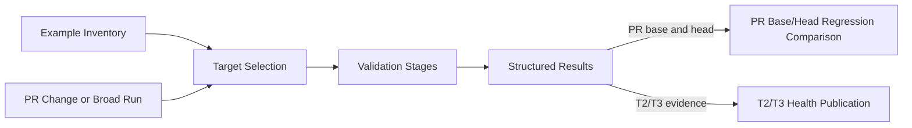

# Ianvs Example Validator

## Introduction

The Ianvs Example Validator is an inventory-driven tool for validating
repository examples locally and in GitHub Actions. It provides lightweight
static checks, dependency and environment validation, runtime smoke testing,
pull-request regression detection, and broad example-health evidence.

## Background

Ianvs includes examples for edge AI, cloud-edge collaboration, federated and
lifelong learning, LLM benchmarking, robotics, and other distributed AI
scenarios. These examples span different Python versions, dependencies,
datasets, models, external services, and hardware requirements. As they age,
dependency drift, outdated configuration, missing resources, hardcoded local
paths, and runtime assumptions can make an example fail from a clean checkout.

Discovering those failures manually does not scale and gives contributors
little evidence about whether a failure is new, pre-existing, or caused by an
external change. The validator provides repeatable checks, pull-request
regression comparison, and broad health reporting so maintainers can classify
example health without treating every historical failure as a new PR
regression. It validates and reports example behavior; it does not claim that
every example or external execution environment is fully restored.

See the original [example restoration proposal](../../../docs/proposals/scenarios/example-restoration/phase-3-2026-term-2/proposal.md)
for the broader design context.

## Features

- **Inventory-driven validation** selects benchmark units and their configured
  validation paths from one maintained inventory.
- **Layered checks** cover source and configuration structure, dependencies,
  environment preparation, datasets, and runtime integration.
- **Local and CI execution** uses the same validation runner and contracts.
- **Regression-aware pull requests** distinguish new blocking issues from
  pre-existing failures.
- **Published example health** summarizes broad T2/T3 evidence for maintainers
  and contributors.

See the [validation rules](../../../docs/example_validator/validation_rules.md)
for the authoritative checks, contracts, and CI selection behavior.

## How It Works



## Validation in CI

| Tier | Purpose |
| --- | --- |
| T0 | Static validation for changed examples. |
| T1 | Dynamic validation for changed examples. |
| T2 | Broad validation for validator- or core-impacting changes. |
| T3 | Broad main-branch and periodic example-health validation. |

See [CI coverage](../../../docs/example_validator/validation_rules.md#ci-coverage)
for exact triggers, target selection, lifecycle eligibility, and `SKIP`
behavior.

## Quick Start

Run commands from the Ianvs repository root. Create a disposable environment
and install the lightweight validator dependency:

```bash
python -m venv .venv-validator
. .venv-validator/bin/activate
python -m pip install -r .github/workflows/validator/requirements.txt
```

### Quick static validation

```bash
python .github/workflows/validator/validation_runner.py \
  --static \
  --example examples/llm_simple_qa
```

### Full local dynamic validation

Install the Ianvs runtime prerequisites described in the
[local validation guide](../../../docs/example_validator/local_validation.md#prerequisites),
then run:

```bash
python .github/workflows/validator/validation_runner.py \
  --dependency \
  --pip-install \
  --prepare-env \
  --smoke \
  --example examples/llm_simple_qa
```

`--pip-install` changes the active Python environment. Run dynamic validation
in a disposable virtual environment. For other selectors, dependency modes,
standalone dataset checks, reports, timeouts, affected-example detection, and
troubleshooting, see the
[local validation guide](../../../docs/example_validator/local_validation.md).

## Validation Reports

Current workflows publish a Markdown report to the GitHub Step Summary and
upload JSON and Markdown artifacts. Pull-request reports also include the
base-versus-head regression classification. Base and head validation select
targets from their own revision's inventory, so the report can identify added
and removed benchmark units as well as check-level regressions.


The validator produces three related but distinct kinds of information:

| Concept | Question answered | Authoritative documentation |
| --- | --- | --- |
| Validator check result | Did an individual rule pass, fail, warn, or skip? | [Validation rules](../../../docs/example_validator/validation_rules.md#result-levels) |
| PR-impact classification | Did the pull request introduce a blocking issue? | [Classification policy](../../../docs/example_validator/classification_policy.md) |
| Published example health | What does the latest broad evidence say about the example group? | [Status directions](../../../docs/example_validator/status_directions.md) |

## Example Health

Broad T2 and T3 validation produces example-health evidence. The
[example classification matrix](../../../examples/README.md) displays the
current status backed by automatically generated snapshots.

See [status directions](../../../docs/example_validator/status_directions.md)
for badge meanings, aggregation, publication, and validation timestamps.

## Adding a Validation Target

Add one inventory entry per benchmark job or benchmarking YAML. A minimal entry
that remains inactive until dynamic coverage is ready looks like this:

```yaml
examples:
  - name: my_example_singletask_learning
    example: my_example
    status: unvalidated
    python_version: "3.8"
    path: examples/my_example
    benchmark_file: examples/my_example/benchmarkingjob.yaml
```

Add dependency, preparation, dataset, and Mock Runtime metadata only when the
target needs them, then validate locally before enabling active dynamic
coverage. See the authoritative
[inventory rules](../../../docs/example_validator/validation_rules.md#inventory-rules)
for the complete contract.

## Future Work

These are design directions, not current validator capabilities:

- extensible validator interfaces and versioned schemas;
- broader Markdown, semantic, hardware, and dataset validation;
- stronger execution isolation, security, retry, and caching controls;
- complete local multi-job validation after the
  [`act#6114`](https://github.com/nektos/act/issues/6114) artifact blocker is
  resolved; and
- validation history, cross-environment comparison, and per-benchmark health.

See the [proposal](../../../docs/proposals/scenarios/example-restoration/phase-3-2026-term-2/proposal.md)
for the broader roadmap and the
[local guide](../../../docs/example_validator/local_validation.md#optional-workflow-inspection-with-act)
for the current `act` limitation.

## Documentation

| If you want to... | Read |
| --- | --- |
| Understand exactly what each validator checks | [Validation rules](../../../docs/example_validator/validation_rules.md) |
| Run or debug validation locally | [Local validation](../../../docs/example_validator/local_validation.md) |
| Understand why a PR is blocked or not blocked | [Classification policy](../../../docs/example_validator/classification_policy.md) |
| Understand example badges and published health | [Status directions](../../../docs/example_validator/status_directions.md) |

## Related Workflows

- [Static validation workflow](../static_code_requirement_cicd.yaml)
- [Dynamic validation workflow](../dynamic_code_cicd.yaml)
