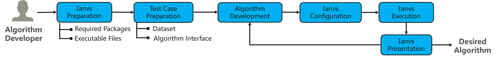
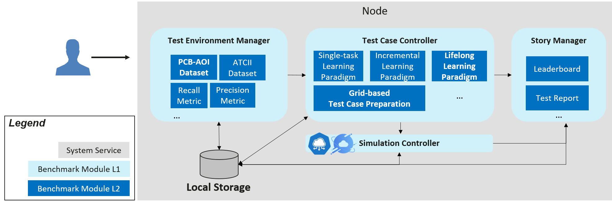
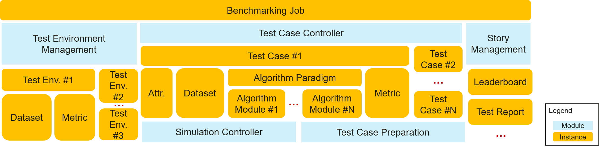

# Distributed Synergy AI Benchmarking
Edge computing emerges as a promising technical framework to overcome the challenges in cloud computing. In this machine-learning era, the AI application becomes one of the most critical type of applications on the edge. Driven by the increasing computation power of edge devices and the increasing amount of data generated from the edge, edge-cloud synergy AI and distributed synergy AI techniques have received more and more attention for the sake of device, edge, and cloud intelligence enhancement. 

Nevertheless, distributed synergy AI is at its initial stage. For the time being, the comprehensive evaluation standard is not yet available for scenarios with various AI paradigms on all three layers of edge computing systems. According to the landing challenge survey 2022, developers suffer from the lack of support of related datasets and algorithms; while end users are lost in the sea of mismatched solutions. That limits the wide application of related techniques and hinders a prosperous ecosystem of distributed synergy AI. A comprehensive end-to-end distributed synergy AI benchmark suite is thus needed to measure and optimize the systems and applications. 

This proposal provides a basic benchmark suite for distributed synergy AI, so that AI developers and end users can benefit from efficient development support and best practice discovery.

## Goals
For developers or end users of distributed synergy AI solutions, the goals of the distributed synergy AI framework are: 
- Facilitating efficient development for developers by preparing
    - test cases including dataset and corresponding tools
    - benchmarking tools including simulation and hyper-parameter searching
- Revealing best practices for developers and end users
    - presentaion tools including leaderboards and test reports

## Proposal
The distributed synergy AI benchmarking Ianvs aims to test the performance of distributed synergy AI solutions following recognized standards, in order to facilitate more efficient and effective development. Its scope includes:
- Provide end-to-end benchmark toolkits across devices, edge nodes and cloud nodes based on typical distributed-synergy AI paradigms and applications. 
    - Tools for Test Environment Management. For example, it would be necessary to support the CRUD (Create, Read, Update and Delete) actions in test environments. Elements of such test environments include algorithm-wise and system-wise configuration 
    - Tools for Test-case Preparation. Typical examples include paradigm templates, simulation tools, and hyper-parameter-based preparation tools.
    - Tools for Benchmark Presentation, e.g., leaderboard and test report generation.  
- Cooperation with other communities, e.g., in KubeEdge SIG AI, to establish comprehensive benchmarks and developed related applications, which can include but are not limited to 
    - Dataset collection, re-organization, and publication
    - Formalized specifications, e.g., standards 
    - Holding competitions or coding events, e.g., open source promotion plan
    - Maintaining solution leaderboards or certifications for commercial usage 

Targeting users
- Developers: build and publish edge-cloud collaborative AI solutions efficiently from scratch
- End users: view and compare distributed synergy AI capabilities of solutions

## Design Details
### User flow
The user flow for the algorithm developer is as follows. 
1. Ianvs Compilation: Prepare executable file for Ianvs. 
    - An algorithm developer can compile Ianvs in his/her own machine to adapt to the local environment, e.g., with TPU. 
    - Or directly download the pre-compiled executable file if the local environment is following default settings.
1. Test Case Preparation 
    - Dataset. Datasets can be large. To avoid over-size projects, the Ianvs executable file and code base do not include origin datasets and developers can download datasets from source links (e.g., from Kaggle) given by Ianvs. 
    - Algorithm Interface. The tested algorithm should follow the Ianvs interface to ensure functional benchmarking.
1. Algorithm Development: Develop the targeted algorithm
1. Ianvs Configuration: Fill configuration files for Ianvs
1. Ianvs Execution: Run the executable file of Ianvs for benchmarking
1. Ianvs Presentation: View the benchmarking result of the targeted algorithms
1. Repeat Step 3 - 6 until the targeted algorithm is satisfactory

### Architecture and Modules
The Ianvs is designed to run within a single node. The architectures and related concepts are shown in the below figure. Critical components include
- Test Environment Management: the CRUD of test environments serving for global usage
- Test Case Controller: control the runtime behavior of test cases like instance generation and vanish 
- Test Case Preparation: test case generation based on certain rules or constraints, e.g., the range of parameters 
- Story Management: the output management and presentation of the test case, e.g., leaderboards
- Simulation Controller: control the simulation process of edge-cloud synergy AI, including the instance generation and vanish of simulation containers

### Definitions of Instances

Quite a few terms exist in ianvs, which include the detailed modules and instances. To facilitate easier concept understanding, we show a hierarchical table of terms in the following figures.  

The concept definition of modules has been shown in the Architecture Section. In the following, we introduce the concepts of instances for easier understanding. 
- Benchmark: standardized evaluation process recognized by the academic or industry.  
- Benchmarking Job: the serving instance for an individual benchmarking with Ianvs, which takes charge of the lifetime management of all possible Ianvs components.
- Test Object: the targeted instance under benchmark testing. A typical example would be a particular algorithm or system. 
- Test Environment: the configuration of benchmarking, including algorithm-wise and system-wise configuration. But it does not include the test object.  
- Test Case: the executable instance to evaluate the performance of the test object under a particular test environment. Thus, the test case is usually generated with a particular test environment and outputs testing results if executed. It is the atomic unit of a benchmark. That is, a benchmarking job can include quite a few test cases.
- Attr. of Test Case: Attributes or descriptors of a test case, e.g., id, name, and time stamp.   
- Algorithm Paradigm: acknowledged AI process which usually includes quite a few modules that can be implemented with replaceable algorithms, e.g., federated learning which includes modules of local train and global aggregation.  

### Details of Modules

The proposal includes Test Environment Management, Test-case Preparation and Benchmark Presentation in the Distributed Synergy AI benchmarking toolkits, where
1. Test Environment Management supports the CRUD of Test environments, which include
    - Algorithm-wise configuration
        - Public datasets
        - Pre-processing algorithms
        - Feature engineering algorithms
        - Post-processing algorithms like metric computation
    - System-wise configuration
        - Overall architecture
        - System constraints or budgets
            - End-to-end cross-node 
            - Per node
1. Test-case Preparation which includes
    - Templates of common distributed-synergy-AI paradigms, which can help the developer to prepare their test case without too much effort. Such paradigms include edge-cloud synergy joint inference, incremental learning, federated learning, and lifelong learning. 
    - Simulation tools. Develop simulated test environments for test cases
    - Other test-case preparation tools. For instance, prepare test cases based on a given range of hyper-parameters. 
1. Benchmark Presentation which includes
    - Leaderboard generation
    - Test report generation

