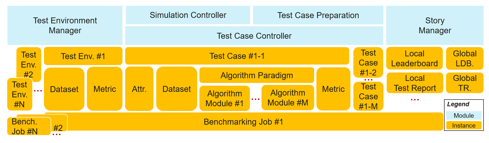

# Distributed Synergy AI Benchmarking
Edge computing emerges as a promising technical framework to overcome the challenges in cloud computing. In this machine-learning era, the AI application becomes one of the most critical types of applications on the edge. Driven by the increasing computation power of edge devices and the increasing amount of data generated from the edge, edge-cloud synergy AI and distributed synergy AI techniques have received more and more attention for the sake of device, edge, and cloud intelligence enhancement. 

Nevertheless, distributed synergy AI is at its initial stage. For the time being, the comprehensive evaluation standard is not yet available for scenarios with various AI paradigms on all three layers of edge computing systems. According to the landing challenge survey 2022, developers suffer from the lack of support on related datasets and algorithms; while end users are lost in the sea of mismatched solutions. That limits the wide application of related techniques and hinders a prosperous ecosystem of distributed synergy AI. A comprehensive end-to-end distributed synergy AI benchmark suite is thus needed to measure and optimize the systems and applications. 

This proposal provides a basic benchmark suite for distributed synergy AI, so that AI developers and end users can benefit from efficient development support and best practice discovery.

## Goals
For developers or end users of distributed synergy AI solutions, the goals of the distributed synergy AI framework are: 
- Facilitating efficient development for developers by preparing
    - test cases including dataset and corresponding tools
    - benchmarking tools including simulation and hyper-parameter searching
- Revealing best practices for developers and end users
    - presentation tools including leaderboards and test reports

## Proposal
The distributed synergy AI benchmarking ianvs aims to test the performance of distributed synergy AI solutions following recognized standards, in order to facilitate more efficient and effective development. 

The scope of ianvs includes
- Providing end-to-end benchmark toolkits across devices, edge nodes and cloud nodes based on typical distributed-synergy AI paradigms and applications. 
    - Tools to manage test environment. For example, it would be necessary to support the CRUD (Create, Read, Update and Delete) actions in test environments. Elements of such test environments include algorithm-wise and system-wise configuration.  
    - Tools to control test cases. Typical examples include paradigm templates, simulation tools, and hyper-parameter-based assistant tools.
    - Tools to manage benchmark presentation, e.g., leaderboard and test report generation. 
- Cooperation with other organizations or communities, e.g., in KubeEdge SIG AI, to establish comprehensive benchmarks and developed related applications, which can include but are not limited to 
    - Dataset collection, re-organization, and publication
    - Formalized specifications, e.g., standards 
    - Holding competitions or coding events, e.g., open source promotion plan
    - Maintaining solution leaderboards or certifications for commercial usage 

Targeting users
- Developers: Build and publish edge-cloud collaborative AI solutions efficiently from scratch
- End users: view and compare distributed synergy AI capabilities of solutions

The scope of ianvs does NOT include to
- Re-invent existing edge platform, i.e., kubeedge, etc.
- Re-invent existing AI framework, i.e., tensorflow, pytorch, mindspore, etc. 
- Re-invent existing distributed synergy AI framework, i.e., kubeedge-sedna, etc.
- Re-invent existing UI or GUI toolkits, i.e., prometheus, grafana, matplotlib, etc.

## Design Details
### User flow
The user flow for an algorithm developer is as follows. 
1. ianvs Preparation: 
    1. Install required packages specified in requirement files
    1. Prepare executable files for ianvs. An algorithm developer can
        - either interpret/ compile the code of ianvs in his/her machine to adapt to the local environment, e.g., with TPU. 
        - or directly download the pre-compiled executable files/ wheels if the local environment is following default settings.
1. Test Case Preparation 
    - Prepare the dataset according to the targeted scenario 
        - Datasets can be large. To avoid over-size projects, the ianvs executable file and code base do not include origin datasets and developers can download datasets from source links (e.g., from Kaggle) given by ianvs. 
    - Leverage the ianvs algorithm interface for the targeted algorithm. 
        - The tested algorithm should follow the ianvs interface to ensure functional benchmarking.
1. Algorithm Development: Develop the targeted algorithm
1. ianvs Configuration: Fill configuration files for ianvs
1. ianvs Execution: Run the executable file of ianvs for benchmarking
1. ianvs Presentation: View the benchmarking result of the targeted algorithms
1. Repeat Step 3 - 6 until the targeted algorithm is satisfactory

### Architecture and Modules
The architectures and related concepts are shown in the below figure. The ianvs is designed to run within a single node. Critical components include
- Test Environment Manager: the CRUD of test environments serving for global usage
- Test Case Controller: control the runtime behavior of test cases like instance generation and vanish 
    - Generation Assistant: assist users to generate test cases based on certain rules or constraints, e.g., the range of parameters 
    - Simulation Controller: control the simulation process of edge-cloud synergy AI, including the instance generation and vanishment of simulation containers
- Story Manager: the output management and presentation of the test case, e.g., leaderboards

### Definitions of Instances

Quite a few terms exist in ianvs, which include the detailed modules and instances. To facilitate easier concept understanding, we show a hierarchical table of terms in the following figures.  

The concept definition of modules has been shown in the Architecture Section. In the following, we introduce the concepts of instances for easier understanding. 
- ``Benchmark``: standardized evaluation process recognized by the academic or industry.  
- ``Benchmarking Job``: the serving instance for an individual benchmarking with ianvs, which takes charge of the lifetime management of all possible ianvs components. 
    - Besides components, a benchmarking job includes instances of a test environment, one or more test cases, a leaderboard, or a test report. 
    - Different test environments lead to different benchmarking jobs and leaderboards. A benchmarking job can include multiple test cases. 
- ``Test Object``: the targeted instance under benchmark testing. A typical example would be a particular algorithm or system. 
- ``Test Environment (Test Env.)``: setups or configurations for benchmarking, typically excluding the test object.  
    - It can include algorithm-wise and system-wise configurations.  
    - It serves as the unique descriptor of a benchmarking job. Different test environments thus lead to different benchmarking jobs.
- ``Test Case``: the executable instance to evaluate the performance of the test object under a particular test environment. Thus, the test case is usually generated with a particular test environment and outputs testing results if executed. 
    - It is the atomic unit of a benchmark. That is, a benchmarking job can include quite a few test cases.
- ``Attribute (Attr.) of Test Case``: Attributes or descriptors of a test case, e.g., id, name, and time stamp.   
- ``Algorithm Paradigm``: acknowledged AI process which usually includes quite a few modules that can be implemented with replaceable algorithms, e.g., federated learning which includes modules of local train and global aggregation.  
- ``Algorithm Module``: the component of the algorithm paradigm, e.g., the global aggregation module of the federated learning paradigm.  
- ``Leaderboard (LDB)/ Test Report (TR)``: the ranking of the test object under a specific test environment. 
    - The local node holds the local leaderboard for private usage. 
    - The local leaderboard can be uploaded to a shared space (e.g., GitHub) as the global leaderboard. 

### Details of Modules

The proposal includes Test-Environment Management, Test-case Controller and Story Manager in the Distributed Synergy AI benchmarking toolkits, where
1. Test-Environment Manager supports the CRUD of Test environments, which basically includes
    - Algorithm-wise configuration
        - Public datasets
        - Pre-processing algorithms
        - Feature engineering algorithms
        - Post-processing algorithms like metric computation
    - System-wise configuration
        - Overall architecture
        - System constraints or budgets
            - End-to-end cross-node 
            - Per node
1. Test-case Controller, which includes but is not limited to the following components 
    - Templates of common distributed-synergy-AI paradigms, which can help the developer to prepare their test case without too much effort. Such paradigms include edge-cloud synergy joint inference, incremental learning, federated learning, and lifelong learning. 
    - Simulation tools. Develop simulated test environments for test cases
    - Other tools to assist test-case generation. For instance, prepare test cases based on a given range of hyper-parameters. 
1. Story Manager, which includes but is not limited to the following components
    - Leaderboard generation
    - Test report generation

### Roadmap

Upon the release of ianvs, the roadmap would be as follows
- AUG 2022: Release Another Use Case and Advanced Algorithm Paradigm - Non-structured lifelong learning paradigm in ianvs
- SEP 2022: Release Another Use Case, Dataset, and Algorithm Paradigm - Another structured dataset and lifelong learning paradigm in ianvs
- OCT 2022: Release Advanced Benchmark Presentation - shared space for story manager to present your work in public
- NOV 2022: Release Advanced Algorithm Paradigm - Re-ID with Multi-edge Synergy Inference in ianvs
- DEC 2022: Release Simulation Tools
- JUN 2023: More datasets, algorithms, and test cases with ianvs
- DEC 2023: Standards, coding events, and competitions with ianvs
