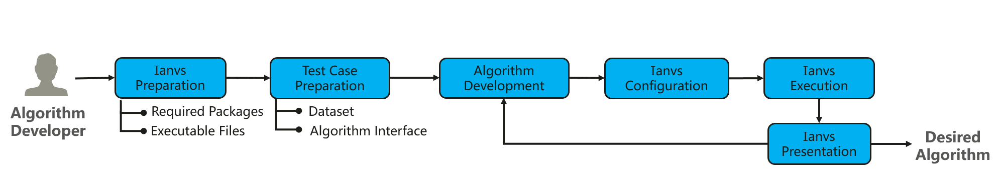

The user flow for an algorithm developer is as follows. 
1. ianvs Preparation: 
    1. Install required packages specified in requirement files
    1. Prepare executable files for ianvs. An algorithm developer can
        - either interpret/ compile the code of ianvs in his/her machine to adapt to the local environment, e.g., with TPU. 
        - or directly download the pre-compiled executable files/ wheels if the local environment is following default settings.
1. Test Case Preparation 
    - Prepare the dataset according to the targeted scenario 
        - Datasets can be large. To avoid over-size projects, the ianvs executable file and code base do not include origin datasets and developers can download datasets from source links (e.g., from Kaggle) given by ianvs. 
    - Leverage the ianvs algorithm interface for the targeted algorithm. 
        - The tested algorithm should follow the ianvs interface to ensure functional benchmarking.
1. Algorithm Development: Develop the targeted algorithm
1. ianvs Configuration: Fill configuration files for ianvs
1. ianvs Execution: Run the executable file of ianvs for benchmarking
1. ianvs Presentation: View the benchmarking result of the targeted algorithms
1. Repeat Step 3 - 6 until the targeted algorithm is satisfactory