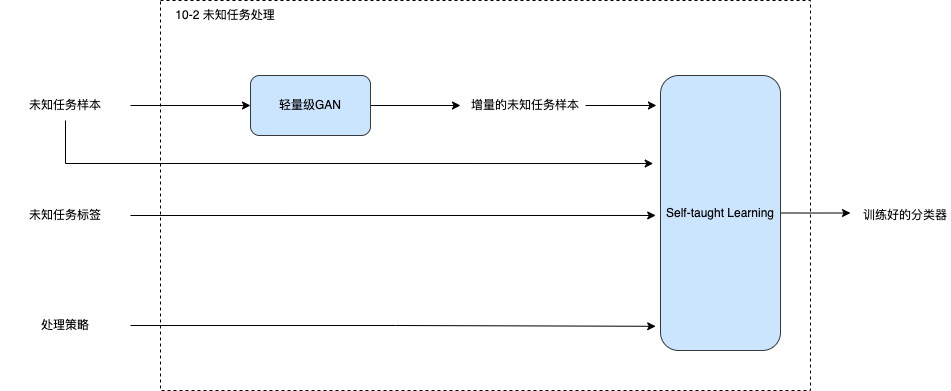
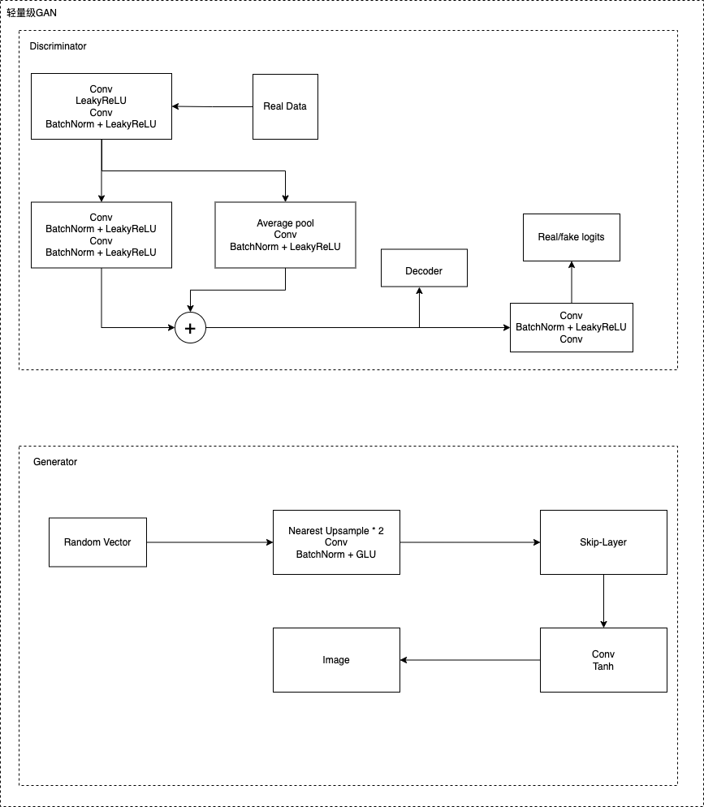

# Integrate GAN and Self-taught Learning into ianvs Lifelong Learning to Handle Unknown Tasks

## Motivation

In the process of ianvs lifelong learning, there would be a chance to confront unknown tasks, whose data are always heterogeneous small sample. Generate Adversarial Networks(GAN) is the start-of-art generative model and GAN can generate fake data according to the distribution of the real data. Naturally, we try to utilize GAN to handle small sample problem. Self-taught learning is an approach to improve classfication performance using sparse coding to construct higher-level features with the unlabeled data. Hence, we combine GAN and self-taught learning to help ianvs lifelong learning handle unknown tasks.

### Goals

* Handle unknown tasks
* Implement of a lightweight GAN to solve small sample problem
* Utilize self-taught learning to solve heterogeneous problem

## Proposal
We focus on the process of handling unknown tasks.     

The overview is as follows:

The process is illustrated as below:    
1. GAN exploits the unknown task sample to generate more fake sample. 
2. Self-taught learning unit utilize the fake sample and orginal unknown task sample and its label to train a classifier.
3. A well trained classifier is output.

### GAN Design
We use the networks design by [TOWARDS FASTER AND STABILIZED GAN TRAINING FOR HIGH-FIDELITY FEW-SHOT IMAGE SYNTHESIS](https://openreview.net/forum?id=1Fqg133qRaI). The design is aimed for small training data and pour computing devices. Therefore, it is perfectly suitable for handling unkwnon tasks of ianvs lifelong learning. The networks is shown below.    

### Self-taught Learing Design
Self-taught learning uses unlabeled data to find the latent feature of data and then makes every labeled data a represention using the latent feature and uses the represention and label corresponding to train classifier.    

