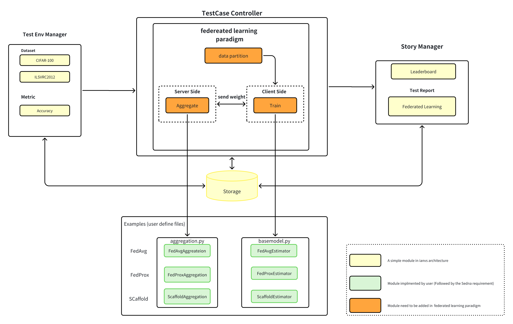
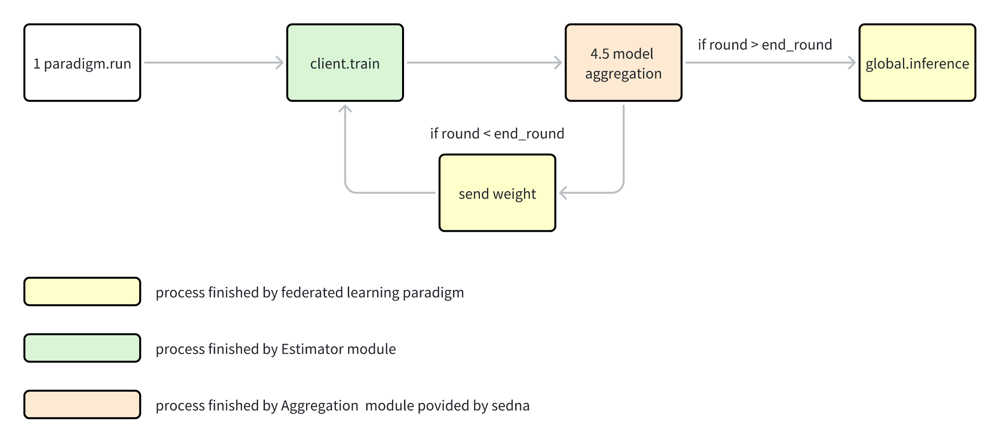
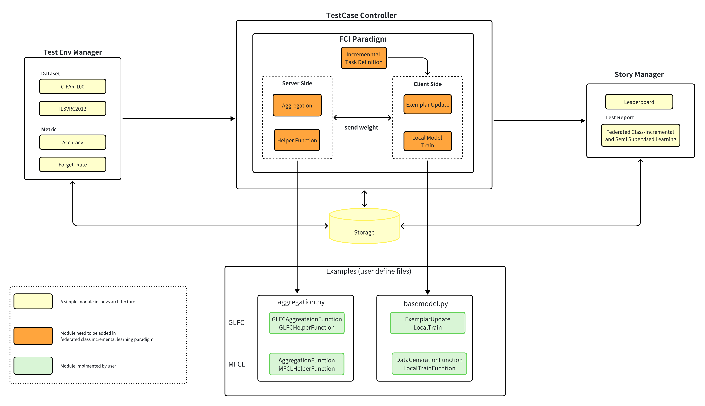
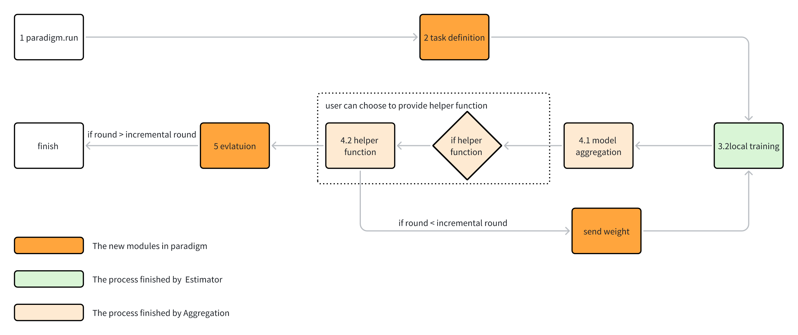
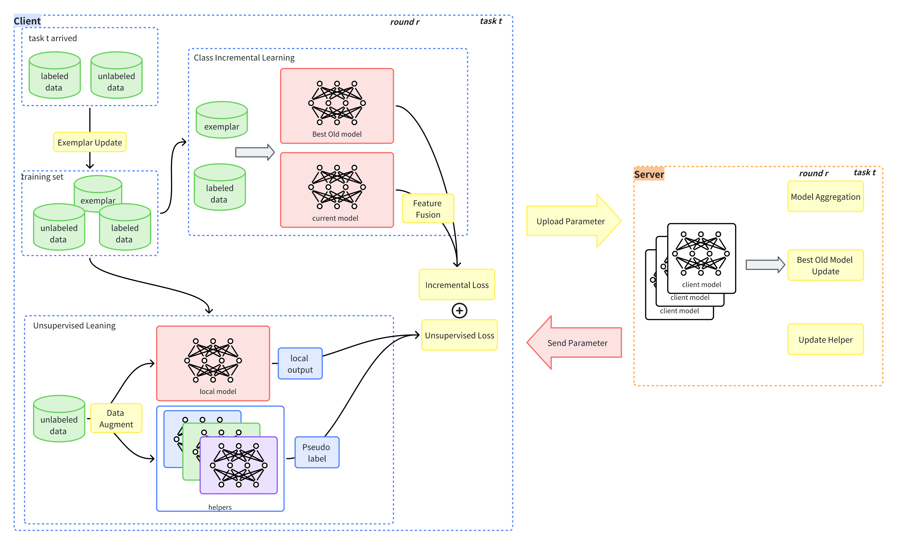

# Federated Incremental Learning for Label Scarcity: Base on KubeEdge-Ianvs

## 1 Motivation

### 1.1 Background

The data arriving at the edge device in the edge environment continues to increase over time, leading to an expanding range of categories. Due to labeling costs, only a small portion of this data is labeled. To optimize models using such data, collaborative distributed model training can be conducted among edge devices through federated learning. However, traditional federated learning only considers supervised learning in scenarios with static data and cannot be trained on dynamically changing datasets with limited labels. This project aims to fully utilize scarce labeled streaming data from different edge devices and perform distributed training of the model using federated learning techniques, thereby mitigating model forgetting in class incremental learning scenarios and enhancing overall generalization ability.

Currently, several Federated Class-Incremental Learning methods have been proposed, such as GLFC[1] and Target[2], which address catastrophic forgetting issues in federated learning under streaming data. However, these methods do not leverage unlabeled data. On the other hand, numerous Federated Semi-Supervised Learning methods have been developed, including SemiFL[3] and FedMatch[4], which make use of unlabeled data at the edge. Nevertheless, they are unable to handle streaming data effectively. Consequently, there is a need for Federated Class Incremental Semi-Supervised Learning methods.

AS a result, we will implement a novel Federated Incremental Learning algorithm for label scarcity base on ianvs. Ianvs is a distributed synergy AI benchmarking project incubated in KubeEdge SIG AI. However ianvs has the following problem:

- Lacking of the ability to benchmarking federated class incremental learning. 
- The Paradigm Ianvs support did not provide a distributed benchmarking environment.

### 1.2 Goals

To ensure the effectiveness and practicality of the algorithm, the research objectives of this algorithm are as follows:

- Implement a new benchmark paradigm for federated class incremental learning within the Ianvs framework.
  - Utilize this paradigm to benchmark state-of-the-art federated class incremental learning algorithms for label scarcity.
  - Employ this paradigm to benchmark classic federated class incremental learning algorithms.

- Define the problem of Federated Class Incremental for label scarcity and propose an efficient algorithm to solve it.
  - Fully leverage unlabeled data at the edge and enable incremental learning capability.

## 2 Proposals

The scope of this project includes:

- Define a Federated Class-Incremental learning paradigm base on Ianvs.

  - Sedna is a distributed synergy AI framework, which support plenty of distributed algorithm including incremental learning, federated learning.
  - Ianvs is a distributed synergy AI benchmarking, many benchmarking example can be found in ianvs. However, Ianvs did not support federated class incremental learning paradigm. Our project will fill this gap in the Ianvs project.
  
- Propose a new and effective federated class incremental learning algorithm to utilize the unlabeled data in the edge.

  - A combination of semi-supervised learning and federated class incremental learning.

- Conduct a series of federated class incremental learning benchmarking 

  - We will conduct a series of benchmarking not only some classic baseline methods, but also our SOTA algorithm.

Target users:

- Researchers:  To benchmarking their federated class incremental learning methods.

## 3 Design Details

### 3.1 Problem Definition

In applications such as video surveillance, the camera continuously acquires new data over time, and there may be new categories in these data, such as unseen faces. It is expensive to confirm the class of the data, and only a small amount of data is labeled. Traditional centralized machine learning needs to collect user data to the cloud, which has huge data transmission overhead and privacy issues. However, federated learning is based on supervised learning,  which cannot use unlabeled samples and does not consider the dynamic change of data sets. There are various limitations on edge devices, such as limited resources, so it is necessary to train the model through cloud-edge collaboration.


In order to combine federated class incremental learning and semi supervised learning, we propose the Federated class-incremental Semi-Supervised Learning (FCI-SSL) to solve the above problem of Class Incremental learning with sparse labels in the edge environment.

The scenario of FCI-SSL can refer to the standard scenario in data partitioning of federated semi-supervised learning. At present, incremental semi-supervised learning for disjoint scenarios faces many challenges. Firstly, the data held by client $c$ is unlabeled data, so the source of incremental labeled samples cannot be determined, which is contradictory with the federated learning setting. So consider standard scenario, there is a server, used to aggregate model from the client, have $N$ client, each client $c$  in the task $i$  holds  a sequence data set $D= \{D_ {is}, D_ {iu}\}$, The total number of samples in labeled data sets is much smaller than that in unlabeled data sets, that is, $|D^c_{is}| \ll |D^c_{iu}|$, and the data distribute on different clients is usually non-IID.

In federated learning, the server and the client use the same feature extractor, which is denoted as $G^s$ for the server and $\theta_{G^s}$ for its parameters. The feature extractor of the client is denoted as $\{L^c\}^N_{c=1}$, and its parameters are denoted as $\theta_{L^c}$.

Federated incremental semi-supervised learning is based on the following assumptions:

1. A participant consists of a server and multiple clients, and client-server and client-client do not share data
2. n task sequences {$C_1$,$C_2$,$C_3$⋯}, the data of each task sequence is new data, and contains a small amount of labeled data and a large amount of unlabeled data, and the labeled data must contain new categories. Each client can only access the local data of task k during its training.
4. The data distribution of each client should be non-independent and identically distributed.
5. Each client is allowed to keep a certain memory of examples, and $|M| \ll |D^c_{is}|$

The training objective of Federated Class Incremental Semi-supervised learning (FCI-SSL) is


$$
min L = \lambda_1L_s + \lambda_2L_u + \lambda_3 L_{c}
$$


Where $L_s$represents the supervised loss, $L_u$represents the unsupervised loss, and $L_c$represents the class incremental loss, which is a correction term that minimizes the above loss so that the model can recognize unlabeled data during training and prevent catastrophic forgetting.


### 3.2 Architecture Design

First, Let's introduce the training process for FCI-SSL :

1. At the beginning of each training round, the server samples the clients and sends the global model to them.
2. When the new task arrived, the first step is to recognize the new task and  maybe client can perform exemplar data update function.
3. The next step for the client is local model training. Since the training dataset is mainly unlabeled data, the client needs to perform pseudo-label generation on the unlabeled data before it can utilize the data.
4. After the local training is completed, the client uploading the learned model parameters to the server for parameter aggregation.
5. The server receives client parameters, aggregates them, and maybe will performs some helper functions to help alleviate catastrophic forgetting both locally and globally.
6. Then repeat steps 1-5 until all tasks are completed.

#### 3.2.1 Federated Learning Paradigm Design

Federated incremental learning is a special kind of federated learning. However Ianvs did not support federated learning algorithm paradigm. So before we begin to design the federated class incremental learning algorithm, we have to design a simple and single node version of federated learning. 

Sedna is a edge-cloud collaborative training AI framework. It support federated learning ability. Base on Sedna, we can have a simple federated learning architecture: 



##### Implementation Detail

For implementation detail of federated learning, we plan to add  a module name `federated learning` under `core/testcasecontroller/algorithm/paradigm`:

- `federated_learning.py `: serves as the entry point for the whole learning process
- `sedna_federated_learning.py`: is a simple `FederatedLearning` client, which describe the main behavior of the client.

We will add enumerations for `federated learning` in `ParadigmType` within `core/common/constant` and add enumerations  for `Aggregation` in `ModuleType` to inject the user self implemented aggregation module:

```python
# core/common/constatn
class ParadigmType(Enum):
    """
    Algorithm paradigm type.
    """
    ... # other paradigm type
    FEDERATED_LEARNING = "federatedlearning"
    FEDERATED_CLASS_INCREMENTAL_LEARNING = "federatedclassincrementallearning"

class ModuleType(Enum):
    """
    Algorithm module type.
    """
    BASEMODEL = "basemodel"
    ... # other module type
    # FL_AGG
    AGGREGATION = "aggregation"
```

It is quite clear and specific that the paradigm need to start the server and client in single node and then perform federated learning, the whole process can be shown as follow:



Federated Learning Paradigm involved above process, `the yellow block` means the process that the paradigm will execute, `the green block` is the process that paradigm will invoke the estimator to execute and `the pink block` is the process that paradigm will invoke the aggregation to execute.

The `Federated Learning Paradigm` will be organize as follow:

```python
class FederatedLearning(ParadigmBase):

    def __init__(self, workspace, **kwargs):
        super(FederatedLearning, self).__init__(workspace, **kwargs)
        ... # orther parameter init
        self.aggregation, self.aggregator = self.module_instances.get(ModuleType.AGGREGATION.value)

    def init_client(self):
        """
        init the client base on the client number
        """
        self.clients = [self.build_paradigm_job(ParadigmType.FEDERATED_LEARNING.value) for i in
                        range(self.clients_number)]

    def run(self):
        """
        run the test flow of federaeted learning paradigm.
        Returns
        ------
        test result: numpy.ndarray
        system metric info: dict
            information needed to compute system metrics.
        """
        # init client
        # partition data
        # train loop:
        	# local train
            # aggregation
            # send weights to client
        # global predict

    def train_data_partition(self, train_dataset_file):
        """
         Partition the dataset for the class incremental learning paradigm
         - i.i.d
         - non-i.i.d
         """
   
    def train(self, train_datasets, **kwargs):
        """
         perform local train by invoke client implemented estimator.train function
        """
        
    def send_weights_to_clients(self, global_weights):
        """
        send the aggregated weights to client
        """
        
    def predict(self, test_dataset_file):
        # global test
```

#### 3.2.2 Federated Class Incremental Learning Paradigm Design

Base on the above paradigm, we can conduct our federated-class-incremental learning paradigm and the timing diagram of the entire Benchmarking system is presented below: 


We will leverage the existed *TestEnvManager*, *TestCaseController* and *StoryManager* in Ianvs. In order to perform the process of federated class incremental learning for label scarcity, we also add a new paradigm —— federated class incremental learning paradigm （FCI Paradigm). Basically, we will add some feature in Ianvs:

- In *Test Env Manager*: 
  - Add new benchmarking Accuracy and Forget Rate as metrics. 
  - Add a new auto generate dataset function to generate dataset.
  - Add a data utils to partition data
- In *Test Case Controller*
  - Add a new type of Algorithm Paradigm——Federated  learning Algorithm Paradigm.
  - Add  Federated  Class Incremental learning Algorithm Paradigm base on Federated learning Paradigm to normalize the whole process of federated class incremental learning. User have to specify two part of the paradigm —— server and client.
- In *Story Manager*
  -  Show Leaderboard and Test Report for users.

The overall architecture is shown as follow: 



##### Implementation Detail

For implementation detail of federated class incremental learning, we plan to add  a module name `federated class incremental learning` base on `federeated learning` under `core/testcasecontroller/algorithm/paradigm`:

- `federated_class_incremental_learning.py `: serves as the entry point for the whole learning process

We design a novel algorithm paradigm namely Federated-Class-Incremental-Learning Paradigm,  We specify the process of the algorithm paradigm as follows:



Federated Class Incremental Learning Paradigm involved above process, `the orange block` means the process that the paradigm will execute, `the green block` is the process that paradigm will invoke the estimator to execute and `the pink block` is the process that paradigm will invoke the aggregation to execute.

The `Federated Class Incremental Learning Paradigm ` will be organize as follow:

```python
class FederatedClassIncrementalLearning(FederatedLearning):
    
    def __init__(self, workspace, **kwargs):
        super(FederatedClassIncrementalLearning, self).__init__(workspace, **kwargs)
		... # parameter init
        self.incremental_rounds = kwargs.get("incremental_rounds", 1)
        
    def task_definition(self, dataset_files, task_id):
        """
        Define the task for the class incremental learning paradigm
        """
        
    def run(self):
    	"""
        run the test flow of federated class incremental learning paradigm.
        Returns
        ------
        test result: numpy.ndarray
        system metric info: dict
            information needed to compute system metrics.
        """
        # init client
        # task definition data
        # train loop:
        	# local train
            # aggregation
            # send weights to client
            # perform helper function if needed
        # global evaluation
    	
    def _train(self, train_datasets, **kwargs):
		"""
         perform local train by invoke client implemented estimator.train function
        """
        
    def send_weights_to_clients(self, global_weights):
        """
        send the aggregated weights to client
        """
        
    def helper_function(self,train_infos):
       """
       perform helper function if user have implmented helper function in aggregation module
       """
    
    def evaluation(self, testdataset_files, incremental_round):
       """
       perfrom some special metrics evaluation like forget rate
       """
```

In order to provide functionality extensibility and convenience to users, we have specified a process where most of the functionality can be replaced by user-implemented functionality(block in yellow). In addition, we require users to implement the server and client modules （block in green and orange） to complete the whole algorithm process. 

### 3.3 Benchmarking Design 

**Datasets Setting**  

The project will employ two prominent datasets, namely CIFAR-100 and ILSVRC2012, in addition to an optional dataset known as TinyImageNet. These datasets are widely acknowledged and commonly utilized in the field of image classification. 

Below are their download links

CIFAR-100: [CIFAR-10 and CIFAR-100 datasets (toronto.edu)](https://www.cs.toronto.edu/~kriz/cifar.html)

ILSVRC2012: [ImageNet (image-net.org)](https://image-net.org/challenges/LSVRC/2012/)

TinyImageNet: [Tiny ImageNet Dataset | Papers With Code](https://paperswithcode.com/dataset/tiny-imagenet)

We provide three kinds of classical data sets for incremental learning. When users implement their own algorithms, for the allocation of data sets, they can download them through the tool API provided by us and save them locally in the data processing format of Ianvs. After that, we will set the parameters according to the following benchmarking setting, and partition the data to meet the requirements of non-iid. 

**Construction Setting**

To be precise, our benchmarking framework allows users to test their code multiple times with controllable parameters. For example, when benchmarking GLFC on CIFAR-100, you can specify the *proportion of labeled data*, *the size of each incremental task*, *the number of communication rounds*, and *the number of clients*.  So that user can focus to the algorithm testing and ignore the detail of the class-incremental setting. 

The benchmarking setting items  are  as shown follow:

| benchmarking setting  | type         | value                             |
| --------------------- | ------------ | --------------------------------- |
| client_number         | optional     | 2/5/10                            |
| incremental round     | configurable | 10/20/50/100                      |
| dataset               | configurable | CIFAR-100/ILSVRC2012/TinyImageNet |
| dataset_partition     | optional     | non-iid/iid                       |
| labeled dataset ratio | optional     | 0.1/0.2/0.3/1.0                   |
| local model           | self define  | self define                       |
| task_size             | optional     | 5/10/20                           |

**Metrics Setting**

- *accuracy*

  Different from ordinary accuracy testing, accuracy testing in federated incremental learning needs to be performed in incremental tasks. After each task is completed, all the class data that have appeared need to be tested and finally we need to calculate the average accuracy for whole task and the final accuracy for test data. The accuracy of the model for incremental round $t > 1$ is calculated by the following:

  

  


  where $N$ is the total number of the  test set, and $C \in {C_1,..,C_t}$ is the class number of the test set, $N_j$ is the number of class $j$

  

- *forget rate*[7]

  We need to evaluate the forgetting of the algorithm which can reflect the model's performance on old classes. The forget rate for incremental round $t > 1$ is calculated by the following:
  
  
  

  where $C_{old}$ is the number of old classes, $acc_{i,j}$ is the accuracy of class i at incremental round j.

  

### 3.4 Algorithm Design

According to the training process,  there are some core problems need to solved:

- How can we utilize the unlabeled data ?
  - We need to design an efficient pseudo-label generation method, as well as an efficient unsupervised loss function.
- How can we alleviate catastrophic forgetting both locally and globally?
  - We need to design a federated class incremental algorithm based on exemplar.

In this project we need to design a FCI_SSL algorithm that can no only utilize the unlabeled data but also can alleviate the catastrophic forgetting both locally and globally. We name our FCI_SSL algorithm is SemiFCI.

Here is our first design of the algorithm process:  





**Agreement-Base Consistency Unsupervised loss**

we propose **agreement-base consistency unsupervised loss** to utilize the unlabeled data in edge . Consistency regularization is one of most popular approaches to learn from unlabeled examples in a semi-supervised learning setting.  Consistency-regularization methods enforce the predictions from the augmented examples and original (or weakly augmented) instances to output the same class label.  Based on the assumption that class semantics are unaffected by small input perturbations, these methods basically ensures consistency of the prediction across the multiple perturbations of same input.  So our unsupervised loss will be defined as follow:


$$
L_u = \frac{1}{N^k_u}\sum_{u^k \in D^k_u}CrossEntropy(\hat{y}, P(A(u^k),\theta^k))
$$


where $A(u^k)$ performs RandAugment on unlabeled data u at task k. $\hat{y}$ is the agreement-base pseudo-label, defined as follow:


$$
\hat{y} = Max( \frac{1}{H}\sum_{\theta^h \in H}P(\alpha(u^k),\theta^h) + onehot(P(\alpha(u^k), \theta^k)) )
$$


where H is the number of helpers and  $\theta^h$ is the corresponding model parameters. $\alpha(u^k)$ performs a week augment on unlabeled data at task k.

**Class Forgetting Compensate Loss**

We propose class-forgetting compensate loss to alleviate catastrophic forgetting. Our class compensation loss is mainly composed of two parts. The first part is the  gradient compensation mechanism proposed by GLFC[1], According to GLFC[1], we believe that adjust the gradient updates can help mitigate catastrophic forgetting. Specifically, for a single sample $(x^k_i, y^k_i)$ , we calculate its gradient measurement. $G^k_i$ with respect to the $y^k_i$-th neuron of the last output layer(the classifier layer) in $\theta$:


$$
G^k_i = P^k(x^k_i, \theta^k)_{y^k_i} - 1
$$


where $P^k(x^k_i, \theta)_{y^k_i}$ is the $y^k_i$-th softmax output of the i-th sample. To adjust the gradient update, GLFC perform a re-weight method. Given a mini-batch $\{x^k_i, y^k_i\}^b_{i=1}$, define:


$$
G_{new} = \frac{1}{sum^b_{i=1} \mathbb I_{y^k_i\in Y^k}}\sum^b_{i=1}|G^k_i| \mathbb I_{y^k_i\in Y^k}
$$

$$
G_{old} = \frac{1}{sum^b_{i=1} \mathbb I_{y^k_i\in \cup^{k-1}_{j=1}Y^j}}\sum^b_{i=1}|G^k_i| \mathbb I_{y^k_i\in \cup^{k-1}_{j=1}Y^j}
$$


as the gradient mean for new and old classes. where $\mathbb I(\cdot)$ is the indicator function that if the subscript condition is true,  $\mathbb I_{True} = 1$, otherwise, $\mathbb I_{False} = 0$。 

And the gradient compensation  loss will be denote as follow:


$$
L_{C} = \frac{1}{b} \sum^b_{i=1} \frac{|G^k_i|}{\bar{G}} \cdot CrossEntropy(P^k(x^k_i, \theta^k)y^k_i)
$$


The Second part is the feature fusion loss.  We will keep a local best old model to guide the training of our local model, as the best-old model keeps the old class information of the past task. The best old model will only be updated at the beginning of the task, and it fuses the local best old model, as well as the features of the assisting models:
$$
\theta^k_{best} = \alpha \theta^{k-1}_{best} + (1 - \alpha) \cdot \frac{1}{H} sum^H_{j=1} \theta^k_j
$$


 As a result, Given a mini batch data $(X^k_b, Y^k_b)$the feature fusion loss will be denote as follow:


$$
L_F = KL(P^k(X^k_b, \theta^k) || P^k(X^k_b, \theta^k_{best}))
$$


The optimization object for client is :
$$
L = \lambda_1 Lu + \lambda_2L_C + \lambda3 L_F
$$

### 3.5 User Example

#### 3.5.1 Federated Learning Example

Base on the architecture above, If user want to implement a federated learning algorithm， they can following the below instruction:

example path: `example/cifar100/federeated_learning/fedavg`

The folder structure will be as follows:

```cmd
├── federated_learning
│   └── fedavg
│       ├── algorithm
│       │   ├── aggregation.py
│       │   ├── algorithm.yaml
│       │   ├── basemodel.py
│       │   └── __pycache__
│       │       ├── aggregation.cpython-310.pyc
│       │       └── basemodel.cpython-310.pyc
│       ├── benchmarkingjob.yaml
│       └── testenv
│           ├── acc.py
│           ├── __init__.py
│           ├── __pycache__
│           │   └── acc.cpython-310.pyc
│           └── testenv.yaml
```

1. Define an `Estimator`

```python
from sedna.common.class_factory import ClassType, ClassFactory

@ClassFactory.register(ClassType.GENERAL, alias='fedavg')
class Estimator:

    def __init__(self, **kwargs):
        pass
        
    def predict(self, data, **kwargs):
        pass

    def evaluate(self, valid_data, **kwargs):
        pass

    def train(self, train_data, valid_data=None, **kwargs):
        pass
```

2. Define an `Aggregation`

```python
from sedna.common.class_factory import ClassType, ClassFactory

@ClassFactory.register(ClassType.FL_AGG, "FedAvg")
class FedAvg(BaseAggregation, abc.ABC):
    def __init__(self):
        super(FedAvg, self).__init__()
        pass
        
    def aggregate(self, clients):
        pass

```

3. Prepare the `algorithm.yaml`

```yaml
algorithm:
  paradigm_type: "federatedlearning"
  # new config for federated learning
  fl_data_setting:
    train_ratio: 1.0
    splitting_method: "default"
    label_data_ratio: 1.0
    data_partition: "iid"
  initial_model_url: "/home/wyd/ianvs/project/init_model/restnet.pb"

  modules:
    #   1> "basemodel"
    - type: "basemodel"
      name: "fedavg"
      url: "./examples/federated-learning/fedavg/algorithm/basemodel.py"
      hyperparameters:
        - batch_size:
            values:
              - 32
        - learning_rate:
            values:
              - 0.001
        - epochs:
            values:
              - 3
    - type: "aggregation"
      name: "FedAvg"
      url: "./examples/federated-learning/fedavg/algorithm/aggregation.py"


```

4. Prepare the `test_env.yaml` like any other  other paradigm  according to your benchmarking environment.

5. Prepare the `benchmarkinjJob.yaml` like any other paradigm benchmarking job

6. Launch the benchmarking job:

```cmd
ianvs -f ./example/cifar100/federated_learning/fedavg/benchmarkingjob.yaml
```

#### 3.5.2 Federated Class Incremental Learning

Base on the architecture above, If user want to implement a federated class incremental learning algorithm，they can following the below instruction:

example path: `example/cifar100/federeated_class_incremental_learning/fedavg`

The folder structure will be as follows:

```cmd
├── federated_class_incremental_learning
│   └── fedavg
│       ├── algorithm
│       │   ├── aggregation.py
│       │   ├── algorithm.yaml
│       │   ├── basemodel.py
│       │   ├── __init__.py
│       │   ├── network.py
│       │   └── resnet.py
│       ├── benchmarkingjob.yaml
│       ├── __init__.py
│       └── testenv
│           ├── acc.py
│           ├── __init__.py
│           └── testenv.yaml
```

1. Define an `Estimator` but you can choose to implement a helper function

```python
from sedna.common.class_factory import ClassType, ClassFactory

@ClassFactory.register(ClassType.GENERAL, alias='fedavg')
class Estimator:

    def __init__(self, **kwargs):
        pass
        
    def predict(self, data, **kwargs):
        pass

    def evaluate(self, valid_data, **kwargs):
        pass

    def train(self, train_data, valid_data=None, **kwargs):
        pass
    
    def helper_function(self, helper_info, **kwargs):
        pass
```

2. Define an `Aggregation` but you can choose to implement a helper function

```python
import abc
from copy import deepcopy
from typing import List

import numpy as np
import tensorflow as tf
from keras import Sequential
from keras.src.layers import Conv2D, MaxPooling2D, Flatten, Dropout, Dense
from sedna.algorithms.aggregation.aggregation import BaseAggregation
from sedna.common.class_factory import ClassType, ClassFactory
from proxy_server import ProxyServer
from model import resnet10, lenet5
from network import NetWork, incremental_learning


@ClassFactory.register(ClassType.FL_AGG, "FedAvg")
class FedAvg(BaseAggregation, abc.ABC):
    def __init__(self):
		super(FedAvg, self).__init__()
        pass
    
    def aggregate(self, clients):
        pass

    def helper_function(self,train_infos, **kwargs):
        pass
```

3. Prepare the `algorithm.yaml` like above example, but to change the paradigm_type from `federatedlearning` into `federatedclassincrementallearning`

```yaml
algorithm:
  paradigm_type: "federatedclassincrementallearning"
  fl_data_setting:
    ...

  modules:
    ...
```

4. Prepare the `test_env.yaml` like above example, but some new config new to be specific:

```yaml
testenv:
  backend: "keras"
  dataset:
 	...

  model_eval:
    model_metric:
      # metric name; string type;
      ...
  metrics:
     ...
  # incremental rounds setting of incremental learning; int type; default value is 2;
  incremental_rounds: 10 # incremental_rounds measn the incremental times 
  round: 10 # round measn the round number of each incremental round can
  # e.g user can set incremental rounds = 10, which measn ,there are 10 incremental task
  # and round = 10 means ,each task can train 10 times.
```

5. Prepare the `benchmarkinjJob.yaml` like any other paradigm benchmarking job

6. Launch the benchmarking job:

```cmd
ianvs -f ./example/cifar100/federeated_class_incremental_learning/glfc/benchmarkingjob.yaml
```

#### 3.5.3 Federated Learning With Sedna Example

[Sedna federated learning example]([sedna/examples/federated_learning/surface_defect_detection at main · kubeedge/sedna (github.com)](https://github.com/kubeedge/sedna/tree/main/examples/federated_learning/surface_defect_detection))

To match the implementation of federated learning in Sedna, if user want to implement a federated learning algorithm, they can following the below instruction:

The different between this example and example 3.5.1 is that in this version, client and server communicate through websocket while example 3.5.1 communicate with in memory.

The folder structure will be as follows:

```cmd
├── sedna_federated_learning
│   ├── aggregation_worker
│   │   └── aggregate.py
│   └── train_worker
│       ├── basemodel.py
│       ├── __pycache__
│       │   └── basemodel.cpython-310.pyc
│       └── train.py
```

example path: `example/cifar100/sedna_federeated_learning/fedavg`

1. Define an  `Estimator` like `3.5.1 Federated Learning Example ` 
2. Define an `Aggregation` like `3.5.1 Federated Learning Example ` 
3. Define a `server.py` and launch Server

```python
from sedna.service.server import AggregationServer
aggregation_algorithm = 'FedAvg'
exit_round = 100
participants_count = 1
LOGGER.info("running server!!!!")
server = AggregationServer(
      aggregation=aggregation_algorithm,
      exit_round=exit_round,
      ws_size=1000 * 1024 * 1024,
      participants_count=participants_count,
      host='127.0.0.1'
)
server.start()
```

4. Create FederatedLearning Job and launch client to perform federated learning train:

```python
from sedna.core.federated_learning import FederatedLearning
from basemodel import Estimator
cli = FederatedLearning(
      estimator= Estimator(),
      aggregation= 'FedAvg'
)
cli.train(train_data, val_data,None)
```

## 4 Road Map

The road map of this project will be list as follow:

- **4.1 Phase 1 Paradigm (July 1st - August 25th)**
  - Engage in discussions with the project mentor and the community to finalize the development details.
  - Further refine the workflow of the FCI_SSL testing task, including the relationships between different components and modules.
  - Develop the FCI_SSL Paradigm so that Ianvs can support the FCI_SSL process.
  - Develop the test environment, including datasets and model metrics.
  - Begin the development of the base model encapsulation for the test algorithms.

- **4.2 Phase 2 Algorithm (August 26th - September 30th)**
  - Summarize the progress of Phase 1 and generate relevant documentation.
  - Complete the remaining development tasks, including models, test reports, etc.
  - Generate initial algorithm evaluation reports.
  - Engage in discussions with the project mentor and the community to further supplement and improve the project.
  - Organize the project code and related documentation, and merge them into the Ianvs repository.
  - Upon merging into the repository, explore new research areas and produce additional outcomes based on this project.

## 5 Reference

[1] GLFC: [Federated Class-Incremental Learning | IEEE Conference Publication | IEEE Xplore](https://ieeexplore.ieee.org/document/9878590)

[2] LGA:  [No One Left Behind: Real-World Federated Class-Incremental Learning | IEEE Journals & Magazine | IEEE Xplore](https://ieeexplore.ieee.org/abstract/document/10323204)

[3] SemiFL: [SemiFL: Semi-Federated Learning Empowered by Simultaneously Transmitting and Reflecting Reconfigurable Intelligent Surface | IEEE Conference Publication | IEEE Xplore](https://ieeexplore.ieee.org/document/9838989)

[4] FedMatch: [[2006.12097\] Federated Semi-Supervised Learning with Inter-Client Consistency & Disjoint Learning (arxiv.org)](https://arxiv.org/abs/2006.12097)

[5] ResNet: [[1512.03385\] Deep Residual Learning for Image Recognition (arxiv.org)](https://arxiv.org/abs/1512.03385)

[6] LeNet5: [Gradient-based learning applied to document recognition | IEEE Journals & Magazine | IEEE Xplore\](https://ieeexplore.ieee.org/document/726791?reload=true&arnumber=726791)

[7]  Federated Class-Incremental Learning With Dynamic Feature Extractor Fusion [Federated Class-Incremental Learning With Dynamic Feature Extractor Fusion | IEEE Journals & Magazine | IEEE Xplore](https://ieeexplore.ieee.org/document/10574196)