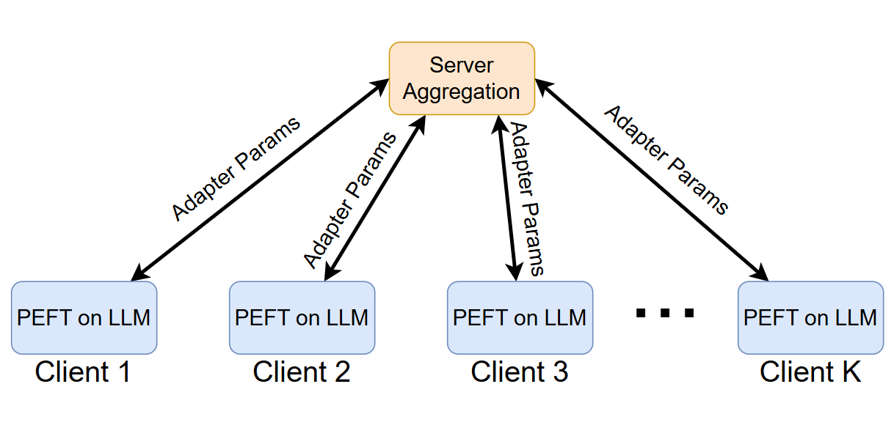
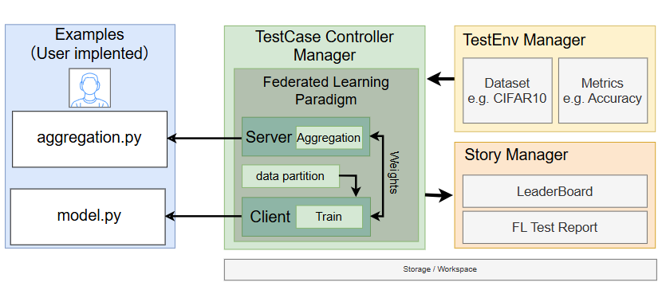
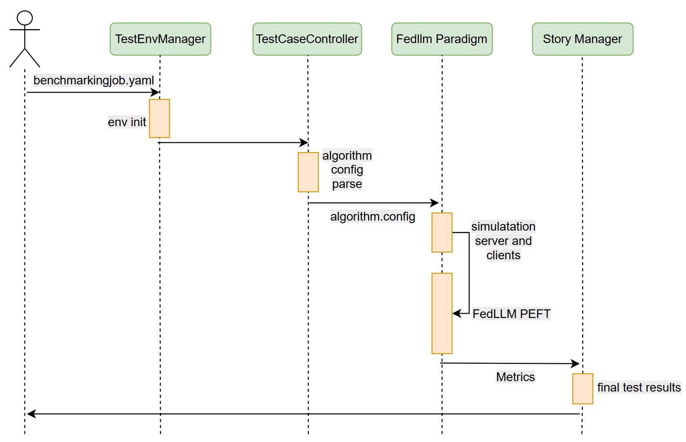
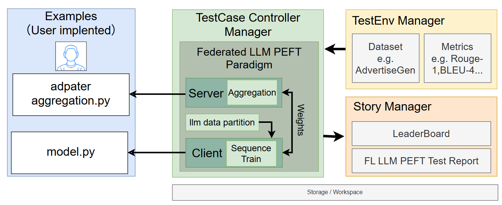
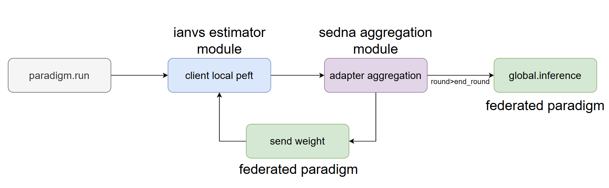

# Federated Fine-Tuning for Large Language Models: Based on KubeEdge-Ianvs

## 1 Motivation

### 1.1 Background

With the growing demand for privacy-preserving AI and the increasing deployment of LLMs (Large Language Models) on edge and personal devices, fine-tuning LLMs in a federated setting has become a vital research topic. Traditional LLM training requires centralizing vast amounts of data, which is infeasible in privacy-sensitive or bandwidth-limited scenarios. Federated Learning (FL) provides a solution by enabling decentralized collaborative model training without raw data exchange.

However, existing FL paradigms are not directly suitable for LLMs due to challenges like large parameter size, high communication costs, model heterogeneity, and the need for parameter-efficient training. Moreover, Ianvs currently lacks support for benchmarking federated fine-tuning of LLMs. This project aims to bridge that gap by enabling efficient, scalable, and reproducible federated LLM fine-tuning within the Ianvs framework using parameter-efficient techniques like LoRA and P-Tuning.

### 1.2 Goals

- Extend Ianvs to support a new paradigm for Federated Fine-Tuning of LLMs in Ianvs.

- Enable integration of PEFT (Parameter-Efficient Fine-Tuning) methods such as LoRA and P-Tuning.

- Benchmark FL algorithms using large language models in various configurations.

## 2 Proposals

We propose to develop a new paradigm **federated_llm_learning** in Ianvs, extending from the base federatedlearning paradigm. The scope of this project includes:

- Define a new one node Federated llm learning paradigm base on Ianvs.

  - Sedna is a distributed synergy AI framework, which support plenty of distributed algorithm including federated learning.
  - Ianvs is a distributed synergy AI benchmarking, many benchmarking example can be found in ianvs. However, Ianvs did not support federated llm fine-tuning paradigm. Our project will fill this gap in the Ianvs project.
  
- Apply the most popular federated llm finetuning algorithm for the users.

  - A combination of semi-supervised learning and federated class incremental learning.

- Conduct a series of federated llm learning benchmarking 

  - We will conduct a series of benchmarking with some different measure metrics, such as ROUGH-1, ROUGH-2, ROUGH-L, BLEU-4, etc.

Target users:

- Researchers:  To benchmarking their llm federated learning methods.
- End users: View and compare federated AI capabilities of solutions.

## 3. Design Details

### 3.1 Algorithm Overview
We will implement several federated LLM fine-tuning algorithms using PEFT methods, such as:

- FedAvg with LoRA
- FedAvg with P-Tuning
- FedProx with LoRA
- FedProx with P-Tuning

Adaptive aggregation for LoRA modules only

Each client will load a LoRA-augmented LLM (e.g., ChatGLM or LLaMA) and perform local training with its own data. Only LoRA modules or prompt vectors will be shared during aggregation.

The training process for Fedllm:

- At the beginning of each training round, the server samples the clients and sends the global llm adapter to them.
- The next step for the clients is local model training. Each client needs to perform Parameter-Efficient Fine-Tuning on the local data.
- After the local training is completed, the clients uploading the learned model parameters to the server for parameter aggregation.
- The server receives client parameters, aggregates them.

Then repeat steps above until all tasks are completed.

### 3.2 Federated LLM PEFT Paradigm Design
Federated large language model (LLM) fine-tuning is a specialized variant of federated learning. Currently, Ianvs supports federated learning paradigms based on the Sedna framework. Sedna is an edge-cloud collaborative AI framework with native support for federated learning. The federated learning architecture in Ianvs is structured as follows:

* The core module is located at:
  `core/testcasecontroller/algorithm/paradigm/federated_learning`

* `federated_learning.py` acts as the **entry point** for the entire training lifecycle.

* `sedna_federated_learning.py` implements a simplified **FederatedLearning client**, describing the main behavior of a local training node.

To support user-defined fl methods, we can modify the following enumeration definitions:

* In `core/common/constant.py`, extend `ParadigmType` to include `"federated learning"`.
* Also, extend `ModuleType` to include a new `Aggregation` enum type.

Building on the above paradigm, we can extend Ianvs to support tasks such as **federated llm peft**. The following is a typical **task queue diagram** of the benchmarking system under such paradigms:

To enable federated LLM fine-tuning, we extend Ianvs by utilizing its existing architecture, including the **TestEnvManager**, **TestCaseController**, and **StoryManager**. A new paradigm is introduced to support the full lifecycle of federated fine-tuning for large language models. The extensions are described as follows:

### ✅ In the Test Environment Manager:

* Add new **benchmarking metrics** such as ROUGE-1, ROUGE-2, ROUGE-L, and BLEU-4.
* Add new **data utilities** for preprocessing, formatting and splitting large language model datasets.

---

### ✅ In the Test Case Controller:

* Based on the existing federated learning paradigm, we introduce a new **Federated LLM Fine-tuning Paradigm**.
* This standardizes the entire training and evaluation pipeline for federated fine-tuning.
* The user must specify both components of the paradigm: the **Server** and the **Clients**, following the Ianvs modular interface.

---

### ✅ In the Story Manager:

* Provide the user with a **leaderboard view** and **detailed test reports**.
* Support visualization of LLM benchmarking metrics across federated rounds.

The overall architecture is shown as follow:

For implementation detail of federated llm peft, we plan to add a module name `federated_llm_learning` base on federeated learning under `core/testcasecontroller/algorithm/paradigm`, and `federated_llm_learning.py` serves as the entry point for the whole learning process

We propose a new algorithmic paradigm: Federated LLM Fine-tuning. Due to the computational constraints of LLM training in single-node testing environments, we are unable to adopt the original multithreaded method used in traditional `federated learning` paradigms. Such methods often lead to GPU out-of-memory (OOM) issues.

To address this issue, we enqueue all clients' PEFT fine‑tuning tasks and launch one worker thread per GPU; each thread sequentially pulls tasks from the queue and executes them, thereby using task scheduling to efficiently exploit multi‑GPU resources on a single node.

This paradigm still starts both the server and clients on a single node, and then proceeds with federated LLM fine-tuning. The entire process is clear and well-structured, as illustrated below:

Federated LLM PEFT involved above process, the green block means the process that the paradigm will execute, the blue block is the process that paradigm will invoke the estimator to execute and the purple block is the process that paradigm will invoke the aggregation to execute.

### 3.3 Benchmarking Design
#### Dataset Setting
We conduct experiments on AdvertiseGen, a dataset for advertising text generation.

Below are their download links:
- [AdvertiseGen Dataset](https://huggingface.co/datasets/shibing624/AdvertiseGen)

When implementing their own algorithms, users can allocate datasets by using the provided dataset utility APIs to process data. The datasets should then be stored locally in the IANVS-compatible format. Afterward, parameters will be configured according to the benchmark settings, and the data will be partitioned accordingly for federated training and evaluation.

#### Construction Setting
Specifically, our benchmarking framework allows users to test their code multiple times under controlled parameters. For example, when benchmarking FedLLM-PEFT on the AdvertiseGen dataset, users can specify parameters such as the number of communication rounds, the local PEFT method, and the number of clients.

This design enables users to focus on algorithm evaluation without worrying about low-level configuration details.

### 3.4 User Example
Todo

## 4. Road Map

The project will be carried out from **July to September**, with bi-weekly milestones:

### 📅 July

* **July 1 – July 14**
  Finalize the proposal, set up the environment, and define key metrics and datasets.

* **July 15 – July 31**
  Implement the new federated LLM fine-tuning paradigm and integrate basic PEFT methods (e.g., LoRA, P-Tuning).

---

### 📅 August

* **August 1 – August 14**
  Optimize the training process and ensure multi-client simulation works smoothly.

* **August 15 – August 31**
  Run initial benchmarks and refine data handling, logging, and configuration.

---

### 📅 September

* **September 1 – September 14**
  Finalize documentation, conduct full benchmarking tests, and prepare reports.

* **September 15 – September 30**
  Submit the final version, engage with the community, and support integration with other tasks.
