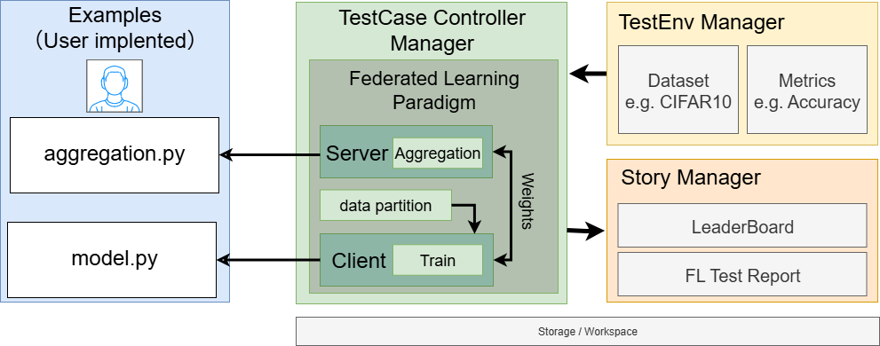

# Federated Fine-Tuning for Large Language Models: Based on KubeEdge-Ianvs

## 1 Motivation

### 1.1 Background

With the growing demand for privacy-preserving AI and the increasing deployment of LLMs (Large Language Models) on edge and personal devices, fine-tuning LLMs in a federated setting has become a vital research topic. Traditional LLM training requires centralizing vast amounts of data, which is infeasible in privacy-sensitive or bandwidth-limited scenarios. Federated Learning (FL) provides a solution by enabling decentralized collaborative model training without raw data exchange.

However, existing FL paradigms are not directly suitable for LLMs due to challenges like large parameter size, high communication costs, model heterogeneity, and the need for parameter-efficient training. Moreover, Ianvs currently lacks support for benchmarking federated fine-tuning of LLMs. This project aims to bridge that gap by enabling efficient, scalable, and reproducible federated LLM fine-tuning within the Ianvs framework using parameter-efficient techniques like LoRA and P-Tuning.

### 1.2 Goals

- Extend Ianvs to support a new algorithm for Federated Fine-Tuning of LLMs in Ianvs.

- Enable integration of PEFT (Parameter-Efficient Fine-Tuning) methods such as LoRA and P-Tuning.

- Benchmark FL algorithms using large language models in various configurations.

## 2 Proposals

We propose to develop a new algorithm **federated_llm_learning** in Ianvs, extending from the base federatedlearning paradigm. The scope of this project includes:

- Define a new single node Federated LLM learning algorithm based on Ianvs.

  - Sedna is a distributed synergy AI framework that supports various distributed algorithm ,including federated learning.
  - Ianvs is a distributed synergy AI benchmarking framework with many examples. However, Ianvs did not currently support a federated llm fine-tuning algorithm. This project aims to fill that gap.
  
- Apply the most popular federated llm fine-tuning algorithm for the users.

  - A combination of different aggregation methods and federated llm fine-tuning.

- Conduct a series of federated llm learning benchmarks

  - We will conduct a series of benchmarking with some different measure metrics, such as ROUGE-1, ROUGE-2, ROUGE-L, BLEU-4, etc.

Target users:

- Researchers:  To benchmark their LLM federated learning methods.
- End users: View and compare federated AI capabilities of solutions.

## 3. Design and Implementation

### 3.1 Algorithm Overview
We will implement several federated LLM fine-tuning algorithms using PEFT methods, such as:

- FedAvg with LoRA
- FedAvg with P-Tuning
- FedAvgM with LoRA
- FedAvgM with P-Tuning

For the PEFT methods, we will use the following techniques:
* **LoRA** – inserts low-rank trainable adapters into weight matrices; few extra parameters, no merge at inference.

* **P-Tuning** – learns continuous prompt vectors in the embedding layer; modifies only inputs, flexible across tasks.

Adaptive aggregation for LoRA/P-Tuning modules only:
* **FedAvg** – weighted average of client models.

* **FedAvgM** – FedAvg with server-side momentum for stabler convergence.

Each client will load a LoRA/P-Tuning-augmented LLM (e.g., ChatGLM or LLaMA) and perform local training with its own data. Only LoRA/P-Tuning modules or prompt vectors will be shared during aggregation.


The training process for FedLLM:

- At the beginning of each training round, the server samples the clients and sends the global llm adapter to them.
- The next step for the clients is local model training. Each client needs to perform Parameter-Efficient Fine-Tuning on the local data.
- After the local training is completed, the clients upload the learned model parameters to the server for parameter aggregation.
- The server receives client parameters, aggregates them.

Then repeat steps above until all tasks are completed.

### 3.2 Architecture Design
Federated large language model (LLM) fine-tuning is a specialized variant of federated learning. Currently, Ianvs supports federated learning paradigm based on the Sedna framework. Sedna is an edge-cloud collaborative AI framework with native support for federated learning. The federated learning architecture in Ianvs is structured as follows:



* The core module is located at:
  `core/testcasecontroller/algorithm/paradigm/federated_learning`

* `federated_learning.py` acts as the **entry point** for the entire training lifecycle.

* `sedna_federated_learning.py` implements a simplified **FederatedLearning client**, describing the main behavior of a local training node.

To unify standard FL and LLM-PEFT fine-tuning within a single paradigm, we introduce a parameter named ``if_mode_llm``. The defaukt value is `false`, indicating that the algorithm operates in standard federated learning mode. If the value is set to `true`, the algorithm will switch to LLM fine-tuning mode, enabling the use of LoRA or P-Tuning methods. This allows the same framework to handle both traditional FL tasks and specialized LLM fine-tuning without requiring separate paradigm implementations. 

Building on the above principles and the existing architecture of Ianvs, we can extend the **federated learning paradigm** to support tasks such as **federated LLM PEFT** (Parameter-Efficient Fine-Tuning). The following is a typical **task queue diagram** of the benchmarking system under such algorithmic paradigms:


We extend Ianvs by utilizing its existing architecture, including the **TestEnvManager**, **TestCaseController**, and **StoryManager**. A new algorithm is introduced to support the full lifecycle of federated fine-tuning for large language models. The new algorithm is described as follows:

### ✅ For the Test Environment:

* Add new **benchmarking metrics** such as ROUGE-1, ROUGE-2, ROUGE-L, and BLEU-4.
* Add new **data utilities** for preprocessing and splitting large language model datasets. 

---

### ✅ For the Test Case Controller:

* Based on the existing federated learning paradigm, we introduce a new **Federated LLM Fine-tuning Algorithm**.
* This standardizes the entire training and evaluation pipeline for federated fine-tuning.
* The user must specify both components of the algorithm: the **Server** and the **Clients**, following the Ianvs modular interface.

---

### ✅ For the Story Manager:

* Provide the user with a **leaderboard view** and **detailed test reports**.
* Support visualization of LLM benchmarking metrics across federated rounds.

The overall new architecture is shown as follows:


Due to the computational constraints of LLM training in single-node testing environments, we are unable to adopt the original multithreaded method used in traditional `federated learning` paradigms. Such methods often lead to GPU out-of-memory (OOM) issues.

To address this issue and maximize throughput during federated fine-tuning of large language models, the paradigm adopts a **GPU-aware task scheduler**. At the start of each communication round, all client training jobs are placed into a global task queue (Queue). A dedicated worker thread is launched for every visible GPU; inside the thread we bind the process to that device with ``torch.cuda.set_device(gpu_id)`` and pull tasks one-by-one:
```python
def _gpu_worker(gpu_id: int):
    torch.cuda.set_device(gpu_id)        # hard pin to the target GPU
    while not task_q.empty():
        client_id = task_q.get_nowait()
        LOGGER.info(f"GPU-{gpu_id} ⇨ client {client_id}")
        self.client_train(client_id, device_id=gpu_id)  # PEFT fine-tuning
        torch.cuda.empty_cache()         # release residual memory
        task_q.task_done()
```
Because each GPU handles at most one client at any moment, peak memory usage equals the footprint of a single LoRA-augmented model, independent of the total number of clients. When a worker finishes, it immediately dequeues the next client, ensuring continuous utilization without oversubscription. As a result, this GPU-aware scheduler guarantees a fixed memory ceiling by ensuring that only one LoRA-augmented model occupies a GPU at any time, rotates clients through available devices in strict FIFO order for balanced usage, scales linearly with additional GPUs without requiring client-side changes. It is implemented with lightweight Python Queue + Thread primitives—together enabling a single-node, multi-GPU server to fine-tune dozens of 7B-parameter LLM clients reliably and without OOM errors on Nvidia A100s.

Federated LLM PEFT still starts both the server and clients on a single node, and then proceeds with federated LLM fine-tuning. The entire process is clear and well-structured, as illustrated below:


The Federated LLM PEFT process involves the steps shown above: the green blocks represent processes executed by the paradigm, blue blocks are processes where the paradigm invokes the estimator, and purple blocks are processes where the paradigm invokes the aggregation algorithm.

### 3.3 Implementation Details
To implement **federated LLM PEFT**, we introduce a dedicated process in `core/testcasecontroller/algorithm/paradigm/federated_learning`. Instead of introducing a new paradigm, we merge classic FL and federated LLM through a parameter-transfer plugin so both share the same training/aggregation pipeline. It inherits from `ParadigmBase` and re-uses Sedna’s client/server abstractions while adding GPU-aware task scheduling and parameter aggregation logic.
All other edits in data `utils.py, dataset.py` and user `examples/fedllm/*` will keep existing paradigms untouched and preserve the original JSONL data pipeline in Sedna.

| Layer                          | File(s)                                                                                                                | Purpose                                                                                                                            |
| ------------------------------ | ---------------------------------------------------------------------------------------------------------------------- | ---------------------------------------------------------------------------------------------------------------------------------- |
| **Federated LLM Core Algorithm**     | `core/testcasecontroller/algorithm/paradigm/federated_learning/federated_learning.py`                                                                     | Entry point for PEFT federated fine-tuning; general federated learning logic with new adaptations for LLMs; switch to LLM mode via `if_mode_llm`. |
| **Dataset helpers**            | `core/testenvmanager/dataset/{dataset.py, utils.py}`                                                                   | Add `jsonl` to recognised formats and provide `partition_llm_data`.              |
| **Example benchmark**          | `examples/federated-llm/fedllm-peft/**` (YAML configs, model & algorithm code, ROUGE/BLEU metrics)                     | Turn-key demo showing how to launch a PEFT benchmark with FedAvg / FedAvgM aggregators.                                            |
| **Minor fixes**                | `core/testcasecontroller/algorithm/paradigm/sedna_federated_learning.py`                                          | Typo fixes—no functional change to standard FL.                                                                   |

```text
.
├── core
│   └── testcasecontroller
│       └── algorithm
│           └── paradigm
|               ├── sedna_federated_learning.py
│               └── federated_learning
│                   └── federated_learning.py   # ★ add new algorithmic process on existing FL paradigm
│
├── core/testenvmanager
│   └── dataset
│       ├── dataset.py       # + jsonl support
│       └── utils.py         # + partition_llm_data()
│
└── examples
    └── federated-llm
        └── fedllm-peft (take an example)
            ├── benchmarkingjob.yaml
            ├── algorithm
            │   ├── algorithm.yaml
            │   ├── model.py
            │   ├── FedAvg-PEFT.py
            │   └── FedAvgM-PEFT.py
            └── testenv
                ├── testenv.yaml
                ├── rouge1_metric.py
                ├── rouge2_metric.py
                ├── rouge3_metric.py
                └── rougel_metric.py
```

> **Key takeaway:**
> All PEFT-specific logic is sandboxed in the new algorithm and the `examples/` tree; existing paradigms, data formats and Sedna integrations remain fully backward-compatible. The changes to `dataset.py` only add new file-writing formats; most existing examples are read-only and thus unaffected. The modification remains fully compatible with other writing methods.

### 3.4 Benchmarking Design
#### Dataset Setting
We conduct experiments on **two public datasets**:

* **AdvertiseGen** – Chinese advertising-text generation
  [https://huggingface.co/datasets/shibing624/AdvertiseGen](https://huggingface.co/datasets/shibing624/AdvertiseGen)
* **MedQuad** – English medical question-answering
  [https://huggingface.co/datasets/keivalya/MedQuad-MedicalQnADataset](https://huggingface.co/datasets/keivalya/MedQuad-MedicalQnADataset)

After downloading the raw JSONL files and integrating their own algorithms— remember to create a test split for MedQuad and drop its redundant **qtype** field—users simply update the YAML configuration with the dataset path, split strategy, and other parameters. Ianvs then takes care of partitioning the data for federated training and evaluation.

#### Construction Setting
Specifically, our benchmarking framework allows users to test their code multiple times under controlled parameters. For example, when benchmarking FedLLM-PEFT on the MedQuad dataset, users can specify parameters such as the number of communication rounds, the local PEFT method, and the number of clients.

This design enables users to focus on algorithm evaluation without worrying about low-level configuration details.

### 3.5 User Example
For exaample, in a hospital network, clinicians want to tailor a large-language-model chatbot to answer specialty-specific medical questions—yet every dialogue log is packed with protected health information (PHI). Because HIPAA/GDPR strictly prohibit exporting such data, centrally fine-tuning the model is off the table. By switching to **federated parameter-efficient fine-tuning**, each hospital keeps its raw records on-prem and trains a local LoRA adapter; only the tiny weight deltas—stripped of any patient identifiers—are encrypted and shared with the aggregator. Thus, the collective model gains domain expertise while never exposing a single name, lab value, or admission note outside institutional firewalls, fully preserving patient privacy without sacrificing language-model performance.

## 4. Road Map

The project will be carried out from **July to September**, with bi-weekly milestones:

### 📅 July

* **July 1 – July 14**
  Finalize the proposal, set up the environment, and define key metrics and datasets.

* **July 15 – July 31**
  Implement the new federated LLM fine-tuning algorithm in Ianvs core module and integrate basic PEFT methods (e.g., LoRA, P-Tuning).

---

### 📅 August

* **August 1 – August 14**
  Optimize the training process and ensure multi-client simulation works smoothly.

* **August 15 – August 31**
  Run initial benchmarks and refine data handling, logging, and configuration.

---

### 📅 September

* **September 1 – September 14**
  Finalize documentation, conduct full benchmarking tests, and prepare reports.

* **September 15 – September 30**
  Submit the final version, engage with the community, and support integration with other tasks.

## 5. References
1. McMahan, H. B., Moore, E., Ramage, D., Hampson, S., & Aguera y Arcas, B. *Communication-Efficient Learning of Deep Networks from Decentralized Data.* In **AISTATS**, 2017.
2. Hsu, T.-M. H., Qi, H., & Brown, M. *Measuring the Effects of Non-Identical Data Distribution for Federated Visual Classification.* arXiv:1909.06335, 2019.
3. Fan, T., Kang, Y., Ma, G., Chen, W., Wei, W., Fan, L., & Yang, Q. *FATE-LLM: A Industrial Grade Federated Learning Framework for Large Language Models.* In **Symposium on Advances and Open Problems in Large Language Models (LLM\@IJCAI’23)**, 2023.
4. Liu, X., Ji, K., Fu, Y., *et al.* *P-Tuning v2: Prompt Tuning Can Be Comparable to Fine-tuning Universally Across Scales and Tasks.* arXiv:2110.07602, 2021.
5. KubeEdge. *Ianvs: Distributed Synergy AI Benchmarking Framework.* GitHub repository: [https://github.com/kubeedge/ianvs](https://github.com/kubeedge/ianvs).