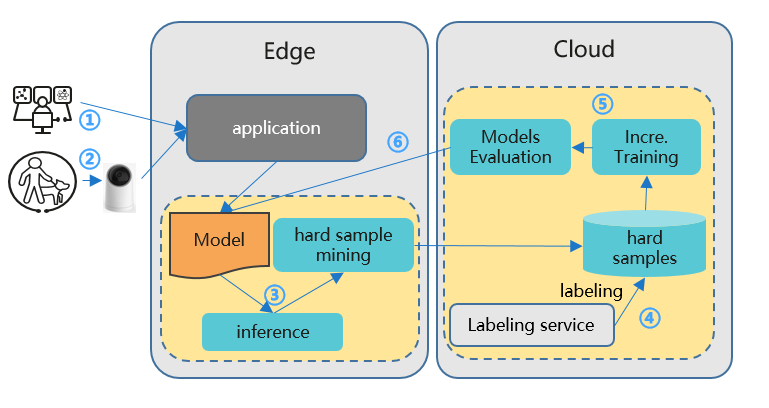

# Incremental learning: BasicIL-FPN

Initial model: [Huawei OBS](https://kubeedge.obs.cn-north-1.myhuaweicloud.com:443/ianvs/pcb-aoi/model.zip)

Traditionally, the data is collected manually and periodically retrained on the cloud to improve the model effect. However, data is continuously generated on the edge side. Traditional method wastes a lot of human resources, and the model update frequency is slow.  

Incremental learning allows users to continuously monitor the newly generated data and by configuring some triggering rules to determine whether to start training, evaluation, and deployment automatically, and continuously improve the model performance.

Its goals include:
* Automatically retrains, evaluates, and updates models based on the data generated at the edge.
* Support time trigger, sample size trigger, and precision-based trigger.
* Support manual triggering of training, evaluation, and model update.
* Support hard example discovering of unlabeled data,  for reducing the manual labeling workload. 



As shown in the above figure, the incremental learning works as following procedures: 
1. Developer implements and deploys the application based on incremental learning. 
2. The application runs and launches incremental learning. It can also return the inference result to the application. 
3. The system detects hard examples and uploads hard examples to the cloud.
4. Labeling service labels the hard examples. 
5. Incremental training online learns the hard examples to generate a new model. 
6. Model evaluation is conducted and updates the model if qualified. 
7. The model outputs the inference result given test samples and continue as Step 3.

## Implementation
Here we will show how to implement a single task learning algorithm for testing in ianvs, based on an opensource algorithm [FPN].

For test of your own algorithm, the base model of FPN is not necessary: It can be replaced with any algorithm complying the requirement of ianvs interface.

Ianvs testing algorithm development, at present, are using Sedna Lib. The following is recommended development workflow:
1. Algorithm Development: put the algorithm implementation to ianvs [examples directory] locally, for testing.
2. Algorithm Submission: submit the algorithm implementation to [Sedna repository], for sharing, then everyone can test and use your algorithm.

Sedna provides a class called `class_factory.py` in `common` package, in which only a few lines of changes are required to become a module of sedna.

Two classes are defined in `class_factory.py`, namely `ClassType` and `ClassFactory`.

`ClassFactory` can register the modules you want to reuse through decorators. For example, in the following code example, you have customized an **single task learning algorithm**, you only need to add a line of `ClassFactory.register(ClassType.GENERAL)` to complete the registration.

The following code is just to show the overall structure of a basicIL-fpn BaseModel, not the complete version. The complete code can be found [here](https://github.com/JimmyYang20/ianvs/tree/main/examples/pcb-aoi/incremental_learning_bench/testalgorithms/fpn).

```python

@ClassFactory.register(ClassType.GENERAL, alias="FPN")
class BaseModel:

    def __init__(self, **kwargs):
        """
        initialize logging configuration
        """

        self.has_fast_rcnn_predict = False

        self._init_tf_graph()

        self.temp_dir = tempfile.mkdtemp()
        if not os.path.isdir(self.temp_dir):
            mkdir(self.temp_dir)

        os.environ["MODEL_NAME"] = "model.zip"
        cfgs.LR = kwargs.get("learning_rate", 0.0001)
        cfgs.MOMENTUM = kwargs.get("momentum", 0.9)
        cfgs.MAX_ITERATION = kwargs.get("max_iteration", 5)

    def train(self, train_data, valid_data=None, **kwargs):

        if train_data is None or train_data.x is None or train_data.y is None:
            raise Exception("Train data is None.")

        with tf.Graph().as_default():

            img_name_batch, train_data, gtboxes_and_label_batch, num_objects_batch, data_num = \
                next_batch_for_tasks(
                    (train_data.x, train_data.y),
                    dataset_name=cfgs.DATASET_NAME,
                    batch_size=cfgs.BATCH_SIZE,
                    shortside_len=cfgs.SHORT_SIDE_LEN,
                    is_training=True,
                    save_name="train"
                )

            # ... ...
            # several lines are omitted here. 

        return self.checkpoint_path

    def save(self, model_path):
        if not model_path:
            raise Exception("model path is None.")

        model_dir, model_name = os.path.split(self.checkpoint_path)
        models = [model for model in os.listdir(model_dir) if model_name in model]

        if os.path.splitext(model_path)[-1] != ".zip":
            model_path = os.path.join(model_path, "model.zip")

        if not os.path.isdir(os.path.dirname(model_path)):
            os.makedirs(os.path.dirname(model_path))

        with zipfile.ZipFile(model_path, "w") as f:
            for model_file in models:
                model_file_path = os.path.join(model_dir, model_file)
                f.write(model_file_path, model_file, compress_type=zipfile.ZIP_DEFLATED)

        return model_path

    def predict(self, data, input_shape=None, **kwargs):
        if data is None:
            raise Exception("Predict data is None")

        inference_output_dir = os.getenv("RESULT_SAVED_URL")

        with self.tf_graph.as_default():
            if not self.has_fast_rcnn_predict:
                self._fast_rcnn_predict()
                self.has_fast_rcnn_predict = True

            restorer = self._get_restorer()

            config = tf.ConfigProto()
            init_op = tf.group(
                tf.global_variables_initializer(),
                tf.local_variables_initializer()
            )

            with tf.Session(config=config) as sess:
                sess.run(init_op)

        # ... ...
        # several lines are omitted here. 

        return predict_dict

    def load(self, model_url=None):
        if model_url:
            model_dir = os.path.split(model_url)[0]
            with zipfile.ZipFile(model_url, "r") as f:
                f.extractall(path=model_dir)
                ckpt_name = os.path.basename(f.namelist()[0])
                index = ckpt_name.find("ckpt")
                ckpt_name = ckpt_name[:index + 4]
            self.checkpoint_path = os.path.join(model_dir, ckpt_name)

        else:
            raise Exception(f"model url is None")

        return self.checkpoint_path

    def evaluate(self, data, model_path, **kwargs):
        if data is None or data.x is None or data.y is None:
            raise Exception("Prediction data is None")

        self.load(model_path)
        predict_dict = self.predict(data.x)
        metric_name, metric_func = kwargs.get("metric")
        if callable(metric_func):
            return {"f1_score": metric_func(data.y, predict_dict)}
        else:
            raise Exception(f"not found model metric func(name={metric_name}) in model eval phase")
```

After registration, you only need to change the name of the basicIL and parameters in the yaml file, and then the corresponding class will be automatically called according to the name.


[FPN]: https://github.com/DetectionTeamUCAS/FPN_Tensorflow
[examples directory]: ../../../../examples
[Sedna repository]: https://github.com/kubeedge/sedna

