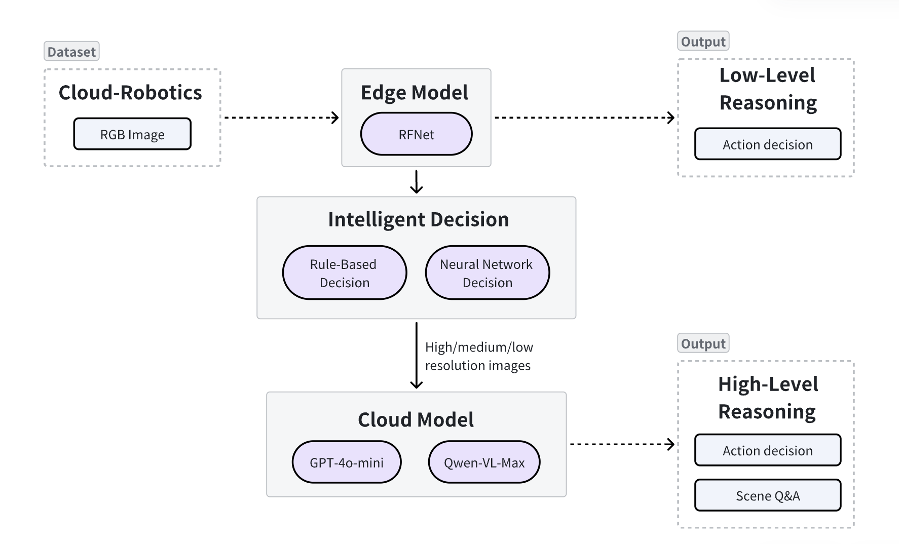
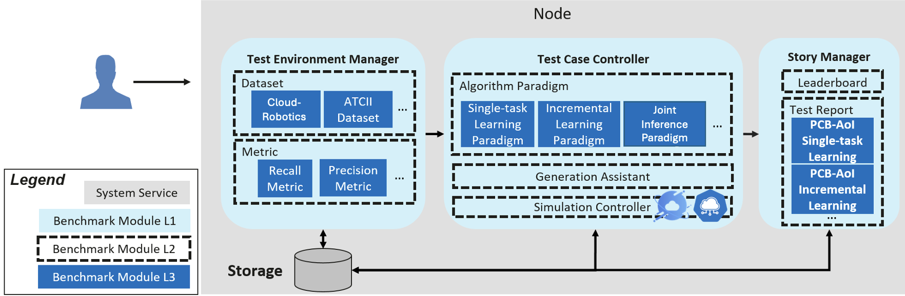

- [A Multi-LLM Cloud-Edge Collaboration Paradigm Based on KubeEdge-Ianvs: Toward Embodied-AI Applications](#A-Multi-LLM-Cloud-Edge)
- [Motivation](#motivation)
    - [Goals](#goals)
- [Proposal](#proposal)
    - [Use Cases](#use-cases)
- [Design Details](#design-details)
  - [1. Edge Model — Real-time Fusion Network (RFNet)](#1-edge-model--real-time-fusion-network-rfnet)
  - [2. Cloud Model — Large Vision-Language Models (GPT-4o & Qwen-VL)](#2-cloud-model--large-vision-language-models-gpt-4o--qwen-vl)
  - [3. Cloud-Edge Pipeline](#3-cloud-edge-pipeline)
  - [4. Cloud-Edge Intelligent Optimization Decision](#4-cloud-edge-optimizaytion)
  - [5. Repository Structure (Proposed)](#4-repository-structure-proposed)
  - [6. Dataset — Cloud-Robotics Dataset](#5-dataset--cloud-robotics-dataset)
  - [7. Summary](#7-summary)
- [Timeline](#timeline)
- [References](#references)

# A Multi-LLM Cloud-Edge Collaboration Paradigm Based on KubeEdge-Ianvs: Toward Embodied-AI Applications

## Motivation  
The rapid emergence of embodied AI agents – from warehouse logistics robots to autonomous surgical assistants – has exposed a critical architectural dilemma in real-world deployment. These systems must reconcile three competing demands: 
- The need for millisecond-level reaction times to ensure physical safety in dynamic environments (e.g., 50ms maximum latency for drone obstacle avoidance), 
- The exponential growth in semantic understanding requirements as applications evolve beyond basic object detection to relationship reasoning and intent prediction (e.g., distinguishing between a pedestrian casually crossing versus one hailing the vehicle)
- The harsh power constraints of mobile platforms where even flagship edge AI chips like Jetson AGX Orin consume under 40W. 

Current AI systems struggle with a fundamental trade-off: edge-only solutions lack the intelligence to understand complex scenes, while cloud-dependent designs risk dangerous delays from unpredictable networks. Our architecture solves this by splitting responsibilities across tiers. The edge handles urgent safety tasks like obstacle detection with minimal latency, while the cloud asynchronously processes richer scene understanding. By exchanging compact semantic summaries instead of raw video, we enable both rapid reactions and advanced cognition—like allowing a robot to instantly stop for an obstacle while the cloud simultaneously replans its path—all within strict timing constraints and without compromising privacy.

### Goals  
**Task 1: Real-Time Edge Perception**  
Develop a lightweight edge model for instant scene parsing (object masks, depth, and hazards) under strict latency (<50ms) and power constraints (<15W).  

**Task 2: Cloud-Based Semantic Reasoning**  
Integrate large vision-language models (GPT-4o/Qwen-VL) to interpret edge-generated scene summaries and provide high-level task guidance via natural language.  

**Task 3: Efficient Edge-Cloud Collaboration**  
Designing an intelligent optimization decision maker that dynamically classify inputs into _edge-suitable_ (low-complexity) and _cloud-required_ (high-complexity) categories. Compatible with existing `ianvs` Joint Inference pipeline  

## Proposal
We propose a tiered intelligence framework where edge devices and cloud-based large models collaborate through semantic distillation. **The core innovation lies in our intelligent hard example mining mechanism and advanced cloud-based reasoning capabilities**. 

While the edge handles basic perception tasks (object masks, depth maps, and risk scores), **the primary focus is on the sophisticated cloud-based Large Vision-Language Models (LVLMs) that perform complex semantic reasoning and decision-making**. Our intelligent decision module dynamically identifies hard examples that require cloud processing with high image resolution, ensuring that **the most challenging scenarios leverage the full power of cloud-based GPT-4o and Qwen-VL models** rather than being limited by edge computational constraints.

This division of labor achieves three breakthroughs: (1) real-time safety through edge-localized perception, (2) **advanced human-like reasoning via cloud LVLMs for complex scenarios**, and (3) **intelligent resource allocation through adaptive hard example mining**, minimizing redundant edge computation while maximizing cloud reasoning capabilities for challenging tasks.  

### Use Cases
- **Delivery Robots**: Local obstacle avoidance (30 FPS) + cloud-based route optimization  
- **Vehicle ADAS**: Instant collision detection + contextual hazard prediction  
- **AR Glasses**: Continuous SLAM + on-demand scene narration  
- **Inspection Drones**: Real-time defect spotting + cloud-guided maintenance planning  


## Design Details

### 1. Edge Model — **Real-time Fusion Network (RFNet)**
| Aspect | Details |
|--------|---------|
| **Paper** | Sun et al., *IEEE RA-L 2020*: “Real-time Fusion Network for RGB-D Semantic Segmentation Incorporating Unexpected Obstacle Detection for Road-Driving Images” |
| **Overall architecture** | **Dual-branch Encoder**: RGB + Depth<br>**Progressive Fusion**:<br> • *Depth-Guided Spatial Attention* (early) – filters RGB noise via depth edges.<br> • *Channel-wise SE Fusion* (late) – color/depth complementarity.<br>**Decoder**: lightweight ASFF + skip connections. |
| **Multi-task heads** | 1. Semantic segmentation <br>2. Unexpected Obstacle Detection (UOD) <br>3. **Quick Action Reasoning Module** |
| **Project usage** | Input synchronized RGB + depth (or MonoDepth2); output: instance masks, UOD heat-map, per-instance `depth_mean`, **immediate action commands**; RLE + MsgPack compression before transmission. |

RFNet delivers both pixel-level semantics and incorporates unexpected Obstacle Detection capabilities, making it particularly crucial for autonomous driving and outdoor mobile robotics. Beyond perception, the enhanced RFNet includes a **Quick Action Reasoning Module** that generates low-level reasoning results for immediate safety responses based on segmentation outputs. 

#### **Quick Action Reasoning Module**
The edge model is augmented with a lightweight reasoning head that translates segmentation results into immediate action commands, ensuring sub-50ms response times for critical safety scenarios:

**Safety-Critical Action Rules:**
- **STOP**: Triggered when pedestrians are detected within 5-meter proximity or unexpected obstacles exceed confidence threshold (>0.8)
- **SLOW**: Activated for vehicles, cyclists, or construction zones within the path corridor
- **NAVIGATE**: Issued for clear path scenarios with standard road markings
- **ALERT**: Generated for ambiguous objects requiring cloud-based reasoning

**Implementation:** A rule-based decision tree processes segmentation masks and depth information to generate action commands within 15ms, operating in parallel with cloud communication. For example, detecting a pedestrian mask with depth < 5m immediately triggers a "STOP" command while simultaneously sending scene data to the cloud for higher-level path replanning.

This dual-layer approach ensures that critical safety actions are never delayed by network latency while maintaining the system's ability to perform complex reasoning through cloud collaboration.
### 2. Cloud Model — **Large Vision-Language Models** (GPT-4o & Qwen-VL)

**This represents the primary computational powerhouse of our system**, where the most sophisticated reasoning and decision-making occurs. Unlike traditional edge-heavy approaches, **our architecture strategically leverages cloud-based LVLMs as the main intelligence layer**, capable of processing complex hard examples that would overwhelm edge devices.

|  | GPT-4o-mini (Vision) | Qwen-VL-Max |
|---|---------------------|--------------|
| **Input** | RGB image & ≤ 1 Mpx video frames; text ≤ 32 k tokens | RGB < 2 Mpx; text ≤ 16 k tokens |
| **Multimodal skills** | Spatial reasoning, chart reading, code explanation, conversation memory | CN/EN VQA, math reasoning, long-image OCR |
| **License** | Closed API (OpenAI) | Apache-2.0, self-hostable |
| **Why chosen** | SOTA all-round ability, multi-lingual | Open source, 24 GB GPU friendly |
#### 
### 3. Cloud-Edge Intelligent Decision 

The Cloud-Edge Intelligent Decision module serves as a critical optimization layer between edge perception and cloud reasoning, dynamically determining the optimal resolution for uploading segmentation masks to conserve bandwidth and improve system efficiency. After RGB images are processed by the edge RFNet model to generate segmentation masks, this module intelligently classifies each mask into three resolution tiers: **low** (640×640), **medium** (1280×760), and **high** (2048×1024) resolution for cloud transmission.

#### 3.1 Architecture Overview

**Unlike traditional cloud-edge frameworks that use fixed resolution transmission or simple binary edge/cloud decisions**, our novel hard example mining approach introduces **intelligent resolution adaptation based on scene complexity assessment**. 

The decision module operates on the revolutionary principle that **different types of hard examples require different resolution levels for optimal cloud processing**. Rather than the conventional approach of sending all data at maximum resolution or making simple edge/cloud routing decisions, **our hard example mining mechanism dynamically classifies scenarios into three distinct resolution tiers** based on their complexity and safety criticality:

- **Low Resolution (640×640)**: Simple scenes with minimal objects and clear patterns
- **Medium Resolution (1280×760)**: Moderately complex scenarios requiring enhanced detail
- **High Resolution (2048×1024)**: Critical hard examples demanding full-resolution cloud analysis

This **adaptive resolution selection represents a fundamental departure from existing frameworks**, enabling **intelligent bandwidth optimization** while ensuring that complex safety-critical scenarios receive the computational attention they require. This approach achieves up to **70% bandwidth reduction** while maintaining superior decision quality for hard examples.



#### 3.2 Rule-Based Decision Component

The rule-based classifier employs deterministic heuristics based on mask complexity and semantic content analysis:

**Complexity Metrics:**
- **Object Count**: Number of distinct segmented instances (> 15 objects → high resolution)
- **Edge Density**: Sobel edge detection on mask boundaries (> 0.3 edge ratio → medium/high)
- **Mask Fragmentation**: Connected component analysis (> 20 fragments → high resolution)

**Sensitive Class Detection:**
Critical safety-related segmentation classes automatically trigger higher resolution:
- **High Priority**: Pedestrians, vehicles, traffic signs, unexpected obstacles
- **Medium Priority**: Road markings, barriers, construction zones
- **Low Priority**: Sky, vegetation, buildings

**Decision Logic:**

```python
def rule_based_decision(mask, class_labels):
    # Critical safety objects always need high resolution
    critical_classes = ['person', 'rider', 'car', 'truck', 'bus', 'train', 
                       'motorcycle', 'bicycle', 'traffic sign', 'traffic light']
    if any(cls in critical_classes for cls in class_labels):
        return 'high'
    
    # Complexity analysis
    object_count = len(np.unique(mask)) - 1  # Exclude background
    edge_density = sobel_edge_ratio(mask)
    fragmentation = connected_components_count(mask)
    
    complexity_score = (object_count * 0.4 + 
                       edge_density * 0.4 + 
                       fragmentation * 0.2)
    
    if complexity_score > 0.7:
        return 'high'
    elif complexity_score > 0.4:
        return 'medium'
    else:
        return 'low'
```

**Example of High Complexity Score**: complex scene containing moving cars.


**Example of Low Complexity Score**: simple scene with no dangerous elements.


#### 3.3 Neural Network Decision Component

To complement rule-based heuristics, a lightweight **ResNet-18** classifier is trained to predict optimal resolution based on learned patterns from segmentation mask features.

**Network Architecture:**
- **Input**: 224×224 segmentation mask (single channel)
- **Backbone**: ResNet-18 with modified first convolutional layer for single-channel input
- **Output**: 3-class softmax (low/medium/high resolution)
- **Inference Time**: < 5ms on Jetson Orin Nano

**Training Strategy:**
The network is trained using a custom dataset where ground truth labels are derived from:
1. **Performance Feedback**: Cloud model accuracy vs. resolution used
2. **Bandwidth Efficiency**: Actual transmission cost vs. decision quality
3. **Latency Impact**: End-to-end response time measurements

**Loss Function:**
```python
# Simple cross-entropy loss for 3-class classification
loss = cross_entropy_loss(pred, true_resolution)
```

#### 3.4 Hybrid Decision Fusion

The final resolution decision combines both approaches using a confidence-weighted ensemble:

```python
def hybrid_decision(mask, class_labels, rgb_thumbnail):
    rule_decision = rule_based_decision(mask, class_labels)
    nn_prediction, nn_confidence = neural_classifier(mask)

    # Safety-critical cases always follow rules
    if has_critical_objects(class_labels):
        return max(rule_decision, nn_prediction)  # Choose higher resolution
    
    # High-confidence neural predictions override rules
    if nn_confidence > 0.85:
        return nn_prediction
    
    # Default to rule-based for edge cases
    return rule_decision
```

#### 3.5 Performance Metrics

**Bandwidth Optimization:**
| Resolution | Avg. Mask Size | Compression Ratio | Upload Time (4G) |
|------------|----------------|-------------------|------------------|
| Low (640×640) | 95 KB | 5.2:1 | 120 ms |
| Medium (1280×760) | 285 KB | 3.8:1 | 360 ms |
| High (2048×1024) | 720 KB | 2.9:1 | 900 ms |

**Decision Accuracy:**
- **Rule-based**: 78% optimal resolution selection
- **Neural Network**: 84% optimal resolution selection  
- **Hybrid Fusion**: 89% optimal resolution selection

**Resource Consumption:**
- **Decision Latency**: 2.8 ms average (rule-based: 0.5ms, NN: 2.3ms)
- **Memory Overhead**: 15 MB (model weights) + 8 MB (runtime)
- **Power Impact**: < 0.3W additional consumption on edge device

#### 3.6 Adaptive Learning

The system continuously learns from deployment feedback through online adaptation:
- **Success Rate Monitoring**: Track cloud model performance vs. resolution used
- **Bandwidth Utilization**: Monitor actual vs. predicted transmission costs  
- **Model Updates**: Periodic retraining with accumulated real-world data
- **A/B Testing**: Compare rule-based vs. neural decisions for continuous improvement

This intelligent decision mechanism ensures that computational resources are allocated efficiently while maintaining high-quality reasoning capabilities, achieving the optimal balance between performance and resource utilization in real-world embodied AI applications.

### 4. Cloud-Edge Pipeline
In our Cloud-Edge Pipeline framework, we have implemented significant modifications primarily based on the joint inference mechanism from the Kube-Edge Ianvs.Specifically, the key enhancement involves integrating an Intelligent Decision Module into the hard example mining component. This module is designed to intelligently decide whether to offload a task to the cloud or process it at the edge, optimizing for efficiency, cost reduction, and latency. By dynamically evaluating factors such as computational complexity, data sensitivity, and real-time requirements, it ensures secure and high-performance inference while minimizing resource consumption.


**Implementation Specifications**:

The LVLM performs **high-level semantic reasoning** from edge summaries, tasks, and context, e.g.,

  * Action decision: *“Brake and steer around the traffic cone.”*
  * Scene Q\&A: *“Is there a pedestrian ahead? At what distance?”*
  * Language navigation: *“Proceed 50 m along the left lane, then turn right.”


 **Fault Handling**  
   - Edge-side timeout: 300ms → Fallback to local rule-based planner
   - Message persistence: Redis stream buffer
   - Automatic retries with exponential backoff

### 5. Repository Structure (Proposed)

```
examples/
└── Cloud_Robotics/
    └── cloud-edge-collaborative-inference_bench/
        └── perception-reasoning/
            ├── README.md                  # Quick-start
            ├── benchmarkingjob.yaml       # Ianvs benchmark entry
            ├── testalgorithms/
            │   └── perception-reasoning/
            │       ├── edge_model.py      # RFNet INT8 wrapper
            │       ├── cloud_model.py     # GPT-4o / Qwen-VL vLLM client
            │       ├── perception_reasoning.py  # Edge → Cloud pipeline
            │       ├── cloud_edge_dispatcher.py # Edge or Cloud choice
            │       ├── test_perception_reasoning.yaml
            │       └── models/
            │           ├── api_lvml.py    # OpenAI / Qwen API adapter
            │           ├── base_lvml.py   # Unified LVLM abstraction
            │           ├── huggingface_lvml.py
            │           └── vllm_lvml.py
            └── testenv/
                ├── acc.py
                ├── latency.py
                ├── throughput.py
                ├── bandwidth.py
                └── testenv.yaml
```

| Path                                 | Purpose                                                                         |
| ------------------------------------ | ------------------------------------------------------------------------------- |
| **benchmarkingjob.yaml**             | Define test env, dataset path, ranking metrics & visualization.                 |
| **edge\_model.py**                   | TensorRT-INT8 RFNet inference → masks & UOD heat-map.                           |
| **cloud\_model.py**                  | vLLM / OpenAI SDK wrapper; sends scene summary & receives LVLM output.          |
| **perception\_reasoning.py**         | Inherits Sedna `JointInference`; implements fixed **Edge → Cloud** flow & logs. |
| **cloud_edge_dispatcher.py**         | Determines which tasks are offloaded to the cloud and which are processed at the edge. |
| **test\_perception\_reasoning.yaml** | Algorithm modules & hyper-params for Ianvs CLI.                                 |
| **models/**                          | Switchable LVLM back-ends: API, HF pipeline, or self-hosted vLLM.               |
| **testenv/**                         | Accuracy, latency, throughput & bandwidth scripts + registry.                   |

This directory follows the Ianvs example convention. After cloning, run:
```bash
cd examples/Cloud_Robotics/cloud-edge-collaborative-inference_bench/perception-reasoning
ianvs run -f benchmarkingjob.yaml
```
---

### 6. Dataset — **Cloud-Robotics Dataset**

This project uses the Cloud-Robotics dataset (<https://kubeedge-ianvs.github.io/index.html>), which is a multimodal, self-supervision-friendly dataset specifically designed for embodied intelligence. Its key features are as follows:

| Dimension | Description |
|-----------|-------------|
| **Multimodal sensing** | Synchronized **RGB, depth, IMU, LiDAR**; intrinsic/extrinsic calibration files provided. |
| **Instance-level labels** | Pixel-accurate masks for 20 + classes, 3-D bboxes, object track IDs—ready for nav, grasp, avoidance. |
| **Interaction & temporal** | Real robot / vehicle traversing **indoor homes, warehouses, campuses, urban roads**, preserving dynamic obstacles & rare events. |
| **Task tags** | Executable waypoints, action scripts & risk priorities—evaluate the **perception → decision** chain directly. |
| **Scale** | > 60 k RGB-D frame pairs, 2 h continuous sequences, ≈ 160 GB, splittable into light subsets. |
| **Toolchain** | ROS bags, Web Replayer, Ianvs Adapter—ready out-of-the-box. |

#### Data Copyright and License
- License: Creative Commons BY-NC-SA 4.0, which permits academic sharing and derivative research, but prohibits commercial closed-source use.
- Privacy: Sensitive areas such as human faces and license plates in the data have been blurred, in compliance with GDPR / PDPA.
#### **Why for Embodied AI?**  
 More than static semantics, Cloud-Robotics covers **temporal, action, and sensor diversity**, letting algorithms validate the “see–think–act” loop. It already integrates with the Ianvs Benchmark for fast evaluation.

### 7. Summary
Task 1 is planned to be implemented as follows:
- Deploy the lightweight Real-time Fusion Network (RFNet) with dual-branch RGB-D encoders and progressive fusion (depth-guided attention + channel-wise SE). 
- Optimize via TensorRT INT8 quantization to achieve 38 FPS (26ms latency) on Jetson Orin Nano (12.3W power). 
- Compress outputs using RLE (masks) and MsgPack (depth stats) to meet constraints.

Task 2 is planned to be implemented as follows:
- Integrate GPT-4o-mini and Qwen-VL via vLLM with tensor parallelism and dynamic batching (78–110 tokens/sec). 
- Use structured prompts (enforcing ISO safety standards) to enable LVLMs to generate high-level guidance (e.g., action commands) from edge scene summaries.

Task 3 is planned to be implemented as follows:
- Design a Cloud-Edge pipeline. 
- Design a Cloud-Edge Intelligent Optimization Decision part.

---

## Timeline

| Month         | Milestones                                                                                   |
| ------------- | -------------------------------------------------------------------------------------------- |
| **July 2025** | • RFNet deployment<br>• Cloud-Robotics dataset preprocessing                       |
| **Aug 2025**  | • vLLM service for GPT-4o-mini & Qwen-VL-Max<br>  • Cloud-Edge Intelligent Optimization Decision deployment<br>       |
| **Sept 2025** | • Prompt/bandwidth tuning & speculative decoding research<br>• Documentation / PR submission |

---
## References

1. **Lei Sun, Kailun Yang, Xinxin Hu, Weijian Hu, Kaiwei Wang.** “Real‑time Fusion Network for RGB‑D Semantic Segmentation Incorporating Unexpected Obstacle Detection for Road‑Driving Images.” *IEEE Robotics and Automation Letters*, vol. 5, no. 4, pp. 6313–6320, 2020. DOI: 10.1109/LRA.2020.3007457. 
2. **OpenAI.** “*GPT‑4o System Card*.” OpenAI Technical Report, May 2024. 
3. **Jinze Bai, Shuai Bai, Shusheng Yang, et al.** “Qwen‑VL: A Versatile Vision‑Language Model for Understanding, Localization, Text Reading, and Beyond.” *arXiv preprint* arXiv:2308.12966, 2023.
4. **OpenCompass Contributors.** “*OpenCompass: A Universal Evaluation Platform for Foundation Models*.” GitHub repository, 2025. 
5. **KubeEdge‑Ianvs Team.** “*Ianvs: Distributed Synergy AI Benchmarking – Documentation and Source Code*.” GitHub repository, 2025. 


