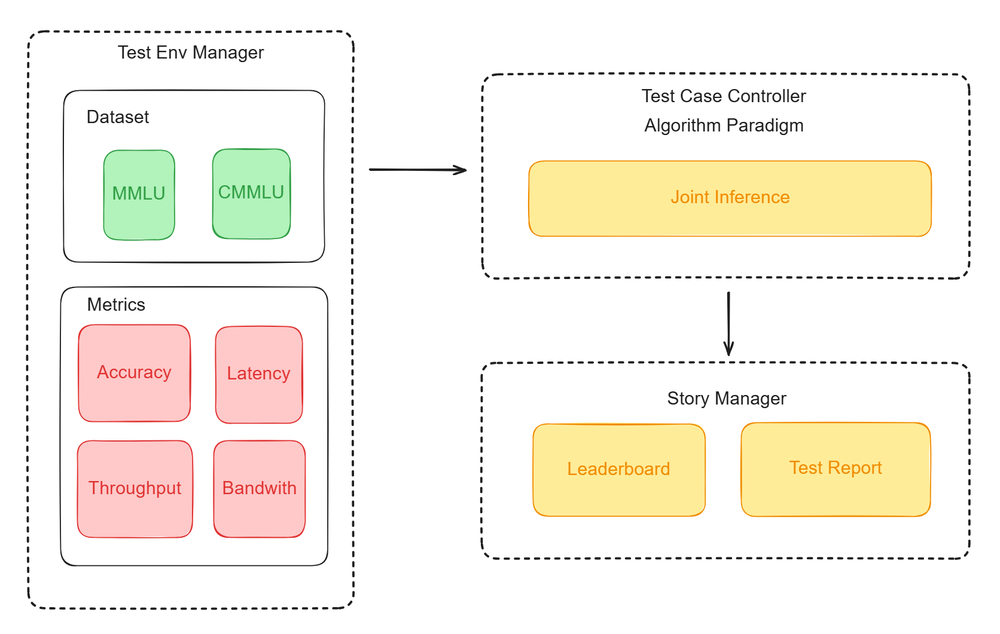
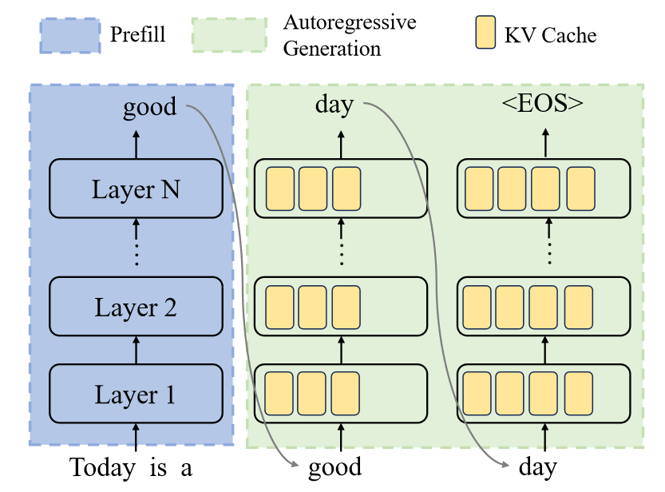
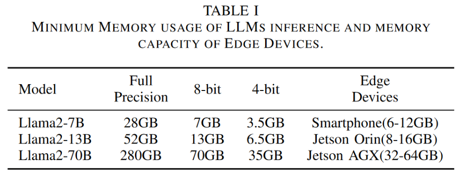
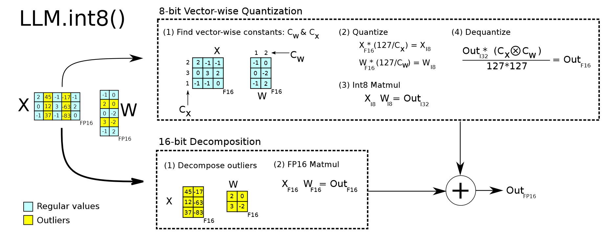
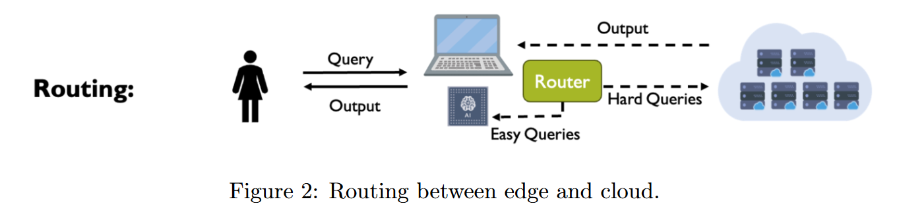
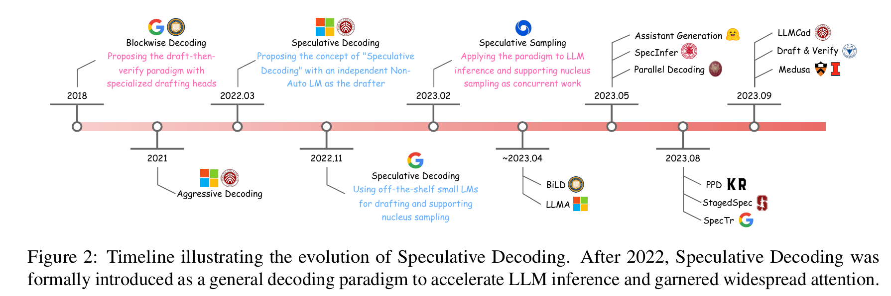
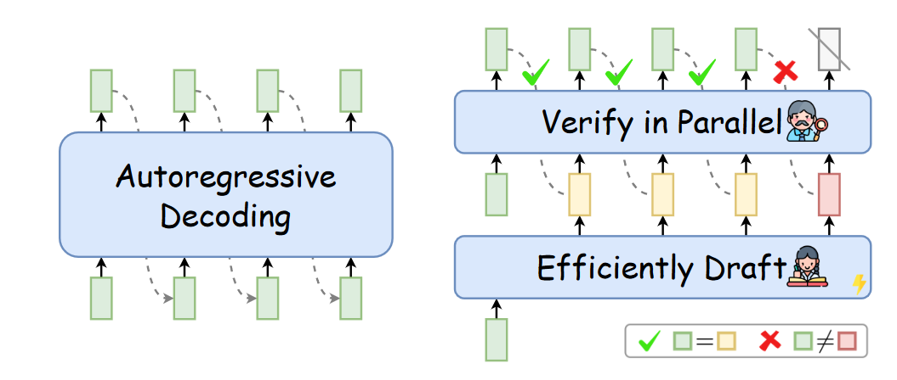

- [Cloud-Edge collaborative inference for LLM based on KubeEdge-Ianvs](#cloud-edge-collaborative-inference-for-llm-based-on-kubeedge-ianvs)
  - [Motivation](#motivation)
    - [Goals](#goals)
  - [Proposal](#proposal)
    - [Use Cases](#use-cases)
  - [Design Details](#design-details)
    - [Implementation Detail](#implementation-detail)
      - [Change of Ianvs](#change-of-ianvs)
      - [Change of Sedna](#change-of-sedna)
      - [Example Implementation](#example-implementation)
    - [Benchmark Construction](#benchmark-construction)
      - [Construction Method](#construction-method)
      - [Metric Selection](#metric-selection)
    - [LLM Background](#llm-background)
      - [LLM Architecture](#llm-architecture)
      - [LLM Overhead Analysis](#llm-overhead-analysis)
      - [Efficient Inference with LLM](#efficient-inference-with-llm)
    - [Collaboration Strategies](#collaboration-strategies)
      - [Query Routing Strategy](#query-routing-strategy)
        - [Model Selection](#model-selection)
        - [Dataset](#dataset)
        - [Loss Function](#loss-function)
        - [Evaluation Metrics](#evaluation-metrics)
        - [Lifelong Learning (Optional)](#lifelong-learning-optional)
      - [Speculative Decoding Strategy](#speculative-decoding-strategy)
    - [Summary](#summary)
  - [Roadmap](#roadmap)
    - [July](#july)
    - [August](#august)
    - [Septembter](#septembter)
  - [References](#references)

# Cloud-Edge collaborative inference for LLM based on KubeEdge-Ianvs
## Motivation

Large language model (LLM) technologies represented by GPT-4, LLaMA-2, and Qwen have demonstrated high usability in a wide range of tasks due to their powerful semantic understanding capabilities, bringing great hope for the realization of general artificial intelligence.

Currently, such LLMs have billions or even trillions of parameters, requiring massive computing power for training and deployment. Therefore, they are often deployed in cloud computing centers and serving via APIs. However, such service paradigm faces many drawbacks: on one hand, the response time of cloud-based LLM is usually very long; on the other hand, uploading user data to the cloud may lead to additional privacy risks and retraining risks $^{[1]}$.

Introducing edge computing into the inference process of large language models will help address these issues. Edge computing is a computational architecture characterized by privacy security and low communication latency that can transfer data processing tasks and services from centralized data centers to network edges with advantages such as low latency, energy efficiency, privacy protection, and bandwidth savings $^{[2]}$. 

Based on the type of device, there are three task offloading strategies for deploying LLMs on edge and cloud: $^{[3]}$:

1. Full-cloud: Strong model performance but weak illusion; long response time; privacy risk.
2. Full-edge: Weak model performance but strong illusion; short response time; privacy security.
3. Edge-cloud collaboration: Balances the strengths and weaknesses of full-cloud and full-edge while ensuring fast response time and privacy protection under the premise of maintaining model performance. 

Edge-cloud collaboration is a more practical way to benefit from edge computing for LLM inference. As the industry's first distributed collaborative AI benchmarking platform, Ianvs should consider adding the above cloud-edge collaboration strategy to improve the efficiency of LLM systems in emerging computing scenarios. 

### Goals


* Task 1: Implement a benchmark for an LLM task in KubeEdge-Ianvs (e.g., user Q&A, code generation, or text translation).
* Task 2: Implement an *query routing* example of LLM cloud-edge collaborative inference in KubeEdge-Ianvs.
* Advanced Task: Implement *speculative decoding* for LLM cloud-edge collaborative inference. 

Highlight: This proposal will introduce a new feature named "Joint Inference" to Ianvs.

## Proposal

We propose KubeEdge-Ianvs to adopt the edge-cloud collaboration strategy to enhance LLM system efficiency according to emerging computational scenarios' needs. This proposal will utilize Sedna's JointInference interface and introduce it to Ianvs' core.

### Use Cases

* Users can get qualified answers from LLMs with lower latency and privacy risk by deploying LLMs using the cloud-edge collaborative strategy.

## Design Details

The architecture of this proposal is shown in the figure below. We leverage the existed *TestEnvManager*, *TestCaseController* and *StoryManager* in Ianvs. 

- In *TestEnvManager*, we plan to add MMLU and CMMLU as LLM benchmark and *Accuracy*, *Latency*, *Throughput*, *Bandwith* as metrics.
- In *TestCaseController*, we plan to add two cloud-edge collaboration algorithm named *Query Routing* and *Speculative Decoding*.
- In *StoryManager*, we plan to show Leaderboard and Test Report for users.



### Implementation Detail 

#### Change of Ianvs

For implementation details, we plan to add a module named `joint_inference` under `core/testcasecontroller/algorithm/paradigm`:

- `joint_inference.py` serves as the entry point for the query routing algorithm (the algorithm planned for implementation in Task 2);
- `sedna_joint_inference.py` is a modified version of the `JointInference` module from `sedna`, which we will modify internally to support collaborative inference with LLMs (in the future, this file should be located in `KubeEdge/sedna` instead of `KubeEdge/ianvs`).

The folder structure will be as follows:

```bash
.
├── testcasecontroller
│   ├── algorithm
│   │   └── paradigm
│   │       ├── __init__.py
│   │       ├── base.py
│   │       ├── joint_inference
│   │       │   ├── __init__.py
│   │       │   ├── joint_inference.py
│   │       │   └── sedna_joint_inference.py
```

We will add enumerations for these two algorithms in `ParadigmType` within `core/common/constant`.

```python
class ParadigmType(Enum):
    SINGLE_TASK_LEARNING = "singletasklearning"
    INCREMENTAL_LEARNING = "incrementallearning"
    MULTIEDGE_INFERENCE = "multiedgeinference"
    LIFELONG_LEARNING = "lifelonglearning"
    JOINT_INFERENCE = "jointinference"
```

We will also modify the `build_paradigm_job()` function in `core/testcasecontroller/algorithm/base.py` to add support for these two algorithms:

```python
from llm_joint_inference.sedna_joint_inference import JointInference

class ParadigmBase:
    def build_paradigm_job(self, paradigm_type):
        if paradigm_type == ParadigmType.JOINT_INFERENCE.value:
            return JointInference(
                estimator=self.module_instances.get(
                    ModuleType.BASEMODEL.value),
                cloud=self.module_instances.get(
                    ModuleType.APIMODEL.value),
                hard_example_mining=self.module_instances.get(
                    ModuleType.HARD_EXAMPLE_MINING.value)
            )
        
        return None
```

Needed fields will also be added to `core/testcasecontroller/algorithm/algorithm.py` to support the new algorithm.

```python
from core.testcasecontroller.algorithm.paradigm import (
    SingleTaskLearning,
    IncrementalLearning,
    MultiedgeInference,
    LifelongLearning,
    JointInference
)

class Algorithm:
    def paradigm(self, workspace: str, **kwargs):
        
        if self.paradigm_type == ParadigmType.JOINT_INFERENCE.value:
            return JointInference(workspace, **config)
      
        return None
```

#### Change of Sedna

Currently, Sedna's JointInference implementation has two major issues:

- the collaborative strategy is hard-coded and not suitable for LLM tasks; 
- The difference between the ModelClient for CV model and OpenAI API for LLM is significant.

Therefore, we plan to make two modifications to Sedna's joint inference.

- Introduce a new parameter `cloud` to the constructor of the JointInference class, allowing users to pass a self-designed model client instance. This resolves the issue where LLM currently needs to build unnecessary forwarding service. Since cloud is an optional parameter, it will not affect existed joint inference examples in Sedna.

```python
    def __init__(self, estimator=None, cloud=None, hard_example_mining: dict = None):
        super(JointInference, self).__init__(estimator=estimator)
```

- Introduce a parameter `mining_mode` for the `inference()` function of the JointInference class. Based on different mining modes, construct corresponding processes to address the issue of current collaborative processes not being compatible with LLMs. For example, we could use "inference-then-mining" for Object Detection collaborative strategy and "mining-then-inference" for LLM query routing strategy.

```python
      mining_mode = kwargs.get("mining_mode", "inference-then-mining")

        if mining_mode == "inference-then-mining":
            # Fist inference on the edge, then mining hard example, and finally inference on the cloud if needed. 
            res, edge_result = self._get_edge_result(data, callback_func, **kwargs)
            
            if self.hard_example_mining_algorithm is None:
                raise ValueError("Hard example mining algorithm is not set.")
            
            is_hard_example = self.hard_example_mining_algorithm(res)
            if is_hard_example:
                res, cloud_result = self._get_cloud_result(data, post_process=post_process, **kwargs)

        elif mining_mode == "mining-then-inference":
            # First conduct hard example mining, and then decide whether to execute on the edge or in the cloud.
            if self.hard_example_mining_algorithm is None:
                raise ValueError("Hard example mining algorithm is not set.")

            is_hard_example = self.hard_example_mining_algorithm(res)
            if is_hard_example:
                if not sepeculative_decoding:
                    res, cloud_result = self._get_cloud_result(data, post_process=post_process, **kwargs)
                else:
                    # do speculative_decoding
                    pass
            else:
                res, edge_result = self._get_edge_result(data, callback_func, **kwargs)
        
        else:
            raise ValueError(
                "Mining Mode must be in ['mining-then-inference', 'inference-then-mining']"
            )

        return [is_hard_example, res, edge_result, cloud_result]
```

This modification can be contributed back to Sedna. For more interface design details, please check [Two plans to introduce Joint Inference](https://github.com/kubeedge/ianvs/pull/122#issuecomment-2268431596)

#### Example Implementation

We will add a folder named `cloud-edge-collaborative-inference-for-llm` under the `examples/` directory, which will contain two subprojects: `query-routing` and `speculative-decoding`.

```bash
├── cloud-edge-collaborative-inference-for-llm
│   ├── README.md
│   ├── benchmarkingjob.yaml
│   ├── testalgorithms
│   │   ├── query-routing
│   │   │   ├── cloud_model.py
│   │   │   ├── edge_model.py
│   │   │   ├── hard_example_mining.py
│   │   │   ├── test_queryrouting.yaml
│   │   │   ├── models
│   │   │   │   ├── api_llm.py
│   │   │   │   ├── base_llm.py
│   │   │   │   ├── huggingface_llm.py
│   │   │   │   └── vllm_llm.py
│   │   └── sepeculative-decoding
│   │   │   └── ...
│   └── testenv
│       ├── acc.py
│       ├── lantency.py
│       ├── throughput.py
│       ├── bandwith.py
│       └── testenv.yaml
```

We will create the following content in `query-routing/basemodel.py` to implement the registration of the query-routing base class.

```python
from models.joint_inference import JointInference, BigModelService
from models.llm import LLM_HuggingFace, LLM_vLLM, LLM_via_API, 

@ClassFactory.register(ClassType.GENERAL, alias="EdgeModel")
class BaseModel:
    """
        This is actually the Edge Model.
    """
    def __init__(self, **kwargs):
        self.kwargs = kwargs
        self.model_url = kwargs.get("model_name", None)
        self.backend = kwargs.get("backend", "huggingface") 
        self.quantization = kwargs.get("quantization", "full")
        self._set_config()
        # 'backend' means serving framework: "huggingface", "vllm"
        # 'quantization' means quantization mode："full","4-bit","8-bit"
    
    def _set_config(self):
        # Some parameters are passed to Sedna through environment variables 
        parameters = os.environ
        # EdgeModel URL, see at https://github.com/kubeedge/sedna/blob/ac623ab32dc37caa04b9e8480dbe1a8c41c4a6c2/lib/sedna/core/base.py#L132
        parameters["MODEL_URL"] = self.model_url

    def load(self, model_url=None):
        if self.backend == "huggingface":
            self.model = HuggingfaceLLM(model_url, self.quantization)
        elif self.backend == "vllm":
            self.model = VllmLLM(model_url, self.quantization)
        else:
            raise Exception(f"Backend {self.backend} is not supported")
        
        self.model.load(model_url=model_url)

    def predict(self, data, input_shape=None, **kwargs):
        answer_list = []
        for line in data:
            response = self.model.inference(line)
            answer_list.append(response)
        return answer_list
```

We will also construct a BERT classifier in `query-routing/hard_example_mining` to achieve the classification of hard examples.

```python
@ClassFactory.register(ClassType.HEM, alias="BERT-Classifier")
class BERTFilter(BaseFilter, abc.ABC):
    def __init__(self, model_path, **kwargs):
        self.classifier = pipeline(
            "text-classification", 
            model=model_path, 
            trust_remote_code=True
        )
    
    def _predict(self, data):
        result = self.classifier(data)
        return result

    def __call__(self, data=None) -> bool:
        return self._predict(data)
```

The content of `benchmarkingjob.yaml` is as follows:

```python
benchmarkingjob:
  name: "benchmarkingjob"
  workspace: "/root/autodl-fs/ianvs/workspace"
  testenv: "./examples/cloud-edge-collaborative-inference-for-llm/testenv/testenv.yaml"
  test_object:
    type: "algorithms"
    algorithms:
      - name: "query-routing"
        url: "./examples/cloud-edge-collaborative-inference-for-llm/testalgorithms/queyr-routing/test_queryrouting.yaml"
  rank:
    sort_by: [ { "acc": "descend" } ]
    visualization:
      mode: "selected_only"
      method: "print_table"

    selected_dataitem:
      paradigms: [ "llmqueryrouting" ]
      modules: [ "all" ]
      hyperparameters: [ "all" ]
      metrics: [ "acc" , "latency", "throughput", "bandwith"]

    save_mode: "selected_and_all"
```

The content of `test_queryrouting.yaml` is as follows:

```python
algorithm:
  paradigm_type: "jointinference"
  modules:
    - type: "basemodel"
      name: "EdgeModel"
      url: "./examples/cloud-edge-collaborative-inference-for-llm/testalgorithms/query-routing/edgemodel.py"
      hyperparameters:
        - model_name: "Qwen/Qwen-1.8B-Chat"
        - backend: "huggingface"
        - quantization: "4-bit"
        - config:
            temperature: 0.7
            top_p: 5
            max_token: 2048

	- type: "apimodel"
      name: "CloudModel"
      url: "./examples/cloud-edge-collaborative-inference-for-llm/testalgorithms/query-routing/cloudmodel.py"
      hyperparameters:
        - model_name: "gpt-4o"
        - config:
            temperature: 0.7
            top_p: 5
            max_token: 2048

    - type: "hard_example_mining"
      name: "HardSampleMining"
      url: "./examples/robot/lifelong_learning_bench/testalgorithms/rfnet/hard_sample_mining.py"
      hyperparameters:
        - example_config: 0
```

### Benchmark Construction

#### Construction Method

Compared to traditional DNN models, the evaluation of LLM faces unprecedented challenges. On one hand, it requires consideration from multiple aspects such as knowledge understanding, logical inference, role-playing, and professional skills; on the other hand, the evaluation list itself has data leakage issues. Emerging LLMs may incorporate evaluation list data into training data, leading to inaccurate evaluations.

The evaluation of LLM is a massive system engineering project. In order to align with the reliability of evaluations in academia and industry, it is recommended to introduce OpenCompass into KubeEdge-Ianvs as an implementation method for Benchmark and integrate one or several sets of evaluations.

OpenCompass was released by Shanghai Artificial Intelligence Laboratory and integrates multiple dimensions of evaluation lists including Language, Knowledge, Reasoning, Examination, Safety Code Understanding Long Context etc., which can broadly reflect the capabilities of LLMs and has become an important tool for evaluating LLM $^{[4]}$.

#### Metric Selection

Among the supported lists in OpenCompass mentioned above，Examination、Knowledge、Reasoning、Code have strong reference significance and can more fully reflect the abilities of LLMs. 

For simplicity, we can choose MMLU / CMMLU in Examination category as our evaluation benchmark.

### LLM Background

#### LLM Architecture

The current mainstream LLM architecture is Decoder-only, which requires two stages of Prefill and Decoding $^{[5]}$.

In the Prefill stage, the user input tokens $(x_1,\cdots,x_n)$ are taken as input to generate the first token $x_{n+1}$.

In the Decoding stage, results are generated iteratively token by token until an end tag is produced or the maximum output length is reached.



As Decoding is iterative, in order to reduce redundant calculations, a key-value pair KV-Cache is used to cache previous processing results so that only new tokens are included for computation.

#### LLM Overhead Analysis

LLM's characteristic feature is its large memory overhead. Taking the Llama2 series as an example, full-precision model memory usage ranges from tens of gigabytes to several hundred gigabytes, posing significant challenges for deploying LLM.



Furthermore, LLM also incurs high time overhead. This is because its generation process operates in an autoregressive manner and can only generate serially token by token. As a result, GPU utilization rates are not high and serious communication bottlenecks occur.

#### Efficient Inference with LLM

To alleviate memory usage issues, some studies have proposed low-bit quantization strategies such as llm.int8(), which can achieve 8-bit or 4-bit quantization while maintaining almost unchanged precision levels for reducing memory consumption with LLM $^{[6]}$.



In order to improve GPU utilization during inference with LLM models, some research has adopted Continuous batching strategy where multiple inferences are combined into a single batch for unified inference and utilize pipelining scheduling to enhance efficiency such as vLLM $^{[7]}$.


Additionally, in order to overcome Python's inherent limitations, certain engineering implementations have utilized C++ rewriting of the inference service for LLN models like llama.cpp. The primary goal of these frameworks is to implement inference on various hardware platforms supporting multiple types of LLN models integrating model compression quantization and deployment functions beneficial for deployment on edge devices $^{[8]}$.

### Collaboration Strategies

The edge cloud collaboration strategy mainly includes three types of strategies: *slicing* strategy, *query routing* strategy and *speculative decoding* strategy.

1. The *slicing* strategy refers to slicing the LLM according to the computing power requirements and time overhead of each layer, and allocating it to be executed on edge servers and cloud servers. The slicing strategy can solve the privacy issues of requests, but communication overhead is still significant.
2. The *query routing* strategy involves deploying a small model on the edge server and a large model on the cloud side, routing user requests to the edge or cloud based on performance needs. The collaboration strategy can greatly reduce communication overhead, but there are still some privacy issues as some requests will go to the cloud.
3. The *speculative decoding* strategy also involves deploying a small model on the edge server and a large model on the cloud side. Different from query routing, this strategy needs the small model and large model to collaboration   through all the generation process of one query.

#### Query Routing Strategy

The principle of *query routing* strategy is shown in the following figure.



The core of this strategy is designing a routing model $R$ that can predict the performance of user request $q$ in both the large cloud model $L$ and small edge model $S$. This model takes request $q$ as input and outputs two labels, 0 or 1, representing preference for either edge or cloud. 

This is essentially a text classification task which can be accomplished by training an NLP model. Training such a model involves considerations such as selecting models, datasets, loss functions, evaluation metrics etc.

##### Model Selection

Typically BERT completes text classification tasks. There are many variants of BERT models including BERT-large, ALBERT, RoBERTa etc. Based on relevant references we plan to fine-tune a RoBERTa variant for completing text classification tasks $^{[3]}$. RoBERTa is an excellent multilingual variant of BERT with better performance across multiple metrics compared to other models.

With LLM coming into existence there have been examples using LLM for text classification tasks too. We could also attempt fine-tuning a lightweight LLM like TinyLlama for performing classification tasks.

##### Dataset

To fine-tune our models we need training data formatted as follows:

| ID   | Query                               | Label |
| ---- | ----------------------------------- | ----- |
| 0    | 1+1 = ?                             | 0     |
| 1    | Explain the principles behind BERT. | 1     |
| ...  | ...                                 | ...   |

We could refer to Hybrid LLMs $^{[3]}$ and use MixInstruct dataset to generate queries. This dataset contains a wide range of real instructions for various tasks, which helps classifiers develop strong generalization capabilities. We can extract around 10K instructions from MixInstruct dataset where each instruction $q_i$ would be answered by both edge-serving small model and cloud-serving large model with responses $A_s$ and $A_l$. 

For responses $A_s$ and $A_l$ we could evaluate their quality using [BART Score](https://github.com/neulab/BARTScore) getting quality scores $S_s$ and $S_l$ respectively where BART score can measure textual generation quality easily through code snippet provided below:

```python
>>> from bart_score import BARTScorer
>>> bart_scorer = BARTScorer(device='cuda:0', checkpoint='facebook/bart-large-cnn')
>>> bart_scorer.score(['This is interesting'], ['This is fun'], batch_size=4) # generation scores from first list texts vs second list texts.
[out]
[-2.510652780532837]
```

Then we can get label $y_i$ through the formula below:

$$
y_i = \begin{cases}
0 &\text{if} ~~~ S_s \geq S_l - \epsilon \\
1 &\text{if} ~~~ S_s < S_l - \epsilon
\end{cases}  
$$

where $\epsilon$ represents permissible performance loss margin.

According to recent generative evaluation progress, we can also consider using LLMs like GPT-4 to give scores for the generated response. The best solution needs to wait for the results of the experiment.

##### Loss Function

We could utilize binary cross entropy function during the training process of the classifier:

$$
\mathcal{L}(w)=-\frac{1}{N} \sum_{i=1}^{N}\bigg[y_{i} \log \big(p_{w}(q_{i})\big)+(1-y_{i}) \log \big(1-p_{w}(q_{i})\big)\bigg]
$$

where $p_w(q_i)$ denotes logits generated by the classifier.

##### Evaluation Metrics

Classifier's evaluation may involve *Accuracy*, *Recall* , *F-score* etc. To verify the overall performance of the system, we can use the Benchmark built with OpenCompass to conduct comprehensive performance testing after setting up the whole system to obtain its performance on typical test sets such as MMLU.

As for the whole cloud-edge collaboration inference process, we should also consider *Latency*, *Throughput*, *Bandwith*. 

##### Lifelong Learning (Optional)

In a long-running cloud-based collaborative inference system for LLM, we can collect user feedback for each generated answer and continuously use the feedback as training data to train the classifier, thereby improving the decision-making ability of the classifier to higher and higher.


#### Speculative Decoding Strategy

Speculative decoding serves as an acceleration method during LLM decoding phase. Over the past few years, several studies have explored speculative decoding, as shown below:



The core idea behind speculative decoding lies in utilizing smaller-scale models predicting future multiple words quickly during decoding followed by parallel validation via larger-scale models; if validation fails then re-generation by larger-scale occurs. In traditional auto-regressive decoding phase, every token is generated one at time, which limits the speed of generation. Speculative decoding combines fast predictions made by smaller size models along with parallel validations done by larger ones and significantly speeds up the generation $^{[9]}$ .



Speculative Decoding requires probability distributions being identical between smaller and larger models, which can ensure high likelihoods between tokens generated by smaller and larger models. Consistent predicted tokens should be retained while inconsistent ones should be discarded .

For most cases, the majority part tokens predicted by smaller scaled modes get adopted. The worst case is that all tokens predicted rejected. however due faster speeds brought about these additional time costs remain minimal relative accelerated effects brought about .

HuggingFace has implemented open source solution related to Speculative Decoding, which is available at [Assisted Generation](https://huggingface.co/blog/assisted-generation).

### Summary

Task 1 is planned to be implemented as follows:

- Integrate OpenCompass to build the evaluation of MMLU and CMMLU benchmarks.

Task 2 is planned to be implemented as follows:

- Model selection: Qwen-1.8B model will be used at the edge, and Qwen-72B-Chat model will be used in the cloud. (For simplicity, also may choose to use LLM service like GPT-4, GLM-4, Claude as our cloud model)
- Classifier design: Train a RoBERTa-base as a classifier. If time allows, also train a TinyLlama for classifier comparison.
- Inference optimization: Plan to use low-bit quantization technology to achieve 4-bit and 8-bit quantized deployment, and introduce vllm to form the inference framework.

Advanced task is planned to be implemented as follows:

- Combine HuggingFace code examples to complete speculative decoding of LLM.
- Implement the speculative decoding strategy in the edge-cloud collaborative framework.


## Roadmap

### July

- Study code and interfaces of Ianvs.
- Task 1: build a benchmark for LLM.

### August

- Task 2: build a cloud-edge collaborative inference example for LLM.
- Try advanced task: build a *speculative decoding* example for cloud-edge collaborative inference.

### Septembter

- Write detailed docs for this proposal.
- PR and merge.

## References

[1] Z. Zhou *et al.*, “Edge Intelligence: Paving the Last Mile of Artificial Intelligence With Edge Computing,” *Proceedings of the IEEE*, vol. 107, no. 8, pp. 1738–1762, Aug. 2019

[2] M. Xu *et al.*, “Unleashing the Power of Edge-Cloud Generative AI in Mobile Networks: A Survey of AIGC Services,” *IEEE Communications Surveys & Tutorials*, pp. 1–1, 2024

[3] D. Ding *et al.*, “Hybrid LLM: Cost-Efficient and Quality-Aware Query Routing.” arXiv, Apr. 22, 2024. Accessed: May 30, 2024. 

[4] O. Contributors, “OpenCompass: a universal evaluation platform for foundation models.” 2023. [Online]. Available: https://github.com/open-compass/opencompass

[5] M. Zhang *et al.*, “EdgeShard: Efficient LLM Inference via Collaborative Edge Computing.” arXiv, May 23, 2024. 

[6] T. Dettmers, M. Lewis, Y. Belkada, and L. Zettlemoyer, “LLM.int8(): 8-bit Matrix Multiplication for Transformers at Scale.” arXiv, Nov. 10, 2022.

[7] W. Kwon *et al.*, “Efficient Memory Management for Large Language Model Serving with PagedAttention.” arXiv, Sep. 12, 2023. Accessed: Jan. 31, 2024.

[8] G. Gerganov, “ggerganov/llama.cpp.” May 31, 2024. Accessed: May 31, 2024. [Online]. Available: https://github.com/ggerganov/llama.cpp

[9] H. Xia *et al.*, “Unlocking Efficiency in Large Language Model Inference: A Comprehensive Survey of Speculative Decoding.” arXiv, Feb. 20, 2024. Accessed: May 31, 2024.