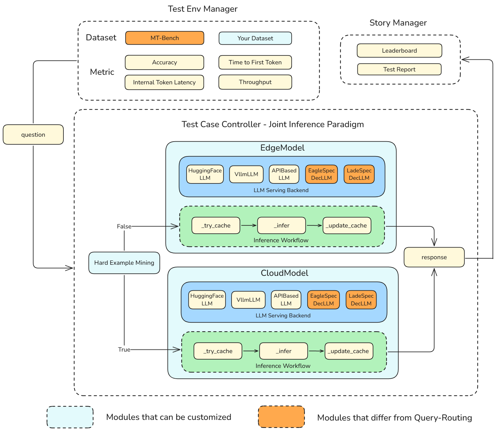
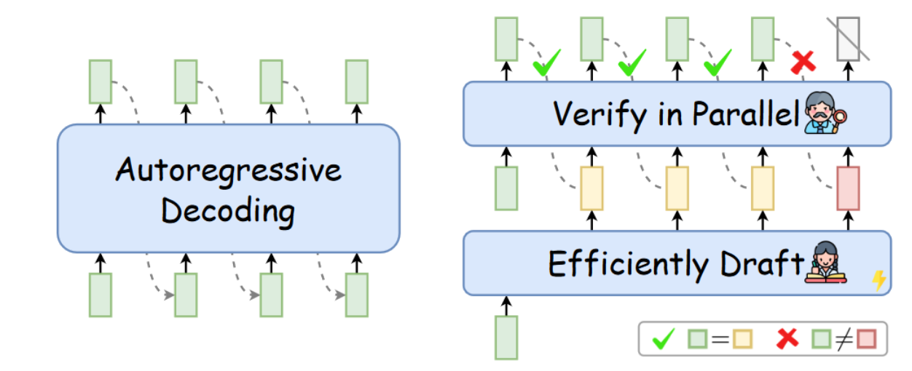
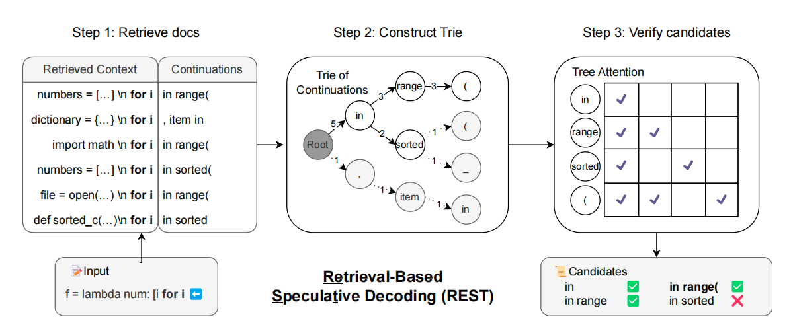

- [Cloud-edge collaborative speculative decoding for LLM based on KubeEdge-Ianvs](#cloud-edge-collaborative-speculative-decoding-for-llm-based-on-kubeedge-ianvs)
  - [Motivation](#motivation)
    - [Goals](#goals)
  - [Proposal](#proposal)
  - [Design Details](#design-details)
    - [Highlights](#highlights)
    - [Overall Architecture](#overall-architecture)
    - [Speculative Decoding Implementation](#speculative-decoding-implementation)
      - [Draft-Model Mechanism](#draft-model-mechanism)
      - [No-Draft-Model Mechanism](#no-draft-model-mechanism)
    - [Cloud Edge Collaboration Strategy](#cloud-edge-collaboration-strategy)
  - [Roadmap](#roadmap)
    - [October](#october)
    - [November](#november)
  - [References](#references)

# Cloud-edge collaborative speculative decoding for LLM based on KubeEdge-Ianvs

## Motivation

### The way to higher inference speed

Large Language Models have been proved to be effective in many natural language processing tasks, such as machine translation, text generation, and question answering. However, these tasks are not the ultimate goal of LLM development. Currently, extensive research indicates that ***LLM-based Agents have significant potential for automating control over a variety of complex software programs.***, which may greatly improve the efficiency of human-computer interaction finally lead to a fully automated society.

The inference speed of Large Language Model (LLM) is a key QoE (Quality-of-Experience) metric for many applications. 
- In chatbot scenario, higher inference speed means faster responses, enabling users catch up the needed answers in time, which is crucial especially in long-context conversations. 
- In agent-based applications, faster inference speed means quicker decision-making and faster conduction, which is essential for real-time control.

However, the autoregressive decoding mode of LLM determines that LLM can only be decoded serially, which limits its inference speed. There have been many researches on improving the inference speed of LLM. Some researches focus on the efficient Attention mechanis such as FlashAttention $^{2}$ and PagedAttention $^{3}$ , aiming to make the attention computation faster, while some dive into quantization techniques such as GPTQ $^{4}$ and AWQ $^{5}$, trying to reduce the model size and improve the inference speed. 

### Speculative Decoding's Effect

***Speculative decoding technique*** is another promising solution to improve the inference speed of LLM without any accuracy loss. With speculative decoding techniques, LLMs can generate multiple tokens quickly using a small model or a pre-build trie-tree, then choose the correct token as the final output.

Below is a gif showing the process of lookahead decoding, a typical speculative decoding technique, where blue fonts are tokens generated in parallel in a single decoding step.

On a preliminary experiment, we have compared the inference speed of `Qwen2-7B-Instruct` model on a single RTX-4090 GPU with three different LLM Serving engines, including `transformers`, `vLLM`, and a speculative decoding framework named `EAGLE`. 

The results shows that EAGLE can achieve a 2.66x speed up compared to the `transformers` engine. When generating an article or a segment of code with 1000 tokens, the `transformers` requires 20.16 seconds, `vLLM` needs 16.78 seconds, the `EAGLE` only takes 7.6 seconds.

| Serving Engine | Time to First Token (s) | Internal Token Latency (s) | Throughput (tokens/s) | Speed Up |
| :-----------:| :-----------------------: | :--------------------------: | :---------------------: | :--------: | 
| transformers   | 1.4382                  | 0.0202                     | 49.60                 | 1.00x    |
| vLLM           | **0.0676**              | 0.0168                     | 59.54                 | 1.20x    | 
| EAGLE         | 0.1918                  | **0.0076**                 | **131.80**            | **2.66x**    |

Besides, on November 6, 2024, OpenAI introduced an innovative feature named [**Predicted Outputs**](https://x.com/OpenAIDevs/status/1853564730872607229), which is capable of accelerating GPT-4o generation by **2-4 times** while maintaining accuracy. This remarkable capability is rooted in the concept of Speculative Decoding, showcasing its immense potential to enhance the inference speed of Large Language Models (LLMs).

### The Lack of Consideration in Cloud-Edge Scenario
Currently, the cloud-edge collaborative speculative decoding technology mainly focus on the cloud-only scenario, **lack of consideration for performance in cloud-edge environments**.

This project aims to implement cloud-edge collaborative speculative decoding benchmark based on KubeEdge-Ianvs, an open source cloud-edge collaborative distributed machine learning platform, so as to further improve the LLM inference speed in cloud-edge environment.

### Goals

- Implement an example of cloud-edge collaborative speculative decoding based on KubeEdge-Ianvs platform.
- (Optional) Propose a more efficient cloud-edge collaborative speculative decoding algorithm.

## Proposal

We propose KubeEdge-Ianvs to adopt the cloud-edge collaborative speculative decoding strategy to enhance LLM system efficiency according to emerging computational scenarios' needs.

This proposal will utilize Sedna's Joint Inference interface and Ianvs's `query-routing` pipeline.

## Design Details
### Highlights

This proposal mainly differs from the existing `query-routing` pipeline that already exists with Ianvs in that:

- **Benchmark**: will add `MT-Bench` as a new accuracy benchmark and *Latency*, *Throughput*, *Internal Token Latency* as performance metrics.
- **Mechanisms**: will add a series LLM-Serving backend in *Query Routing* pipeline, including *Draft-Model Mechanisms* such as `EagleSpecDecLLM` and *No-Draft-Model Mechanisms* such as `LadeSpecDecLLM`.

### Overall Architecture

The architecture of this proposal is shown in the figure below. We leverage the existed *TestEnvManager*, *TestCaseController* and *StoryManager* in Ianvs.

- In *TestEnvManager*, we plan to add `MT-Bench` as benchmark and *Accuracy*, *Latency*, *Throughput*, *Internal Token Latency* as metrics.
- In *TestCaseController*, we plan to add a series of cloud-edge collaboration serving framework named *SpecDecLLMs* in *Query Routing* pipeline. 
  - The series of *SpecDecLLMs* will include *Draft-Model Mechanisms* such as `EagleSpecDecLLM` and *No-Draft-Model Mechanisms* such as `LadeSpecDecLLM`.
- In *StoryManager*, we plan to show Leaderboard and Test Report for users.

The core progress is herited from the [Query Routing](https://github.com/kubeedge/ianvs/tree/main/examples/cloud-edge-collaborative-inference-for-llm).

### Speculative Decoding Implementation

Basically, there are two types of speculative decoding strategy.

#### Draft-Model Mechanism

Draft-Model Mechanism uses Small-scale LLM as a draft model to quickly generate tokens, which are then verified by LLM.

The representative work includes:
- [EAGLE](https://github.com/SafeAILab/EAGLE): Faster Inference of Language Models with Dynamic Draft Trees $^{6}$
- [MEDUSA](https://github.com/FasterDecoding/Medusa): Simple LLMInference Acceleration Framework with Multiple Decoding Heads $^{7}$
- ...

#### No-Draft-Model Mechanism
No-Draft-Model Mechanism doesn't require a draft model. It builds a Trie tree based on existing documents and also has them verified by LLM.

The representative work includes:
- [REST](https://github.com/FasterDecoding/REST): REST: Retrieval-Based Speculative Decoding $^{8}$
- [LADE](https://github.com/hao-ai-lab/LookaheadDecoding): Break the Sequential Dependency of LLM Inference Using Lookahead Decoding $^{9}$
- ...

### Cloud Edge Collaboration Strategy

The cloud-edge collaboration for speculative decoding can take many forms, such as:
- The DraftModel is placed on the edge device and Large Model is placed in the cloud.
- Trie tree is placed on the edge device while the Large Model remains in the cloud.

However, these methods face some challenges in a cloud-edge architecture:
- The edge device might lack sufficient resources, leading to slow model generation and rendering the Draft Model approach ineffective.
- The cloud-edge system often face higher propagation delays, significantly higher than Internal Token Latency (ITL) (e.g., 50ms vs. 5ms), which may lead to a worse performance than the cloud-only system.

To minimize communication as much as possible, we consider deploying both Draft Model or Trie Tree and Large Model together on the edge or on the cloud, achieving edge-cloud collaboration through [Query Routing](https://github.com/kubeedge/ianvs/tree/main/examples/cloud-edge-collaborative-inference-for-llm).

The entire process is as follows:

- Using a Hard Example Mining Module to judge a query is hard or not.
  - If easy, send the query to the small model on Edge. 
  - If hard, send the query to the Large Model on Cloud.
- Both the small model and the large model can use speculative decoding mechanism to accelerate the inference process.
    - Mechanism 1: Draft-Model Mechanism
    - Mechanism 2: No-Draft-Model Mechanism

## Roadmap

### October

- Submit a proposal and build a prototype of speculative decoding.

### November

- Implement an example using either the draft model strategy or the documents retrieval strategy.
- PR and merge.

## References

[1] H. Xia *et al.*, “Unlocking Efficiency in Large Language Model Inference: A Comprehensive Survey of Speculative Decoding.” arXiv, Feb. 20, 2024. Accessed: May 31, 2024.

[2] T. Dao, “FlashAttention-2: Faster Attention with Better Parallelism and Work Partitioning,” Jul. 17, 2023, arXiv: arXiv:2307.08691. doi: 10.48550/arXiv.2307.08691.4

[3] W. Kwon et al., “Efficient Memory Management for Large Language Model Serving with PagedAttention,” Sep. 12, 2023, arXiv: arXiv:2309.06180. doi: 10.48550/arXiv.2309.06180.

[4] J. Lin et al., “AWQ: Activation-aware Weight Quantization for LLM Compression and Acceleration,” Jul. 18, 2024, arXiv: arXiv:2306.00978. doi: 10.48550/arXiv.2306.00978.

[5] E. Frantar, S. Ashkboos, T. Hoefler, and D. Alistarh, “GPTQ: Accurate Post-Training Quantization for Generative Pre-trained Transformers,” Mar. 22, 2023, arXiv: arXiv:2210.17323. doi: 10.48550/arXiv.2210.17323.

[6] Y. Li, F. Wei, C. Zhang, and H. Zhang, “EAGLE-2: Faster Inference of Language Models with Dynamic Draft Trees,” in Proceedings of the 2024 Conference on Empirical Methods in Natural Language Processing, Y. Al-Onaizan, M. Bansal, and Y.-N. Chen, Eds., Miami, Florida, USA: Association for Computational Linguistics, Nov. 2024, pp. 7421–7432.

[7] T. Cai et al., “Medusa: Simple LLM Inference Acceleration Framework with Multiple Decoding Heads,” Jun. 14, 2024, arXiv: arXiv:2401.10774. doi: 10.48550/arXiv.2401.10774.

[8] Z. He, Z. Zhong, T. Cai, J. Lee, and D. He, “REST: Retrieval-Based Speculative Decoding,” in Proceedings of the 2024 Conference of the North American Chapter of the Association for Computational Linguistics: Human Language Technologies (Volume 1: Long Papers), K. Duh, H. Gomez, and S. Bethard, Eds., Mexico City, Mexico: Association for Computational Linguistics, Jun. 2024, pp. 1582–1595. doi: 10.18653/v1/2024.naacl-long.88.

[9] Y. Fu, P. Bailis, I. Stoica, and H. Zhang, “Break the Sequential Dependency of LLM Inference Using Lookahead Decoding,” in Proceedings of the 41st International Conference on Machine Learning, R. Salakhutdinov, Z. Kolter, K. Heller, A. Weller, N. Oliver, J. Scarlett, and F. Berkenkamp, Eds., in Proceedings of Machine Learning Research, vol. 235. PMLR, Jul. 2024, pp. 14060–14079. 
