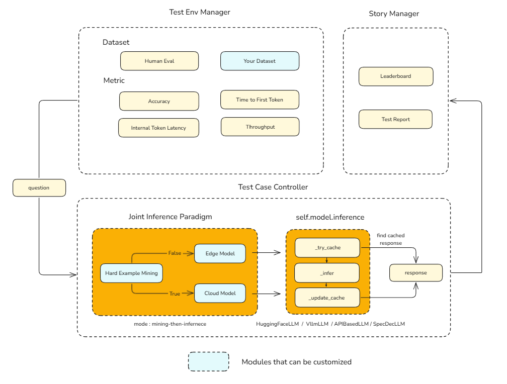
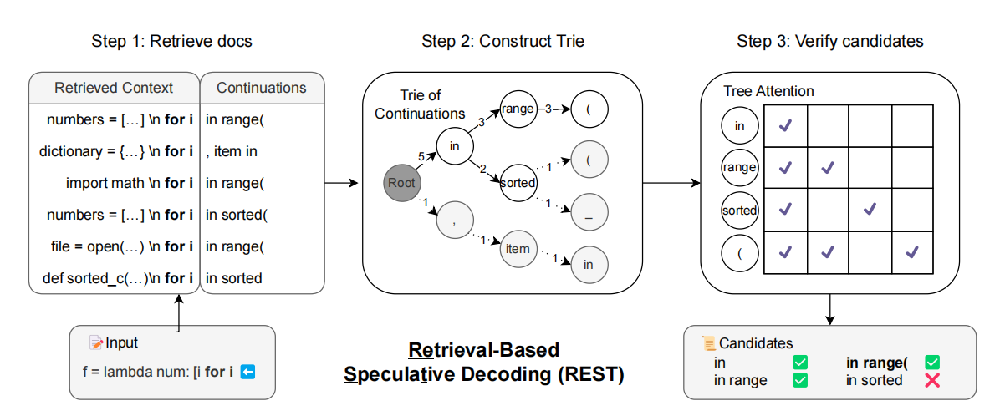

- [Cloud-edge collaborative speculative decoding for LLM based on KubeEdge-Ianvs](#cloud-edge-collaborative-speculative-decoding-for-llm-based-on-kubeedge-ianvs)
  - [Motivation](#motivation)
    - [Goals](#goals)
  - [Proposal](#proposal)
  - [Design Details](#design-details)
    - [Overall Architecture](#overall-architecture)
    - [Speculative Decoding Implementation](#speculative-decoding-implementation)
  - [Roadmap](#roadmap)
    - [October](#october)
    - [November](#november)
  - [References](#references)

# Cloud-edge collaborative speculative decoding for LLM based on KubeEdge-Ianvs

## Motivation

The autoregressive decoding mode of LLM determines that LLM can only be decoded serially, which limits its inference speed.  Speculative decoding technique can be used to decode LLM in parallel with the help of draft model, so as to improve the inference speed of LLM without loss of accuracy. However, the speculative decoding technology of LLM does not consider the application in the cloud-edge distributed environment. 

This project aims to implement cloud-edge collaborative speculative decoding based on KubeEdge-Ianvs, an open source cloud-edge collaborative distributed machine learning platform, so as to further improve the LLM inference speed in cloud-edge environment.

### Goals

- Implement an example of cloud-edge collaborative speculative decoding based on KubeEdge-Ianvs platform.
- (Optional) Propose a more efficient cloud-edge collaborative speculative decoding algorithm.

## Proposal

We propose KubeEdge-Ianvs to adopt the cloud-edge collaborative speculative decoding strategy to enhance LLM system efficiency according to emerging computational scenarios' needs. 

This proposal will utilize Sedna's Joint Inference interface and `query-routing` example

## Design Details

### Overall Architecture

The architecture of this proposal is shown in the figure below. We leverage the existed *TestEnvManager*, *TestCaseController* and *StoryManager* in Ianvs.

- In *TestEnvManager*, we plan to add Human Eval as LLM benchmark and *Accuracy*, *Latency*, *Throughput*, *Internal Token Latency* as metrics.
- In *TestCaseController*, we plan to add a cloud-edge collaboration algorithm named *Speculative Decoding*. This will inherit the process of *Query Routing*.
- In *StoryManager*, we plan to show Leaderboard and Test Report for users.

### Speculative Decoding Implementation

Basically, there are two types of speculative decoding strategy. 

One method uses SLM as a draft model to quickly generate tokens, which are then verified by LLM.

The other method builds a Trie tree based on existing documents to predict tokens and also has them verified by LLM.

## Roadmap

### October

- Submit a proposal and build a prototype of speculative decoding.

### November

- Implement an example using either the draft model strategy or the documents retrieval strategy.
- PR and merge.

## References

[1] H. Xia *et al.*, “Unlocking Efficiency in Large Language Model Inference: A Comprehensive Survey of Speculative Decoding.” arXiv, Feb. 20, 2024. Accessed: May 31, 2024.

[2] He, Zhenyu, et al. "Rest: Retrieval-based speculative decoding." *Proceedings of the 2024 Conference of the North American Chapter of the Association for Computational Linguistics: Human Language Technologies*. 2024

[3] Zhao, Yao, et al. "Lookahead: An inference acceleration framework for large language model with lossless generation accuracy." *Proceedings of the 30th ACM SIGKDD Conference on Knowledge Discovery and Data Mining*. 2024.