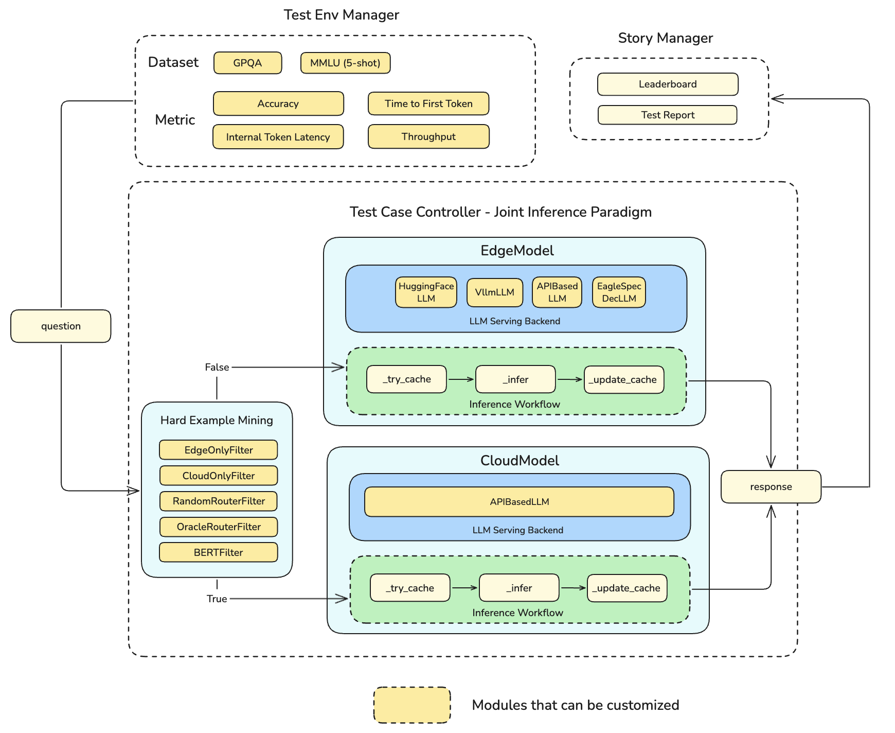

# Joint Inference: Query Routing

## Motivation

Joint inference is a computational paradigm in machine learning where multiple systems, models, or devices collaborate to perform inference tasks. Unlike traditional inference, where a single model or system processes an input to produce an output, joint inference distributes the workload across different entities—such as edge devices, cloud servers, or heterogeneous models—to optimize key performance metrics like latency, accuracy, privacy, energy efficiency, and cost. This approach is particularly relevant for large language models (LLMs) with billions or trillions of parameters, which are resource-intensive and challenging to deploy on a single system.

### Key Characteristics

- **Distributed Workload**: Inference tasks are partitioned, coordinated, or shared among multiple systems based on their capabilities, network conditions, or task requirements.
- **Collaboration**: Systems work together, often in real-time, to produce a unified output. For example, one system might preprocess data, while another performs heavy computation.
- **Optimization Goals**: Joint inference aims to balance trade-offs, such as reducing latency while maintaining accuracy, ensuring privacy, or minimizing computational costs.
- **Flexibility**: It supports various architectures, including cloud-edge setups, multi-model ensembles, or federated systems.

### Example Scenarios

- **Edge-Cloud Collaboration**: An edge device processes simple queries locally, while complex queries are offloaded to the cloud.
- **Multi-Model Ensemble**: A small model generates initial predictions, which a larger model refines.
- **Federated Inference**: Multiple edge devices process local data and share intermediate results with a central server for final inference.

**Note**: Here, we will specifically focus on `Cloud-Edge Collaborative Inference Scenario for LLMS`.

## Cloud Edge Collaborative Inference for LLMs

Cloud-edge collaborative inference is a specific implementation of joint inference where inference tasks for LLMs are distributed between edge devices (e.g., mobile phones, PCs, IoT devices, or base stations) and cloud servers. This approach leverages the low-latency and privacy-preserving nature of edge computing alongside the high computational power of cloud infrastructure to optimize LLM deployment.

### Why LLM need cloud-edge collaborative inference?

Currently, such LLMs have billions or even trillions of parameters, requiring massive computing power for training and deployment. Therefore, they are often deployed in cloud computing centers and serving via APIs. However, such service paradigm faces many drawbacks.

- Time to First Token(TTFT) is quite long, due to transmission delays from the distance to the data center.
- Uploading user data to the cloud may lead to additional privacy risks and retraining risks.
- Calling APIs of the most advanced models (GPT-4o *et.al*) is often very expensive.
- Not all tasks require high-performance models to complete.

These issues can be addressed by introducing Edge Computing, which is an architecture featured by low-latency, privacy security, energy-efficient. 

By deploying small-scale LLMs on edge devices like mobile phones, PCs and communication base station, users will have low-latency and privacy-secure services. Empirically, models with fewer than 3B parameters are possible to be deployed on the aforementioned edge devices. However, due to Scaling Law, smaller models perform worse than larger models, so they can only maintain good performance on certain tasks. 

Thus, smaller models on edge should collaborate with larger models on cloud to achieve better performance on other tasks.

### Possible Collaborative Inference Strategy 

There are several cloud-edge collaborative inference strategy, including:

- **Query Routing**: route query to smaller-scale model on edge or larger-scale model on cloud based on its difficulty.
- **Speculative Decoding**: smaller-scale models predicting future multiple words quickly during decoding followed by parallel validation via larger-scale models; if validation fails then re-generation by larger-scale occurs.

**Note**: Here, we will specifically focus on `Query-Routing Inference Strategy`.

### Query-Routing

The principle of *query routing* strategy is shown in the following figure.


The core of this strategy is designing a routing model *R* that can predict the performance of user request *q* in both the large cloud model *L* and small edge model *S*. This model takes request *q* as input and outputs two labels, 0 or 1, representing preference for either edge or cloud. 

This is essentially a text classification task which can be accomplished by training an NLP model. Training such a model involves considerations such as selecting models, datasets, loss functions, evaluation metrics etc.

Thus, Query Routing is a very useful cloud-edge collaboration strategy based on two facts:

- Calling top-tier large language models is expensive: For GPT-4o, the pricing is \$5.00 / 1M input tokens and \$15.00 / 1M output tokens.

-  Not all tasks require calling top-tier models: For tasks like translation, organization, summarization, data formatting,and casual conversation, small models with 3B parameters or less can achieve satisfactory results.

These two facts suggest that if we can call different models based on the difficulty of the task, it will help save unnecessary API calls and thus reduce costs. Additionally, if edge device prformance is sufficient, locally deployed small models can also demonstrate excellent latency and throughput metrics, further enhancing user experience.

### Details of Design 

The overall design is shown in the figure below.



When Ianvs starts the benchmarking job, the Test Env Manager will first pass the data of the user-specified Dataset to the Test Case Controller for Joint Inference one by one.

Joint Inference supports multiple modes, including `mining-then-inference`, `inference-then-mining`, and `self-design`. Among them, `mining-then-inference` is suitable for LLM scenarios, `inference-then-mining` is suitable for CV scenarios, and `self-design` allows us to implement more complex collaborative inference strategies on our own.

In this example, we will rely on Ianvs' Joint Inference Paradigm using the `inference-then-mining` mode to implement a Query Routing strategy. First, we call our custom Hard Example Mining module to determine if it is a hard case. If it is, we call the inference interface of the Edge Model to complete the inference; if not, we call the inference interface of the Cloud Model to complete it.


After all tests are completed, the Test Env Manager will calculate relevant metrics based on selected Metrics and hand over to Story Manager for printing test reports and generating Leader Board.

### Implementation 

##### EdgeModel Configuration

The `EdgeModel` is the model that will be deployed on the local machine, supporting `huggingface` and `vllm` as serving backends.

For `EdgeModel`, the open parameters are:

| Parameter Name         | Type  | Description                                                  | Defalut                  |
| ---------------------- | ----- | ------------------------------------------------------------ | ------------------------ |
| model                  | str   | model name                                                   | Qwen/Qwen2-1.5B-Instruct |
| backend                | str   | model serving framework                                      | huggingface              |
| temperature            | float | What sampling temperature to use, between 0 and 2            | 0.8                      |
| top_p                  | float | nucleus sampling parameter                                   | 0.8                      |
| max_tokens             | int   | The maximum number of tokens that can be generated in the chat completion | 512                      |
| repetition_penalty     | float | The parameter for repetition penalty                         | 1.05                     |
| tensor_parallel_size   | int   | The size of tensor parallelism (Used for vLLM)               | 1                        |
| gpu_memory_utilization | float | The percentage of GPU memory utilization (Used for vLLM)     | 0.9                      |

##### CloudModel Configuration

The `CloudModel` represents the model on cloud, it will call LLM API via OpenAI API format. 

For `CloudModel`, the open parameters are:

| Parameter Name     | Type | Description                                                  | Defalut     |
| ------------------ | ---- | ------------------------------------------------------------ | ----------- |
| model              | str  | model name                                                   | gpt-4o-mini |
| temperature        | float  | What sampling temperature to use, between 0 and 2            | 0.8         |
| top_p              | float  | nucleus sampling parameter                                   | 0.8         |
| max_tokens         | int  | The maximum number of tokens that can be generated in the chat completion | 512         |
| repetition_penalty | float  | The parameter for repetition penalty                         | 1.05        |

##### Router Configuration

Router is a component that routes the query to the edge or cloud model. The router is configured by `hard_example_mining` in `examples/cloud-edge-collaborative-inference-for-llm/testrouters/query-routing/test_queryrouting.yaml`.

Currently, supported routers include:

| Router Type  | Description                                                  | Parameters       |
| ------------ | ------------------------------------------------------------ | ---------------- |
| EdgeOnly     | Route all queries to the edge model.                         | -                |
| CloudOnly    | Route all queries to the cloud model.                        | -                |
| OracleRouter | Optimal Router         |         |
| BERTRouter   | Use a BERT classifier to route the query to the edge or cloud model. | model, threshold |
| RandomRouter | Route the query to the edge or cloud model randomly.         | threshold        |

We can modify the `router` parameter in `test_queryrouting.yaml` to select the router we want to use.

For BERT router, we can use [routellm/bert](https://huggingface.co/routellm/bert) or [routellm/bert_mmlu_augmented](https://huggingface.co/routellm/bert_mmlu_augmented) or our own BERT model.

### Customize algorithm

Sedna provides a class called `class_factory.py` in `common` package, in which only a few lines of changes are required to become a module of sedna.

Two classes are defined in `class_factory.py`, namely `ClassType` and `ClassFactory`.

`ClassFactory` can register the modules you want to reuse through decorators. For example, in the following code example, we have customized an **Joint Inference : Query Routing algorithm**, we only need to add a line of `ClassFactory.register(ClassType.GENERAL)` to complete the registration.

The following code is just to show the overall structure Routing Strategies, not the complete version. The complete code can be found [here](https://github.com/kubeedge/ianvs/blob/main/examples/cloud-edge-collaborative-inference-for-llm/testalgorithms/query-routing/hard_sample_mining.py).

```python
from sedna.common.class_factory import ClassFactory, ClassType

__all__ = ('BERTFilter', 'EdgeOnlyFilter', 'CloudOnlyFilter',
           'RandomRouterFilter', 'OracleRouterFilter')

@ClassFactory.register(ClassType.HEM, alias="BERTRouter")
class BERTFilter(BaseFilter, abc.ABC):
    """BERTRouter Logic"""
    ...

@ClassFactory.register(ClassType.HEM, alias="EdgeOnly")
class EdgeOnlyFilter(BaseFilter, abc.ABC):
    """EdgeOnly Router Logic"""
    ...

@ClassFactory.register(ClassType.HEM, alias="CloudOnly")
class CloudOnlyFilter(BaseFilter, abc.ABC):
    """CloudOnly Router Logic"""
    ...

@ClassFactory.register(ClassType.HEM, alias="RandomRouter")
class RandomRouterFilter(BaseFilter, abc.ABC):
    """RandomRouter Router Logic"""
    ...

@ClassFactory.register(ClassType.HEM, alias="OracleRouter")
class OracleRouterFilter(BaseFilter, abc.ABC):
  """"OracleRouter Logic"""
    ...
```

After registration, you only need to change the name of the STL and parameters in the yaml file, and then the corresponding class will be automatically called according to the name.