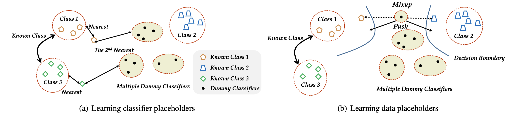
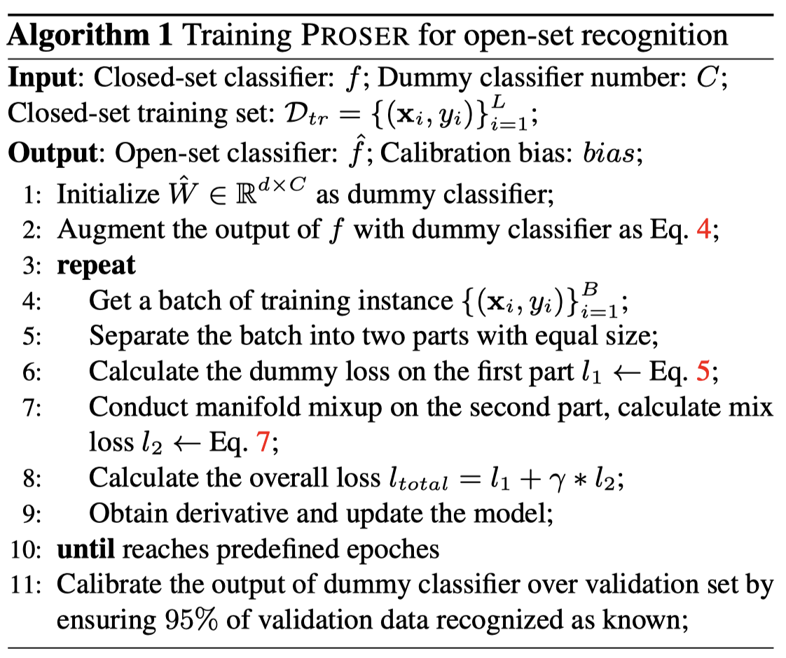

# Open-set recognition: Learning Placeholders

This is based on the 2021 CVPR paper *Learning Placeholders for Open-Set Recognition* . The basic information as followed.

```
author = {Zhou, Da-Wei and Ye, Han-Jia and Zhan, De-Chuan},
title = {Learning Placeholders for Open-Set Recognition}, 
booktitle = {CVPR}, 
pages = {4401-4410}, 
year = {2021}
```

You can find more details as follows:

The paper link: [Learning Placeholders for Open-Set Recognition](https://openaccess.thecvf.com/content/CVPR2021/papers/Zhou_Learning_Placeholders_for_Open-Set_Recognition_CVPR_2021_paper.pdf)

The GitHub link:[CVPR21-Proser](https://github.com/zhoudw-zdw/CVPR21-Proser)

## Background

Traditional classifiers are deployed under a closed-set setting, with both training and test classes belonging to the same set. However, real-world applications probably face the input of unknown categories, and the model will recognize them as known ones. Under such circumstances, open-set recognition is proposed to maintain classification performance on known classes and reject unknowns. The closed-set models make overconfident predictions over familiar known class instances so that calibration and thresholding across categories become essential issues when extending to an open-set environment. 

Learning PlaceholdeRs for open-set recognition prepares for the unknown classes by allocating placeholders for both data and classifier. In detail, learning data placeholders try to anticipate open-set class data, thus transforming closed-set training into open-set training. Besides, reserving classifier placeholders as the class-specific boundary between known and unknown to learn the invariant information between target and non-target classes. 


## PROSER Algorithm Principle



##### Learning classifier placeholders

Retaining classifier placeholders aims at setting up additional virtual classifiers and optimizing them to represent the threshold between known and unknown classes. Assuming a well-trained closed-set classifier W; the paper first augments the output layer with additional virtual classifiers, as shown in Eq.
$$
\hat{f} (\mathrm {x})=[W^{\top}\phi(\mathrm {x}),\hat{w}^{\top }\phi(\mathrm {x})]
$$
The closed set classifier and the virtual classifier embed the same set (matrix) and create only one additional linear layer. The added indices are passed through the softmax layer to generate the posterior probabilities. By fine-tuning the model so that the virtual classifier outputs the second highest probability of a known class, the invariant information between the known class classifier and the virtual classifier can be transferred to the detection process by this method. Since the output is increased by using the virtual classifier, the classification loss can be expressed as Eq:
$$
l_{1}=\sum_{(\mathrm {x},y)\in \mathcal{D}_{tr}  }^{} \ell (\hat{f}(\mathrm {x},y)+\beta \ell(\hat{f}(\mathrm {x} \setminus  y,K+1 )
$$
$L$ denotes cross entropy or other loss function. The first term in the formula corresponds to the output of the optimized expansion, which pushes the samples into the corresponding class groups to maintain accurate identification in the closed set. In the second term, matching the task to $K+1$ classes makes the virtual classifier output the second highest probability, tries to associate the position of the virtual classifier in the center space, and controls the distance to the virtual classifier as the second closest distance among all class centers. Thus, it seeks a trade-off between correctly classifying closed set instances and retaining the probability of a new class as a classifier placeholder. During training, it can be positioned between target and non-target classes. In the case of novel classes, the predictive power of the virtual classifier can be high because all known classes are non-target classes. Therefore, it is considered as an instance-related threshold that can be well adapted to each known class.

##### Learning data placeholders

The purpose of learning data placeholders is to transform closed-set training into open-set training. The combined data placeholders should have two main characteristics, the distribution of these samples should look novel and the generation process should be fast. In this paper, we simulate new patterns with multiple mixtures. Equation 6 in the paper gives two samples from different categories and mixes them in the middle layer.
$$
\widetilde{\mathrm {x} } _{pre}  =\lambda \phi _{pre}(\mathrm {x}_{i})+(1-\lambda)\phi_{pre}(\mathrm {x}_{j}),y_{i}\ne y_{j}
$$
The results of the mixture are passed through the later layers to obtain the new model embedding $\phi_{post}$. considering that the interpolation between two different clusters is usually a low confidence prediction region. The paper treats the embedding $\phi _{post}(\tilde{\mathrm {x}}_{pre} ))$as an embedding of the open set class and trains it as a new class.
$$
l_{2}=\sum_{(\mathrm {x}_{i},\mathrm {x}_{j})\in \mathcal{D}_{tr}  }^{} \ell ([W,\hat{w}]^{\top}\phi_{post}(\tilde{x}_{pre}),K+1 )
$$

$$
\tilde{x}_{pre}=\lambda\phi_{pre}(\mathrm{x}_{i})+(1-\lambda)\phi_{pre}(\mathrm{x}_{j}),y_{i}\ne y_{j}.
$$

It is clear that the formulation in the paper does not consume additional time complexity, which would generate new situations between multiple decision boundaries. In addition, streamwise blending allows better use of interpolation of deeper hidden representations to generate new patterns in the improved embedding space, which better represents the new distribution. As illustrated in the figure above, the blending instance pushes the decision boundaries in the embedding space to two separate locations of the classes. With the help of the data placeholders, the embedding of the known classes will be tighter, leaving more places for the new classes.


## PROSER algorithm training process




