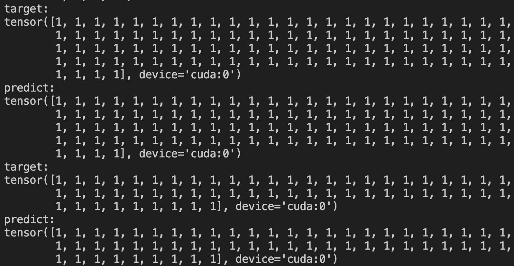
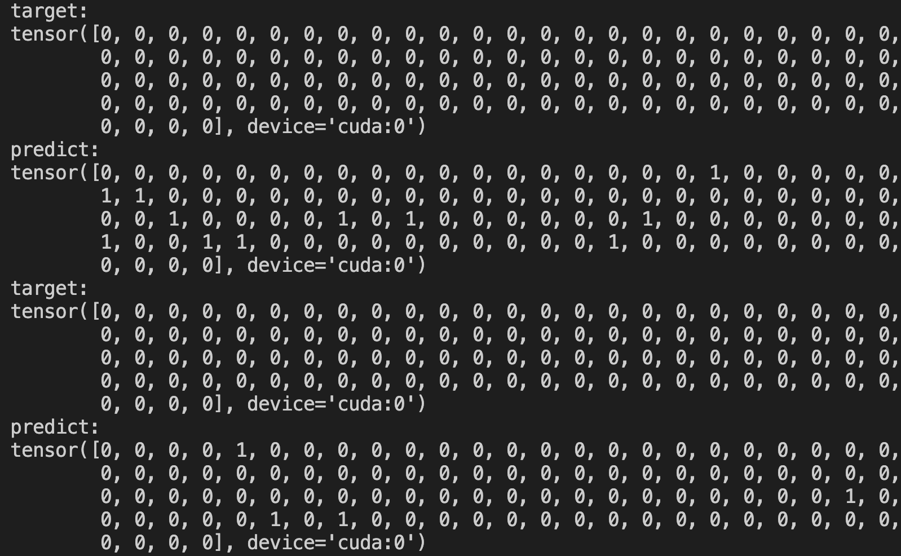
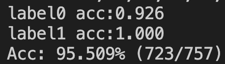

# Testing Open-set recognition in Curb-detection datasets

## About Open-set recognition

Traditional classifiers are deployed under a closed-set setting, with both training and test classes belonging to the same set. However, real-world applications probably face the input of unknown categories, and the model will recognize them as known ones. Under such circumstances, open-set recognition is proposed to maintain classification performance on known classes and reject unknowns. The closed-set models make overconfident predictions over familiar known class instances so that calibration and thresholding across categories become essential issues when extending to an open-set environment. 

This test aims to reproduce the CVPR2021 paper "Learning placeholders for open-set recognition".

See [here](https://github.com/Frank-lilinjie/ianvs/tree/main/docs/proposals/algorithms/lifelong-learning/Additional-documentation/Open-set_recognition_Learning_Placeholders.md) for details


## About Curb-detection datasets

Two datasets, SYNTHIA, and cityscape, were selected for this project. Because SYNTHIA is often easier to obtain than the real urban road dataset as simulated by the simulator in a real research environment, it is treated as known task data for model pre-training, while the real urban landscape image acquisition requires more resources and is more difficult to obtain, so it is treated as unknown task data.

See [here](https://github.com/Frank-lilinjie/ianvs/tree/main/docs/proposals/algorithms/lifelong-learning/Additional-documentation/curb_detetion_datasets.md) for details


## Benchmark Setting

Key settings of the test environment to Open-set recognition are as follows:

```yaml
benchmarkingjob:
  # job name of bechmarking; string type;
  name: "benchmarkingjob"
  # the url address of job workspace that will reserve the output of tests; string type;
  workspace: "/ianvs/lifelong_learning_bench/workspace"

  # the url address of test environment configuration file; string type;
  # the file format supports yaml/yml;
  testenv: "./examples/curb-detection/lifelong_learning_bench/testenv/testenv.yaml"

  # the configuration of test object
  test_object:
    # test type; string type;
    # currently the option of value is "algorithms",the others will be added in succession.
    type: "algorithms"
    # test algorithm configuration files; list type;
    algorithms:
      # algorithm name; string type;
      - name: "rfnet_lifelong_learning"
        # the url address of test algorithm configuration file; string type;
        # the file format supports yaml/yml
        url: "./examples/curb-detection/lifelong_learning_bench/testalgorithms/rfnet/rfnet_algorithm.yaml"
```

Key settings of the algorithm are as follows:

```yaml
algorithm:
  # paradigm type; string type;
  # currently the options of value are as follows:
  #   1> "singletasklearning"
  #   2> "incrementallearning"
  #   3> "lifelonglearning"
  paradigm_type: "lifelonglearning"
  lifelong_learning_data_setting:
    # ratio of training dataset; float type;
    # the default value is 0.8.
    train_ratio: 0.8
    # the method of splitting dataset; string type; optional;
    # currently the options of value are as follows:
    #   1> "default": the dataset is evenly divided based train_ratio;
    splitting_method: "default"

  # algorithm module configuration in the paradigm; list type;
  modules:
    # type of algorithm module; string type;
    # currently the options of value are as follows:
    #   1> "basemodel": contains important interfaces such as train、 eval、 predict and more; required module;
    - type: "basemodel"
      # name of python module; string type;
      # example: basemodel.py has BaseModel module that the alias is "FPN" for this benchmarking;
      name: "BaseModel"
      # the url address of python module; string type;
      url: "./examples/curb-detection/lifelong_learning_bench/testalgorithms/rfnet/basemodel.py"
      # hyperparameters configuration for the python module; list type;
      hyperparameters:
        # name of the hyperparameter; string type;
        - learning_rate:
            values:
              - 0.0001
    #  2> "task_definition": define lifelong task ; optional module;
    - type: "task_definition"
      # name of python module; string type;
      name: "TaskDefinitionByOrigin"
      # the url address of python module; string type;
      url: "./examples/curb-detection/lifelong_learning_bench/testalgorithms/rfnet/task_definition_by_origin.py"
      # hyperparameters configuration for the python module; list type;
      hyperparameters:
        # name of the hyperparameter; string type;
        # origins of data; value is ["real", "sim"], this means that data from real camera and simulator.
        - origins:
            values:
              - [ "real", "sim" ]
    #  3> "task_allocation": allocate lifelong task ; optional module;
    - type: "task_allocation"
      # name of python module; string type;
      name: "TaskAllocationByOrigin"
      # the url address of python module; string type;
      url: "./examples/curb-detection/lifelong_learning_bench/testalgorithms/rfnet/task_allocation_by_origin.py"
      # hyperparameters configuration for the python module; list type;
      hyperparameters:
        # name of the hyperparameter; string type;
        # origins of data; value is ["real", "sim"], this means that data from real camera and simulator.
        - origins:
            values:
              - [ "real", "sim" ]
    - type: "unknow_task_recognition"
      # name of python module; string type;
      name: "SampleRegonitionByScene"
      # the url address of python module; string type;
      url: "./examples/curb-detection/lifelong_learning_bench/testalgorithms/rfnet/unknow_task_recognition.py"
       # hyperparameters configuration for the python module; list type;
      hyperparameters:
        -model_path:
          values:
            - "/examples/curb-detection/lifelong_learning_bench/testalgorithms/rfnet/results/Epochofprose17.pth"
```


## Benchmark Result

| rank | algorithm               | accuracy            | samples_transfer_ratio | paradigm         | basemodel | task_definition        | task_allocation        | unseen_sample_recognition      | basemodel-learning_rate | task_definition-origins | task_allocation-origins | unseen_sample_recognition-model_path                         | time                | url                                                          |
| ---- | ----------------------- | ------------------- | ---------------------- | ---------------- | --------- | ---------------------- | ---------------------- | ------------------------------ | ----------------------- | ----------------------- | ----------------------- | ------------------------------------------------------------ | ------------------- | ------------------------------------------------------------ |
| 1    | rfnet_lifelong_learning | 0.30090234155994056 | 0.4535                 | lifelonglearning | BaseModel | TaskDefinitionByOrigin | TaskAllocationByOrigin | UnseenSampleRecognitionByScene | 0.0001                  | ['real', 'sim']         | ['real', 'sim']         | /examples/curb-detection/lifelong_learning_bench/testalgorithms/rfnet/results/Epochofprose17.pth | 2022-10-25 14:50:01 | /ianvs/lifelong_learning_bench/workspace/benchmarkingjob/rfnet_lifelong_learning/1dfff552-542f-11ed-b875-b07b25dd6922 |


## Effect Display

In this project, the known category is labeled as 1, and the unknown category is labeled as 0.

This is the recognition result of some known classes, where *target* is the original tag and *predict* is the predicted value.

<center>
  
  <br>
  <dir style="color:orange; border-bottom: 1px solid #d9d9d9;
              display: inline-block;
              color: #999;
              padding: 2px;">
    Cityscape's RGB images
  </dir>
</center>

This is the recognition result of some unknown classes, where *target* is the original tag and *predict* is the predicted value.

<center>
  
  <br>
  <dir style="color:orange; border-bottom: 1px solid #d9d9d9;
              display: inline-block;
              color: #999;
              padding: 2px;">
    Cityscape's RGB images
  </dir>
</center>

Results.

<center>
  
  <br>
  <dir style="color:orange; border-bottom: 1px solid #d9d9d9;
              display: inline-block;
              color: #999;
              padding: 2px;">
    Cityscape's RGB images
  </dir>
</center>