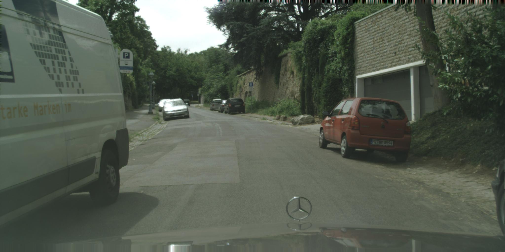
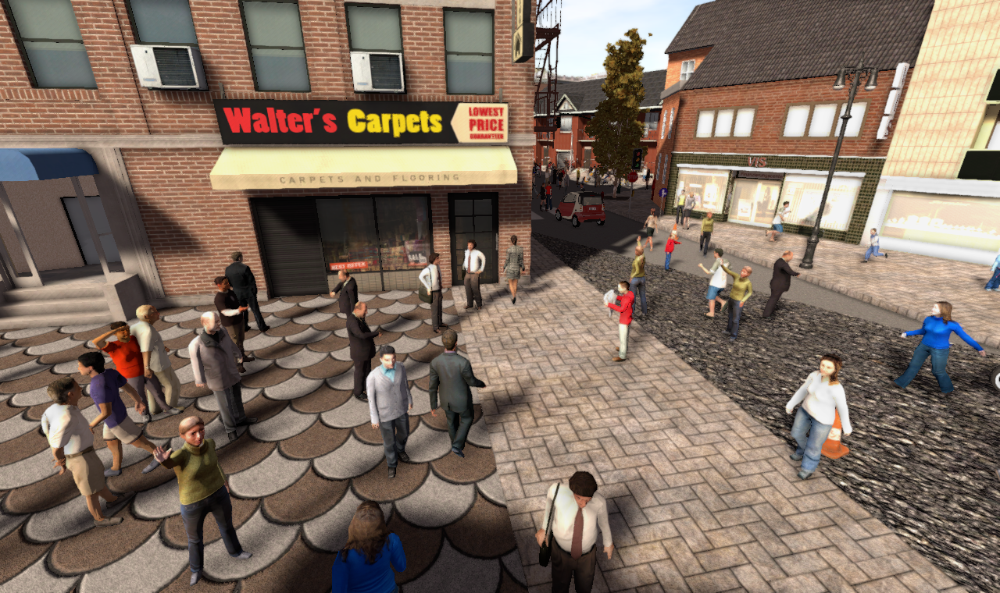

# Semantic Segmentation: Cityscapes and SYNTHIA

You can download the dataset directly locally by following the command below.

```shell
wget https://kubeedge.obs.cn-north-1.myhuaweicloud.com/ianvs/curb-detection/curb-detection.zip
```

This command comes from [The lifelong learning bench of curb-detection](https://github.com/kubeedge/ianvs/tree/feature-lifelong-n/examples/curb-detection/lifelong_learning_bench).

The following is a description of each data set separately.


## Cityscapes dataset

Download link: [cityscapes](https://www.cityscapes-dataset.com/downloads/)

paper link: [The Cityscapes Dataset for Semantic Urban Scene Understanding](https://www.cityscapes-dataset.com/wordpress/wp-content/papercite-data/pdf/cordts2016cityscapes.pdf)

### Background

 Cordts $et$ $al.$ propose the Cityscapes benchmark suite and a corresponding dataset, specifically tailored for autonomous driving in an urban environment and involving a much wider range of highly complex inner-city street scenes that were recorded in 50 different cities. Cityscapes significantly exceed previous efforts in terms of size, annotation richness, and, more importantly, scene complexity and variability. We go beyond pixel-level semantic labeling by also considering instance-level semantic labeling in both our annotations and evaluation metrics. To facilitate research on 3D scene understanding, and provide depth information through stereo vision.

Below shows one example figure(RGB) in the dataset.

<center>
  
  <br>
  <dir style="color:orange; border-bottom: 1px solid #d9d9d9;
              display: inline-block;
              color: #999;
              padding: 2px;">
    Cityscape's RGB images
  </dir>
</center>
### Data Explorer

Cityscapes is comprised of a large, diverse set of stereo video sequences recorded in streets from 50 different cities. 5000 of these images have high-quality pixel-level annotations; 20 000 additional images have coarse annotations to enable methods that leverage large volumes of weakly-labeled data.

The directories of this dataset is as follows:

```
├─Cityscapes Dataset
   ├─disparity
   │  ├─test
   │  │  ├─berlin
   │  │  ├─bielefeld
   │  │  ├─bonn
   │  │  ├─...
   │  │  └─munich
   │  ├─train
   │  │  ├─01_Hanns_Klemm_Str_45
   │  │  ├─03_Hanns_Klemm_Str_19
   │  │  ├─...
   │  │  └─zurich
   │  └─val
   │      ├─02_Hanns_Klemm_Str_44
   │      ├─04_Maurener_Weg_8
   │      ├─05_Schafgasse_1
   │      ├─...
   │      └─munster
   ├─gtFine
   │  ├─train
   │  │  ├─01_Hanns_Klemm_Str_45
   │  │  ├─03_Hanns_Klemm_Str_19
   │  │  ├─...
   │  │  └─zurich
   │  └─val
   │      ├─02_Hanns_Klemm_Str_44
   │      ├─04_Maurener_Weg_8
   │      ├─05_Schafgasse_1
   │      ├─...
   │      └─munster
   └─leftImg8bit
       ├─test
       │  ├─berlin
       │  ├─bielefeld
       │  ├─bonn
       │  ├─...
       │  └─munich
       ├─train
       │  ├─01_Hanns_Klemm_Str_45
       │  ├─03_Hanns_Klemm_Str_19
       │  ├─...
       │  └─zurich
       └─val
           ├─02_Hanns_Klemm_Str_44
           ├─04_Maurener_Weg_8
           ├─05_Schafgasse_1
           ├─...
           └─munster
```

The following is part of `index.txt`:

```
./images/real_aachen_000093_00019_leftImg8bit.png ./images/real_aachen_000093_00019_gtFine_labelTrainIds.png
./images/real_aachen_000094_00019_leftImg8bit.png ./images/real_aachen_000094_00019_gtFine_labelTrainIds.png
./images/real_aachen_000095_00019_leftImg8bit.png ./images/real_aachen_000095_00019_gtFine_labelTrainIds.png
./images/real_aachen_000096_00019_leftImg8bit.png ./images/real_aachen_000096_00019_gtFine_labelTrainIds.png
./images/real_aachen_000097_00019_leftImg8bit.png ./images/real_aachen_000097_00019_gtFine_labelTrainIds.png
./images/real_aachen_000098_00019_leftImg8bit.png ./images/real_aachen_000098_00019_gtFine_labelTrainIds.png
./images/real_aachen_000099_00019_leftImg8bit.png ./images/real_aachen_000099_00019_gtFine_labelTrainIds.png
```

The first column represents the file path of the original image, and the second column represents the file path of the label file.


## The SYNTHIA dataset

Download link: [Synthia](http://synthia-dataset.net/downloads/)

paper link: [The SYNTHIA Dataset: A Large Collection of Synthetic Images for Semantic Segmentation of Urban Scenes](https%3A%2F%2Fwww.cv-foundation.org%2Fopenaccess%2Fcontent_cvpr_2016%2Fpapers%2FRos_The_SYNTHIA_Dataset_CVPR_2016_paper.pdf)

### Background

The *SYNTHetic collection of Imagery and Annotations* is a dataset that has been generated with the purpose of aiding semantic segmentation and related scene understanding problems in the context of driving scenarios. SYNTHIA consists of a collection of photo-realistic frames rendered from a virtual city and comes with precise pixel-level semantic annotations for [**13 classes**](http://synthia-dataset.net/table-classes/): misc, sky, building, road, sidewalk, fence, vegetation, pole, car, sign, pedestrian, cyclist, lane-marking.

Below shows one example figure(RGB) in the dataset.

<center>
  
  <br>
  <dir style="color:orange; border-bottom: 1px solid #d9d9d9;
              display: inline-block;
              color: #999;
              padding: 2px;">
    Synthia's RGB images
  </dir>
</center>

### Data Explorer

It is a new set containing 9,000 random images with labels compatible with the CITYSCAPES test set. The list of classes is void, sky, building, road, sidewalk, fence, vegetation, pole, car, traffic sign, pedestrian, bicycle, motorcycle, parking slot, road-work, traffic light, terrain, rider, truck, bus, train, wall, and landmarking. These images are generated as random perturbations of the virtual world, therefore no temporal consistency is provided (this is not a video stream).

```
├─SYNTHIA Dataset
├─RGB
│  ├─0000000.png
│  ├─0000001.png
│  ├─...
│  └─0009399.png
├─GT
│  ├─COLOR
│  │  ├─0000000.png
│  │  ├─0000001.png
│  │  ├─...
│  │  └─0009399.png
│  ├─LABELS
│  │  ├─0000000.png
│  │  ├─0000001.png
│  │  ├─...
│  │  └─0009399.png
├─Depth
   ├─0000000.png
   ├─0000001.png
   ├─...
   └─0009399.png

```

The following is part of `index.txt`:

```
./images/sim_1769.png ./images/sim_1769TrainIds.png
./images/sim_1770.png ./images/sim_1770TrainIds.png
./images/sim_1771.png ./images/sim_1771TrainIds.png
./images/sim_1772.png ./images/sim_1772TrainIds.png
./images/sim_1773.png ./images/sim_1773TrainIds.png
./images/sim_1775.png ./images/sim_1775TrainIds.png
./images/sim_1777.png ./images/sim_1777TrainIds.png
./images/sim_1779.png ./images/sim_1779TrainIds.png
./images/sim_1780.png ./images/sim_1780TrainIds.png
```

The first column represents the file path of the original image, and the second column represents the file path of the label file.