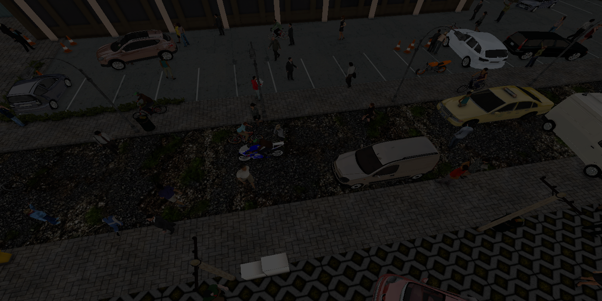
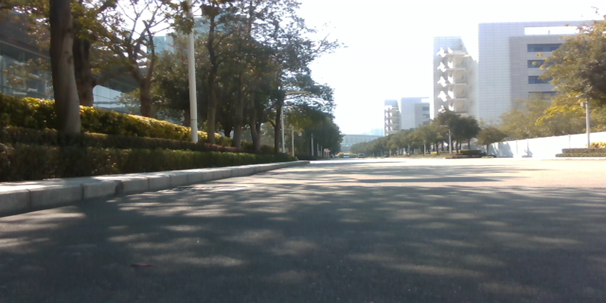
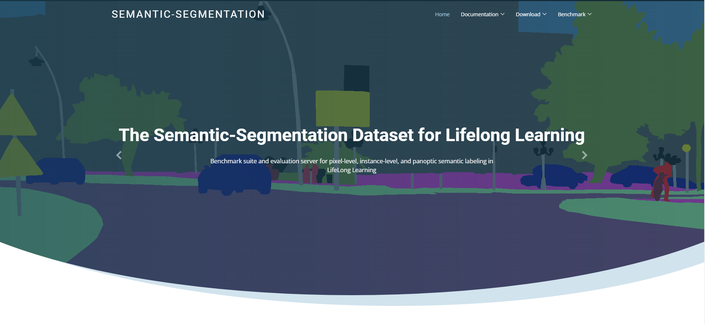
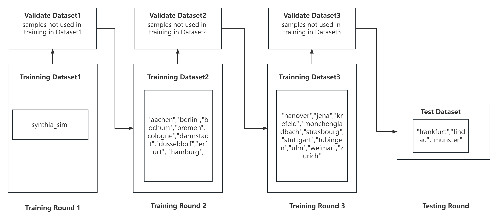
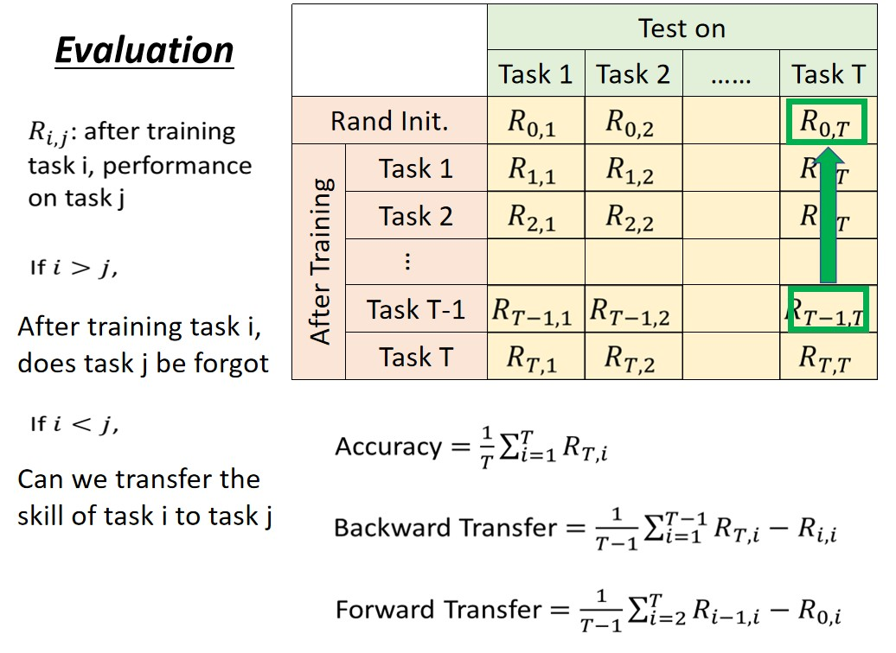
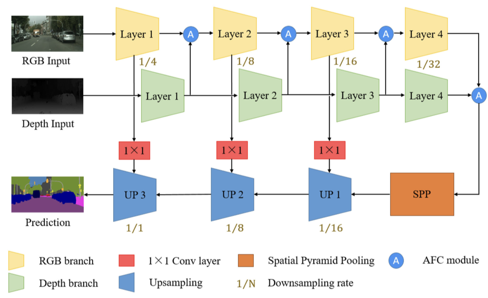

<<<<<<< HEAD
# Cloud-Robotic AI Benchmarking for Edge-cloud Collaborative Lifelong Learning

## 1 Motivation

### 1.1 background

It is estimated that by 2025, 75% of the world's data will be generated at the edge, and the computing power on the cloud will be more abundant. Edge-cloud collaborative artificial intelligence will become an inevitable trend, and its demand will be further released. Among them, the global service robot market is expected to reach 90-170 billion US dollars in 2030. The use of cloud-native edge computing and artificial intelligence technology to deal with the issues of the robot industry and complete industrial transformation has also become the focus of the industry.

In recent years, lifelong learning-related algorithms such as Lifelong SLAM and Lifelong Object Detection have become popular for the problem of edge-data heterogeneity and small samples, but the real-world practise requires further considerations on its edge-cloud collaborative nature. To further accelerate research and results transformation, the KubeEdge community released the first open source edge-cloud collaborative lifelong learning framework and its resource orchestration template on KubeEdge-Sedna in June 2021. Moreover, the collaborative AI benchmarking KubeEdge-Ianvs in July 2022 is also released with related benchmark datasets and compute metrics.

This project aims to develop the edge-cloud collaborative lifelong learning benchmarking that are suitable for robotic scenarios based on KubeEdge-Ianvs. This project will help all Edge AI application developers to validate and select the best-matched algorithm of lifelong learning. The benchmark can include dataset, metrics and algorithm. Specific applications include but are not limited to robot navigation, inspection, cleaning, delivery, etc. KubeEdge SIG AI has already prepared real-world datasets for everyone to explore!

### 1.2 Goals

Based on real-world datasets provided by industry members of KubeEdge SIG AI, this project aims to build a lifelong learning benchmarking on KubeEdge-Ianvs. Namely, it aims to help all Edge AI application developers to validate and select the best-matched algorithm of lifelong learning. It includes:

1. Release new datasets for lifelong learning in KubeEdge-Ianvs.
2. Build benchmarking websites for released datasets.
3. Provide test examples for released datasets in KubeEdge-Ianvs.
5. Reproduce BWT, FWT and other system metrics for lifelong learning in KubeEdge-Ianvs.
6. Improve the tutorial document for lifelong learning in KubeEdge-Ianvs.

## 2 Proposal

This project will provide new test examples of real-world datasets for KubeEdge-Ianvs's lifelong learning algorithm, including a public Semantic-Segmentation data set and a Cloud-Robotics dataset provided by Huawei. Each dataset released at the same time will have a supporting benchmarking website to introduce the dataset. In addition, the project will further enrich the lifelong learning algorithm in KubeEdge-Ianvs, including but not limited to dataset-splitting, task-definition, task-allocation, task-recognition and other methods. 

### 2.1 Introduction for Semantic-Segmentation datasets

This project will provide a public semantic segmentation dataset of the real world. This data set is from **SYNTHIA** and **cityscapes**. We will mix the data of two datasets to form a dataset specifically for lifelong learning algorithm. Here is a brief introduction to the contents of these two datasets.

#### 2.1.1 Cityscapes dataset

Cordts propose the **Cityscapes** benchmark suite and a corresponding dataset, specifically tailored for autonomous driving in an urban environment and involving a much wider range of highly complex inner-city street scenes that were recorded in 50 different cities. Cityscapes significantly exceed previous efforts in terms of size, annotation richness, and, more importantly, scene complexity and variability. We go beyond pixel-level semantic labeling by also considering instance-level semantic labeling in both our annotations and evaluation metrics. To facilitate research on 3D scene understanding, and provide depth information through stereo vision.

paper link: [The Cityscapes Dataset for Semantic Urban Scene Understanding](https://www.cityscapes-dataset.com/wordpress/wp-content/papercite-data/pdf/cordts2016cityscapes.pdf)

Below shows one example figure(RGB) in the dataset.

#### 2.1.2 SYNTHIA dataset

The ***SYNTHetic** collection of Imagery and Annotations* is a dataset that has been generated with the purpose of aiding semantic segmentation and related scene understanding problems in the context of driving scenarios. SYNTHIA consists of a collection of photo-realistic frames rendered from a virtual city and comes with precise pixel-level semantic annotations for 13 classes: misc, sky, building, road, sidewalk, fence, vegetation, pole, car, sign, pedestrian, cyclist, lane-marking.

paper link: [The SYNTHIA Dataset: A Large Collection of Synthetic Images for Semantic Segmentation of Urban Scenes](www.cv-foundation.org/openaccess/content_cvpr_2016/papers/Ros_The_SYNTHIA_Dataset_CVPR_2016_paper.pdf)

Below shows one example figure(RGB) in the dataset.

### 2.2 Introduction for Cloud-Robotics datasets

We present **Cloud-Robotics**, a new test benchmark dataset for lifelong learning. The Cloud-Robotics dataset contains 2500 annotated real-world images collected in Shenzhen Industry Zone by robotic dogs.

The Cloud-Robotics Dataset is intended for

(1) assessing the performance of vision algorithms for major tasks of semantic robotic scene understanding for lifelong learning;

(2) supporting research that aims to exploit large volumes of annotated data for lifelong learning.

Below shows one example figure(RGB) in the dataset.

### 2.3 Introduction for the benchmarking  website

#### 2.3.1 Content of the benchmarking website

| Page               | Content                                |
| ------------------ | -------------------------------------- |
| Home page          | 1.Dataset overview                     |
|                    | 2.Lifelong learning algorithm overview |
|                    | 3.Data sample display                  |
| Documentation page | 1.Dataset partition description        |
|                    | 2.Data statistics                      |
|                    | 3.Data format                          |
|                    | 4.Data annotation                      |
| Download page      | 1.Instructions and links               |
| Benchmark page     | 1.Various algorithm and metric results |

#### 2.3.2 An Example

### 2.4 New test examples of semantic segmentation for lifelong learning

#### 2.4.1 Why we need it?

The way the dataset is divided during each round of training in lifelong learning tasks has a significant impact on the final model training results. If only a random partitioning method is used, there may be situations that are inconsistent with reality, such as later data appearing in earlier training sets. At the same time, changes in data distribution in different splitting methods can make it difficult to compare test results. Therefore, we urgently need a reasonable dataset splitting method as a benchmark for testing lifelong learning algorithms on semantic segmentation datasets. 

Currently, we have implemented the "City Mode" test benchmark, and we will implement more various test benchmarks in the future.

#### 2.4.2 An example of "City Mode" test benchmark

In this example, we provide **City Mode**: a dataset splitting method based on different cities. The test workflow is shown in the following figure:

The first training round uses all simulated images as the pre training of the model. The second training round uses images collected by mobile edge devices in nine cities that first joined the system, including aachen and berlin, for training. The third training round uses images collected by mobile edge devices in 10 cities that have joined the system, including Weimar and Zurich. The final test uses images collected by mobile edge devices in Frankfurt, Lindau, and Munster that have not yet joined the system. During each round of training, the images were fed into the model in chronological order.

### 2.5 Introduction for BWT, FWT

The BWT and FWT metrics are used to respectively measure the model's ability to resist forgetting and to generalize. 

### 2.6 Scope

What we propose：

- Provide new real world datasets for KubeEdge-Ianvs lifelong learning users.
- Provide benchmarking websites for released datasets.
- Provide variable testing examples for the new datasets.
- Provide BWT, FWT and other system metrics for KubeEdge-Ianvs lifelong learning algorithm.

We are NOT:

- Provide domain/application-specific algorithms, i.e., facial recognition, text classification, etc.
- Pursue SOTA results on released datasets.

## 3 Design Details
### 3.1 Implementation for released datasets

You can download the dataset directly locally by following the command below.

~~~bash
wget https://kubeedge.obs.cn-north-1.myhuaweicloud.com/sedna-robo/semantic_segmentation_dataset.zip
~~~

The structure of semantic_segmentation_dataset is as follow:

~~~
semantic_segmentation_dataset
├── test
│   ├── depth
│   │   ├── cityscapes_real
│   │   │   ├── frankfurt [267 pic]
│   │   │   ├── lindau [59 pic]
│   │   │   └── munster [174 pic]
│   │   └── synthia_sim [830 pic]
│   ├── gtFine
│   │   ├── cityscapes_real
│   │   │   ├── frankfurt [1335 pic]
│   │   │   ├── lindau [295 pic]
│   │   │   └── munster [870 pic]
│   │   └── synthia_sim [830 pic]
│   └── leftImg8bit
│       ├── cityscapes_real
│       │   ├── frankfurt [267 pic]
│       │   ├── lindau [59 pic]
│       │   └── munster [174 pic]
│       └── synthia_sim [830 pic]
├── test.txt
├── train
│   ├── depth
│   │   ├── cityscapes_real
│   │   │   ├── aachen [174 pic]
│   │   │   ├── berlin [544 pic]
│   │   │   ├── bochum [96 pic]
│   │   │   ├── ...
│   │   │   └── zurich [122 pic]
│   │   └── synthia_sim [5813 pic]
│   ├── gtFine
│   │   ├── cityscapes_real
│   │   │   ├── aachen [870 pic]
│   │   │   ├── berlin [2720 pic]
│   │   │   ├── bochum [480 pic]
│   │   │   ├── ...
│   │   │   └── zurich [610 pic]
│   │   └── synthia_sim [5813 pic]
│   └── leftImg8bit
│       ├── cityscapes_real
│       │   ├── aachen [174 pic]
│       │   ├── berlin [544 pic]
│       │   ├── bochum [96 pic]
│       │   ├── ...
│       │   └── zurich [122 pic]
│       └── synthia_sim [5813 pic]
├── train.txt
└── val
    ├── depth
    │   ├── cityscapes_real
    │   │   ├── bielefeld [181 pic]
    │   │   ├── bonn [46 pic]
    │   │   ├── leverkusen [58 pic]
    │   │   ├── mainz [298 pic]
    │   │   └── munich [398 pic]
    │   └── synthia_sim [1663 pic]
    ├── gtFine
    │   ├── cityscapes_real
    │   │   ├── bielefeld [905 pic]
    │   │   ├── bonn [230 pic]
    │   │   ├── leverkusen [290 pic]
    │   │   ├── mainz [1490 pic]
    │   │   └── munich [1990 pic]
    │   └── synthia_sim [1663 pic]
    └── leftImg8bit
        ├── cityscapes_real
        │   ├── bielefeld [181 pic]
        │   ├── bonn [46 pic]
        │   ├── leverkusen [58 pic]
        │   ├── mainz [298 pic]
        │   └── munich [398 pic]
        └── synthia_sim [1663 pic]
~~~
The following is part of `train.txt`:

~~~txt
/train/leftImg8bit/cityscapes_real/aachen/aachen_000000_000019_leftImg8bit.png /train/depth/cityscapes_real/aachen/aachen_000000_000019_disparity.png /train/gtFine/cityscapes_real/aachen/aachen_000000_000019_gtFine_labelTrainIds.png
/train/leftImg8bit/cityscapes_real/aachen/aachen_000001_000019_leftImg8bit.png /train/depth/cityscapes_real/aachen/aachen_000001_000019_disparity.png /train/gtFine/cityscapes_real/aachen/aachen_000001_000019_gtFine_labelTrainIds.png
...
/train/leftImg8bit/synthia_sim/6707.png /train/depth/synthia_sim/6707.png /train/gtFine/synthia_sim/6707TrainIds.png
/train/leftImg8bit/synthia_sim/6708.png /train/depth/synthia_sim/6708.png /train/gtFine/synthia_sim/6708TrainIds.png
...
~~~

The first column represents the file path of the original image, the second column represents the file path of the depth file, the third column represents the file path of the label file.

### 3.2 Customize algorithm

We uses the RFNet method mentioned in the RAL2020 paper **Real-Time Fusion Network for RGB-D Semantic Segmentation Incorporating Unexpected Obstacle Detection for Road-Driving Images** to train the model.

The entire network architecture of RFNet is shown below. In the encoder part of the architecture, we design two independent branches to extract features for RGB and depth images separately RGB branch is the main branch, and the Depth branch is the subordinate branch. In both branches, we choose ResNet18 as the backbone to extract features from inputs because ResNet-18 has moderate depth and residual structure, and its small operation footprint is compatible with the real-time operation. After each layer of ResNet-18, the output features from the Depth branch are fused to the RGB branch after the Attention Feature Complementary (AFC) module. The spatial pyramid pooling (SPP) block gathers the fused RGB-D features from two branches and produces feature maps with multi-scale information. Finally, referring to SwiftNet, we design the efficient upsampling modules to restore the resolution of these feature maps with skip connections from the RGB branch.

## 4 Roadmap

### March

- Release the semantic_segmentation_dataset;
- Build the benchmarking website for semantic_segmentation_dataset.

### April

- Release the dataset from Huawei;
- Build the benchmarking website for the dataset;
- Provide variable test examples for the new datasets.

### May

- Reproduction of BWT, FWT and other system metrics;
- Merge into the lib of the Ianvs module.
=======
version https://git-lfs.github.com/spec/v1
oid sha256:f7173da9588462150d19ff10eaceaafc24839a685b7dd187dc45fe66a875375e
size 14727
>>>>>>> 9676c3e (ya toh aar ya toh par)
