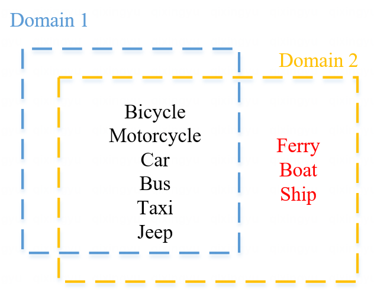
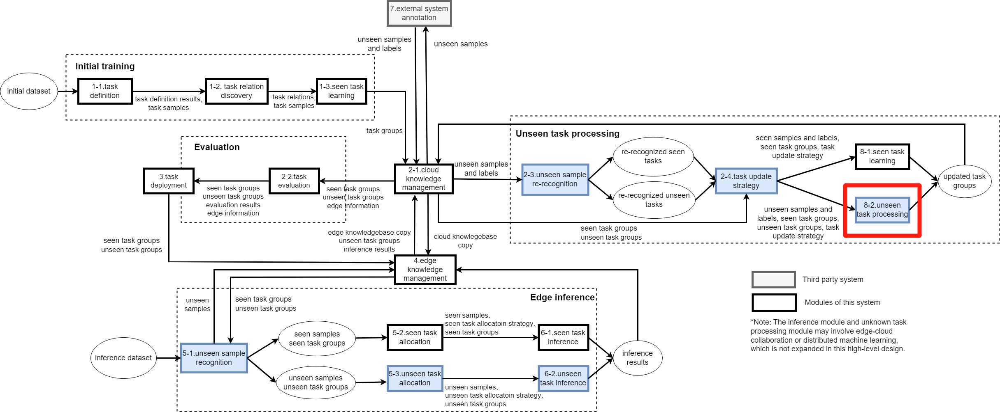
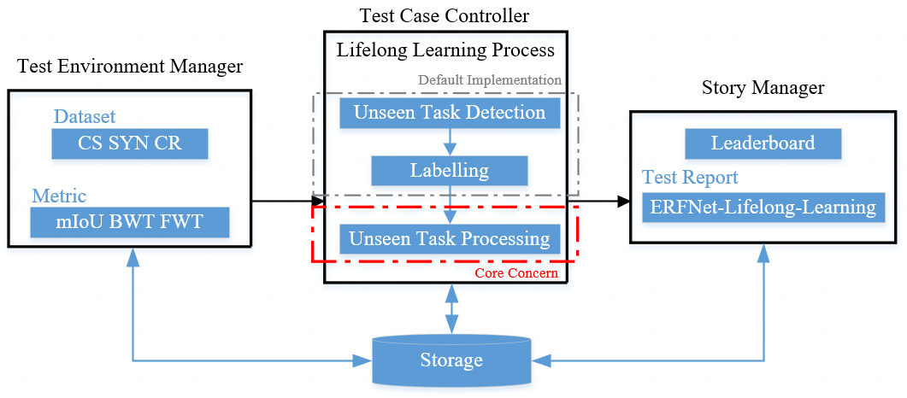
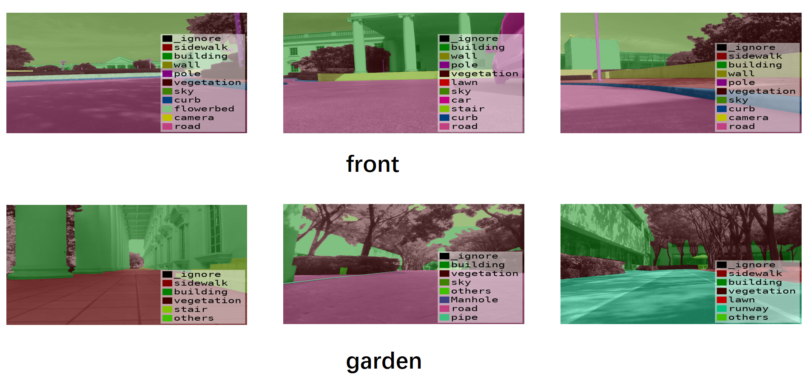
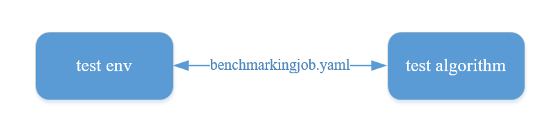
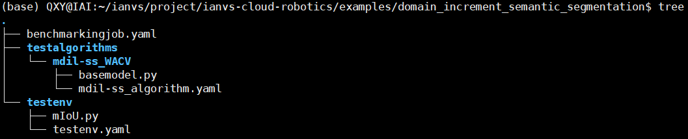

<!-- TOC -->

- [Implementation of a Class Incremental Learning Algorithm Evaluation System based on Ianvs](#implementation-of-a-class-incremental-learning-algorithm-evaluation-system-based-on-ianvs)
    - [Motivation](#motivation)
        - [Background](#background)
        - [Goals](#goals)
    - [Proposal](#proposal)
    - [Design Details](#design-details)
        - [Overall Design](#overall-design)
        - [Dataset](#dataset)
        - [File-level Design](#file-level-design)
            - [Test Environment](#test-environment)
            - [Test Algorithm](#test-algorithm)
            - [Test Report](#test-report)
    - [Roadmap](#roadmap)
        - [Phase 1 July 1st - August 15th](#phase-1-july-1st---august-15th)
        - [Phase 2 August 16th - September 30th](#phase-2-august-16th---september-30th)

<!-- /TOC -->

# Implementation of a Class Incremental Learning Algorithm Evaluation System based on Ianvs

## 1 Motivation

### 1.1 Background
Currently, lifelong learning is facing a challenge: new classes may appear when models are trained on a new data domain ( for example, in the figure below, three classes in red are new classes in `Domain 2` ), which makes it difficult for models to maintain generalization ability and results in a severe performance drop.

<div align = center>

</div>

Many algorithms have been proposed to solve the class increment problem in domain shift scenario. However, such algorithms lack a unified testing environment, which is not conducive to comparing algorithms. In some cases, new algorithms are only tested on certain datasets, which is not rigorous. 

In this context, it is necessary to develop an algorithm evaluation system that provides standardized testing for class-incremental learning algorithms, which is increasingly widely used in the industry, and evaluates the effectiveness of these algorithms.

[KubeEdge-Ianvs](https://github.com/kubeedge/ianvs) is a distributed collaborative AI benchmarking project which can perform benchmarks with respect to several types of paradigms (e.g. single-task learning, incremental learning, etc.). This project aims to leverage the benchmarking capabilities of Ianvs to develop an evaluation system for class-incremental learning algorithms, in order to fulfill the benchmarking requirements specific to this type of algorithm.

### 1.2 Goals

This project aims to build a benchmarking for class-incremental learning in domain shift scenario on KubeEdge-Ianvs, it includes:
 - Reproduce the Multi-Domain Incremental Learning for Semantic Segmentation (MDIL-SS) algorithm proposed in the [WACV2022 paper](https://github.com/prachigarg23/MDIL-SS).
 - Use three datasets (including Cityscapes, SYNTHIA, and the Cloud-Robotic dataset provided by KubeEdge SIG AI) to conduct benchmarking tests and generate a comprehensive test report (including rankings, time, algorithm name, dataset,  and test metrics, among other details).

## 2 Proposal

`Implementation of a Class Incremental Learning Algorithm Evaluation System based on Ianvs` taking MDIL-SS algorithm as an example, aims to test the performance of class-incremental learning models following benchmarking standards, to make the development more efficient and productive.

The scope of the system includes

- A test case for class-incremental learning semantic segmentation algorithms, in which a test report can be successfully generated following instructions.
- Easy to expand, allowing users to seamlessly integrate existing algorithms into the system for testing.

Targeting users include

- Beginners: Familiarize with distributed synergy AI and lifelong learning, among other concepts.
- Developers: Quickly integrate class-increment algorithms into Ianvs and test the performance for further optimization.


## 3 Design Details

### 3.1 Overall Design

The following is the [architecture diagram](https://github.com/kubeedge/sedna/blob/main/docs/proposals/lifelong-learning/unstructured-lifelong-learning.md) of this project system, and this project focuses on the `unseen task processing` module.

Before entering this module, unknown tasks have been [detected](https://github.com/kubeedge/ianvs/tree/4ae10f0e5e1ab958e143b04fade4acc448009857/examples/scene-based-unknown-task-recognition/lifelong_learning_bench) and samples have been labeled by some means such as manual labeling. The core concern of this module is how to use unknown task samples (i.e., incremental class samples) to update the model.

 

The following diagram shows how the algorithm works in Ianvs.

 

### 3.2 Dataset

This project will use three datasets, namely **Cityscapes**, **SYNTHIA**, and KubeEdge SIG AI's **Cloud-Robotics** dataset (**CS**, **SYN**, **CR**).

Ianvs has already provides [Cityscapes and SYNTHIA datasets](https://github.com/kubeedge/ianvs/blob/main/docs/proposals/algorithms/lifelong-learning/Additional-documentation/curb_detetion_datasets.md). The following two images are examples from them respectively.

|                          CS Example                          |                         SYN Example                          |
| :----------------------------------------------------------: | :----------------------------------------------------------: |
|   | |

In addition, this project utilizes the CR dataset from KubeEdge.

|                          CR Example                          |
| :----------------------------------------------------------: |
|  |

The following code is an excerpt from the `train-index-mix.txt` file. The first column represents the path to the original image, and the second column represents the corresponding label image path.

```txt
rgb/train/20220420_garden/00480.png gtFine/train/20220420_garden/00480_TrainIds.png
rgb/train/20220420_garden/00481.png gtFine/train/20220420_garden/00481_TrainIds.png
rgb/train/20220420_garden/00483.png gtFine/train/20220420_garden/00483_TrainIds.png
```

The following code snippet is an excerpt from the `test-index.txt` file, which follows a similar format to the training set.

```txt
rgb/test/20220420_garden/01357.png gtFine/test/20220420_garden/01357_TrainIds.png
rgb/test/20220420_garden/01362.png gtFine/test/20220420_garden/01362_TrainIds.png
rgb/test/20220420_garden/01386.png gtFine/test/20220420_garden/01386_TrainIds.png
rgb/test/20220420_garden/01387.png gtFine/test/20220420_garden/01387_TrainIds.png
```

As shown in the table below, this dataset contains 7 groups and 30 classes.

|    Group     |                           Classes                            |
| :----------: | :----------------------------------------------------------: |
|     flat     |               road · sidewalk · ramp · runway                |
|    human     |                        person · rider                        |
|   vehicle    |       car · truck · bus · train · motorcycle · bicycle       |
| construction |  building · wall · fence · stair · curb · flowerbed · door   |
|    object    | pole · traffic sign · traffic light · CCTV camera · Manhole · hydrant · belt · dustbin |
|    nature    |                     vegetation · terrain                     |
|     sky      |                             sky                              |

More detail about CR dataset please refer to [this link](https://github.com/kubeedge/ianvs/blob/main/docs/proposals/scenarios/Cloud-Robotics/Cloud-Robotics_zh.md).

### 3.3 File-level Design

The development consists of two main parts, which are **test environment (test env)** and **test algorithms**.

Test environment can be understood as an exam paper, which specifies the dataset, evaluation metrics, and the number of increments used for testing. It is used to evaluate the performance of the "students". And test algorithms can be seen as the students who will take the exam.

<div align = center>

</div>

In addition, `benchmarkingjob.yaml` is used for integrating the configuration of test env and test algorithms, and is a necessary ianvs configuration file.

For test env, the development work mainly focuses on the implementation of `mIoU.py`. And for test algorithms, development is concentrated on `basemodel.py`, as shown in the picture below.



#### 3.3.1 Test Environment

The following code is the `testenv.yaml` file designed for this project. 

As a configuration file for test env, it contains the 3 aspects, which are the dataset and the number of increments, model validation logic, and model evaluation metrics.

```yaml
# testenv.yaml

testenv:

  # 1
  dataset:
    train_url: "/home/QXY/ianvs/dataset/mdil-ss-dataset/train_data/index.txt"
    test_url: "/home/QXY/ianvs/dataset/mdil-ss-dataset/test_data/index.txt"
    using: "CS SYN CR"
  incremental_rounds: 3
  
  # 2
  model_eval:
    model_metric:
      name: "mIoU"
      url: "/home/QXY/ianvs/examples/mdil-ss/testenv/mIoU.py"
    threshold: 0
    operator: ">="

  # 3
  metrics:
    - name: "mIoU"
      url: "/home/QXY/ianvs/examples/mdil-ss/testenv/mIoU.py"
    - name: "BWT"
    - name: "FWT"
```

After each round of lifelong learning, the model will be evaluated on the validation set. In this project, **mIoU** (mean Intersection over Union) is used as the evaluation metric. If the model achieves an mIoU greater than the specified threshold on the validation set, the model will be updated. 

**BWT** (Backward Transfer) and **FWT** (Forward Transfer) are two important concepts in the field of lifelong learning. BWT refers to the impact of previously learned knowledge on the learning of the current task, while FWT refers to the impact of the current task on the learning of future tasks. Along with mIoU, they serve as testing metrics to assess the lifelong learning capability of the model in semantic segmentation. Functions related to BWT and FWT have already been implemented in [Ianvs repository](https://github.com/kubeedge/ianvs/blob/main/core/testcasecontroller/metrics/metrics.py).

#### 3.3.2 Test Algorithm

The following code is the `mdil-ss_algorithm.yaml` file designed for this project. 

```yaml
# mdil-ss_algorithm.yaml

algorithm:
  paradigm_type: "incrementallearning"
  
  incremental_learning_data_setting:
    train_ratio: 0.8
    splitting_method: "default"
  
  modules:
    - type: "basemodel"

      # 1
      name: "ERFNet"
      url: "/home/QXY/ianvs/examples/mdil-ss/testalgorithms/mdil-ss/basemodel.py"
      
      # 2
      hyperparameters:
        - learning_rate:
            values:
              - 0.01
              - 0.0001
        - epochs:
            values:
              - 5
              - 10
        - batch_size:
            values:
              - 10
              - 20
```

First, `basemodel.py`, which involves encapsulating various functional components of the model, including its architecture, layers, and operations, which is the focus of development.

Second, **hyperparameters** setting for the model is also defined in this yaml file. In addition, the evaluation system can perform tests with multiple combinations of hyperparameters at once by configuring multiple hyperparameters in `mdil-ss_algorithm.yaml`.

#### 3.3.3 Test Report

The test report is designed as follows, which contains the ranking, algorithm name, three metrics, dataset name, base model, three hyperparameters, and time.

| Rank | Algorithm | mIoU   | BWT   | FWT   | Paradigm         | Round | Dataset   | Basemodel | Learning_rate | Epoch | Batch_size | Time                |
| ---- | :-------: | ------ | ----- | ----- | ---------------- | ----- | --------- | --------- | ------------- | ----- | ---------- | ------------------- |
| 1    |  MDIL-SS  | 0.6521 | 0.075 | 0.021 | Lifelonglearning | 3     | CS SYN CR | ERFNet    | 0.0001        | 1     | 10         | 2023-05-28 17:05:15 |

## 4 Roadmap

### 4.1 Phase 1 (July 1st - August 15th)

- Engage in discussions with the project mentor and the community to finalize the development details.

- Further refine the workflow of the MDIL-SS testing task, including the relationships between different components and modules.

- Develop the test environment, including datasets and model metrics.

- Begin the development of the base model encapsulation for the test algorithms.

### 4.2 Phase 2 (August 16th - September 30th)

- Summarize the progress of Phase 1 and generate relevant documentation.

- Complete the remaining development tasks, including models, test reports, etc. 

- Generate initial algorithm evaluation reports.

- Engage in discussions with the project mentor and the community to further supplement and improve the project.

- Organize the project code and related documentation, and merge them into the Ianvs repository.

- Upon merging into the repository, explore new research areas and produce additional outcomes based on this project.
