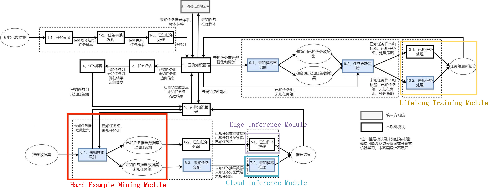
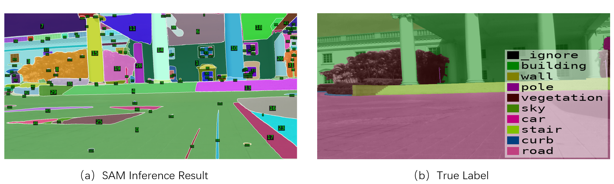

# Real-Time IoT Perception Systems Based on Edge-Cloud Collaboration with Large Foundation Models

## 1 Motivation

### 1.1 Background

Real-time perception systems are an essential component of intelligent Internet of Things (IoT) devices such as industrial robots and household mobile devices. When performing basic perception tasks such as semantic segmentation, the limited resources of edge platforms pose great challenges to the accuracy and adaptiveness of models. For example, in the case of semantic segmentation, new environments bring new semantic classes and states, and the small models that edge platforms can only segment limited-semantic information. Currently, large foundation models represented by SAM and GPT are widely recognized for their superior generalization ability. It is an important research direction to enable small models on edge platforms to achieve efficient and real-time IoT perception applications through the framework of edge-cloud collaboration with foundation models.

### 1.2 Goal

1. Implementation of Real-time IoT Perception Algorithm with Edge-Cloud Collaboration:

      Implement **SAM-based Semantic Segmentation** algorithm and **hard-example mining** algorithm based on **Kubeedge/Ianvs**, and test the algorithm's performance (model inference accuracy and other metrics).

2. Development of Edge-Cloud Collaboration Real-time IoT Perception System:

      Port the implemented edge-cloud collaboration algorithm to the **Kubeedge/Sedna** platform and develop an edge-cloud collaboration real-time IoT perception system.

3. Deployment on Real Edge-Cloud Environment Platform:

      Deploy the edge-cloud collaboration real-time IoT perception system developed based on Kubeedge/Sedna to **real edge-cloud environments** composed of devices such as **Nvidia Jetson Nano** and **Raspberry Pi**, and test the system's actual performance (latency, communication overhead, resource utilization, and other metrics).

## 2 Proposal

This project mainly focuses on semantic segmentation tasks in the AIoT environment, deploying **SAM** as the large model in the cloud and RFNet as the small model at the edge, and collaborating through **cloud-edge collaborative inference**.

### 2.1 Introduction for Segment Anything Model

The **Segment Anything Model ([SAM](https://segment-anything.com/)) **is a model designed for promptable segmentation, which is a task in image segmentation. SAM consists of three components: an image encoder, a prompt encoder, and a mask decoder. The image encoder computes an image embedding, the prompt encoder embeds prompts, and the mask decoder predicts segmentation masks by combining the information from the image and prompt encoders. SAM is trained to be promptable, meaning it can transfer its segmentation capabilities to new image distributions and tasks through prompt engineering. It is designed to be flexible, real-time, and ambiguity-aware. SAM has been evaluated on various tasks and has shown impressive zero-shot performance, often comparable to or better than fully supervised models.

SAM is designed to perform promptable segmentation, which means it can generate segmentation masks from a wide range of prompts. This flexibility allows SAM to be used for various segmentation tasks without the need for extensive retraining. SAM has the ability to transfer its segmentation capabilities to new image distributions and tasks without the need for additional training. This zero-shot transfer capability makes SAM highly adaptable and useful in scenarios where labeled data for specific tasks may be limited.

### 2.2 Introduction for Cloud-Edge Collaborative Inference

**Cloud-edge collaborative inference**, as an emerging technology, combines the processing capabilities of the cloud and edge devices to handle complex tasks more efficiently. The core idea of cloud-edge collaborative inference is to deploy large-scale models in the cloud, leveraging the powerful computing resources to handle complex tasks and challenging samples. On the other hand, deploying small-scale models on edge devices can meet the requirements for processing simple samples. In this architecture, edge devices only need to transmit sample data and communicate with the cloud, without bearing a large amount of computation tasks, greatly saving energy and computational resources.

The benefits of cloud-edge collaborative reasoning are not only reflected in the optimization of computing resources but also in improving the real-time performance and stability of the system. The large model in the cloud can continuously improve its recognition ability through learning and training, while edge devices can process simple samples in real-time, thereby improving the overall system's response speed. At the same time, when the small model on the edge device encounters issues or requires updates, remote model updates can be performed through communication with the cloud to maintain system stability.

## 3 Design Detail

### 3.1 Overview architecture

The overall architecture of the Cloud-edge Collaborative IoT Real-time Perception System is shown in the figure below. This system architecture considers applications in typical lifelong learning scenarios. Edge devices continuously collect images of the environment they are located and efficiently process these images using the Cloud-edge Collaborative Real-time Perception System. At the same time, the edge model is continuously trained through lifelong learning, based on the exploration of hard sample patterns, to ensure that the model can continuously adapt to the dynamic changes in the edge environment.

The overall workflow of the system is as follows:

1. Edge nodes collect samples for inference.
2. Edge nodes use deployed Edge Model to infer these samples and obtain edge inference results.
3. The edge inference results are sent to the Hard Example Mining module.
4. The Hard Example Mining module classifies the samples based on the inference results, labeling them as Hard samples and Easy samples.
5. Easy samples are directly output with their edge inference results, while Hard samples are uploaded to the cloud inference module on the cloud node.
6. In the cloud inference module, hard samples are inferred by the SAM model to obtain the cloud inference mask, and the edge inference results are obtained by the Edge Model.
7. In the cloud inference module, the cloud inference results are obtained by combining the cloud inference mask and the edge inference results.
8. Edge nodes download the cloud inference results, while cloud node storing hard samples and their cloud inference results in the cloud node's replay buffer.
9. Edge nodes output the cloud inference results, while the cloud node performs lifelong learning training on the edge model based on the samples in the cloud node's replay buffer.
10. The cloud node synchronizes the updated Edge Model to the edge nodes.

The Hard Example Mining Module will be implemented in the unknown sample recognition module of Ianvs. The Edge Inference Module will be implemented in the known sample inference module of Ianvs' edge-side knowledge management. The Cloud Inference Module will be implemented in the unknown task processing module of Ianvs' cloud-side knowledge management.

### 3.2 Implementation of SAM-based Semantic Segmentation

The SAM model has good generalization ability in handling visual segmentation tasks. However, as a general large model, its drawback is that it requires users to perform segmentation through prompts and cannot autonomously perform semantic segmentation on images. The figure below shows the results obtained from SAM inference compared with the actual labels:

It is evident that the SAM model produces detailed segmentation, accurately dividing all the objects in the image. However, on one hand, SAM segmentation has a relatively small granularity, segmenting objects such as floor tiles that do not require such fine segmentation. On the other hand, SAM's inference results do not include class labels, making it unsuitable for direct use in semantic segmentation.

Chen Jiaqi et al. from Fudan University proposed [Semantic Segment Anything](https://github.com/fudan-zvg/Semantic-Segment-Anything) to address the issue of SAM's inability to perform semantic segmentation directly. Taking inspiration from their approach, we propose a cloud-edge collaborative inference framework based on SAM, as shown in the figure below:

In this framework, the Hard-example mining module first determines the inference samples. If they are simple samples, RFNet is directly used for inference at the edge. If they are difficult samples, the challenging examples are uploaded to the cloud for SAM inference. Since SAM's inference results do not have class labels, they are combined with the class-labeled results obtained from edge inference, enabling SAM's inference results to have class labels, as shown in the figure below:

It can be observed that the combined results are more accurate in segmentation compared to RFNet's inference results and provide class labels that are lacking in SAM's segmentation results.

### 3.3 Implementation of Hard Example Mining

The Hard Example Mining module plays a crucial role in the entire system. If the Hard Example Mining module identifies too many samples as hard samples and uploads them to the cloud, it will result in a prolonged average inference latency. On the other hand, if the module identifies too few samples as hard samples, it will lead to a decrease in average inference accuracy. Considering the limited computational capability of edge devices, it is essential to ensure that the Hard Example Mining module does not consume excessive resources. Therefore, training a separate difficult example classifier based on models like ViT solely for the purpose of mining hard samples may impose an unbearable cost on edge nodes. Hence, in this project, we have considered two feasible Hard Example Mining approaches.

#### 3.3.1 Score Margin based Hard Example Mining

In "[Big/Little Deep Neural Network for Ultra Low Power Inference(CODE+ISSS2015)](https://ieeexplore.ieee.org/abstract/document/7331375)", they had a key observation: Score margin can be a metric to judge successful inference. 

Obviously, this idea of using a DNN-based approach to determine the confidence of image classification results can be easily extended to semantic segmentation tasks, as semantic segmentation is essentially a pixel-level classification task. By computing the average score margin for each pixel in an image, we can obtain a score margin for the semantic segmentation image. A larger score margin indicates that the model is more confident in its inference for this sample, and it can be considered as an easy sample. A smaller score margin indicates that the model is less confident in its inference for this sample, and it can be considered as a hard sample.

The advantage of this score margin-based approach for mining hard example samples is that it is simple to implement and quickly discriminates hard examples. However, the drawback is that the model often becomes overly confident in its inferences, and in the early experiments conducted for this project, no significant correlation was observed between the score margin and hard example samples. Therefore, we only consider the score margin-based method as one of the baseline methods for implementation.

#### 3.3.2 AppealNet based Hard Example Mining

In "[AppealNet: An Efficient and Highly-Accurate Edge/Cloud Collaborative Architecture for DNN Inference(DAC 2021)](https://ieeexplore.ieee.org/abstract/document/9586176)", a two-head architecture for edge model hard example mining was proposed.

In this model architecture, AppealNet builds a predictor head on top of the feature extractor of the Edge Model to predict whether the sample is a hard sample. The advantage of this method is that it does not require training a separate model specifically for identifying hard samples, while leveraging the information from the feature extractor of the Edge Model. The current plan is to use this approach to implement the Hard Example Mining module.

## 4 Roadmap

### July

- Implement **SAM-based Semantic Segmentation** algorithm based on **Kubeedge/Ianvs**;

### August

- Implement **hard-example mining** algorithm based on **Kubeedge/Ianvs**.

### September

- Port the implemented edge-cloud collaboration algorithms to the **Kubeedge/Sedna** platform;
- Commit the codes for **Kubeedge/Ianvs**.