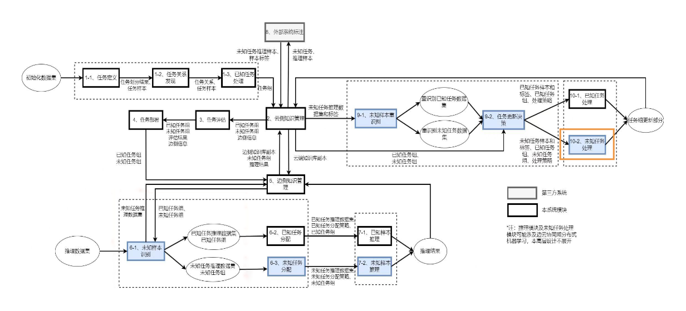
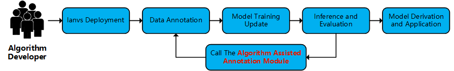
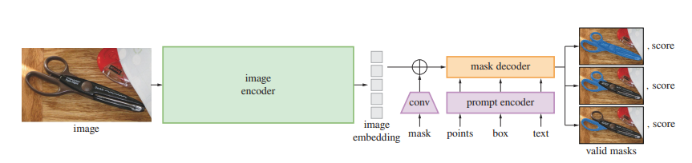
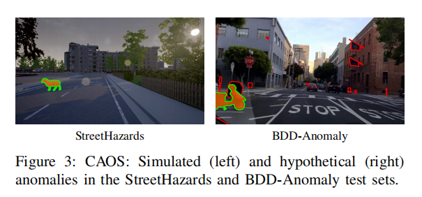
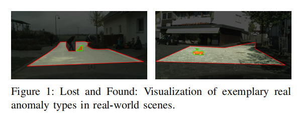
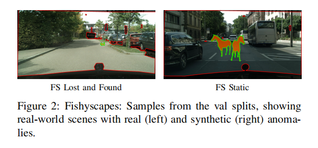
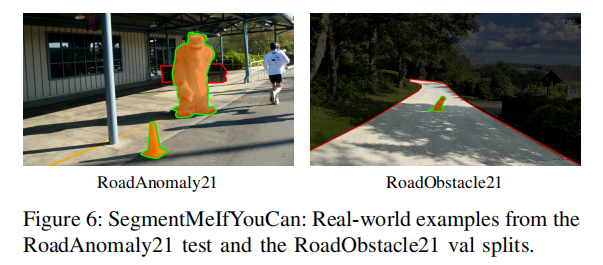
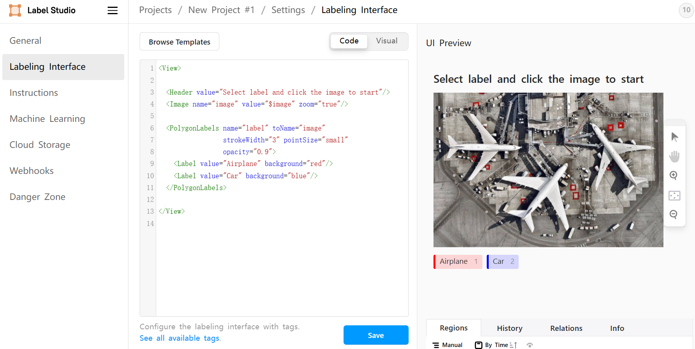

<<<<<<< HEAD
# 1 Background
The current traditional machine learning models and algorithms have obvious limitations, that is, they can only effectively predict and classify categories that have been seen in the training stage, and the models tend to show uncertain behavior for categories that have never appeared in the training data, which limits the performance of the models when dealing with open-world tasks. Traditional machine learning models typically acquire specific knowledge during the training phase, but struggle to transfer that knowledge to new tasks. Lifelong learning, one of the machine learning paradigms, attempts to solve this problem by enabling models to gradually accumulate previously learned knowledge and respond flexibly to different tasks.

With the evolution of large model technology, the importance of data in machine learning model training has become increasingly prominent, and manually collecting and labeling data has become a time-consuming and laborious task. In this context, it is urgent to use automated methods to generate annotated data and reduce the burden of data annotation. In the paper "Segment Anything", published in 2023, a data engine tool for open-world object segmentation is proposed, capable of fast data annotation and closed loop of data.

Based on the lifelong learning system framework built by KubeEdge's edgecloud collaborative AI paradigm, this project aims to reproduce the Segment Anything Model(SAM) model and try to apply this algorithm to open domain data annotation. By embedding the auxiliary data annotation system based on SAM into the framework of lifelong learning, it can help users realize corner case annotation, etc., so that new models can be trained on the basis of retaining old knowledge to quickly adapt to tasks in the new environment.

# 2. Goals
1. reproduce segment anything model based on open world segmentation dataset
2. achieve >0.45 accuracy for open-world object segmentation (e.g., AP, mIoU).
3. use the reproduced algorithms to build a data annotation tool, which is integrated into the Sedna and Ianvs lifelong learning modules based on the Ianvs architecture for practical application.

# 3. Proposal
Open world object segmentation is the core task of this project, and various basic computer vision tasks can be solved by fine-tuning the pre-trained large-scale open world segmentation model **SAM**.

This project reproduces the open world segmentation algorithm **Segment Anything Model** based on sedna and Ianvs lifelong learning, and chooses to fine-tune it on the Autopilot Small Obstacle Detection dataset according to the actual situation. This project tries to use **SAM and its related models** to realize the automatic annotation of open domain data supporting local and cloud deployment, users can send the demanded data to the cloud for processing through the annotation tool at the edge end, and then realize the complete data annotation process through the reasoning module based on SAM and its related algorithms in the cloud.

## 3.1 Algorithm architecture
The overall algorithm process is illustrated in the following diagram.

<image width = 400 src = "images/sam_annotation_algorithm_architecture.png"></image>

In the first step, images are automatically annotated using the SSA model. Next, the SSA-generated JSON data is converted into a format compatible with Label Studio. The pre-annotated results are imported into Label Studio for manual correction. Finally, the annotated results are exported and transformed into segmentation images suitable for training.

The relationship between the algorithm and the Ianvs lifelong learning architecture is depicted in the figure above, with its primary location in the unknown task processing module.

## 3.2 User flow

1. Deploy distributed synergy AI benchmarking Ianvs
2. Prepare data sets based on the actual task scenario
3. Conduct preliminary model training
4. Use models for reasoning and evaluation
5. Call the algorithm assisted annotation module to further annotate the data, so as to solve the problem of high difficulty in corner case processing and poor reasoning effect
6. The cloud further trains and updates the model to achieve a closed loop of annotation-train-reasoning-evaluation
7. Derive the final model that meets the requirements of the actual task for further application

# 4. Design Details
This section mainly introduces the algorithm model used in the system, the small obstacle detection dataset for automatic driving, and the principle of algorithm-assisted labeling.

## 4.1 Segment Model
### 4.1.1 Segment Anything Model（SAM）

The paper presents the [Segment Anything](https://arxiv.org/abs/2304.02643) (SA) project: a new task, a new model and a new dataset for image segmentation. Its use of the proposed SAM model in a data collection loop builds the largest segmentation dataset to date **SA-1B**, generating more than 1 billion masks on top of 11 million image data.Since the model is designed and trained to be promptable, it can be migrated to new image tasks in a ZERO-shot fashion.

The authors, influenced by pre-trained large language models in NLP, used the prompt engineering mechanism to create a similar large-scale vision base model with strong zero-shot (zero samples), few-shot (fewer samples) generalization capabilities to flexibly solve a variety of downstream tasks.The SAM has three main modules: the image encoder, Flexible Cue Encoder and Fast Mask Decoder.

### 4.1.2  Semantic Segment Anything Model

 While SAM is a powerful model capable of segmenting anything in images, it lacks the ability to predict the semantic categories of each mask. To address this limitation, [Semantic Segment Anything (SSA)](https://github.com/fudan-zvg/Semantic-Segment-Anything) was introduced. 
 Prior to the introduction of SAM, most semantic segmentation applications already had their own models. These models could provide rough category classifications for regions but with fuzzy and imprecise edges, lacking accurate masks. To overcome this issue, we proposed an open framework called SSA, which leverages SAM to enhance the performance of existing models. Specifically, the original semantic segmentation model provides category predictions, while the powerful SAM provides masks. 
 Additionally, the authors introduced an SSA engine, an open-vocabulary automatic annotation engine that benefits from the combined architecture of dense segmentation and open-vocabulary segmentation. This provides satisfactory annotations for most samples and can offer more detailed annotations using image captioning techniques.

## 4.2 Datasets
The dataset used in this project is mainly a small obstacle detection dataset within the field of autonomous driving.

### 4.2.1 StreetHazards
StreetHazards is a component of the 2019 CAOS benchmark. The training set includes three towns from CARLA and the dataset provides a variety of scenarios.

### 4.2.2 Lost and Found
The Lost and Found dataset was introduced in 2016 by Pinggera et al. and is the first dataset focusing on small road hazard detection with binocular camera acquisition.

It provides stereo masks for semantic segmentation tasks allowing pixel-level and instance-level evaluation. Its scenarios include irregular road surfaces, large object distances and illumination variations. Typical environments include residential areas, parking lots or industrial areas.

Blum et al. introduced it to the Fishyscapes (FS) benchmark, the FS Lost and Found dataset, in 2019.

### 4.2.3 RoadAnomaly
RoadAnomaly21 is a part of the SegmentMeIfYouCan benchmark, whose previous version was released in 2019 by Lis et al. It is designed for general anomaly detection scenarios in full street scenes, where the anomalies can be categorized as animals, unknown vehicles and tents, pianos or roadblocks. These anomalies can appear anywhere in the image, even in the sky.

**Aggregate comparison of data sets:**

|  Dataset   | Year  | Size(Test/Val) | Resolution|
|  :----:  | :----:  | :----:  | :----:  |
| StreetHazards | 2019 | 150 | 1280×720 |
| Lost and Found   FS Lost and Found | 2016   2019 | 2104   275/100 | 2048×1024 |
| RoadAnomaly21 | 2021 | 100/10 | 2048×1024   1280×720 |

## 4.3 Ancillary labeling

The principle of assisted annotation is to use the existing model for reasoning, and save the reasoning information into the label file format of the annotation software. Then the labeling software is manually operated to load the generated label file, and it only needs to check whether the target of each picture is standardized, and whether there are missed or wrongly labeled targets. This project plans to build a visualized auxiliary annotation tool through **SAM and its related models** to realize semi-automatic annotation or automatic annotation of image data, and try to realize manual adjustment of the annotation results.

[Label Studio](https://labelstud.io) is an open-source data labeling tool that allows users to create custom labeling tasks to train and improve AI models through the data labeling process. Label Studio supports various structured data types, including text, images, and audio. It is highly scalable and can be integrated into existing workflows to accelerate data labeling and enhance labeling quality.

Since the segmentation result of SAM does not include semantic labels, it hinders the achievement of fully automated labeling. Semantic segmentation is an image segmentation algorithm whose goal is to assign a semantic category label to each pixel in the input image, thereby segmenting the image into regions with semantic information. This segmentation provides an automated method for data annotation, making the process more efficient and accurate. The project plans to integrate an automatic annotation module through SAM-related semantic segmentation algorithms (such as SSA).

# 5. Road Map

The route map is as follows:

### July
- Study and compare the components in the SAM source code, and modify the code related to experimental data processing.
- Learn about the basic framework components of Sedna and Ianvs.

### August
- Replicate the SAM algorithm for different datasets.
- Attempt to build an open-domain data annotation tool, conduct system testing, and optimization.

### September
- Optimize the system architecture to achieve an accuracy of greater than 0.45 for the open-world object segmentation algorithm.
- Integrate it into the library of the Ianvs module.
=======
version https://git-lfs.github.com/spec/v1
oid sha256:8465c0d6339ff51083cb77465f7cdee1ed32c5cb86812b239d7ac8891fad2be6
size 10935
>>>>>>> 9676c3e (ya toh aar ya toh par)
