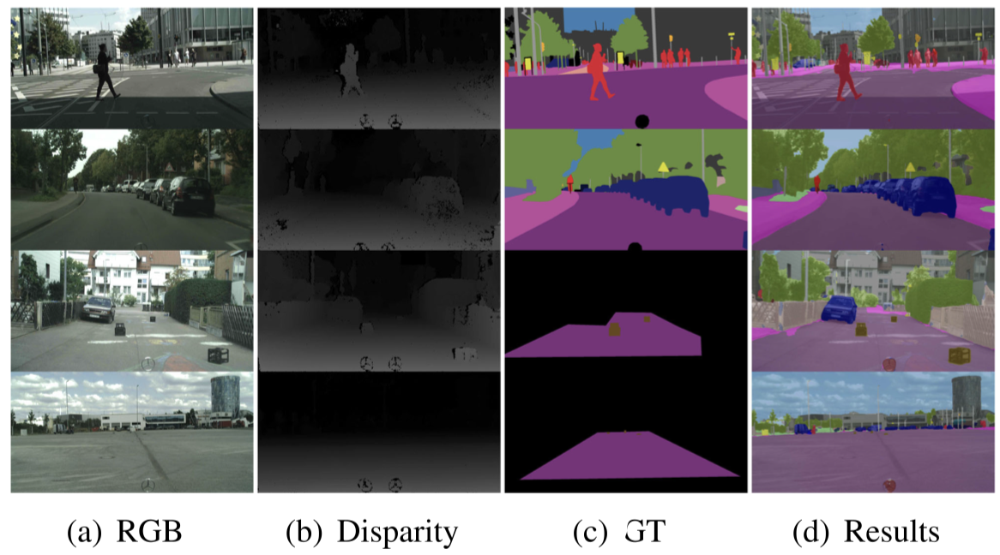
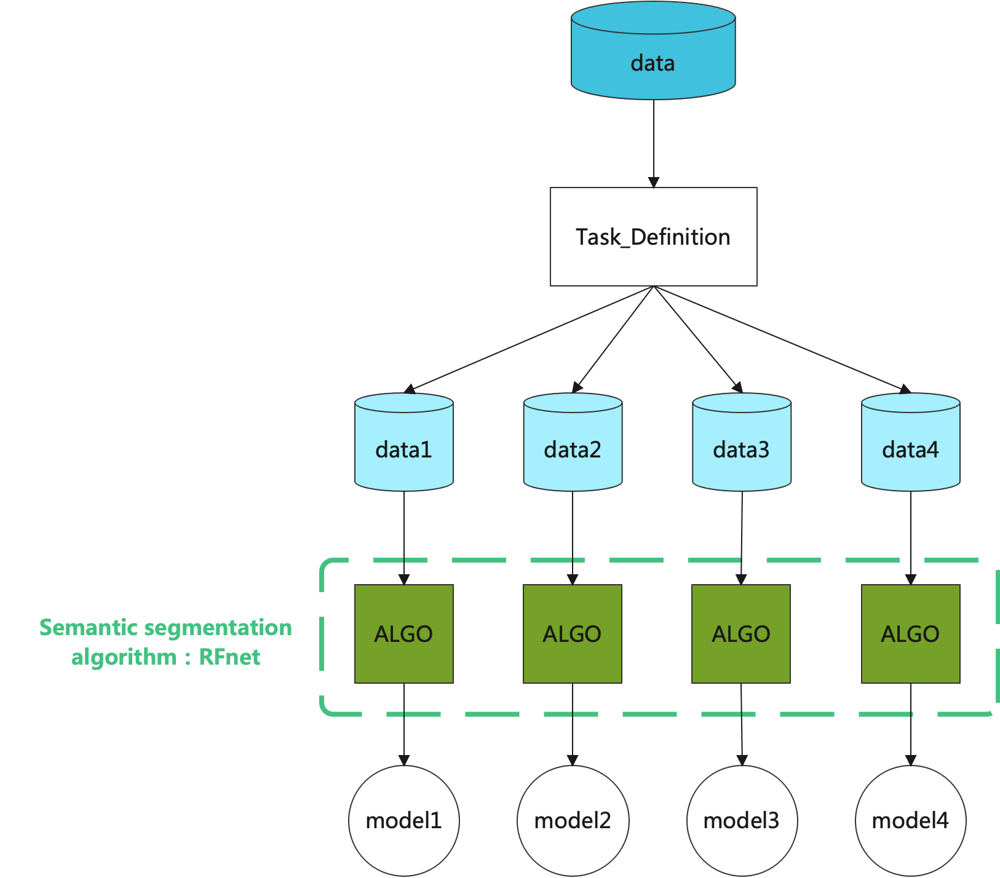
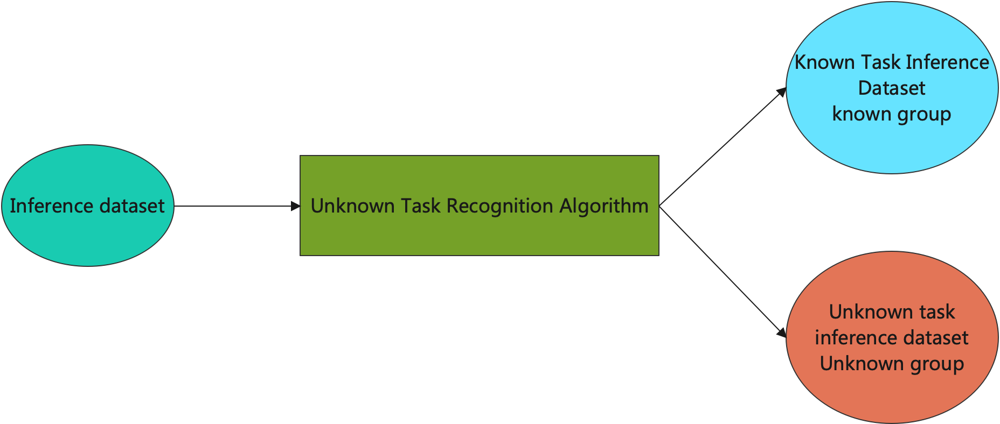
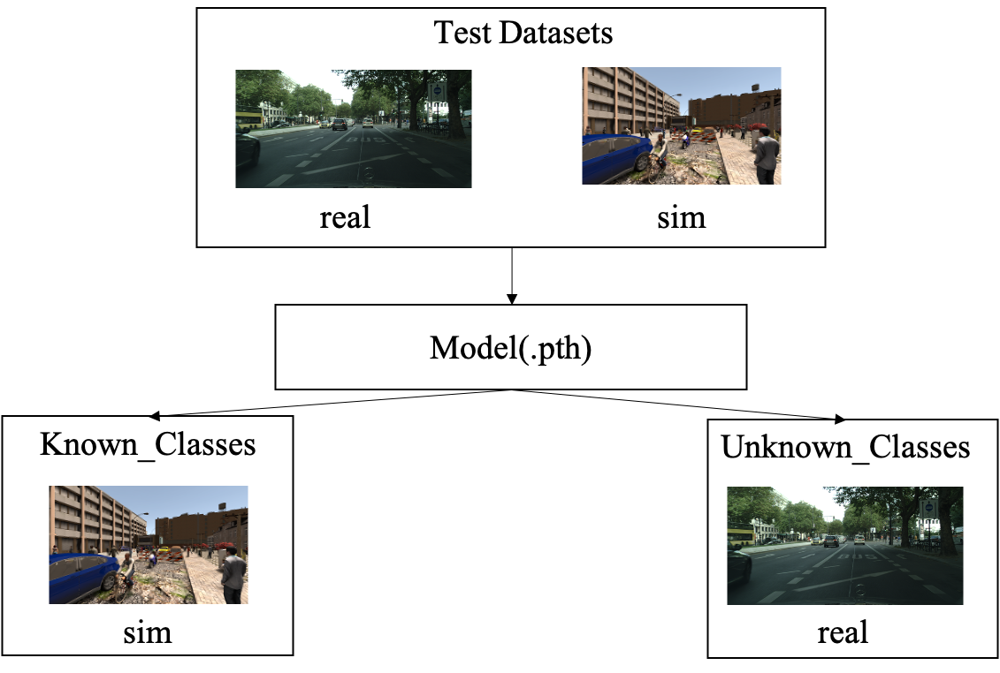

# Unknown Task Recognition Algorithm Reproduction based on Lifelong Learning of Ianvs


## 1 Project Background

The current mainstream machine learning paradigm is to run machine learning algorithms on a given set of data to generate a model, and then apply this model to a task in a real environment, which we can call "isolated learning". The main problem with this learning paradigm is that the model does not retain and accumulate previously learned knowledge and cannot use it in future learning, and the learning environment is static and closed, in contrast to the human learning process. In reality, the situation is so varied that it is clearly impossible to label every possible task or to collect large amounts of data before training in order for a machine learning algorithm to learn. Lifelong machine learning was created to address these problems.

Lifelong learning has five key characteristics.

1. a process of continuous learning.
2. the accumulation and retention of knowledge in the knowledge base.
3. the ability to use accumulated learned knowledge to aid future learning
4. the ability to discover new tasks.
5. the ability to learn while working.

Relying on the lifelong learning system built by KubeEdge+Sedna+Ianvs distributed collaborative AI joint inference framework, the core task of this project is to complete the unknown task identification algorithm module and embed it in the framework, with the aim of equipping the system with the ability to discover new tasks.

Traditional machine learning performs test set inference by training known samples, whose knowledge is limited, and the resulting models cannot effectively identify unknown samples in new classes, which will be treated as known samples. In a real production environment, it is difficult to guarantee that the training set contains samples from all classes. If the unknown class samples cannot be identified, the accuracy and confidence of the model will be greatly affected, and the cost consumed for model improvement is incalculable. This project aims to reproduce the algorithm of the CVPR2021 paper "Learning placeholders for open-set recognition". The paper proposes placeholders that mimic the emergence of new classes, thus helping to transform closed training into open training to accomplish recognition of unknown classes of data.

In this project, the algorithm is packaged as a python callable module and embedded in the lib library of Ianvs' lifelong learning testing system. The algorithm developer does not need to develop additional algorithms for unknown task recognition and can directly test the performance of the currently developed algorithms in combination with the dataset and testing environment provided by Ianvs. At the same time, Ianvs provides local and cloud-based algorithm performance rankings for developers to facilitate the exchange of lifelong machine learning researchers and thus promote the development of the lifelong learning research field.


## 2 Goals

1. Reproducing the algorithm from the CVPR2021 paper "Learning placeholders for open-set recognition".
2. Achieving an accuracy of 0.9 for unknown task recognition.
3. Making unknown category recognition modules according to Ianvs architecture and contextual relationship to store in the lib library, so that the algorithm can be used on demand.


## 3 Proposal

The goal of this project based on Ianvs' lifelong learning replication of the unknown task recognition algorithm is to train the classifier model by the unknown task recognition algorithm after the dataset has been trained by the initial task definition and business model in Ianvs' lifelong machine learning system, and to reason that the dataset can categorize and classify the known samples and identify the unknown samples for subsequent task assignment by reasoning with the classifier model.

This project needs to complete the task definition part and the unknown task identification part.

Task definition is the predecessor task, the business model is trained by the RFNet semantic segmentation algorithm, and the datasets involved are Cityscapes (camera data) and SYNTHIA-RAND-CITYSCAPES (simulation data).

Unknown task identification is the core task of this project. The unknown task recognition is data inference, using Wide-ResNet network structure, combined with the classification placeholders and data placeholders in CVPR2021 paper "Learning placeholders for open-set recognition" to form a neural network and train the classifier, which can classify known samples and identify the unknown samples.

### 3.1 Architecture

This project mainly implements the function of discovering new tasks.


The following is the architecture diagram of this project system, as shown in the figure, the input of the unknown sample identification module is the inference dataset, and the output bits are known sample set and unknown sample set. Before the unknown sample identification module is the task definition module, after the task definition, the initialized dataset is considered as known dataset. In the task assignment module after the unknown sample identification module, the known data are inferred and the unknown data are re-posted and incorporated into the edge-side knowledge base and then into the cloud-side knowledge base.


### 3.2 Usecase

#### 3.2.1 Calling datasets

```python
from sedna.datasources import BaseDataSource
```

#### 3.2.2 User flow chart


Usage Process
1. View the dataset
2. download the edge cloud synergy dataset
3. Package your algorithm into Estimator
4. Call the Benchmark module, and the Benchmark module calls the developer's encapsulated Estimator
5. Run and view the results
6. Update and view the local edge cloud collaborative AI ranking

#### 3.2.3 Interface Description

```yaml
type: "unknown_task_recognition"
name: "UnknownTaskRecognition"
url: "./examples/curb-detection/lifelong_learning_bench/testalgorithms/rfnet/unknown_task_recognition.py"
hyperparameters:
      # name of the hyperparameter; string type;
      # dataset which should be the dataset you chose to call above.
   - dataset:
     values:
       - "dataset_test"
```


## 4 datasets

In this project, the image source is used as the classification criterion, and RGB images in three datasets are selected as samples, among which, the real camera dataset and simulator dataset are selected for the known task dataset, and the animation dataset of Akiyama open source is selected for the unknown task dataset. The sample dataset and dataset structure are shown below.


```
├─train
│  ├─0_real
│  │  ├─0_0001.png
│  │  ├─0_0002.png
│  │  ├─0_0003.png
│  │  ├─...
│  │  └─0_3000.png
│  ├─1_sim
│  │  ├─1_0001.png
│  │  ├─1_0002.png
│  │  ├─...
│  │  └─1_3000.png
├─close_test
│  ├─0_real
│  │  ├─0_3001.png
│  │  ├─0_3002.png
│  │  ├─0_3003.png
│  │  ├─...
│  │  └─0_3500.png
│  ├─1_sim
│  │  ├─1_3001.png
│  │  ├─1_3002.png
│  │  ├─...
│  │  └─1_3500.png
└─open_test
    ├─0_real
    │  ├─0_3501.png
    │  ├─0_3502.png
    │  ├─0_3503.png
    │  ├─...
    │  └─0_4000.png
    ├─1_sim
    │  ├─1_3501.png
    │  ├─1_3502.png
    │  ├─1_3503.png  
    │  ├─...
    │  └─1_4000.png
    └─2_cartoon
       ├─2_001.png
       ├─2_002.png
       ├─...       
       └─2_500.png
```


## 5 Design Details

It is mainly about the algorithm of the training business model of the system, logical structure of task definition part, introduction of urban landscape dataset, neural network structure, and algorithm principle of unknown task recognition algorithm.

### 5.1 Model of the task definition section

This part of the training model algorithm uses the RFNet method mentioned in the RAL2020 paper **Real-Time Fusion Network for RGB-D Semantic Segmentation Incorporating Unexpected Obstacle Detection for Road-Driving Images** to train the model.

The entire network architecture of RFNet is shown in Fig. In the encoder part of the architecture, we design two independent branches to extract features for RGB and depth images separately RGB branch is the main branch, and the Depth branch is the subordinate branch. In both branches, we choose ResNet18 [30] as the backbone to extract features from inputs because ResNet-18 has moderate depth and residual structure, and its small operation footprint is compatible with real-time operation. After each layer of ResNet-18, the output features from the Depth branch are fused to the RGB branch after the Attention Feature Complementary (AFC) module. The spatial pyramid pooling (SPP) block gathers the fused RGB-D features from two branches and produces feature maps with multi-scale information. Finally, referring to SwiftNet, we design the efficient upsampling modules to restore the resolution of these feature maps with skip connections from the RGB branch.


Fig. shows some examples from the validation set of Cityscapes and Lost and Found, which demonstrates the excellent segmentation accuracy of our RFNet in various scenarios with or without small obstacles.



### 5.2 Task Definition

The task definition is mainly accomplished by dividing the data into multiple parts with various classifications, and each part of the data is trained with a model to obtain multiple models.

For this project, we use two datasets to train the models separately: cityscape and SYNTHIA-RAND-CITYSCAPES, where the cityscape is the traveling camera data and SYNTHIA-RAND-CITYSCAPES is the simulation data.

#### 5.2.1 workflow



### 5.3 Unknown Task Recognition

This project aims to reproduce the CVPR2021 paper "Learning placeholders for open-set recognition" in a defect detection scenario.

#### 5.3.1 Workflow

The following is the workflow of the unknown task identification module. When faced with an inference task, the unknown task identification algorithm can give a timely indication of which data are known and which are unknown in the data set.



#### 5.3.2 Neural network structure

For the model network structure of this project, WideResnet network + placeholder is selected, and the following is the schematic diagram of model training. As shown in the figure, in the training phase, we use real camera acquisition data and simulator data as known class training data set, and train the model after WideResnet+Proser algorithm.


In the testing phase, the test set consists of a combination of known and unknown class data, where the known class data are camera capture images and simulator images, while the unknown class data are natural forest images and cartoon images. After the model recognition, the data will be distinguished into known and unknown classes, where the known class data will be further classified according to the training categories.



**WideResnet principle**

Resnet has been shown to scale to thousands of layers and still have improved performance. wideResnet is proposed to build on Resnet by reducing the depth of the network, increasing the width of the network, and using Dropout to regularize and prevent overfitting of the model training. Experimentally, WideResnet training speed is faster than ResNet for the same parameters.

The following is the structural unit diagram of WideResnet.


**PROSER Algorithm Principle**


##### Learning classifier placeholders

Retaining classifier placeholders aims at setting up additional virtual classifiers and optimizing them to represent the threshold between known and unknown classes. Assuming a well-trained closed-set classifier W; the paper first augments the output layer with additional virtual classifiers, as shown in Eq.
$$
\hat{f} (\mathrm {x})=[W^{\top}\phi(\mathrm {x}),\hat{w}^{\top }\phi(\mathrm {x})]
$$
The closed set classifier and the virtual classifier embed the same set (matrix) and create only one additional linear layer. The added indices are passed through the softmax layer to generate the posterior probabilities. By fine-tuning the model so that the virtual classifier outputs the second highest probability of a known class, the invariant information between the known class classifier and the virtual classifier can be transferred to the detection process by this method. Since the output is increased by using the virtual classifier, the classification loss can be expressed as Eq:
$$
l_{1}=\sum_{(\mathrm {x},y)\in \mathcal{D}_{tr}  }^{} \ell (\hat{f}(\mathrm {x},y)+\beta \ell(\hat{f}(\mathrm {x} \setminus  y,K+1 )
$$
$L$ denotes cross entropy or other loss function. The first term in the formula corresponds to the output of the optimized expansion, which pushes the samples into the corresponding class groups to maintain accurate identification in the closed set. In the second term, matching the task to $K+1$ classes makes the virtual classifier output the second highest probability, tries to associate the position of the virtual classifier in the center space, and controls the distance to the virtual classifier as the second closest distance among all class centers. Thus, it seeks a trade-off between correctly classifying closed set instances and retaining the probability of a new class as a classifier placeholder. During training, it can be positioned between target and non-target classes. In the case of novel classes, the predictive power of the virtual classifier can be high because all known classes are non-target classes. Therefore, it is considered as an instance-related threshold that can be well adapted to each known class.

##### Learning data placeholders

The purpose of learning data placeholders is to transform closed-set training into open-set training. The combined data placeholders should have two main characteristics, the distribution of these samples should look novel and the generation process should be fast. In this paper, we simulate new patterns with multiple mixtures. Equation 6 in the paper gives two samples from different categories and mixes them in the middle layer.
$$
\widetilde{\mathrm {x} } _{pre}  =\lambda \phi _{pre}(\mathrm {x}_{i})+(1-\lambda)\phi_{pre}(\mathrm {x}_{j}),y_{i}\ne y_{j}
$$
The results of the mixture are passed through the later layers to obtain the new model embedding $\phi_{post}$. considering that the interpolation between two different clusters is usually a low confidence prediction region. The paper treats the embedding $\phi _{post}(\tilde{\mathrm {x}}_{pre} ))$as an embedding of the open set class and trains it as a new class.
$$
l_{2}=\sum_{(\mathrm {x}_{i},\mathrm {x}_{j})\in \mathcal{D}_{tr}  }^{} \ell ([W,\hat{w}]^{\top}\phi_{post}(\tilde{x}_{pre}),K+1 )
$$

$$
\tilde{x}_{pre}=\lambda\phi_{pre}(\mathrm{x}_{i})+(1-\lambda)\phi_{pre}(\mathrm{x}_{j}),y_{i}\ne y_{j}.
$$

It is clear that the formulation in the paper does not consume additional time complexity, which would generate new situations between multiple decision boundaries. In addition, streamwise blending allows better use of interpolation of deeper hidden representations to generate new patterns in the improved embedding space, which better represents the new distribution. As illustrated in the figure above, the blending instance pushes the decision boundaries in the embedding space to two separate locations of the classes. With the help of the data placeholders, the embedding of the known classes will be tighter, leaving more places for the new classes.

**PROSER algorithm training process**


## Roadmap

The roadmap would be as follows

### July

- Select image dataset；
- Complete the design of the task definition；

### August

- Completion of the task definition algorithm；
- Reproduction of unknown task recognition algorithms；
- Designing classifiers with the algorithm of the paper；

### September

- Improved accuracy of unknown task recognition algorithm to 90%；
- Merge into the lib of the Ianvs module；
- Intermodulation with other related projects；
