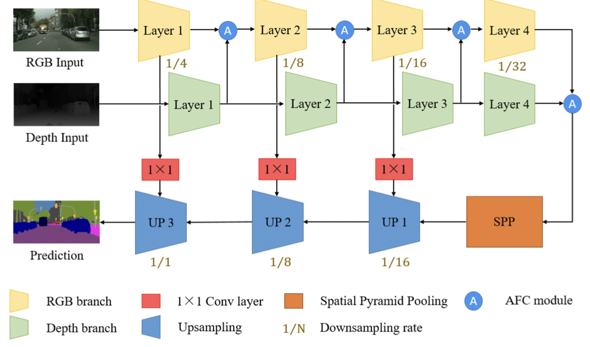

# Unknown Task Recognition Algorithm Reproduction based on Lifelong Learning of Sedna
Traditional machine learning performs test-set inference by training known samples to which its knowledge is limited. The model which is trained by traditional machine learning cannot be effectively recognized the unknown samples from new classes and they will be processed as known samples. Therefore, the recognition and processing of unknown samples or unknown tasks will become the main research direction of artificial intelligence in the future. This project aims to reproduce the CVPR2021 paper "Learning placeholders for open-set recognition" in the Semantic Segmentation dataset. This paper proposes placeholders that imitate the emergence of new classes, thus helping to transform closed-set training into open-set training.

## Goals
1. The reproduction should be completed based on the Cityscapes Semantic Segmentation dataset.
2. The reproduced code is successfully merged into the lifelong learning module of Sedna.
3. The recognition accuracy (e.g. f1_score) of unknown classes is greater than 0.9.

## Proposal
The goal of this Sedna-based lifelong learning recurrence unknown task identification algorithm project is to identify unknown samples and known samples in the inference dataset and categorize them for subsequent task assignment in the lifelong learning system created by Sedna, after the initial training phase of task definition and model training.

This project needs to complete the task definition part and the unknown task identification part.

Among them, the task definition part is a semantic segmentation task, and the datasets involved are Cityscapes (camera data) and SYNTHIA-RAND-CITYSCAPES (simulation data).

The unknown task identification is the core task of this project. The unknown task recognition is data inference, based on data distribution for category classification, combined with the idea of categorization placeholders and data placeholders in CVPR2021 paper **"Learning placeholders for open-set recognition"**, to train classifiers to identify known and unknown samples and perform labeling.

## Design Details

### Model

This part of the training model algorithm uses the RFNet method mentioned in the RAL2020 paper **Real-Time Fusion Network for RGB-D Semantic Segmentation Incorporating Unexpected Obstacle Detection for Road-Driving Images** to train the model.

The entire network architecture of RFNet is shown in Fig. In the encoder part of the architecture, we design two independent branches to extract features for RGB and depth images separately RGB branch as the main branch and the Depth branch as the subordinate branch. In both branches, we choose ResNet18 [30] as the backbone to extract features from inputs because ResNet-18 has moderate depth and residual structure, and its small operation footprint is compatible with the real-time operation. After each layer of ResNet-18, the output features from the Depth branch are fused to the RGB branch after the Attention Feature Complementary (AFC) module. The spatial pyramid pooling (SPP) block gathers the fused RGB-D features from two branches and produces feature maps with multi-scale information. Finally, referring to SwiftNet, we design the efficient upsampling modules to restore the resolution of these feature maps with skip connections from the RGB branch.

Fig. shows some examples from the validation set of Cityscapes and Lost and Found, which demonstrates the excellent segmentation accuracy of our RFNet in various scenarios with or without small obstacles.

### Task Definition

The task definition is mainly accomplished by dividing the data into multiple parts with various classifications, and each part of the data is trained with a model to obtain multiple models.

For this project, we use two datasets to train the models separately: cityscape and SYNTHIA-RAND-CITYSCAPES, where the cityscape is the traveling camera data and SYNTHIA-RAND-CITYSCAPES is the simulation data.

#### workflow

#### Dataset

##### Cityscape

##### SYNTHIA-RAND-CITYSCAPES

### Unknown Task Recognition

This project aims to reproduce the CVPR2021 paper "Learning placeholders for open-set recognition" in a defect detection scenario.

#### Workflow

The following is the workflow of the unknown task identification module. When faced with an inference task, the unknown task identification algorithm can give a timely indication of which data are known and which are unknown in the data set.

#### Main Work

Data placeholders and classification placeholders are set up in the paper to handle the unknown class recognition problem. Among them, the purpose of the data placeholders is to mimic the emergence of new classes and to transform closed training into open training. The purpose of reserving classification placeholders for new classes is to augment the closed-set classifier with a virtual classifier that adaptively outputs class-specific thresholds to distinguish known classes from unknown classes. Specifically, the paper augments the closed-set classifier with an additional classification placeholder that represents a class-specific threshold between known and unknown. The paper reserves the classification placeholder for open classes to obtain invariant information between target and non-target classes. To efficiently predict the distribution of new classes, the paper uses data placeholders, which mimic open classes at a limited complexity cost, as a way to enable the transformation of closed classifiers into open classifiers and adaptively predict class-specific thresholds during testing.

#### Algorithm Principle

##### Learning classifier placeholders

Retaining classifier placeholders aims at setting up additional virtual classifiers and optimizing them to represent the threshold between known and unknown classes. Assuming a well-trained closed-set classifier W; the paper first augments the output layer with additional virtual classifiers, as shown in Eq.

The closed set classifier and the virtual classifier embed the same set (matrix) and create only one additional linear layer. The added indices are passed through the softmax layer to generate the posterior probabilities. By fine-tuning the model so that the virtual classifier outputs the second highest probability of a known class, the invariant information between the known class classifier and the virtual classifier can be transferred to the detection process by this method. Since the output is increased by using the virtual classifier, the classification loss can be expressed as Eq:

L denotes cross entropy or other loss function. The first term in the formula corresponds to the output of the optimized expansion, which pushes the samples into the corresponding class groups to maintain accurate identification in the closed set. In the second term, matching the task to K+1 classes makes the virtual classifier output the second highest probability, tries to associate the position of the virtual classifier in the center space, and controls the distance to the virtual classifier as the second closest distance among all class centers. Thus, it seeks a trade-off between correctly classifying closed set instances and retaining the probability of a new class as a classifier placeholder. During training, it can be positioned between target and non-target classes. In the case of novel classes, the predictive power of the virtual classifier can be high because all known classes are non-target classes. Therefore, it is considered as an instance-related threshold that can be well adapted to each known class.

##### Learning data placeholders

The purpose of learning data placeholders is to transform closed-set training into open-set training. The combined data placeholders should have two main characteristics, the distribution of these samples should look novel and the generation process should be fast. In this paper, we simulate new patterns with multiple mixtures. Equation 6 in the paper gives two samples from different categories and mixes them in the middle layer.

The results of the mixture are passed through the later layers to obtain the new model embedding post. considering that the interpolation between two different clusters is usually a low confidence prediction region. The paper treats the embedding φpost (̃xpre) as an embedding of the open set class and trains it as a new class.

It is clear that the formulation in the paper does not consume additional time complexity, which would generate new situations between multiple decision boundaries. In addition, streamwise blending allows better use of interpolation of deeper hidden representations to generate new patterns in the improved embedding space, which better represents the new distribution. As illustrated in the figure above, the blending instance pushes the decision boundaries in the embedding space to two separate locations of the classes. With the help of the data placeholders, the embedding of the known classes will be tighter, leaving more places for the new classes.

**PROSER algorithm training process**

### Embedded in Sedna

In the training phase, the classifier is deployed in two more ways, the classifier is stored as a model in the form of a file, either in a container or as an environment variable that is used by calling the address directly.

In the inference phase, the unknown task algorithm exists in the Edge inference of the edge end, worker.

## Roadmap

The roadmap would be as follows

### July

- Completion of image dataset selection.
- Completion of the design of the task definition.
- Reproducing the semantic segmentation-RFNet algorithm.
### August
- Completion of task definition content.
- Reproducing unknown task recognition algorithms.
- Provide initially available unknown task algorithms for system testing
### September
- Modification of the unknown task source code to increase the accuracy of the unknown task identification algorithm to 90%.
- merged into the Edge Inference of the Sedna.