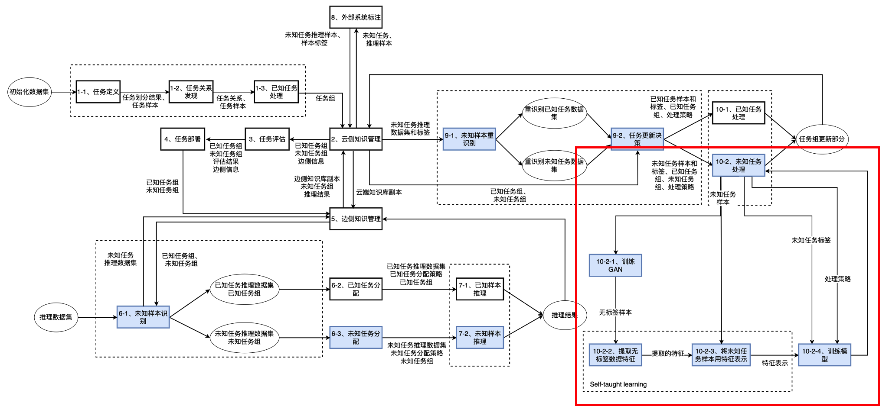
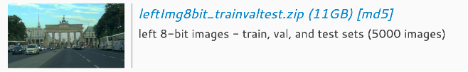
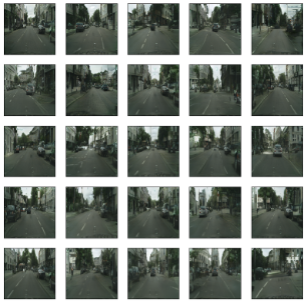
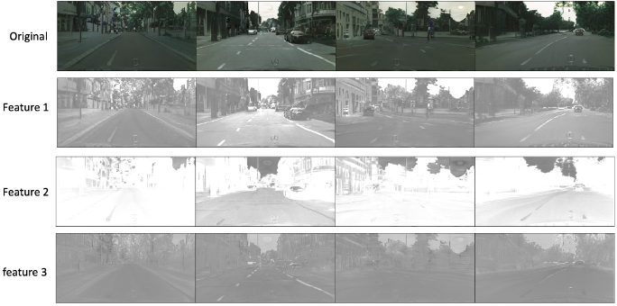
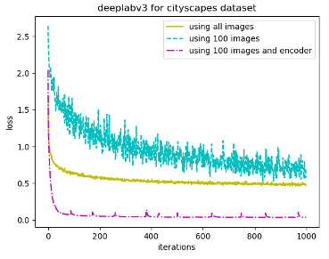
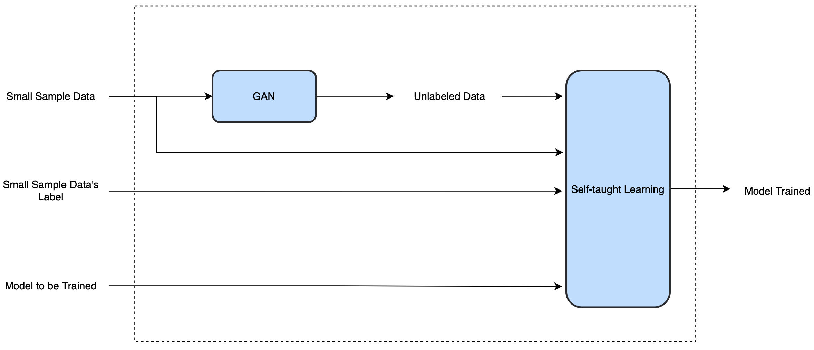
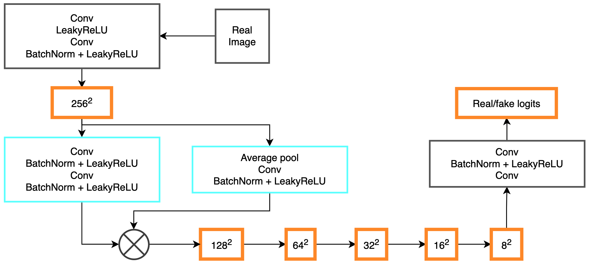
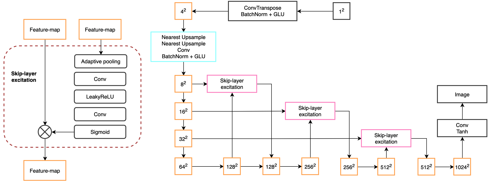
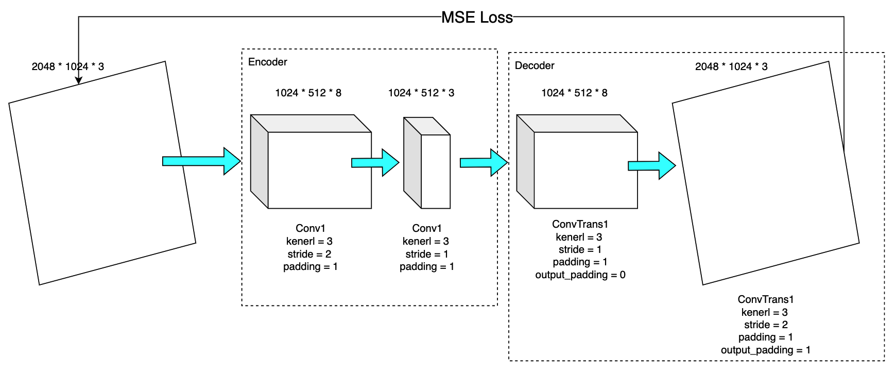

# Unknown Task Processing Algorithm based on Lifelong Learning of Ianvs

## 1 Project Background
In the robot anomaly detection and inspection scenarios, lifelong learning needs to deal with the identified unknown tasks. In the process of lifelong learning, the data of unknown tasks may be small samples and heterogeneous. Generative adversarial networks (GANs) are advanced generative models that can generate data based on the distribution of real data. KubeEdge SIG AI released a new feature on Sedna/Ianvs, trying to use GANs to solve the small sample problem, but the data generated by GANs is not labeled. Self-taught learning (STL) is an algorithm that uses sparse coding and unlabeled data to build high-level data representations to improve classification performance. Therefore, one solution is to use GANs and STL in the cloud to expand small samples and heterogeneous data respectively and extract data representations to help the model train better. With this solution, model training can converge faster and reduce the number of training rounds, achieving fast and efficient training in small samples and heterogeneous data scenarios.    

# 2. Goals
1. Unknown task processing with unlabeled data;
2. Compared with the scenario using all data, the unknown task processing algorithm reduces the number of convergence iterations by 50% and the training loss is reduced by 50%;
3. Integrate the algorithm into Sedna/Ianvs to complete the process.

# 3. Proposal
## Overview
We propose an approach of combining [GAN](https://en.wikipedia.org/wiki/Generative_adversarial_network) and [Self-taught Learning](https://ai.stanford.edu/~hllee/icml07-selftaughtlearning.pdf) to solve small sample problem in Ianvs lifelong learning, as shown in the figure below, corresponding to the [pull request](https://github.com/kubeedge/ianvs/pull/90).

We describe the arichtecture and the process. More details can be seen in [Design Details](#Design%20Details).

1. Train GAN with orginal small sample data;
2. GAN generates more data according to the probability distribution;
3. Train Autoencoder (which is consist of encoder and decoder) with the data generated by GAN;
4. Use encoder to get data representation of original small sample data;
5. Use data representation and orignal labels to train model that the unseen task model needs;
6. Ouput a well trained model.

# 4. Use Case
The case uses the `Cityscapes Dataset` and trains the `DeepLabV3` model as an unknown task. Specifically, the leftImg8bit_trainvaltest in the `Cityscapes Dataset` is selected, which has 5000 images, and the size of each image is `2048*1024*3`. In this case, the `DeepLabV3` is integrated into Ianvs and the `DeepLabV3` is configured as an unseen task. The `Cityscapes Dataset` shown in figure below is one of the most authoritative and professional image semantic segmentation evaluation sets in the field of automatic driving. It focuses on the understanding of urban road environment in real scenes, and the task is more difficult and closer to the popular requirements of automatic driving. The `DeepLabV3` model is a semantic segmentation algorithm, and the use of empty convolution is discussed, this makes it possible to obtain a larger receptive field to obtain multi-scale information in the framework of cascade modules and spatial pyramid pooling.

The runtime environment is as follows: the operating system is Ubuntu 20.04, the CPU is Intel i7 processor, the memory is 32GB, the graphics card is NVIDIA RTX 3060(12GB), and the Ianvs version is v0.2.0.    

Small sample environment settings. The case randomly selects 100 images in the data set as a small sample environment and compares it with the training of the entire data set.    

Small sample unknown task training demonstration. In this case, small sample training is carried out on the Ianvs platform, and the training of all data sets is compared to prove the effectiveness of the scheme. The training process can be carried out in the Ianvs lifelong learning platform, or the trained model can be directly deployed to the Ianvs cloud.    

We learn the data distribution of small sample data by GAN, and Figure shows the images generated by the generator. The generator generates data for self-learning module training.    

We use the images generated by the generator to train the STL module, Figure shows the data representations extracted by STL, the first line represents the original image, the second/third/fourth line represents the extracted data representation information.

  

Figure shows the small sample unknown task training comparison. The following three training processes represent the effect of training with all data (yellow line), the effect of training with only 100 images (blue line), and the training effect after using only 100 images and using the trained encoder data representation (red line).

  

It can be found that using only 100 images to train not only the loss decreases slowly, but also the phenomenon of oscillation instability, and the training loss variance of the last 500 rounds of iteration is 0.08. However, after the trained encoder data representation and then training, not only the loss drops quickly, the training is stable, and it achieves better results than using all the data for training. Specifically, our method converges after 20 rounds of iteration, and the number of iterations is 90% less than that of the training process using all the data sets. At the same time, our method can achieve a lower training loss (under the same loss function), which is 80% lower than the training process using the entire data set.   

The case fully proves that the solution is effective in model training in the case of small samples and is suitable for Sedna/Ianvs lifelong learning.

# 5. Design Details
## Architecture

- Overview  
  Our algorithm includes GAN and STL, both of which are based on unlabeled data and only use labels for small sample data when training unknown tasks.
  

- GAN (we refer to [Towards Faster and Stabilized GAN Training for High-fidelity Few-shot Image Synthesis](https://openreview.net/forum?id=1Fqg133qRaI)).   
  The GAN module is designed for small sample data, while preventing training forgetting, the network layer is designed as deep as possible, and the deep information of the data is put forward.    

  Discriminator

  

  Generator

  

- Convolutional AutoEncoder of Self-taught Learning    

  In implementing the Self-taught Learning module, we use Convolutional AutoEncoder for fast extracting data representations.
  
