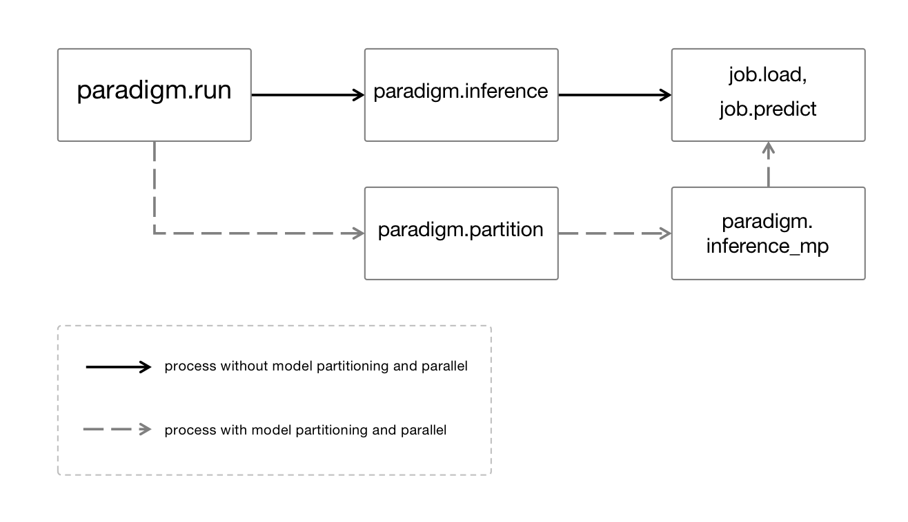
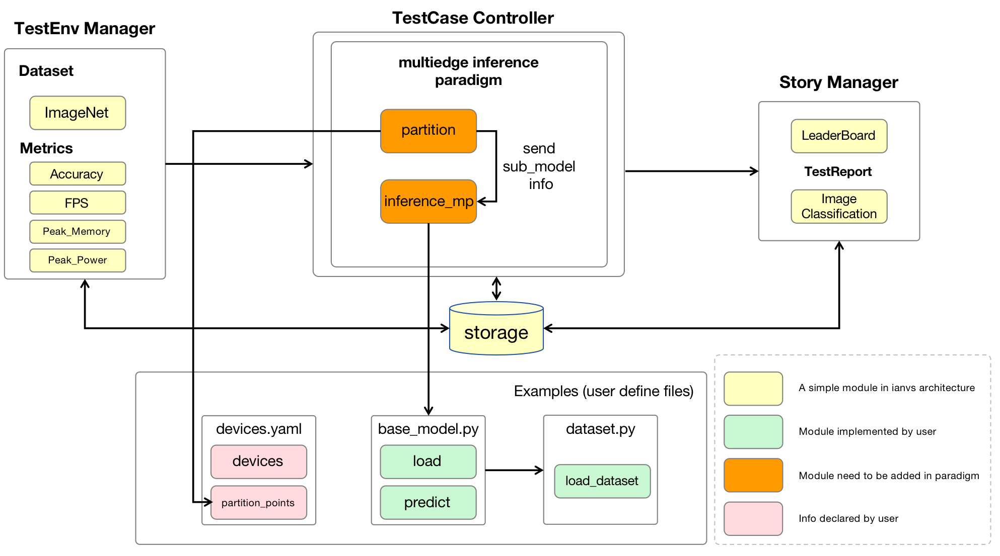
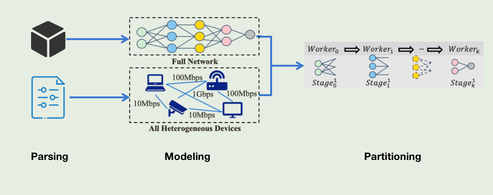
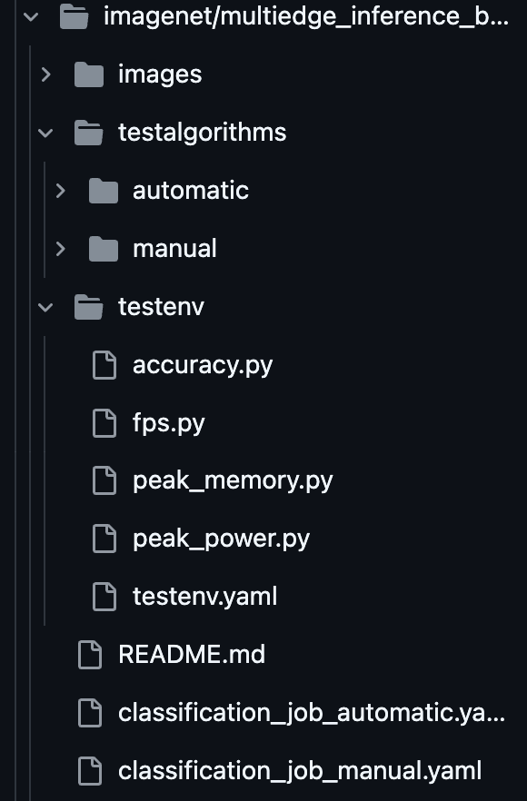

# Backgroud
In high-mobility scenarios such as highways and high-speed railways, the connection between personal terminal devices and cloud servers is significantly weakened. However, in recent years, artificial intelligence technology has permeated every aspect of our lives, and we also need to use artificial intelligence technologies with high computational and storage demands and sensitive to latency in high-mobility scenarios. For example, even when driving through a tunnel with a weak network environment, we may still need to use AI capabilities such as image classification and large model dialogue. Therefore, in the event that edge devices lose connection with the cloud, offloading AI computing tasks to adjacent edge devices and achieving computational aggregation based on the mutual collaboration between devices, to complete computing tasks that traditionally require cloud-edge collaboration, has become an issue worth addressing. This project aims to use multiple heterogeneous computing units on the edge (such as personal mobile phones, tablets, bracelets, laptops, and other computing devices) for collaborative artificial intelligence neural network inference, enabling AI tasks to be completed with lower latency using devices that are closer to the edge, thereby enhancing the user experience.

To simulate the workflow of multi-edge inference in the real world, Ianvs, as a distributed collaborative AI benchmarking platform, currently supports this AI paradigm and provides a simple simulation benchmark testing. However, facing various heterogeneous computing units, Ianvs does not have the capability for automatic partitioning and scheduling of the computation graph, but instead requires users to manually partition the computation graph and decide on its allocation to suitable computing nodes, which greatly limits the computational resource utilization and flexibility of multi-edge inference, especially in high-mobility scenarios, where this limitation can further deteriorate the user experience.

Therefore, targeting high-mobility scenarios and heterogeneous computing devices, this proposal offers an automatic partitioning and scheduling framework for neural network computation graphs, thereby enhancing the collaborative and adaptive capabilities of multi-end inference.
# Goals

1. Complete the partitioning module in Ianvs, supporting automatic partitioning of neural networks in any ONNX format while considering the different computational capabilities of heterogeneous computing units, adaptively achieve load balancing.;
2. Based on the aforementioned module, providing a multi-edge inference benchmarking job in a high-mobility scenario (such as edge-side LLM inference and image recognition, etc.) to directly use the automatic partitioning function of Ianvs, and form a demonstration example.
# Proposal
_Heterogeneous Multi-Edge Collaborative Neural Network Inference for High Mobility Scenarios_ based on the multi-edge inference paradigm supported by Ianvs, a sub-module for automatic computation graph partitioning is added on top, to adapt to the problem of heterogeneous computing capabilities of multiple edge devices in high mobility scenarios, avoiding the need for developers to manually partition the neural network computation graph, making the multi-edge inference workflow more efficient and productive.

The scope of the system includes: 

1. Encapsulating the capabilities of automatic computation graph partitioning into function, and providing them as extended options for users to customize, seamlessly integrating with the existing multi-edge inference workflow; 
2. Providing a multi-edge inference benchmarking job in a high-mobility scenario (such as edge-side LLM inference and image recognition, etc.) to verify the effectiveness and benefits of the automatic partitioning module.
3. Adding judgments to the multi-edge inference paradigm process has provided significant scalability for the partitioning algorithm. If the user has implemented a custom partition function, the user-defined partitioning algorithm is called first.

Targeting users include: 

1. Beginners: Familiarize with distributed synergy AI and multi-edge inference, among other concepts. 
2. Developers: Quickly integrate multi-edge inference algorithms into other development environments such as Sedna and test the performance for further optimization.
# Design Details
## Process Design 
Firstly, taking the existing tracking_job and reid_job as examples, analyze the workflow of the two benchmarking jobs, clarify the function call logic of Ianvs, determine the writing position of configuration information and the insertion position of the partition function, to ensure high cohesion and low coupling of the overall code. The workflow starts from the main() function in the benchmarking.py file (located in the ianvs/core directory), which reads the user's configuration file reid_job.yaml and creates a BenchmarkingJob. This process parses the configuration parameters of the yaml file and creates instances of classes such as TestEnv, Rank, Simulation, and TestCaseController that match the configuration description. 

Subsequently, the run() method of the BenchmarkingJob instance is called, using the build_testcases() method of the TestCaseController instance to create test cases. This step is actually parsing the algorithm configuration specified by _test_object.url_ in the reid_job.yaml file and creating instances of Algorithm and TestCase that match the algorithm configuration description. Then, the run_testcases() method of the TestCaseController instance is called, which ultimately calls the run() method of the corresponding algorithm paradigm, such as the run() method of the MultiedgeInference class instance in this case. 

In this method, a job instance is created through self.build_paradigm_job(ParadigmType.MULTIEDGE_INFERENCE.value), which is actually the instance of the BaseModel class that the user has written themselves and has been registered in the module_instances during the configuration parsing process. Therefore, all subsequent load() and predict() methods are actually calling the methods defined in the user's own BaseModel class. For example, the user-defined load method implements simulation of data parallelism in a multi-device scenario:

```python
# examples/MOT17/multiedge_inference_bench/pedestrian_tracking/testalgorithms/reid/m3l/basemodel.py

def load(self, model_url=None):
    if model_url:
        arch = re.compile("_([a-zA-Z]+).pth").search(model_url).group(1)
        # Create model
        self.model = models.create(
            arch, num_features=0, dropout=0, norm=True, BNNeck=True
        )
        # use CUDA
        self.model.cuda()
        self.model = nn.DataParallel(self.model)
        if Path(model_url).is_file():
            checkpoint = torch.load(model_url, map_location=torch.device('cpu'))
            print("=> Loaded checkpoint '{}'".format(model_url))
            self.model.load_state_dict(checkpoint["state_dict"])
        else:
            raise ValueError("=> No checkpoint found at '{}'".format(model_url))
    else:
        raise Exception(f"model url is None")
```

Based on the above process analysis, we find that the existing multi-edge inference benchmarking job only uses Ianvs to create and manage test cases, where the core algorithmic processes such as multi-device parallelism and model partitioning are left to the user to implement. It is also worth mentioning that the nn.DataParallel(self.model) used in this case only achieves data parallelism, and for scenarios with low computing power on the edge and large models, relying solely on data parallelism is obviously insufficient to support edge inference needs. Therefore, this project needs to implement model parallel capabilities based on model partitioning and encapsulate these capabilities (partitioning and scheduling) into an function, separated from the user's code, as an optional feature in the multiedge_inference paradigm supported by Ianvs.

The newly added automatic partitioning module will be inserted into the position indicated in the diagram below, thereby forming a new complete flowchart:


## Module Design and Code Integration 
From the above process analysis, it is known that to provide automatic graph partitioning and scheduling capabilities within the Ianvs framework, the optimal code integration point is in the Algorithm Paradigm module of the Test Case Controller component, specifically in the directory core/testcasecontroller/algorithm/paradigm. The current structure of this directory is:

```
paradigm
├── __init__.py
├── base.py
├── incremental_learning
│   ├── __init__.py
│   └── incremental_learning.py
├── lifelong_learning
│   ├── __init__.py
│   └── lifelong_learning.py
├── multiedge_inference
│   ├── __init__.py
│   └── multiedge_inference.py
└── singletask_learning
    ├── __init__.py
    ├── singletask_learning.py
    ├── singletask_learning_active_boost.py
    └── singletask_learning_tta.py
```

Based on the process analysis, this project intends to add a _partition function under the multiedge_inference paradigm, and implement our computation graph partitioning and scheduling capabilities within it. The total process should include:

- Input: Initial model data and the user-declared devices.yaml file, which contains the number of heterogeneous devices the user simulates on a single machine, information about each device (such as GPU memory, number of GPUs, etc.), as well as communication bandwidth between devices.

- Parsing: The user-declared devices.yaml file is parsed to obtain device data, and the initial model computation graph is parsed to obtain model data.

- Modeling(optional): Joint analysis of the parsed device data and model data is performed to enable the algorithm to calculate a matching list of devices and computational subgraphs.

- Partitioning: The model is partitioned based on the decided computational subgraphs.

- Output: The matching list of devices and computational subgraphs, as well as the partitioned computational subgraphs.

It is worth noting that we have implemented a general interface and a simple partitioning algorithm here (by analyzing the partitioning points specified by the user). More partitioning algorithms will be added in the future and user can customize their own partition methods in basemodel.py, they only need to comply with the input and output specifications defined by the interface as follows:

```
def partiton(self, initial_model):
    ## 1. parsing devices.yaml
    ## 2. modeling
    ## 3. partition
    return models_dir, map_info
```

Subsequently, modify the logic in multiedge_inference.py to decide whether to use the auto partitioning capability based on user's code. If it is chosen to use, pass url of initial_model and key information of devices.yaml into the automatic partitioning algorithm and then pass the returned matching list of devices and computational subgraphs as well as the partitioned computational subgraphs to the user's code.

Further, provide the load method of the BaseModel class in the  benchmarking job to receive these parameters and use them to complete the multi-inference process.

At the same time, the corresponding multi-edge inference benchmarking job for high-mobility scenarios will be provided in the _examples_ folder.

The following diagram illustrates the framework of the entire system after the modifications:


## Method Desgin

We implement the heterogeneous neural network multi-edge collaborative inference for high-mobility scenarios using the method shown in the above figure. 

First, the user-declared devices.yaml file is parsed to obtain device data. Considering further updates to the partitioning algorithm in the future (such as joint modeling based on device capabilities and model computational complexity), we have reserved sufficient fields in devices.yaml to obtain information such as device type, memory, frequency, bandwidth, etc.

Subsequently, based on the matching relationship, the model is partitioned and scheduled to matching device (simulated by Docker or GPU by user themselves) to achieve the best collaborative effect. 

It is worth noting that the parallelism we implement here is model parallelism. When multiple inference tasks are carried out simultaneously, models that complete inference in this round do not have to wait for the models that have not finished inference. Instead, they can proceed in parallel with the inference of the next task, thus forming a simple pipeline parallelism. More complex and efficient pipeline parallelization strategies are left for future work.

In this process, the most crucial part is the extraction and modeling of device information and model information. Since the simulation is carried out in a single-machine environment, the device information will be supplemented by the user as a configuration file named devices.yaml, and the memory occupancy and computational cost of each model layer will require the user to implement profiling. We will provide two benchmarking jobs in the examples/imagenet directory to simulate different partitioning algorithms. The manual partitioning algorithm, which is based on predefined partitioning points, is simulated in testalgorithms/manual, and the core partitioning process will be integrated into the ianvs core code as the default partition method. Since in most cases we do not know the cost of each computational subgraph of complex models, we provide an automatic partitioning algorithm based on profiling and memory matching in testalgorithms/automatic to form a comparative experiment with manual partitioning.

The benchmarking job will use the vit-base-patch16-224 model and the ImageNet dataset to simulate edge-side image recognition tasks and verify the performance comparison between different partitioning methods and the baseline (no partitioning). The specific comparison metrics include accuracy, FPS, peak_memory, and peak_power. The structure of the Benchmarking Job is as follows:



## Roadmap
**July**

- Complete the arbitrary partitioning function of the ONNX computational graph.
- Implement the profiling of some large models such as ViT, Bert, etc.

**August**

- Implement the automatic graph scheduling and partitioning algorithm based on Ianvs.

**September**

- Implement the multiedge inference benchmarking job based on the automatic scheduling and partitioning of the neural network computational graph and complete the demonstration example.
