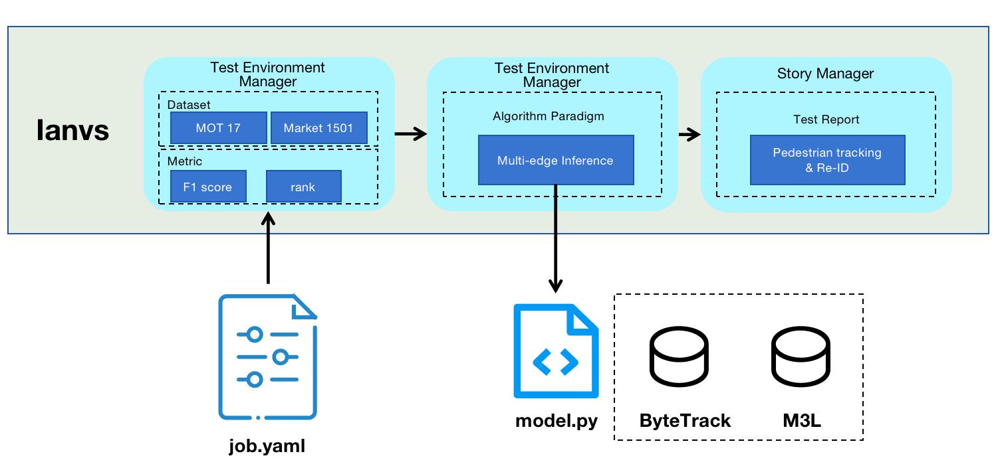
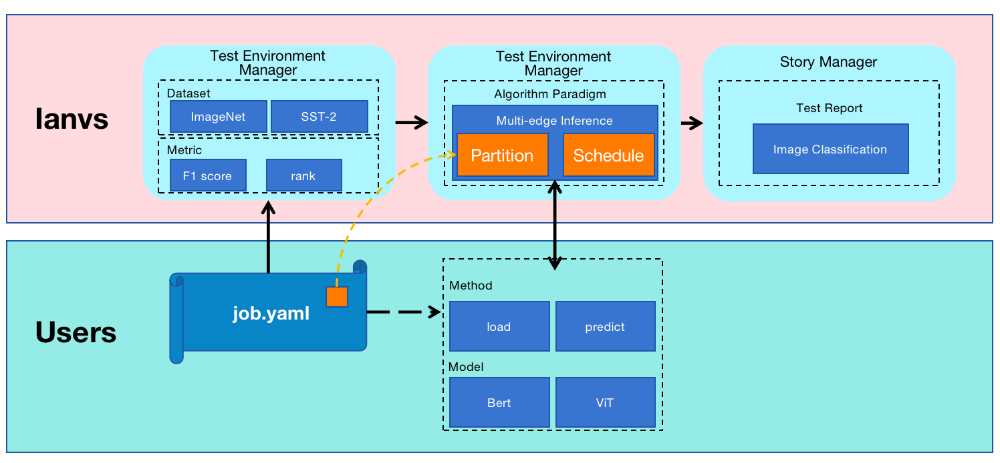
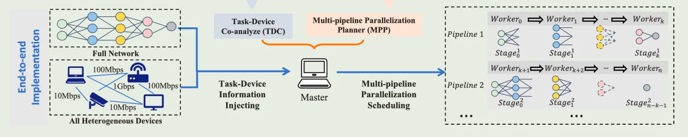

# Backgroud
In high-mobility scenarios such as highways and high-speed railways, the connection between personal terminal devices and cloud servers is significantly weakened. However, in recent years, artificial intelligence technology has permeated every aspect of our lives, and we also need to use artificial intelligence technologies with high computational and storage demands and sensitive to latency in high-mobility scenarios. For example, even when driving through a tunnel with a weak network environment, we may still need to use AI capabilities such as image classification and large model dialogue. Therefore, in the event that edge devices lose connection with the cloud, offloading AI computing tasks to adjacent edge devices and achieving computational aggregation based on the mutual collaboration between devices, to complete computing tasks that traditionally require cloud-edge collaboration, has become an issue worth addressing. This project aims to use multiple heterogeneous computing units on the edge (such as personal mobile phones, tablets, bracelets, laptops, and other computing devices) for collaborative artificial intelligence neural network inference, enabling AI tasks to be completed with lower latency using devices that are closer to the edge, thereby enhancing the user experience.

To simulate the workflow of multi-edge inference in the real world, Ianvs, as a distributed collaborative AI benchmarking platform, currently supports this AI paradigm and provides a simple simulation benchmark testing. However, facing various heterogeneous computing units, Ianvs does not have the capability for automatic partitioning and scheduling of the computation graph, but instead requires users to manually partition the computation graph and decide on its allocation to suitable computing nodes, which greatly limits the computational resource utilization and flexibility of multi-edge inference, especially in high-mobility scenarios, where this limitation can further deteriorate the user experience.

Therefore, targeting high-mobility scenarios and heterogeneous computing devices, this proposal offers an automatic partitioning and scheduling framework for neural network computation graphs, thereby enhancing the collaborative and adaptive capabilities of multi-end inference.
# Goals

1. Complete the partitioning module, supporting arbitrary automatic partitioning of neural networks in any ONNX format;
2. Complete the scheduling module, taking into account the different computational capabilities of heterogeneous computing units, adaptively achieve load balancing.
3. Based on the two aforementioned modules, Providing a multi-edge inference benchmarking job in a high-mobility scenario (such as edge-side LLM inference and image recognition, etc.) to directly invoke the model automatic partitioning and scheduling function of Ianvs in the configuration file, and form a demonstration example.
# Proposal
_Heterogeneous Multi-Edge Collaborative Neural Network Inference for High Mobility Scenarios_ based on the multi-edge inference paradigm supported by Ianvs, two sub-modules for automatic computation graph partitioning and scheduling are added on top, to adapt to the problem of heterogeneous computing capabilities of multiple edge devices in high mobility scenarios, avoiding the need for developers to manually partition the neural network computation graph, making the multi-edge inference workflow more efficient and productive.

The scope of the system includes: 

1. Encapsulating the capabilities of automatic computation graph partitioning and scheduling into sub-modules, and providing them as extended options in the job configuration file for users to customize (users can also choose the existing manual partitioning capabilities), seamlessly integrating with the existing multi-edge inference workflow; 
2. Providing a multi-edge inference benchmarking job in a high-mobility scenario (such as edge-side LLM inference and image recognition, etc.) to verify the effectiveness and benefits of the automatic partitioning and scheduling modules.

Targeting users include: 

1. Beginners: Familiarize with distributed synergy AI and multi-edge inference, among other concepts. 
2. Developers: Quickly integrate multi-edge inference algorithms into other development environments such as Sedna and test the performance for further optimization.
# Design Details
## Process Design 
Firstly, taking the existing tracking_job and reid_job as examples, analyze the workflow of the two benchmarking jobs, clarify the function call logic of Ianvs, determine the writing position of configuration information and the insertion position of the automatic partitioning and scheduling module, to ensure high cohesion and low coupling of the overall code. The workflow starts from the main() function in the benchmarking.py file (located in the ianvs/core directory), which reads the user's configuration file reid_job.yaml and creates a BenchmarkingJob. This process parses the configuration parameters of the yaml file and creates instances of classes such as TestEnv, Rank, Simulation, and TestCaseController that match the configuration description. 

Subsequently, the run() method of the BenchmarkingJob instance is called, using the build_testcases() method of the TestCaseController instance to create test cases. This step is actually parsing the algorithm configuration specified by _test_object.url_ in the reid_job.yaml file and creating instances of Algorithm and TestCase that match the algorithm configuration description. Then, the run_testcases() method of the TestCaseController instance is called, which ultimately calls the run() method of the corresponding algorithm paradigm, such as the run() method of the MultiedgeInference class instance in this case. 

In this method, a job instance is created through self.build_paradigm_job(ParadigmType.MULTIEDGE_INFERENCE.value), which is actually the instance of the BaseModel class that the user has written themselves and has been registered in the module_instances during the configuration parsing process. Therefore, all subsequent load() and predict() methods are actually calling the methods defined in the user's own BaseModel class. For example, the user-defined load method implements simulation of data parallelism in a multi-device scenario:

```python
# examples/MOT17/multiedge_inference_bench/pedestrian_tracking/testalgorithms/reid/m3l/basemodel.py

def load(self, model_url=None):
    if model_url:
        arch = re.compile("_([a-zA-Z]+).pth").search(model_url).group(1)
        # Create model
        self.model = models.create(
            arch, num_features=0, dropout=0, norm=True, BNNeck=True
        )
        # use CUDA
        self.model.cuda()
        self.model = nn.DataParallel(self.model)
        if Path(model_url).is_file():
            checkpoint = torch.load(model_url, map_location=torch.device('cpu'))
            print("=> Loaded checkpoint '{}'".format(model_url))
            self.model.load_state_dict(checkpoint["state_dict"])
        else:
            raise ValueError("=> No checkpoint found at '{}'".format(model_url))
    else:
        raise Exception(f"model url is None")
```

The overall process is illustrated in the following diagram:


Based on the above process analysis, we find that the existing multi-edge inference benchmarking job only uses Ianvs to create and manage test cases, where the core algorithmic processes such as multi-device parallelism and model partitioning are left to the user to implement. It is also worth mentioning that the nn.DataParallel(self.model) used in this case only achieves data parallelism, and for scenarios with low computing power on the edge and large models, relying solely on data parallelism is obviously insufficient to support edge inference needs. Therefore, this project needs to implement model parallel capabilities based on model partitioning and encapsulate these capabilities (partitioning and scheduling) into independent sub-modules, separated from the user's code, as an optional feature in the multiedge_inference paradigm supported by Ianvs, allowing users to choose whether to use automatic partitioning or manual partitioning in the configuration information (job.yaml).

## Module Design and Code Integration 
From the above process analysis, it is known that to provide automatic graph partitioning and scheduling capabilities within the Ianvs framework, the optimal code integration point is in the Algorithm Paradigm module of the Test Case Controller component, specifically in the directory core/testcasecontroller/algorithm/paradigm. The current structure of this directory is:

```
paradigm
├── __init__.py
├── base.py
├── incremental_learning
│   ├── __init__.py
│   └── incremental_learning.py
├── lifelong_learning
│   ├── __init__.py
│   └── lifelong_learning.py
├── multiedge_inference
│   ├── __init__.py
│   └── multiedge_inference.py
└── singletask_learning
    ├── __init__.py
    ├── singletask_learning.py
    ├── singletask_learning_active_boost.py
    └── singletask_learning_tta.py
```

Based on the process analysis, this project intends to add a utility file named utils.py under the multiedge_inference paradigm, and implement automatic graph partitioning and scheduling capabilities within it, which specifically includes:

- Partitioning: A function that automatically partitions any ONNX-formatted computational graph.
- Scheduling: A function that plans the partitioning method of the neural network computational graph based on the computing capabilities of multiple devices, providing a basis for the partitioning module.

Subsequently, modify the logic in multiedge_inference.py to decide whether to call the scheduling and partitioning modules in utils.py based on the "whether to choose automatic partitioning" information declared by the user in the configuration file. If it is chosen to call, pass the above two functions as parameters to the user's code when job.load(trained_model, partition_func, schedule_func).
Further, provide the load method of the BaseModel class in the  benchmarking job to receive these two function parameters and use them to complete the automatic partitioning and scheduling of the computational graph.

The modified code structure is as follows:


```
paradigm
├── __init__.py
├── base.py
├── incremental_learning
│   ├── __init__.py
│   └── incremental_learning.py
├── lifelong_learning
│   ├── __init__.py
│   └── lifelong_learning.py
├── multiedge_inference
│   ├── __init__.py
│   ├── multiedge_inference.py
│   └── utils.py
└── singletask_learning
    ├── __init__.py
    ├── singletask_learning.py
    ├── singletask_learning_active_boost.py
    └── singletask_learning_tta.py
```

At the same time, the corresponding multi-edge inference benchmarking job for high-mobility scenarios will be provided in the _examples_ folder.

In conjunction with the process design, the newly added automatic partitioning and scheduling module will be inserted into the position indicated in the diagram below, thereby forming a new complete flowchart:

## Method Desgin

We implement the heterogeneous neural network multi-edge collaborative inference for high-mobility scenarios using the method shown in the above figure. First, we model the devices and model computational tasks through Task-Device Co-analyze (TDC). Specifically, the computational capabilities of the devices and the computational complexity of the neural network subgraphs are modeled. The modeling methods include, but are not limited to, feature embedding of neural networks and computing devices, and outputting the match degree between computational subgraphs and devices based on a backbone such as MLP or Transformer. Subsequently, based on the matching relationship, the model is partitioned and a multi-pipeline parallelization strategy is planned using the Multi-pipeline Parallelization Planner (MPP) to achieve the best collaborative effect between devices. Of course, in Ianvs, we only implement the partitioning and scheduling of the model, that is, a simple single-pipeline strategy, while more complex and efficient pipeline parallelization strategies are left for users to customize themselves.
## Roadmap
**July**

- Complete the arbitrary partitioning function of the ONNX computational graph.
- Implement the modeling of device computational capabilities and model computational complexity.

**August**

- Implement the automatic graph scheduling and partitioning algorithm based on device-model joint analysis.

**September**

- Implement the multiedge inference benchmarking job based on the automatic scheduling and partitioning of the neural network computational graph and complete the demonstration example.
