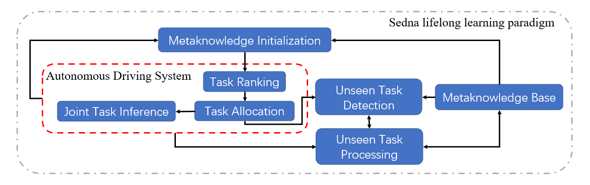

# Multi-task Joint Inference for Ianvs

## Motivation
Nowadays,  the inference of lifelong learning is somehow a single task approach, which will first vote for the task suited for the sample, and then the model trained for this task will be used for inference. This approach works well when the model for the task is easy to train. However, for the perception of mobile agents, more complex models are usually used. Besides,  as shown in figure 1, an empirical study concluded that no single model maintains the best accuracy even for one second. So the joint inference will be better.


​														Fig 1. Heatmap of normalized mAP on a clip of 1 second


We have noticed that autonomous driving is one of the important applications of edge AI. We consider the image object detection task on moving vehicles as the typical online model inference scenario. Recently, how to cooperate with resources on the edge and cloud to provide support for autonomous driving applications has become an important topic.  

### Goals

The goals of the multi-task joint inference for Ianvs are:

- Adding an example named multi-task joint inference in Ianvs 
  - choose tasks to realize joint inference according to various scenarios dynamically
    - the characteristics of vehicle movement, the scenarios faced by autonomous vehicles are complicated
  - fuse the output of multi tasks
- Verifying the effectiveness of the joint inference in Object Detection

## Proposal
### Scope

- Providing a new example for Ianvs

## Design Details
### Implementation

Task, A triplet: Task Allocation +  Task samples + Task model 

The architecture is shown in the below figure. The red box shows the work we are going to do. 



​																						Fig 2. Architecture


- **Metaknowledge Initialization:** generates metaknowledge given the metadata base and training samples using meta learning


- **Unseen Task Detection:** detects if the targeted task is covered in metaknowledge base
- **Unseen Task Processing:**  updates the metaknowledge in the metaknowledge base 
- **Task Ranking:**  ranks tasks according to the similarity

  - During the process of inference, we will use a model which trained based metaknowledge to rank the tasks


- **Task Allocation:** assigns tasks for the sample 

  - After get the ranks of the tasks, we will first select some tasks to meet the time delay
  - Then, according to the output of the model, wo use a threshold to determine the numbers of the tasks


- **Joint Task Inference**:  aggregates the inference results of multiple allocated tasks


  - In the Object Detection task, we first add all the bounding boxes together. The we use non maximum suppression(NMS) to get the final output. The figure 3 shows the process.

    

    ​                                                 Fig 3. Joint inference in Object Detection

### Customize algorithm

We want to realize it in Ianvs first. We need to submit the code in examples. The path of Ianvs of our example is as follows：

``` 
ianvs
│  ...    
└─examples
│   └─bdd
│       └─multi-task inference
│           └─testalgorithms
│           └─testenv
│                 │testenv.yaml      #dataset、model_env、metrics
│           │benchmarkingjob.yaml
│  ... 
```
To add a new example in Ianvs, we need to prepare the test environments, provide the algorithms and give test reports or leaderboards. To prepare the test environments, we need to modify the testenv.yaml. The code of the algorithms is in  the folder: testalgorithms. The flow chart of the algorithms is in figure 4. 


​                                                                        Fig 4. algorithm in Ianvs


## Roadmap

July

- Install and deploy Sedna.

August 

0804---0810：Install and deploy Sedna

0811---0817：Finish the base code

0818--0824：Code multi task inference

0825--0831：Verifying the effectiveness of the joint inference module

0901--0907：Project publish