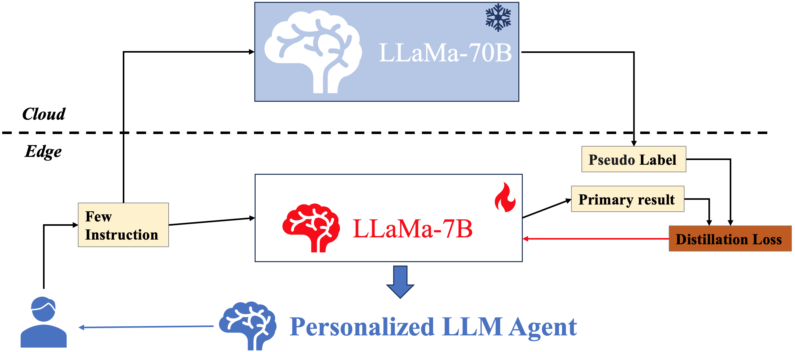
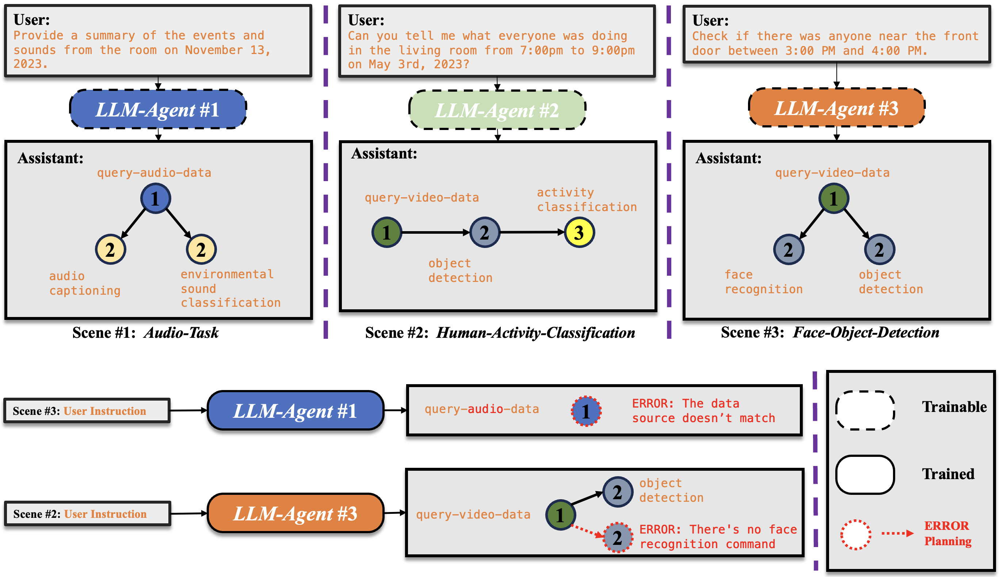
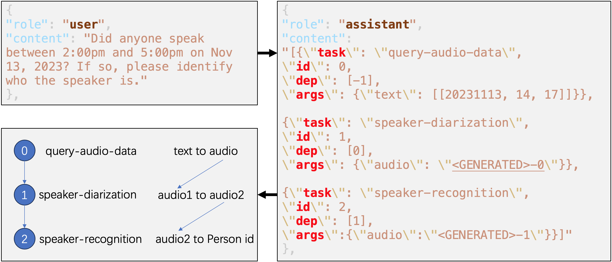

# Personalized LLM Agent based on KubeEdge-Ianvs Cloud-Edge Collaboration

# 1 Motivation

## 1.1 Background

### 1.1.1 LLM is Not Equivalent to AGI

Large Language Models (LLMs) possess excellent reasoning and thinking abilities due to extensive training data and various training methods. However, current LLMs are not truly Artificial General Intelligence (AGI). The following are three obstacles that prevent LLMs from achieving AGI:

1. **Lack of support for multimodal input**. AGI requires models to solve complex real-world multimodal tasks like humans and possess lifelong learning capabilities. LLMs only support single-modal text input and do not support the integration of multimodal inputs such as video or voice.

2. **Inability to decompose and plan complex tasks**. In the real world, humans decompose complex problems into multiple sub-tasks and possess task-planning abilities when solving them. LLMs do not have this capability.

3. **Inferior to expert models in specific domains**. Although LLMs demonstrate powerful zero-shot or few-shot learning capabilities, they are weaker compared to expert models fine-tuned for specific domains.

This project aims to address the above issues by developing a multi-expert intelligent agent system based on LLM Agents, where the LLM serves as the system's controller (analogous to the human brain). By connecting, managing, and invoking expert models, the system completes complex tasks. Specifically, the LLM's text understanding ability is used to decompose user instructions, distribute different instructions to task-specific expert models, and link the inputs and outputs of various experts to collaboratively complete complex tasks. The system employs the LLM as a controller to receive text and multimodal inputs, understand user requirements through text, and plan sub-tasks. By leveraging the strengths of expert models, the system completes a complex task step by step, addressing the obstacles preventing LLMs from achieving AGI.

### 1.1.2 Edge Requirements for Personalized LLM Agent

This project aims to provide personalized LLM Agent services for edge users, facing three challenges: privacy, timeliness, and efficiency.

1. **Privacy**: Uploading users' personal data to the cloud poses security risks of data breaches.
2. **Timeliness**: Edge computing allows edge users to receive faster feedback.
3. **Efficiency**: Edge computing power is limited, making the deployment of LLM models costly.

This project aims to achieve a personalized LLM Agent by utilizing a cloud-edge collaborative framework, combining answers from cloud-based large models with those generated based on privacy data at the edge. We plan to develop a personalized LLM Agent based on the KubeEdge-lanvs cloud-edge collaborative platform for lifelong learning (maintaining user-specific data in the knowledge base, with lifelong learning supporting different models on different edges). This system integrates the generalization capabilities of large cloud-based LLMs with personalized user data on edge devices to generate high-quality, personalized responses.

## 1.2 Goals

1. Research evaluation benchmarks for LLM and LLM Agents.

2. Develop a personalized LLM Agent based on lifelong learning using the KubeEdge-lanvs cloud-edge collaborative platform."

# 2. Proposal

## 2.1 LLM Agent

In an LLM-powered autonomous agent system, LLM functions as the agent’s brain, complemented by several key components:

- Planning
  - Subgoal and decomposition: The agent breaks down large tasks into smaller, manageable subgoals, enabling efficient handling of complex tasks.
  - Reflection and refinement: The agent can do self-criticism and self-reflection on past actions, learn from mistakes, and refine them for future steps, thereby improving the quality of final results.
- Memory
  - Short-term memory: I would consider all the in-context learning as utilizing short-term memory of the model to learn.
  - Long-term memory: This provides the agent with the capability to retain and recall (infinite) information over extended periods, often by leveraging an external vector store and fast retrieval.
- Tool use
  - The agent learns to call external APIs for extra information that is missing from the model weights (often hard to change after pre-training), including current information, code execution capability, access to proprietary information sources, and more.

## 2.2 Cloud-Edge Collaboration

Large-scale LLM agent models possess powerful generalization capabilities, enabling them to output personalized task plans based on different user instructions. However, edge devices have limited computing resources and cannot support the operation of large-scale LLM agent models. If a small-scale LLM agent can learn from the habits of different users and perform comparably to large-scale LLM agents, this issue can be resolved. Since user data is streamed and large amounts of training data cannot be immediately obtained, continuous learning of the small-scale edge LLM agent is necessary.

Therefore, this project proposes a **Personalized LLM Agent based on KubeEdge-Ianvs Cloud-Edge Collaborative Lifelong Learning**. The goal is to enable small-scale edge LLM agents to gradually achieve capabilities comparable to large-scale models by leveraging the guidance of large-scale cloud LLM agent models. Specifically, edge users provide a small number of instructions to both the cloud and edge LLM agent models. The output of the cloud LLM agent model serves as pseudo-labels for the edge LLM agent, which is gradually trained through knowledge distillation. This process transforms the edge model into a **Personalized LLM Agent**.

# 3 Design Detail

## 3.1 Demo

This project presents three scenarios, which are audio task, human posture classification task and face and object recognition task.

What happens if you put a trained Agent model in a mismatched scenario? Here are two examples:
1. Set ***Agent #1*** to ***Scene #3***: Data source does not match;
2. Place ***Agent #3*** in ***Scene #2***: A task planning error occurred.

## 3.2 DataSet

### 3.2.1 Q2A Task-plan Dataset

"Q2A (Query to Answer) Task-plan Dataset is a custom dataset created for this project. This dataset includes multiple user instructions and the task planning results generated by the LLM. We can use several data points as prompts, leveraging the few-shot capability of the pretrained LLM to fine-tune it, enabling it to perform task planning and become an LLM Agent."

## 3.3 Ianvs Implement

This project implements automated task definition and task orchestration through the LLM Agent on Ianvs and evaluates it using the self-built Q2A dataset. Specifically, in the Test Environment Manager, we integrate the Q2A and DAHLIA datasets, as well as three evaluation metrics: task decomposition, tool invocation, and parameter prediction, to establish a benchmark for LLM Agent evaluation. In the Test Case Controller, we perform automated task definition and task orchestration, providing user instructions to the LLM Agent and outputting task plan results. In the Story Manager, we set up the output of test reports.

## 3.4 Metrics
### 3.4.1 Task Decomposition
#### Rouge-N
The ROUGE-N metric is a method used to evaluate the quality of automatic summarization or machine translation, focusing on recall, which is the degree of overlap between the system-generated text and the reference text. The "N" in ROUGE-N represents the length of the longest common subsequence considered. Here is the calculation formula for ROUGE-N:
$$ ROUGE\_N=\frac{\displaystyle\sum^{}_{S\in\{ReferenceSummaries\}}\sum^{}_{grams_n\in S}Count_{match} (gram_n) }{\displaystyle\sum^{}_{S\in\{ReferenceSummaries\}}\sum^{}_{grams_n\in S}Count (gram_n)} $$

####  Bertscore
[Bert_score](https://github.com/Tiiiger/bert_score?tab=readme-ov-file#readme) leverages the pre-trained contextual embeddings from BERT and matches words in candidate and reference sentences by cosine similarity. It has been shown to correlate with human judgment on sentence-level and system-level evaluation. Moreover, BERTScore computes precision, recall, and F1 measures, which can be useful for evaluating different language generation tasks.

$$ R_{\mathrm{BERT}}=\frac{1}{|x|} \sum_{x_{i} \in x} \max _{\hat{x}_{j} \in \hat{x}} \mathbf{x}_{i}^{\top} \hat{\mathbf{x}}_{j}$$ 
$$P_{\mathrm{BERT}}=\frac{1}{|\hat{x}|} \sum_{\hat{x}_{j} \in \hat{x}} \max _{x_{i} \in x} \mathbf{x}_{i}^{\top} \hat{\mathbf{x}}_{j}$$ 
$$F_{\mathrm{BERT}}=2 \frac{P_{\mathrm{BERT}} \cdot R_{\mathrm{BERT}}}{P_{\mathrm{BERT}}+R_{\mathrm{BERT}}} $$

# 4 Roadmap

## July

- Research benchmarks for evaluating LLM Agent; 
- Commit Proposal for Kubeedge/Ianvs

## August

- Implement LLM Agent Benchmark based on Kubeedge/Ianvs;

## September

- Implement the Personalized LLM Agent framework on Kubedege/Ianvs
- Commit the codes for Kubeedge/Ianvs

