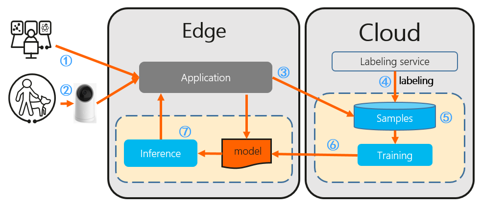

# Single task learning: FPN

Pre-trained model: [Huawei OBS](https://kubeedge.obs.cn-north-1.myhuaweicloud.com:443/ianvs/pcb-aoi/model.zip)

Single task learning is a traditional learning pooling all data together to train a single model. It typically includes a specialist model laser-focused on a single task and requires large amounts of task-specific labeled data, which is not always available on early stage of a distributed synergy AI project. 

As shown in the following figure, the single task learning works as procedures below: 
1. Developer implements and deploys the application based on single task learning. 
2. The application runs and launches single task learning. 
3. The application uploads samples to the cloud.
4. Labeling service labels the uploaded samples. 
5. Training learns the samples to generate a new model. 
6. The system updates the model on the edge. 
7. The model conducts inference given test samples where the inference result is send to the application which ends the process.




As for the base model of single task learning, in this report we are using FPN_TensorFlow. It is a tensorflow re-implementation of Feature Pyramid Networks for Object Detection, which is based on Faster-RCNN. More detailedly, feature pyramids are a basic component in recognition systems for detecting objects at different scales. But recent deep learning object detectors have avoided pyramid representations, in part because they are compute and memory intensive. Researchers have exploited the inherent multi-scale, pyramidal hierarchy of deep convolutional networks to construct feature pyramids with marginal extra cost. A top-down architecture with lateral connections is developed for building high-level semantic feature maps at all scales. The architecture, called a Feature Pyramid Network (FPN), shows significant improvement as a generic feature extractor in several applications. Using FPN in a basic Faster R-CNN system, the method achieves state-of-the-art single-model results on the COCO detection benchmark without bells and whistles, surpassing all existing single-task entries including those from the COCO 2016 challenge winners. In addition, FPN can run at 5 FPS on a GPU and thus is a practical and accurate solution to multi-scale object detection. 

The ``FPN_TensorFlow`` is also open sourced and completed by YangXue and YangJirui. For those interested in details of ``FPN_TensorFlow``, an example implementation is available [here](https://github.com/DetectionTeamUCAS/FPN_Tensorflow) and is extended with the Ianvs algorithm inferface [here](https://github.com/kubeedge-sedna/FPN_Tensorflow).


## Implementation

Here we also show how to implement a single task learning algorithm for testing in ianvs, based on an opensource algorithm [FPN].  

When testing your own algorithm, of course, FPN is not necessary. It can be replaced with any algorithm complying the requirement of ianvs interface.

Ianvs testing algorithm development, at present, are using Sedna Lib. The following is recommended development workflow:
1. Algorithm Development: put the algorithm implementation to ianvs [examples directory] locally, for testing.
2. Algorithm Submission: submit the algorithm implementation to [Sedna repository], for sharing, then everyone can test and use your algorithm.

## Customize algorithm

Sedna provides a class called `class_factory.py` in `common` package, in which only a few lines of changes are required to become a module of sedna.

Two classes are defined in `class_factory.py`, namely `ClassType` and `ClassFactory`.

`ClassFactory` can register the modules you want to reuse through decorators. For example, in the following code example, you have customized an **single task learning algorithm**, you only need to add a line of `ClassFactory.register(ClassType.GENERAL)` to complete the registration.

The following code is just to show the overall structure of a basicIL-fpn BaseModel, not the complete version. The complete code can be found [here](https://github.com/JimmyYang20/ianvs/tree/main/examples/pcb-aoi/incremental_learning_bench/testalgorithms/fpn).

```python

@ClassFactory.register(ClassType.GENERAL, alias="FPN")
class BaseModel:

    def __init__(self, **kwargs):
        """
        initialize logging configuration
        """

        self.has_fast_rcnn_predict = False

        self._init_tf_graph()

        self.temp_dir = tempfile.mkdtemp()
        if not os.path.isdir(self.temp_dir):
            mkdir(self.temp_dir)

        os.environ["MODEL_NAME"] = "model.zip"
        cfgs.LR = kwargs.get("learning_rate", 0.0001)
        cfgs.MOMENTUM = kwargs.get("momentum", 0.9)
        cfgs.MAX_ITERATION = kwargs.get("max_iteration", 5)

    def train(self, train_data, valid_data=None, **kwargs):

        if train_data is None or train_data.x is None or train_data.y is None:
            raise Exception("Train data is None.")

        with tf.Graph().as_default():

            img_name_batch, train_data, gtboxes_and_label_batch, num_objects_batch, data_num = \
                next_batch_for_tasks(
                    (train_data.x, train_data.y),
                    dataset_name=cfgs.DATASET_NAME,
                    batch_size=cfgs.BATCH_SIZE,
                    shortside_len=cfgs.SHORT_SIDE_LEN,
                    is_training=True,
                    save_name="train"
                )

            # ... ...
            # several lines are omitted here. 

        return self.checkpoint_path

    def save(self, model_path):
        if not model_path:
            raise Exception("model path is None.")

        model_dir, model_name = os.path.split(self.checkpoint_path)
        models = [model for model in os.listdir(model_dir) if model_name in model]

        if os.path.splitext(model_path)[-1] != ".zip":
            model_path = os.path.join(model_path, "model.zip")

        if not os.path.isdir(os.path.dirname(model_path)):
            os.makedirs(os.path.dirname(model_path))

        with zipfile.ZipFile(model_path, "w") as f:
            for model_file in models:
                model_file_path = os.path.join(model_dir, model_file)
                f.write(model_file_path, model_file, compress_type=zipfile.ZIP_DEFLATED)

        return model_path

    def predict(self, data, input_shape=None, **kwargs):
        if data is None:
            raise Exception("Predict data is None")

        inference_output_dir = os.getenv("RESULT_SAVED_URL")

        with self.tf_graph.as_default():
            if not self.has_fast_rcnn_predict:
                self._fast_rcnn_predict()
                self.has_fast_rcnn_predict = True

            restorer = self._get_restorer()

            config = tf.ConfigProto()
            init_op = tf.group(
                tf.global_variables_initializer(),
                tf.local_variables_initializer()
            )

            with tf.Session(config=config) as sess:
                sess.run(init_op)

        # ... ...
        # several lines are omitted here. 

        return predict_dict

    def load(self, model_url=None):
        if model_url:
            model_dir = os.path.split(model_url)[0]
            with zipfile.ZipFile(model_url, "r") as f:
                f.extractall(path=model_dir)
                ckpt_name = os.path.basename(f.namelist()[0])
                index = ckpt_name.find("ckpt")
                ckpt_name = ckpt_name[:index + 4]
            self.checkpoint_path = os.path.join(model_dir, ckpt_name)

        else:
            raise Exception(f"model url is None")

        return self.checkpoint_path

    def evaluate(self, data, model_path, **kwargs):
        if data is None or data.x is None or data.y is None:
            raise Exception("Prediction data is None")

        self.load(model_path)
        predict_dict = self.predict(data.x)
        metric_name, metric_func = kwargs.get("metric")
        if callable(metric_func):
            return {"f1_score": metric_func(data.y, predict_dict)}
        else:
            raise Exception(f"not found model metric func(name={metric_name}) in model eval phase")
```

After registration, you only need to change the name of the STL and parameters in the yaml file, and then the corresponding class will be automatically called according to the name.


[FPN]: https://github.com/DetectionTeamUCAS/FPN_Tensorflow
[examples directory]: ../../../../examples
[Sedna repository]: https://github.com/kubeedge/sedna