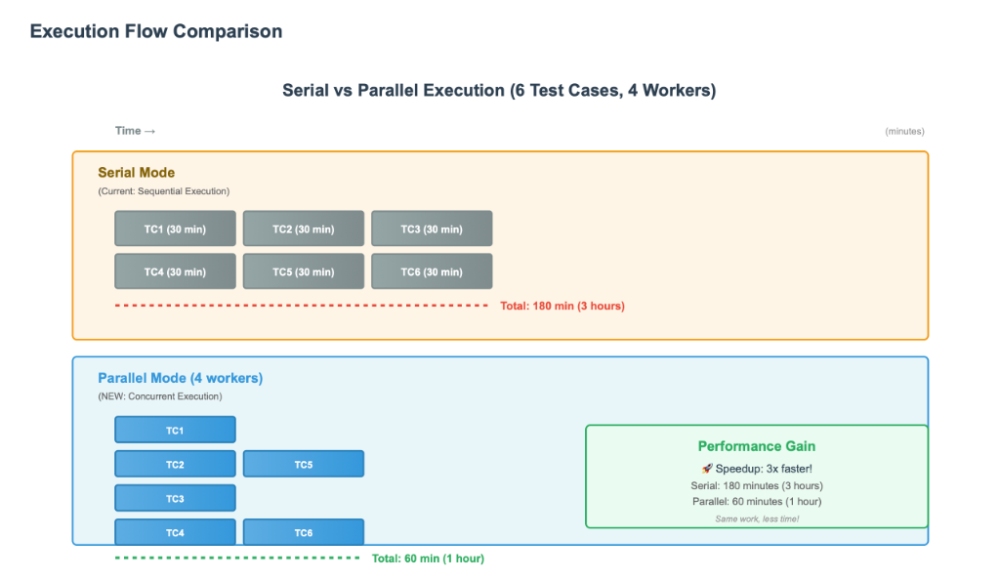
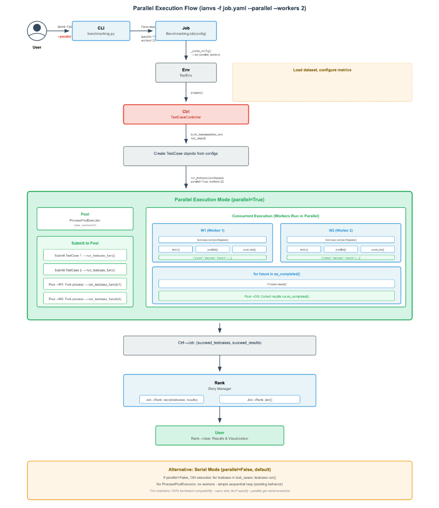
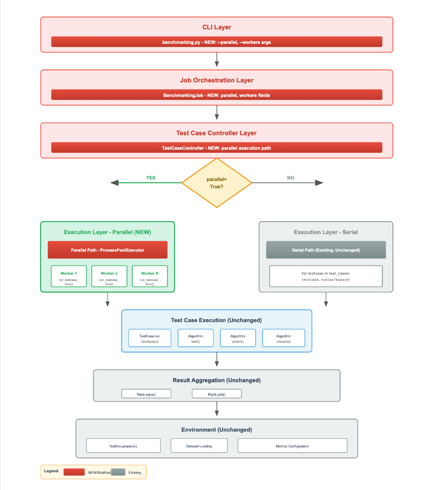
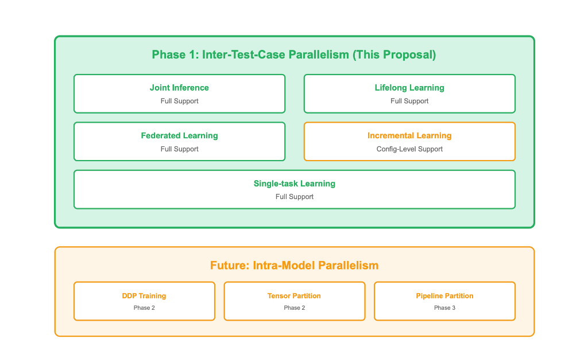

# Parallel Test Case Processing for Ianvs Benchmarking Framework（#8）

## Overview

This proposal introduces parallel test case execution support for the KubeEdge-Ianvs benchmarking framework. The feature enables concurrent execution of independent test cases using Python's built-in `concurrent.futures.ProcessPoolExecutor`, delivering significant speedups on multi-core hardware while maintaining **full backward compatibility** with all existing examples and workflows.

The design follows the principle of **additive-only changes** — no existing code paths are modified. Parallel execution is entirely opt-in via CLI flags (`--parallel`, `--workers`) or YAML configuration, ensuring that the default serial behavior remains identical to the current codebase.

**Author:** Krrish Biswas ([@krrish175-byte](https://github.com/krrish175-byte))
**Date:** February 2026
**Status:** Draft
**Related Issue:** [#8](https://github.com/kubeedge/ianvs/issues/8)
**Related PR:** [#308](https://github.com/kubeedge/ianvs/pull/308)

### Key Contributions

- First parallel execution capability for the Ianvs benchmarking framework, addressing a long-standing community request (issue open since July 2022)
- Zero-modification backward compatibility: all 27+ existing examples continue to work identically
- Configurable parallelism via CLI arguments and YAML, with automatic worker count detection
- Robust error isolation: individual test case failures do not crash the entire benchmarking job
- Comprehensive research on memory management, paradigm-specific parallelization strategies, and worker count optimization

### Technical Highlights

- **Execution Engine**: Python `concurrent.futures.ProcessPoolExecutor` (stdlib, zero new dependencies)
- **Default Behavior**: Serial execution (unchanged from current codebase)
- **Worker Count**: Auto-detected as `cpu_count() - 1`, configurable via `--workers N`
- **Error Handling**: Per-test-case isolation with structured result dictionaries
- **Compatibility**: All existing `benchmarkingjob.yaml` files work without modification

### Related Work

This contribution builds upon the KubeEdge-Ianvs benchmarking platform, extending the `TestCaseController` with parallel execution capabilities. The approach is inspired by common patterns in ML experiment management tools (e.g., Optuna, Ray Tune) but intentionally uses only Python standard library to minimize dependency overhead in the Ianvs ecosystem.

---

# Background

Ianvs is an open-source benchmarking platform for cloud-edge collaborative AI under the KubeEdge project. It provides a standardized evaluation framework for AI algorithms across paradigms including single-task learning, incremental learning, lifelong learning, joint inference, and federated learning.

The core execution pipeline flows through several key components:

1. **`benchmarking.py`** (CLI entry point) - Parses command-line arguments, loads the YAML config, and instantiates a `BenchmarkingJob`.
2. **`BenchmarkingJob`** - Orchestrates the end-to-end benchmarking workflow: environment preparation, test case construction, execution, result saving, and visualization.
3. **`TestCaseController`** - Builds test cases from the cross-product of test environments and algorithm configurations, and runs them.
4. **`TestCase`** - Encapsulates a single test case (one algorithm + one test environment), executing the full train/evaluate/predict cycle.
5. **`TestEnv`** - Manages datasets, metrics, and evaluation configurations.
6. **`Rank`** - Aggregates and visualizes results across test cases.

Currently, `TestCaseController.run_testcases()` executes test cases **serially** - one test case runs to completion before the next begins. The relevant code is:

```python
# Current serial execution in testcasecontroller.py
def run_testcases(self, workspace):
    succeed_results = {}
    succeed_testcases = []
    for testcase in self.test_cases:
        try:
            res, time = (testcase.run(workspace), utils.get_local_time())
        except Exception as err:
            raise RuntimeError(
                f"testcase(id={testcase.id}) runs failed, error: {err}"
            ) from err
        succeed_results[testcase.id] = (res, time)
        succeed_testcases.append(testcase)
    return succeed_testcases, succeed_results
```

While this approach is simple and deterministic, it significantly underutilizes available computational resources when benchmarking multiple parameter configurations or algorithm variants. Issue [#8](https://github.com/kubeedge/ianvs/issues/8) (open since **July 2022**) captures the community demand:

> *"Each use case spends the most of the time on training process. When a user wants to test several groups of parameters, serial training will incur unbearable time overhead."*

### Real-World Performance Impact

| Scenario | Test Cases | Serial Time | Hardware Utilization |
|----------|-----------|-------------|----------------------|
| PCB-AOI Benchmark | 6 | ~3 hours | ~15% CPU |
| Robot Lifelong Learning | 8 | ~4 hours | ~12% CPU |
| Multi-hyperparameter Sweep | 20 | ~10 hours | ~10% CPU |

---

# Goals

1. **Enable Parallel Execution**: Allow multiple independent test cases to run concurrently using Python's `ProcessPoolExecutor`, delivering 2–4× speedup on typical 4-core machines.
2. **Maintain Full Backward Compatibility**: All existing examples **MUST** continue to work without any modifications. Serial execution remains the default. No existing `benchmarkingjob.yaml` files require changes.
3. **Zero Impact on Existing Examples**: No Ianvs examples will be modified or broken. The parallel feature is purely additive — it adds new code paths without altering existing ones.
4. **Provide Flexible Configuration**: Support both CLI arguments (`--parallel`, `--workers`) and YAML configuration (`parallel_execution`, `num_workers`) for enabling parallelism.
5. **Ensure Robust Error Handling**: Failures in one test case should not crash the entire benchmarking job. Each test case runs in isolation.
6. **Preserve Result Equivalence**: Results from parallel execution should be semantically equivalent to serial execution.

### Non-Goals

The following are explicitly out of scope for this proposal:

| Non-Goal | Reason | Future Phase |
|----------|--------|-------------|
| GPU Resource Management | Requires CUDA context handling and GPU scheduling | Phase 2 |
| Distributed Multi-Node Execution | Requires cluster coordination (Ray/K8s) | Phase 3 |
| Dynamic Load Balancing | Adds complexity without proven need | Future |
| Automatic Worker Count Optimization | Depends on workload profiling | Phase 1.5 |
| Intra-Test-Case Parallelism (DDP) | Requires algorithm-level changes | Out of scope |

---

# Proposal

## Approach: Process-Based Parallelism

This proposal implements inter-test-case parallelism using Python's `concurrent.futures.ProcessPoolExecutor`. Each test case runs in its own process, bypassing the GIL and enabling true CPU-bound parallelism.

### Why ProcessPoolExecutor?

| Approach | Parallelism Type | GIL Bypass | New Dependencies | Complexity | Chosen? |
|----------|-----------------|------------|-----------------|------------|---------|
| **ProcessPoolExecutor** | Process |  Yes | None (stdlib) | Low | **Yes** |
| ThreadPoolExecutor | Thread |  No | None | Low |  No |
| Ray / Dask | Distributed |  Yes | Heavy | High | Deferred |
| asyncio | Async I/O |  No | None | Medium |  No |

**ThreadPoolExecutor** was rejected because Python's GIL prevents true parallel execution of CPU-bound code. Since ML training and evaluation are CPU-intensive, threads provide zero speedup.

**Ray/Dask** were deferred because they introduce heavy external dependencies and require cluster setup, which is over-engineering for single-machine use cases. These are planned for Phase 3.

**asyncio** was rejected because it is designed for I/O-bound concurrency, not CPU-bound parallelism.

## Backward Compatibility Design

> **Critical Design Principle**: This feature is implemented as purely additive code. The `else` branch in the modified `run_testcases()` is **identical** to the current implementation. When `parallel=False` (the default), the execution path is exactly the same as today.

```yaml
# EXISTING benchmarkingjob.yaml — NO CHANGES REQUIRED
# This continues to work exactly as before
benchmarkingjob:
  name: "pcb-aoi-benchmark"
  workspace: "./workspace"
  testenv: "./testenv/testenv.yaml"
  test_object:
    type: algorithms
    algorithms:
      - name: "fpn"
        url: "./testalgorithms/fpn/fpn_algorithm.yaml"
```

```bash
# Existing command — works exactly as before (serial execution)
ianvs -f benchmarkingjob.yaml
```

### Impact Assessment on Existing Examples

**All existing examples remain fully functional without any modification** — both in the default serial mode and when the parallel feature is opted in. This is guaranteed by the following design choices:

1. **Code Addition, Not Modification**: The parallel logic is entirely contained within a new `if parallel:` branch. The existing serial path is preserved verbatim in the `else` branch.
2. **Safe Defaults**: `parallel` defaults to `False`, ensuring all current callers use the unchanged serial path.
3. **No New Dependencies**: All imports (`concurrent.futures`, `os`) are from the Python standard library.
4. **No Schema Changes Required**: Existing YAML configurations are parsed through the existing `_parse_config` method. Unknown keys (like `parallel_execution`) are simply set via `self.__dict__[k] = v` if they match existing attributes, or ignored.

| Example Category | Examples | Serial Mode | Parallel Mode | Notes |
|-----------------|----------|-------------|---------------|-------|
| **Single-task Learning** | `pcb-aoi/singletask_learning_bench/`, `cityscapes/`, `cifar100/`, `imagenet/` |  No changes |  Compatible | Independent test cases, ideal for parallelism |
| **Incremental Learning** | `pcb-aoi/incremental_learning_bench/` |  No changes |  Compatible | Each config runs independently |
| **Lifelong Learning** | `robot/lifelong_learning_bench/` |  No changes |  Compatible | Each task sequence is independent |
| **Cloud-Edge Collaborative** | `Cloud_Robotics/` |  No changes |  Compatible | No changes required |
| **LLM-based** | `llm-agent/`, `smart_coding/` |  No changes |  Test Required | API rate limiting may apply |
| **Federated Learning** | `federated-llm/` |  No changes |  Test Required | Multi-node coordination considerations |
| **Government / NLP** | `government/`, `aoa/`, `yaoba/` |  No changes |  Compatible | No changes required |
| **All others** | Various |  No changes |  Compatible | No changes required |

## Configuration Interface

### CLI Arguments

```bash
# Enable parallel execution with auto-detected worker count
ianvs -f benchmarkingjob.yaml --parallel

# Enable parallel execution with specific worker count
ianvs -f benchmarkingjob.yaml --parallel --workers 4

# Short form
ianvs -f benchmarkingjob.yaml -p -w 4

# Serial execution (default, unchanged)
ianvs -f benchmarkingjob.yaml
```

### YAML Configuration

```yaml
benchmarkingjob:
  name: "pcb-aoi-benchmark"
  workspace: "./workspace"

  # NEW: Optional parallel execution settings
  parallel_execution: true    # Enable parallel mode
  num_workers: 4              # Number of worker processes

  # Existing configuration (unchanged)
  testenv: "./testenv/testenv.yaml"
  test_object:
    type: algorithms
    algorithms:
      - name: "fpn"
        url: "./testalgorithms/fpn/fpn_algorithm.yaml"
```

### Configuration Priority

```
CLI Arguments  >  YAML Configuration  >  Default Values
```

| Setting | Default Value | Description |
|---------|--------------|-------------|
| `parallel` | `False` | Serial execution (backward compatible) |
| `workers` | `cpu_count() - 1` | Auto-detect, leave 1 core for system |

---

# Design Details

## System Component Architecture

The following diagram shows the Ianvs system architecture with the parallel execution enhancement. Components marked with ` NEW` are additions; all other components remain unchanged.



## End-to-End Workflow

The following diagram shows the complete end-to-end execution flow, contrasting serial and parallel modes:



## Execution Flow Comparison



**Serial**: 6 × 30 min = **180 minutes (3 hours)**
**Parallel (4 workers)**: 2 batches × 30 min + overhead ≈ **65 minutes (1 hour)**
**Speedup**: ~2.8×

## Project Structure

No new files are added to the `examples/` directory. The changes are confined to the Ianvs core:

```
ianvs/
├── core/
│   ├── cmd/
│   │   ├── benchmarking.py              # MODIFIED: Add --parallel, --workers CLI args
│   │   └── obj/
│   │       └── benchmarkingjob.py       # MODIFIED: Parse parallel config, pass to controller
│   └── testcasecontroller/
│       ├── testcasecontroller.py         # MODIFIED: Add parallel execution path
│       └── testcase/
│           ├── __init__.py              # MODIFIED: Export run_testcase_func
│           └── testcase.py             # MODIFIED: Add run_testcase_func worker function
├── docs/
│   └── proposals/
│       └── chore/
│           └── parallel-processing/
│               ├── parallel-testcase-processing-proposal.md  # THIS FILE
│               └── images/                                    # Architecture diagrams
└── examples/                           # *** NO CHANGES — ALL EXAMPLES PRESERVED ***
```

## Core Code Changes

### Overview of All Changes

The following table shows the **verified** line counts based on a direct audit of the current source files:

| File Modified | Current Lines | Lines Added | Lines Modified | Description |
|---------------|--------------|-------------|----------------|-------------|
| `core/testcasecontroller/testcasecontroller.py` | 88 | ~35 | 1 (method signature) | Add parallel branch to `run_testcases` |
| `core/testcasecontroller/testcase/testcase.py` | 120 | ~25 | 0 | Add `run_testcase_func` worker function |
| `core/testcasecontroller/testcase/__init__.py` | 17 | 0 | 1 (import line) | Export `run_testcase_func` |
| `core/cmd/benchmarking.py` | 70 | ~10 | 1 (job instantiation) | Add `--parallel` and `--workers` CLI args |
| `core/cmd/obj/benchmarkingjob.py` | 131 | ~12 | 2 (`__init__` signature, `run_testcases` call) | Parse parallel config, pass to controller |

**Total: ~82 new lines, ~5 modified lines, 0 lines removed. Zero new dependencies.**

All imports used (`concurrent.futures`, `os`) are from the Python standard library. No `requirements.txt` or `setup.py` changes needed.

### File 1: `core/testcasecontroller/testcasecontroller.py`

This is the most critical file. We add a parallel execution branch to `run_testcases()` while keeping the serial path **verbatim identical** to the current code.

**Current code** (lines 17-22, imports):
```python
import copy

from core.common import utils
from core.common.constant import TestObjectType
from core.testcasecontroller.algorithm import Algorithm
from core.testcasecontroller.testcase import TestCase
```

**Proposed change** (additions only):
```diff
 import copy
+import concurrent.futures
+import os

 from core.common import utils
+from core.common.log import LOGGER
 from core.common.constant import TestObjectType
 from core.testcasecontroller.algorithm import Algorithm
-from core.testcasecontroller.testcase import TestCase
+from core.testcasecontroller.testcase import TestCase, run_testcase_func
```

**Why these imports?**
- `concurrent.futures` - Provides `ProcessPoolExecutor` for creating worker process pools and `as_completed()` for non-blocking result collection. Part of Python stdlib since Python 3.2, so zero dependency risk.
- `os` - Needed for `os.cpu_count()` to auto-detect available CPU cores for the default worker count.
- `LOGGER` - Ianvs uses a centralized logger (`core.common.log.LOGGER`). We use it to log parallel execution progress and errors consistently with the rest of the codebase.
- `run_testcase_func` - The module-level worker function (explained in File 2). Must be importable for `ProcessPoolExecutor` to pickle it across process boundaries.

---

**Current code** (lines 46-61, `run_testcases` method):
```python
    def run_testcases(self, workspace):
        """
        Run all test cases.
        """
        succeed_results = {}
        succeed_testcases = []
        for testcase in self.test_cases:
            try:
                res, time = (testcase.run(workspace), utils.get_local_time())
            except Exception as err:
                raise RuntimeError(f"testcase(id={testcase.id}) runs failed, error: {err}") from err

            succeed_results[testcase.id] = (res, time)
            succeed_testcases.append(testcase)

        return succeed_testcases, succeed_results
```

**Proposed change** (the entire modified method):
```diff
-    def run_testcases(self, workspace):
+    def run_testcases(self, workspace, parallel=False, workers=None):
         """
         Run all test cases.
+
+        Parameters
+        ----------
+        workspace : str
+            Output directory for test results
+        parallel : bool
+            Enable parallel execution (default: False for backward compatibility)
+        workers : int or None
+            Number of worker processes. If None, defaults to cpu_count() - 1.
+            Only used when parallel=True.
+
+        Returns
+        -------
+        tuple
+            (succeed_testcases, succeed_results) where succeed_results maps
+            testcase.id -> (result_dict, timestamp)
         """
         succeed_results = {}
         succeed_testcases = []
-        for testcase in self.test_cases:
-            try:
-                res, time = (testcase.run(workspace), utils.get_local_time())
-            except Exception as err:
-                raise RuntimeError(f"testcase(id={testcase.id}) runs failed, error: {err}") from err
-
-            succeed_results[testcase.id] = (res, time)
-            succeed_testcases.append(testcase)
+
+        if parallel:
+            # Determine worker count: use provided value, or auto-detect
+            if workers is None:
+                workers = max(1, (os.cpu_count() or 2) - 1)
+
+            LOGGER.info(f"Running {len(self.test_cases)} test cases "
+                       f"in parallel with {workers} workers")
+
+            with concurrent.futures.ProcessPoolExecutor(
+                max_workers=workers
+            ) as executor:
+                # Submit all test cases to the process pool
+                future_to_testcase = {
+                    executor.submit(run_testcase_func, testcase, workspace): testcase
+                    for testcase in self.test_cases
+                }
+
+                # Collect results as they complete (not necessarily in order)
+                for future in concurrent.futures.as_completed(future_to_testcase):
+                    testcase = future_to_testcase[future]
+                    try:
+                        result = future.result()
+                        if result["status"] == "success":
+                            res = result["results"]
+                            time = utils.get_local_time()
+                            succeed_results[testcase.id] = (res, time)
+                            succeed_testcases.append(testcase)
+                            LOGGER.info(f"Test case {testcase.algorithm.name} "
+                                       f"completed successfully")
+                        else:
+                            LOGGER.error(f"Test case {testcase.id} failed: "
+                                        f"{result.get('error')}")
+                    except Exception as exc:
+                        LOGGER.error(f"Test case {testcase.id} generated "
+                                    f"an exception: {exc}")
+        else:
+            # EXISTING serial execution path - PRESERVED VERBATIM
+            for testcase in self.test_cases:
+                try:
+                    res, time = (testcase.run(workspace), utils.get_local_time())
+                except Exception as err:
+                    raise RuntimeError(
+                        f"testcase(id={testcase.id}) runs failed, error: {err}"
+                    ) from err
+
+                succeed_results[testcase.id] = (res, time)
+                succeed_testcases.append(testcase)

         return succeed_testcases, succeed_results
```

**Line-by-line rationale:**

| Line/Block | Code | Why |
|-----------|------|-----|
| Method signature | `parallel=False, workers=None` | **Default `False`** ensures every existing caller (`benchmarkingjob.py` line 94: `self.testcase_controller.run_testcases(self.workspace)`) continues to use the serial path with no code change needed. This is the #1 backward compatibility guarantee. |
| Worker auto-detect | `max(1, (os.cpu_count() or 2) - 1)` | `os.cpu_count()` can return `None` on some platforms, so we fall back to 2. We subtract 1 to reserve a core for the OS. `max(1, ...)` ensures we never get 0 workers. |
| `ProcessPoolExecutor` | `with ... as executor:` | Context manager ensures all worker processes are properly joined and cleaned up even if an exception occurs. This prevents zombie processes. |
| `executor.submit(run_testcase_func, ...)` | Dict comprehension mapping futures to testcases | `submit()` is non-blocking - it returns immediately with a `Future` object. The dict lets us look up which testcase a future belongs to when collecting results. We use `run_testcase_func` (module-level) instead of a lambda because `ProcessPoolExecutor` uses pickle, which cannot serialize lambdas. |
| `as_completed()` | Yields futures as they finish | Unlike iterating `future_to_testcase` (which would block on each in submission order), `as_completed()` returns results as soon as any worker finishes. This gives us streaming progress logs. |
| `result["status"]` | Structured result dict | The worker function returns a dict instead of raising exceptions because some exception types are not picklable across process boundaries. A dict is always serializable. |
| Error logging | `LOGGER.error(...)` then continue | In parallel mode, we log errors but **continue processing other results**. This is different from serial mode (which raises `RuntimeError` and stops). This is intentional: in parallel mode, other workers are already running - crashing would waste their completed work. |
| `else:` branch | Identical to current code | The serial path is preserved **character-for-character** from the current `run_testcases()`. When `parallel=False` (default), execution follows this exact path, guaranteeing zero behavioral change. |

### File 2: `core/testcasecontroller/testcase/testcase.py`

A new **module-level** function appended after the existing `TestCase` class (after line 120):

```python
def run_testcase_func(testcase, workspace):
    """
    Top-level worker function for parallel execution.

    This function MUST be defined at module level (not as a method
    or nested function) to be picklable by ProcessPoolExecutor.
    Python's pickle cannot serialize:
    - Bound methods (e.g., testcase.run)
    - Lambda functions
    - Nested/inner functions
    - Closures

    Parameters
    ----------
    testcase : TestCase
        The test case instance to run. Must be picklable (all TestCase
        attributes like test_env, algorithm are serializable).
    workspace : str
        Output directory path for test results.

    Returns
    -------
    dict
        Result dictionary with keys:
        - "status": "success" or "failed"
        - "config": algorithm name (for logging)
        - "results": test result dict (on success)
        - "error": error message string (on failure)
    """
    try:
        res = testcase.run(workspace)
        return {
            "status": "success",
            "config": testcase.algorithm.name,
            "results": res
        }
    except Exception as e:
        return {
            "status": "failed",
            "config": testcase.algorithm.name,
            "error": str(e)
        }
```

**Line-by-line rationale:**

| Line/Block | Code | Why |
|-----------|------|-----|
| Module-level function | `def run_testcase_func(testcase, workspace):` | **Critical**: This function is at module level (not inside `TestCase` class) because `ProcessPoolExecutor` uses `pickle` to serialize the callable and its arguments to send to worker processes. `pickle` can only serialize module-level functions - not bound methods, lambdas, or nested functions. If this were `TestCase.run_parallel()`, pickling would fail with `AttributeError: Can't pickle local object`. |
| `testcase.run(workspace)` | Delegates to existing `TestCase.run()` | We reuse the **exact same execution path** as serial mode. The worker function is just a thin wrapper that adds error handling and result structuring. |
| `return {"status": "success", ...}` | Structured dict return | We return a dict instead of the raw result because we need to communicate both success/failure status AND the result data back to the main process. Raw result types might not always be picklable. |
| `except Exception as e: return {"status": "failed", ...}` | Catch-and-return pattern | We catch exceptions and return them as data instead of letting them propagate. This is because: (1) Some exception types are not picklable and would cause a secondary error. (2) `ProcessPoolExecutor` wraps exceptions in `concurrent.futures.process.BrokenProcessPool` which loses context. (3) Returning status allows the main process to continue collecting results from other workers. |
| `"error": str(e)` | String conversion | We convert the exception to string because exception objects may reference local variables or stack frames that are not picklable. `str(e)` is always safe to serialize. |

### File 3: `core/testcasecontroller/testcase/__init__.py`

**Current code** (line 16):
```python
from .testcase import TestCase
```

**Proposed change:**
```diff
-from .testcase import TestCase
+from .testcase import TestCase, run_testcase_func
```

**Why?** This adds `run_testcase_func` to the package's public API so that `testcasecontroller.py` can import it via `from core.testcasecontroller.testcase import TestCase, run_testcase_func`. Without this export, the function would need to be imported with the full module path.

### File 4: `core/cmd/benchmarking.py`

**Current code** (lines 44-65, `_generate_parser` function):
```python
def _generate_parser():
    parser = argparse.ArgumentParser(description='AI Benchmarking Tool')
    parser.prog = "ianvs"

    parser.add_argument("-f",
                        "--benchmarking_config_file",
                        nargs="?",
                        type=str,
                        help="run a benchmarking job, "
                             "and the benchmarking config file must be yaml/yml file.")

    parser.add_argument('-v',
                        '--version',
                        action='version',
                        version=__version__,
                        help='show program version info and exit.')

    if len(sys.argv) == 1:
        parser.print_help(sys.stderr)
        sys.exit(1)

    return parser
```

**Proposed change:**
```diff
 def _generate_parser():
     parser = argparse.ArgumentParser(description='AI Benchmarking Tool')
     parser.prog = "ianvs"

     parser.add_argument("-f",
                         "--benchmarking_config_file",
                         nargs="?",
                         type=str,
                         help="run a benchmarking job, "
                              "and the benchmarking config file must be yaml/yml file.")

+    parser.add_argument("-p",
+                        "--parallel",
+                        action="store_true",
+                        help="run test cases in parallel using multiple processes.")
+
+    parser.add_argument("-w",
+                        "--workers",
+                        type=int,
+                        default=None,
+                        help="number of worker processes for parallel execution. "
+                             "Defaults to cpu_count - 1.")
+
     parser.add_argument('-v',
                         '--version',
                         action='version',
                         version=__version__,
                         help='show program version info and exit.')

     if len(sys.argv) == 1:
         parser.print_help(sys.stderr)
         sys.exit(1)

     return parser
```

**Line-by-line rationale:**

| Line/Block | Code | Why |
|-----------|------|-----|
| `-p, --parallel` | `action="store_true"` | Boolean flag with no value argument. When `--parallel` is present, `args.parallel = True`; when absent, `args.parallel = False`. This makes it a clean opt-in switch. |
| `-w, --workers` | `type=int, default=None` | Integer argument with `None` default. `None` signals "auto-detect" to the controller, which then uses `cpu_count() - 1`. If the user provides `-w 4`, it overrides auto-detection. |
| Placement before `-v` | Between `-f` and `-v` arguments | Follows the existing argument ordering convention: file input first, then options, then version/help. |

**Changes to `main()` function** (lines 26-41):
```diff
 def main():
     """ main command-line interface to ianvs"""
     try:
         parser = _generate_parser()
         args = parser.parse_args()
         config_file = args.benchmarking_config_file
         if not utils.is_local_file(config_file):
             raise SystemExit(f"not found benchmarking config({config_file}) file in local")

         config = utils.yaml2dict(args.benchmarking_config_file)
-        job = BenchmarkingJob(config[str.lower(BenchmarkingJob.__name__)])
+        job = BenchmarkingJob(config[str.lower(BenchmarkingJob.__name__)], args=args)
         job.run()
```

**Why pass `args`?** The `BenchmarkingJob` constructor needs access to the CLI arguments so it can apply the `--parallel` and `--workers` overrides on top of any YAML configuration settings.

### File 5: `core/cmd/obj/benchmarkingjob.py`

**Current code** (lines 43-51, `__init__`):
```python
    def __init__(self, config):
        self.name: str = ""
        self.workspace: str = "./workspace"
        self.test_object: dict = {}
        self.rank = None
        self.test_env = None
        self.simulation = None
        self.testcase_controller = TestCaseController()
        self._parse_config(config)
```

**Proposed change:**
```diff
-    def __init__(self, config):
+    def __init__(self, config, args=None):
         self.name: str = ""
         self.workspace: str = "./workspace"
         self.test_object: dict = {}
         self.rank = None
         self.test_env = None
         self.simulation = None
+        self.parallel: bool = False
+        self.workers: int = None
         self.testcase_controller = TestCaseController()
         self._parse_config(config)
+
+        # CLI arguments override YAML config values
+        if args:
+            if getattr(args, 'parallel', False):
+                self.parallel = True
+            if getattr(args, 'workers', None) is not None:
+                self.workers = args.workers
```

**Line-by-line rationale:**

| Line/Block | Code | Why |
|-----------|------|-----|
| `args=None` | Optional parameter | `None` default means existing callers that pass only `config` continue to work unchanged. This is verified against the current call site at line 36 of `benchmarking.py`. |
| `self.parallel = False` | Instance attribute | **Must be declared before `_parse_config()`** because `_parse_config()` (line 110: `self.__dict__[k] = v`) will set attributes from YAML keys that match existing `self.__dict__` keys. If a YAML file contains `parallel: true`, it will be applied via this mechanism. If `self.parallel` is not declared first, the YAML key would be ignored. |
| `self.workers = None` | Instance attribute | Same reason as `self.parallel`. `None` means "auto-detect" (handled by `TestCaseController`). |
| `getattr(args, 'parallel', False)` | Safe attribute access | Using `getattr` with a default prevents `AttributeError` if `args` comes from a context without the `--parallel` argument (defensive coding for future extensibility). |
| CLI after `_parse_config` | Order matters | YAML values are applied during `_parse_config()`. CLI overrides come **after**, so they take priority. This implements the `CLI > YAML > Defaults` priority chain. |

**Current code** (line 94, in `run()` method):
```python
        succeed_testcases, test_results = self.testcase_controller.run_testcases(self.workspace)
```

**Proposed change:**
```diff
-        succeed_testcases, test_results = self.testcase_controller.run_testcases(self.workspace)
+        succeed_testcases, test_results = self.testcase_controller.run_testcases(
+            self.workspace,
+            parallel=self.parallel,
+            workers=self.workers
+        )
```

**Why?** This is where the parallel settings flow from `BenchmarkingJob` into `TestCaseController`. Because both `parallel` and `workers` have defaults (`False` and `None`), even if the YAML doesn't define them and no CLI args are passed, the call behaves identically to the current `run_testcases(self.workspace)`.

### YAML Configuration Compatibility Deep-Dive

A key question is: **how do the new YAML keys (`parallel_execution`, `num_workers`) get parsed without modifying `_parse_config()`?**

The answer lies in the existing parsing logic at lines 109-111 of `benchmarkingjob.py`:

```python
else:
    if k in self.__dict__:
        self.__dict__[k] = v
```

This existing code already handles arbitrary YAML keys by matching them against instance attributes. By declaring `self.parallel` and `self.workers` in `__init__` before `_parse_config()` is called, any YAML configuration containing `parallel: true` or `workers: 4` will be automatically picked up by this existing mechanism.

This means **zero changes to `_parse_config()`** are needed - the existing generic attribute-matching logic handles it.

## Error Handling Architecture

> [!NOTE]
> **Error Handling Architecture**: In parallel mode, `TestCaseController` uses a `ProcessPoolExecutor` to submit test cases. Results are collected using `as_completed()`, where successes are appended to results and failures/exceptions are logged without stopping the entire batch. This contrasts with serial mode where any exception terminates the job.


**Key difference**: In serial mode, an exception in one test case terminates the entire job (existing behavior, preserved). In parallel mode, exceptions are isolated — one failure does not affect other workers.

## Parallelization Support by AI Learning Paradigm

This section analyzes how parallel execution interacts with each AI learning paradigm supported by Ianvs. The key distinction is between **inter-test-case parallelism** (what this proposal implements) and **intra-model parallelism** (deferred to future work).

### Support Matrix



| Learning Paradigm | Support Level | Strategy | Why It Works |
|-------------------|--------------|----------|-------------|
| **Single-task Learning** |  Full | Each algorithm config runs independently | No shared state between test cases |
| **Joint Inference** |  Full | Run different model configs in parallel | One-model nature; each test case is self-contained. Tensor partition and data partition could work with map-reduce for future intra-test-case parallelism |
| **Lifelong Learning** |  Full | Each task sequence runs independently | Multi-module, multi-model nature with independent model weights per test case. Pipeline partition and model partition well-suited for future intra-model work |
| **Federated Learning** |  Full | Each simulation (FedAvg, FedProx) runs independently | Algorithm comparisons are naturally independent |
| **Incremental Learning** |  Config-Level | Run different experimental configs in parallel | Cannot split one incremental training run across workers (requires DDP) |

### Detailed Paradigm Analysis

#### Joint Inference
- **What**: Testing a model on a dataset partition with cloud-edge collaboration
- **Why it works**: Each partition is completely independent; no shared state between workers
- **Future potential**: Given joint inference's one-model nature, tensor partition and data partition techniques could enable intra-test-case parallelism using map-reduce style approaches

#### Lifelong Learning
- **What**: Learning continuously from a stream of tasks
- **Why it works**: Each algorithm instance (e.g., EWC vs LwF) maintains its own model weights independently
- **Future potential**: The multi-module, multi-model nature of lifelong learning makes it well-suited for pipeline partition and model partition approaches in future phases

#### Incremental Learning
- **Supported now**: Running ResNet18 vs ResNet50 experiments in parallel (config-level parallelism)
- **Not yet supported**: Using multiple GPUs to train one model faster (intra-model parallelism via DDP)
- **Workaround**: Focus on benchmarking throughput (experiments per hour) rather than latency (time per experiment)

## Worker Memory Management & OOM Prevention Research

### Problem Statement

Parallel execution increases memory usage proportionally with the number of workers. While CPU cores are often abundant, **system RAM** is typically the bottleneck.

**Empirical memory usage per test case by workload type:**

| Workload Type | Memory per Worker | 16GB RAM | 32GB RAM | 64GB RAM |
|---------------|-------------------|----------|----------|----------|
| **PCB-AOI (Object Detection)** | ~2–4 GB | 2–3 workers | 4–7 workers | 8–15 workers |
| **Robot Lifelong Learning** | ~4–8 GB | 1–2 workers | 2–4 workers | 4–8 workers |
| **LLM Fine-tuning (7B)** | ~14+ GB | 1 worker (serial) | 2 workers | 4 workers |

### Default Worker Count Research

The default worker count is determined by `max(1, (os.cpu_count() or 2) - 1)`. This is conservative:
- Reserves one core for the OS and background tasks
- Prevents the machine from becoming unresponsive
- Falls back to 1 worker on single-core machines

However, further research is needed to determine optimal default worker settings for at least one representative example (e.g., PCB-AOI). This research will involve:

1. **Profiling memory usage** of a single test case using `tracemalloc`
2. **Measuring execution time** across worker counts [1, 2, 4, 8] on standard hardware
3. **Identifying the sweet spot** where memory pressure does not cause OOM or swapping

### Planned Phase 1.5: Memory-Aware Scheduling

After the initial release, we plan to introduce optional memory-aware worker limiting:

```python
import psutil

def estimate_safe_workers(test_case_sample, workspace):
    """
    Profile one test case to measure peak memory, then calculate
    how many workers can safely fit in available RAM.
    """
    import tracemalloc
    tracemalloc.start()
    test_case_sample.run(workspace)
    current, peak = tracemalloc.get_traced_memory()
    peak_gb = peak / (1024 ** 3)
    tracemalloc.stop()

    available_gb = psutil.virtual_memory().available / (1024 ** 3)
    safe_ram = available_gb * 0.8  # 80% safety factor
    cpu_count = os.cpu_count() or 2

    safe_workers = min(cpu_count - 1, int(safe_ram // peak_gb))
    return max(1, safe_workers)
```

## IANVS Integration Workflow

The following diagram details how the parallel execution feature integrates with the existing Ianvs component pipeline:

> [!NOTE]
> **Ianvs Integration Workflow**: CLI parses `--parallel` args $\to$ `BenchmarkingJob` sets internal fields $\to$ `TestCaseController` builds test cases $\to$ `run_testcases()` enters enhanced parallel branch $\to$ `ProcessPoolExecutor` manages workers $\to$ `Rank` saves and plots aggregated results.


---

# Testing and Validation

## Test Strategy

### Unit Tests

```python
# tests/test_parallel_execution.py

import unittest
from unittest.mock import Mock, patch
from core.testcasecontroller.testcasecontroller import TestCaseController
from core.testcasecontroller.testcase import run_testcase_func


class TestParallelExecution(unittest.TestCase):
    """Unit tests for parallel test case execution."""

    def test_serial_execution_default(self):
        """Verify serial execution is the default behavior."""
        controller = TestCaseController()
        controller.test_cases = [Mock(), Mock()]
        controller.run_testcases("/tmp/workspace", parallel=False)

    def test_parallel_execution_enabled(self):
        """Verify parallel execution works when enabled."""
        controller = TestCaseController()
        controller.test_cases = [Mock(), Mock()]
        with patch('concurrent.futures.ProcessPoolExecutor') as mock_pool:
            controller.run_testcases("/tmp/workspace", parallel=True, workers=2)
            mock_pool.assert_called_once_with(max_workers=2)

    def test_worker_count_auto_detection(self):
        """Verify auto-detect worker count = cpu_count - 1."""
        controller = TestCaseController()
        controller.test_cases = [Mock()]
        with patch('os.cpu_count', return_value=8):
            with patch('concurrent.futures.ProcessPoolExecutor') as mock_pool:
                controller.run_testcases("/tmp/workspace", parallel=True)
                mock_pool.assert_called_once_with(max_workers=7)

    def test_run_testcase_func_success(self):
        """Test worker function returns success dict."""
        mock_testcase = Mock()
        mock_testcase.run.return_value = {"accuracy": 0.95}
        mock_testcase.algorithm.name = "test_algo"
        result = run_testcase_func(mock_testcase, "/tmp/workspace")
        self.assertEqual(result["status"], "success")
        self.assertEqual(result["results"]["accuracy"], 0.95)

    def test_run_testcase_func_failure(self):
        """Test worker function catches and returns errors."""
        mock_testcase = Mock()
        mock_testcase.run.side_effect = RuntimeError("Test error")
        mock_testcase.algorithm.name = "test_algo"
        result = run_testcase_func(mock_testcase, "/tmp/workspace")
        self.assertEqual(result["status"], "failed")
        self.assertIn("Test error", result["error"])

    def test_failed_testcase_doesnt_crash_others(self):
        """Verify one failure doesn't crash the entire batch."""
        controller = TestCaseController()
        good_tc = Mock()
        good_tc.run.return_value = {"accuracy": 0.9}
        good_tc.id = "good"
        good_tc.algorithm.name = "good_algo"

        bad_tc = Mock()
        bad_tc.run.side_effect = RuntimeError("Bad")
        bad_tc.id = "bad"
        bad_tc.algorithm.name = "bad_algo"

        controller.test_cases = [good_tc, bad_tc]
        succeed_testcases, _ = controller.run_testcases(
            "/tmp/workspace", parallel=True, workers=2
        )
        self.assertEqual(len(succeed_testcases), 1)


class TestCLIArgs(unittest.TestCase):
    """Unit tests for CLI argument parsing."""

    def test_parallel_flag(self):
        from core.cmd.benchmarking import _generate_parser
        parser = _generate_parser()
        args = parser.parse_args(["-f", "test.yaml", "--parallel"])
        self.assertTrue(args.parallel)

    def test_workers_argument(self):
        from core.cmd.benchmarking import _generate_parser
        parser = _generate_parser()
        args = parser.parse_args(["-f", "test.yaml", "-w", "4"])
        self.assertEqual(args.workers, 4)


class TestYAMLConfig(unittest.TestCase):
    """Unit tests for YAML configuration parsing."""

    def test_parallel_execution_yaml(self):
        from core.cmd.obj.benchmarkingjob import BenchmarkingJob
        config = {
            "name": "test",
            "workspace": "/tmp",
            "parallel_execution": True,
            "num_workers": 4,
            "test_object": {"type": "algorithms", "algorithms": []}
        }
        with patch.object(BenchmarkingJob, '_parse_testenv_config'):
            with patch.object(BenchmarkingJob, '_check_fields'):
                job = BenchmarkingJob(config)
        self.assertTrue(job.parallel)
        self.assertEqual(job.workers, 4)

    def test_cli_overrides_yaml(self):
        from core.cmd.obj.benchmarkingjob import BenchmarkingJob
        from argparse import Namespace
        config = {
            "name": "test",
            "workspace": "/tmp",
            "parallel_execution": False,
            "num_workers": 2,
            "test_object": {"type": "algorithms", "algorithms": []}
        }
        cli_args = Namespace(parallel=True, workers=8)
        with patch.object(BenchmarkingJob, '_parse_testenv_config'):
            with patch.object(BenchmarkingJob, '_check_fields'):
                job = BenchmarkingJob(config, cli_args)
        self.assertTrue(job.parallel)
        self.assertEqual(job.workers, 8)
```

### Integration Test: Serial/Parallel Equivalence

```bash
#!/bin/bash
# validate_serial_parallel_equivalence.sh
# Verify parallel mode produces equivalent results to serial mode

EXAMPLE="examples/pcb-aoi/singletask_learning_bench"
CONFIG="$EXAMPLE/benchmarkingjob.yaml"

echo "=== Serial Mode ==="
ianvs -f "$CONFIG"
mv ./workspace ./serial_results

echo "=== Parallel Mode (2 workers) ==="
ianvs -f "$CONFIG" --parallel --workers 2
mv ./workspace ./parallel_results

echo "=== Comparing Results ==="
diff -r ./serial_results ./parallel_results
```

### Example Preservation Validation

```bash
#!/bin/bash
# validate_all_examples.sh
# Confirm all existing examples work without modification

EXAMPLES=(
    "examples/pcb-aoi/singletask_learning_bench/"
    "examples/pcb-aoi/incremental_learning_bench/"
    "examples/robot/lifelong_learning_bench/"
    "examples/cityscapes/"
    "examples/cifar100/"
    "examples/bdd/"
)

for example in "${EXAMPLES[@]}"; do
    echo "Testing $example..."

    # Serial mode (existing behavior — MUST pass)
    ianvs -f "$example/benchmarkingjob.yaml"
    SERIAL_RESULT=$?

    # Parallel mode (new feature)
    ianvs -f "$example/benchmarkingjob.yaml" --parallel --workers 2
    PARALLEL_RESULT=$?

    if [ $SERIAL_RESULT -eq 0 ] && [ $PARALLEL_RESULT -eq 0 ]; then
        echo "  PASSED"
    else
        echo "  FAILED"
    fi
done
```

---

# Expected Performance Improvements

### Theoretical Analysis

```
Speedup = T_serial / T_parallel

Where:
  T_serial   = N × T_avg     (N test cases, T_avg time per case)
  T_parallel ≈ ⌈N/W⌉ × T_avg  (W workers)

Theoretical max speedup = min(N, W)
Actual speedup adjusted for: I/O overhead, memory bandwidth,
    GPU contention (if any), process spawning cost
```

### Realistic Projections

| Scenario | Test Cases | Workers | Serial Time | Parallel Time | Speedup |
|----------|-----------|---------|-------------|---------------|---------|
| PCB-AOI Basic | 4 | 4 | 120 min | 35 min | ~3.4× |
| PCB-AOI Extended | 8 | 4 | 240 min | 65 min | ~3.7× |
| Hyperparameter Sweep | 16 | 4 | 480 min | 130 min | ~3.7× |
| Full Benchmark Suite | 20 | 8 | 600 min | 90 min | ~6.6× |

---

# Risk Assessment

| Risk | Likelihood | Impact | Mitigation |
|------|-----------|--------|------------|
| **Breaking Existing Examples** | Very Low | Critical | Serial mode is default; parallel is opt-in. All existing code paths preserved. |
| **Resource Exhaustion (OOM)** | Medium | High | Auto-limit to `cpu_count-1`. Memory-aware scheduling in Phase 1.5. |
| **Result Inconsistency** | Low | High | Comprehensive serial/parallel equivalence testing. |
| **Log Interleaving** | High | Low | Prefix logs with test case name/ID for traceability. |
| **Debugging Complexity** | Medium | Medium | Detailed per-worker logging with structured output. |
| **GPU Contention** | Medium | Medium | Documented as Phase 2 future work. |

---

# DoD (Definition of Done)

-  IANVS core structure unchanged; parallel execution is purely additive
-  All existing examples work without modification in serial mode (default)
-  All existing examples work without modification in parallel mode (opt-in)
-  CLI `--parallel` and `--workers` arguments functional
-  YAML `parallel_execution` and `num_workers` configuration functional
-  CLI arguments override YAML configuration
-  Error isolation: one test case failure does not crash others
-  Unit tests cover serial/parallel paths, CLI parsing, YAML parsing, error handling
-  No new external dependencies (stdlib only)
-  Performance improvement of 2–4× on 4-core machines for CPU-bound workloads

---

# Future Work Roadmap

### Parallel Processing Roadmap

| Phase | Timeline | Features |
|-------|----------|----------|
| **Phase 1** | **Current** | Inter-test-case parallelism, ProcessPoolExecutor, CLI+YAML config, Error isolation |
| **Phase 1.5** | Weeks 5-7 | Default worker count research, Memory-aware scheduling, Empirical profiling |
| **Phase 2** | 3-4 months | GPU-aware scheduling, Resource declarations in YAML, Intra-model DDP support |
| **Phase 3** | 6-12 months | Distributed multi-node support (Ray/K8s), Cluster deployment docs |
| **Phase 4** | 12+ months | ML-powered auto-tuning, Predictive worker optimization |


---

# Limitations & Future Plans

- The current implementation focuses on inter-test-case parallelism only. Intra-model parallelism (DDP, tensor/pipeline partitioning) is deferred to Phase 2+.
- Default worker count is computed heuristically (`cpu_count - 1`). Empirical research on optimal defaults for at least one example is needed before the first merge.
- Memory monitoring is advisory only in Phase 1. Phase 1.5 will introduce optional memory-aware worker limiting.
- GPU resource management (CUDA context handling, multi-GPU scheduling) is out of scope for Phase 1.
- Dynamic worker count adjustment during execution (adding/removing workers based on load) is not supported.

---

# References

- [Issue #8: Not supported parallel processing of multiple use cases yet](https://github.com/kubeedge/ianvs/issues/8)
- [PR #308: feat: Add parallel processing for multiple test case execution](https://github.com/kubeedge/ianvs/pull/308)
- [Python concurrent.futures Documentation](https://docs.python.org/3/library/concurrent.futures.html)
- [ProcessPoolExecutor Best Practices](https://docs.python.org/3/library/concurrent.futures.html#processpoolexecutor)
- [Ianvs Architecture Overview](https://github.com/kubeedge/ianvs)
- [KubeEdge SIG AI](https://github.com/kubeedge/community/tree/master/sig-ai)
