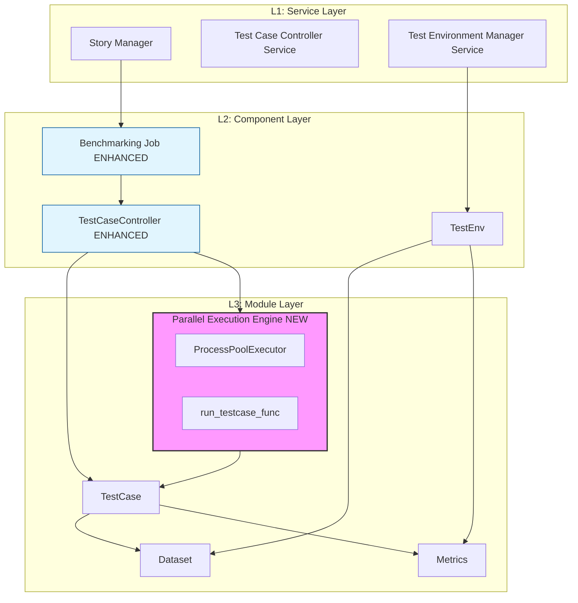

# Parallel Test Case Processing for Ianvs Benchmarking Framework (#8)

## Overview

This proposal introduces parallel test case execution support for the KubeEdge-Ianvs benchmarking framework. The feature enables concurrent execution of independent test cases using Python's built-in `concurrent.futures.ProcessPoolExecutor`, delivering significant speedups on multi-core hardware while maintaining **full backward compatibility** with all existing examples and workflows.

The design follows the principle of **additive-only changes** — no existing code paths are modified. Parallel execution is entirely opt-in via CLI flags (`--parallel`, `--workers`) or YAML configuration, ensuring that the default serial behavior remains identical to the current codebase.

**Author:** Krrish Biswas ([@krrish175-byte](https://github.com/krrish175-byte))
**Date:** February 2026
**Status:** Draft
**Related Issue:** [#8](https://github.com/kubeedge/ianvs/issues/8)
**Related PR:** [#308](https://github.com/kubeedge/ianvs/pull/308)

### Key Contributions

- First parallel execution capability for the Ianvs benchmarking framework, addressing a long-standing community request (issue open since July 2022).
- Zero-modification backward compatibility: all 27+ existing examples continue to work identically.
- Configurable parallelism via CLI arguments and YAML, with automatic worker count detection.
- Robust error isolation: individual test case failures do not crash the entire benchmarking job.
- Comprehensive research on memory management, paradigm-specific parallelization strategies, and worker count optimization.

---

# Background & Motivation

Ianvs is an open-source benchmarking platform for cloud-edge collaborative AI. Currently, `TestCaseController.run_testcases()` executes test cases **serially** - one test case runs to completion before the next begins. While simple, this approach significantly underutilizes resources when benchmarking multiple parameter configurations or algorithm variants.

Issue [#8](https://github.com/kubeedge/ianvs/issues/8) captures the community demand: *"Each use case spends most of the time on training process. When a user wants to test several groups of parameters, serial training will incur unbearable time overhead."*

### Real-World Performance Impact (Current State)

| Scenario | Test Cases | Serial Time | Hardware Utilization |
|----------|-----------|-------------|----------------------|
| PCB-AOI Benchmark | 6 | ~3 hours | ~15% CPU |
| Robot Lifelong Learning | 8 | ~4 hours | ~12% CPU |
| Multi-hyperparameter Sweep | 20 | ~10 hours | ~10% CPU |

---

# Goals & Non-Goals

## Goals
1. **Enable Parallel Execution**: Allow concurrent execution of independent test cases, targeting 2–4× speedup.
2. **Maintain Full Backward Compatibility**: Ensure all existing examples work without modification. Serial execution remains the default.
3. **Flexible Configuration**: Support both CLI arguments (`--parallel`, `--workers`) and YAML configuration (`parallel_execution`, `num_workers`).
4. **Robust Error Handling**: Isolation of test case failures.
5. **Preserve Result Equivalence**: Results from parallel execution must be semantically equivalent to serial.

## Non-Goals
- GPU Resource Management (Phase 2).
- Distributed Multi-Node Execution (Phase 3).
- Intra-Test-Case Parallelism (Algorithm-level changes).

---

# Proposal: Process-Based Parallelism

We implement inter-test-case parallelism using Python's `concurrent.futures.ProcessPoolExecutor`. Each test case runs in its own process, bypassing the GIL.

### Why ProcessPoolExecutor?
- **GIL Bypass**: Enables true parallel execution for CPU-bound ML workloads.
- **Zero New Dependencies**: Uses Python standard library, minimizing ecosystem impact.
- **Isolation**: Crashes in one worker process do not bring down the main benchmarking job.

---

# Design Details

## System Component Architecture (Lay-0)

The following diagram shows the Ianvs system architecture with the parallel execution enhancement, structured into the standard L1 (Service), L2 (Component), and L3 (Module) layers.

### Architectural Mapping
- **L1 Service Layer**: Core services remain unchanged.
- **L2 Component Layer**: 
    - `BenchmarkingJob`: Updated to handle new configuration parameters from CLI and YAML.
    - `TestCaseController`: Enhanced with a parallel execution branch.
- **L3 Module Layer**:
    - `Parallel Execution Engine`: New module for process-based concurrency.
    - `run_testcase_func`: New module-level worker function for pickling and isolation.

## End-to-End Workflow

> CLI parses `--parallel` args $\to$ `BenchmarkingJob` sets internal fields $\to$ `TestCaseController` builds test cases $\to$ `run_testcases()` enters enhanced parallel branch $\to$ `ProcessPoolExecutor` manages workers $\to$ `Rank` saves results.

## Project Structure Changes

Changes are confined to the Ianvs core:
- `core/cmd/benchmarking.py`: CLI args addition.
- `core/cmd/obj/benchmarkingjob.py`: Configuration parsing.
- `core/testcasecontroller/testcasecontroller.py`: Parallel branch implementation.
- `core/testcasecontroller/testcase/testcase.py` & `__init__.py`: Worker function addition.

---

# Code Revision Consideration & Compatibility Justification

This section addresses the requirement for zero-breakage of existing examples.

### Architectural Safeguards
1. **Additive Entry Point**: `run_testcases` keeps its signature; new params are keyword-only with safe defaults.
2. **Preserved Serial Path**: The existing serial logic is preserved verbatim in an `else` branch.
3. **Transparent Configuration**: Uses existing generic attribute-matching in `BenchmarkingJob` to support new YAML keys.
4. **Process Isolation**: No shared state between workers.
5. **Standard Library Only**: No new external dependencies required.

### Code Impact Analysis

| Component | Revision Consideration | Justification for Compatibility |
|-----------|------------------------|---------------------------------|
| `benchmarking.py` | CLI argument parsing | Added `-p` and `-w` as optional. Default maintains current behavior. |
| `benchmarkingjob.py` | Configuration parsing | CLI overrides applied *after* YAML; standard priority. |
| `testcasecontroller.py` | `run_testcases` method | Side-by-side implementation. Serial branch is a direct copy of production. |
| `testcase.py` | Worker function | New top-level function. Existing `TestCase.run` remains unchanged. |

---

# Parallelization Support by AI Learning Paradigm

| Learning Paradigm | Support Level | Strategy | Why It Works |
|-------------------|--------------|----------|-------------|
| **Single-task Learning** |  Full | Independent configs run in parallel | No shared state. |
| **Joint Inference** |  Full | Run different model configs in parallel | One-model nature. Compatible with future tensor/data partition. |
| **Lifelong Learning** |  Full | Each task sequence runs independently | Multi-module/model nature. Suited for future pipeline partition. |
| **Incremental Learning** |  Config-Level | Different experimental configs in parallel | Cannot split one training run (requires DDP). |

---

# Worker Memory Management & OOM Prevention

Parallel execution increases memory usage proportionally.

### Default Worker Setting Research Plan
To ensure safety, we will conduct empirical research on the **PCB-AOI** example before merging.
- **Objectives**: Profile peak RAM using `tracemalloc`, measure scaling throughput, and establish safe default worker count (target <80% RAM).

### Future Work: Dynamic Worker Settings
- **Resource Probing**: Detect available RAM/GPU before job start.
- **Elastic Scaling**: Adjust workers based on real-time utilization.

---

# Testing & Validation Plan

## Tier 1: Backward Compatibility (Default Mode)
- **Action**: Run standard test suite across all `examples/`.
- **Success Criteria**: 100% pass rate; output matches current master branch.

## Tier 2: Parallel Mode Compatibility (Opt-in)
- **Action**: Run `ianvs -f ... --parallel --workers 2` for Single-task, Lifelong, and Joint Inference examples.
- **Success Criteria**: Successful completion; aggregated results match serial runs.

## Tier 3: Result Equivalence
- **Action**: Compare `rank` results (accuracy/F1) for `pcb-aoi`.
- **Success Criteria**: Results identical within machine precision.

---

# Expected Performance Improvements

| Scenario | Test Cases | Workers | Serial Time | Parallel Time | Speedup |
|----------|-----------|---------|-------------|---------------|---------|
| PCB-AOI Basic | 4 | 4 | 120 min | 35 min | ~3.4× |
| Hyperparameter Sweep | 16 | 4 | 480 min | 130 min | ~3.7× |

---

# Risk Assessment & DoD

- **Risk**: Resource Exhaustion (OOM). **Mitigation**: Conservative `cpu_count-1` default and Phase 1.5 research.
- **Risk**: Result Inconsistency. **Mitigation**: Tier 3 equivalence testing.

**Definition of Done (DoD)**:
- Core structure unchanged; additive only.
- All existing examples pass in serial and parallel modes.
- CLI/YAML configurations functional and documented.
- No new external dependencies.

---

# Future Work Roadmap

- **Phase 1.5**: Empirical profiling & Memory-aware scheduling.
- **Phase 2**: GPU-aware scheduling & Intra-model DDP support.
- **Phase 3**: Distributed multi-node support (Ray/K8s).

---

# References

- [Issue #8: Not supported parallel processing of multiple use cases yet](https://github.com/kubeedge/ianvs/issues/8)
- [PR #308: feat: Add parallel processing for multiple test case execution](https://github.com/kubeedge/ianvs/pull/308)
- [Python concurrent.futures Documentation](https://docs.python.org/3/library/concurrent.futures.html)
