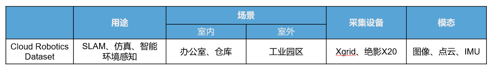
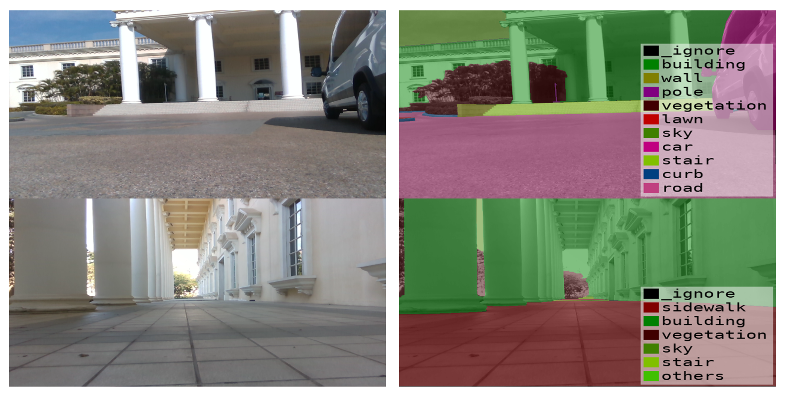
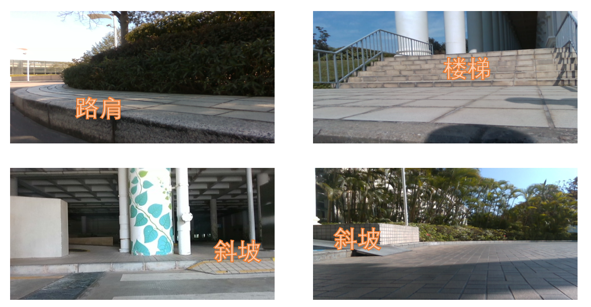
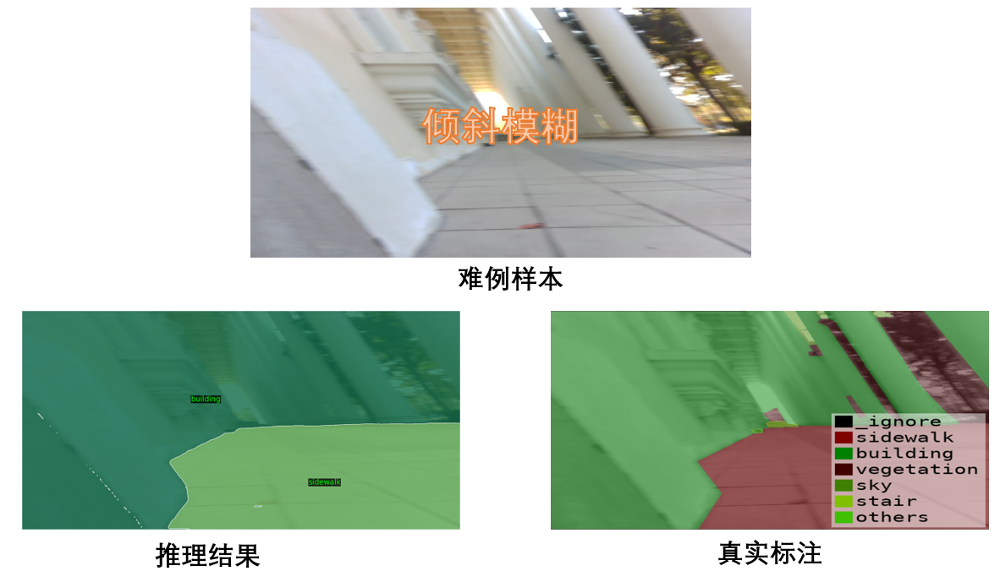
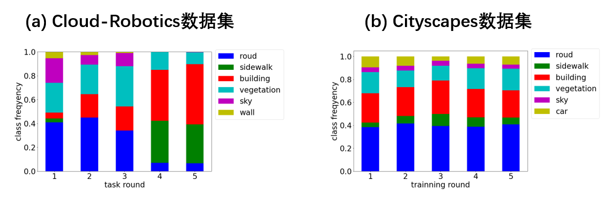
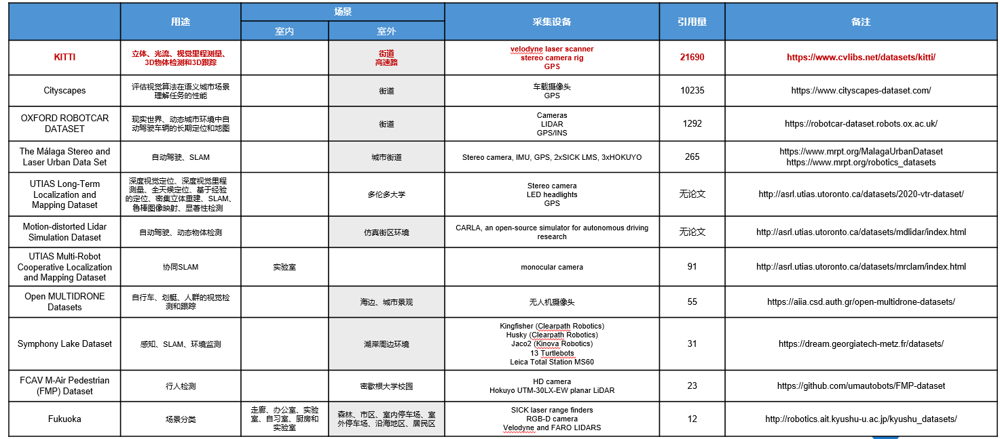
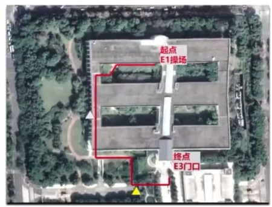
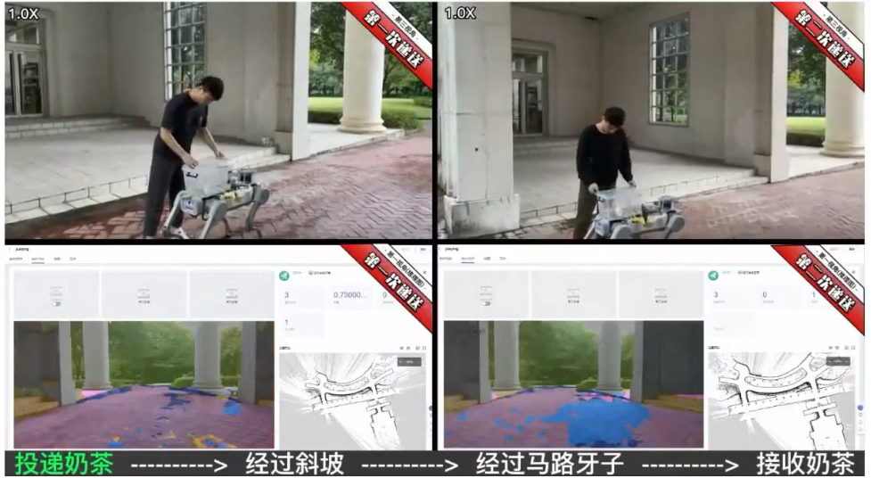
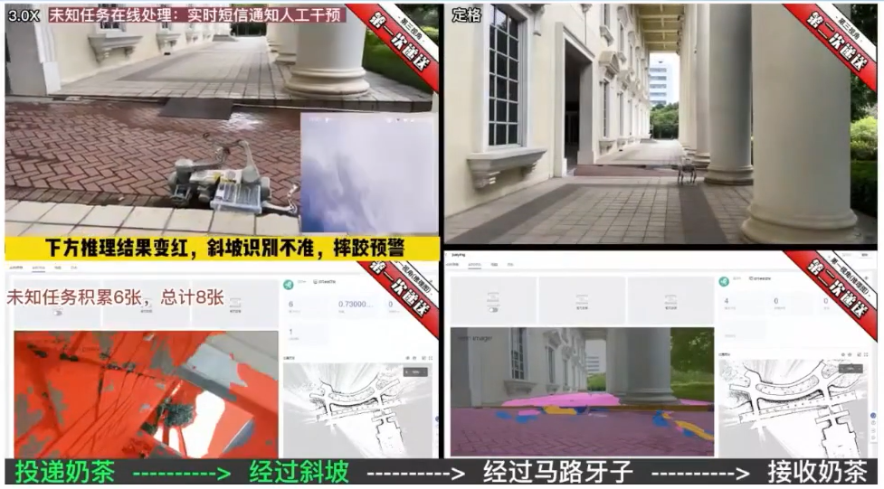
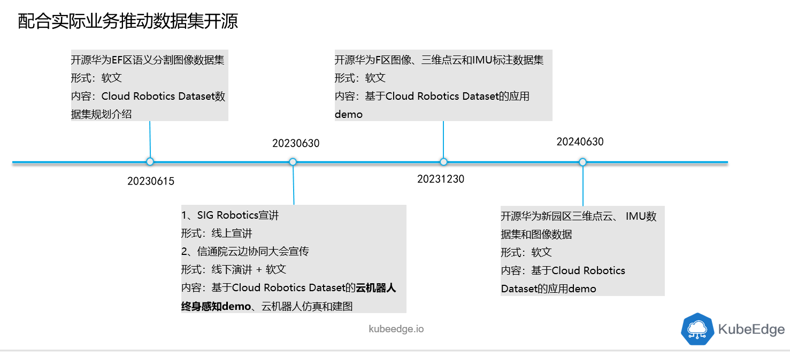

# 新数据集开源！Kubeedge-Ianvs发布Cloud-Robotics云机器人数据集

作者：复旦大学，华为

在边缘计算的浪潮中，AI是边缘云乃至分布式云中最重要的应用。随着边缘设备的广泛使用和性能提升，将人工智能相关的部分任务部署到边缘设备已经成为必然趋势。华为于2022年开源并捐献到CNCF的KubeEdge-Ianvs子项目，作为业界首个分布式协同AI基准测试平台为算法及服务开发者提供全面开发套件支持，以研发、衡量和优化分布式协同AI系统。

在过去几年中机器人技术发展迅速，诸如云深处绝影x20等智能机器人产品的实际应用也越来越广泛。对于机器人应用来说，其模型训练需要大量的数据，同时由于现实环境的复杂多变，模型具备终身学习的能力也越来越重要。然而目前在机器人领域开源的数据集相对较少，机器人领域研发者较难获取比较高质量的数据用于模型训练。

因此，KubeEdge SIG AI 中来自复旦大学计算机学院的成员胡时京和来自华为的毛思通，罗思奇，黄志炜，郑子木，普杰，王烽，决定在KubeEdge-Ianvs上共同发布了云机器人数据集Cloud-Robotics，为机器人学习提供更好的支持。Cloud-Robotics数据集不仅可以为机器人语义分割任务提供高质量的数据支持，还可以为机器人应用测试模型终身学习能力提供更多的可能性。我们相信，这个数据集将会成为机器人学习和应用开发领域的重要工具之一。Ianvs 很荣幸成为首个发布此数据集的站点，工作组也同步将Cloud-Robotics公共数据集托管在 Kaggle和云服务上方便开发者下载。

**KubeEdge-Ianvs项目地址：**

https://github.com/kubeedge/ianvs

**Cloud-Robotics数据集@Ianvs：**

https://github.com/hsj576/ianvs/tree/cloud-robotics/examples/robot/lifelong_learning_bench

**Cloud-Robotics数据集网站：**

https://kubeedge-ianvs.github.io/

**数据集引用：**

```
@online{Cloud-Robotics,
        title={Cloud Robotics},
        author={Hu, Shijing and Mao, Sitong and Luo, Siqi and Huang, Zhiwei and Zheng, Zimu and Pu, Jie and Wang, Feng},
        url={https://kubeedge-ianvs.github.io/}
        year={2023}
    }             
```

## 1. Cloud-Robotics数据集介绍

Cloud-Robotics是在华为深圳工业园区由智能机械狗采集的多模态机器人数据集。



目前数据集已开源了室外图像语义分割数据集部分。语义分割数据集共包含2600张精心标注的语义分割图片，下面展示了数据集中的部分图片。



语义分割任务是将图像中的每个像素分配一个语义标签的任务。它可以被视为像素级别的分类任务，其中每个像素被认为是其周围环境的一部分，并且需要根据其语义类别进行分类。与传统的图像分类任务不同，语义分割需要对图像中的每个像素进行分类，因此需要更加精细和准确的模型和算法。语义分割在计算机视觉中有着广泛的应用，也是机器人领域重要的基础任务之一。

Cloud-Robotics业务场景描述：

- 输入机器人摄像头的拍摄图片，输出图片的每个像素分类

- 提升机器人的环境感知能力

- **构建云机器人递送任务的终身感知应用**

对用户的好处：

- 算法开发者：高精度的多模态数据；基于Kubeedge-Ianvs，提供算法benchmark

- 应用开发者：面向递送、巡检等主流机器人应用，提供丰富真实的室内和室外场景数据

对机器人业务的好处：

- 吸引社区成员在Ianvs打榜和贡献云机器人感知算法

- 吸引社区成员在sedna开发和贡献云机器人感知应用和技能

### 1.1 为什么我们需要Cloud-Robotics数据集

（1）面向云边协同场景机器人应用开源数据集

Cloud-Robotics给封闭环境的机器人应用（递送、巡检）和算法研究提供真实丰富高精度的多模态数据，构建社区影响力，为内部的算法研究吸纳更多外部资源。相比其他语义分割数据集，Cloud-Robotics是首个在真实世界场景中由机械狗实地收集的数据集，因此数据集中的图片都是以机械狗的视角拍摄的，拍摄角度相比Cityscapes等自动驾驶语义分割数据集更低，也更贴近实际应用。同时因为目标应用是机器人，而机器人在行走时碰到不平的路面会容易摔倒。所以相比CItyscapes等自动驾驶数据集，Cloud-Robotics在数据集中会更关注如“路肩”、“楼梯”和“斜坡”等物体的标注，如下图所示。



同时Cloud-Robotics数据集中还提供了一些较难识别但是在真实环境中实际存在的样本，如下图所示：



在机器人应用实际部署在真实环境时，拍摄到的图片中出现反光、倾斜以及模糊等情况是相当普遍的，而这会给只在标准清晰数据集上训练的模型带来极大的挑战。因此，为了进一步提升模型的鲁棒性，在Cloud-Robotics数据集中也加入了部分难例样本，从而更加接近真实环境中部署的机器人应用。

（2）首个终身学习领域语义分割任务真实世界数据集

由于现实世界中普遍存在数据漂移（data drift）等问题，对于模型来说具备终身学习能力变得越来越重要。然而目前终身学习领域相关研究要么是在SplitMNIST这样的toy dataset上进行实验，要么是在Cityscapes这样并不适合终身学习的数据集上进行实验。对于前者，虽然SplitMNIST等数据集中确实人为构造出了数据分布随任务轮数变化这一数据漂移现象，但是由于其来源并非真实数据集，所测试的终身学习算法在现实世界应用时的准确率恐怕要大打折扣。对于后者，Cityscapes是一个很好的语义分割任务的数据集，但是它并不是很适用于检测终身学习算法的性能。以一个5轮任务的终身学习为例，下图分别是对数据集按照时间顺序划分成5轮任务后不同任务类别频率的变化。



可以看出Cloud-Robotics数据集上存在明显的数据漂移现象，而Cityscapes的数据漂移现象则不是很明显。因此，相比SplitMNIST等目前典型的终身学习数据集，Cloud-Robotics数据集是真实世界采集的数据集，其验证终身学习算法的效果更有说服力；相比Cityscapes数据集，Cloud-Robotics数据集中存在真实的数据漂移现象，更适合测试终身学习算法的性能。

### 1.2 Cloud-Robotics数据集数据分布

Cloud-Robotics图像语义分割数据集：

- **Kubeedge-Sedna独家首发**

- **全类别像素级打标**
  - 30个类别，共2600张图像
  - 对比公开数据集Cityscapes，园区场景的语义类别更丰富
  - 对比公开数据集KITTI，更适用于巡检、递送等主流机器人应用和算法研究

- **保证数据质量**

  - 真实园区图像数据

  - 绝影四足机器人摄像头采集原图


Cloud-Robotics数据集中出现的物体包含7大类，共30小类。其类别分布如下：

|    Group     |                           Classes                            |
| :----------: | :----------------------------------------------------------: |
|     flat     |               road · sidewalk · ramp · runway                |
|    human     |                        person · rider                        |
|   vehicle    |       car · truck · bus · train · motorcycle · bicycle       |
| construction |  building · wall · fence · stair · curb · flowerbed · door   |
|    object    | pole · traffic sign · traffic light · CCTV camera · Manhole · hydrant · belt · dustbin |
|    nature    |                     vegetation · terrain                     |
|     sky      |                             sky                              |

Cloud-Robotics数据集主要在华为深圳工业园区的前庭和花园中采集，数据集按照采集的地点分为了front和garden两部分，如下图所示：


数据集中所有的图片都经过了像素级的语义标注，可以直接用于训练语义分割模型。

### 1.3 Cloud-Robotics数据集与其他数据集的比较

机器人领域目前已有了不少开源数据集，如下图所示：



机器人数据集的现状：

- 多数面向开放世界，用于自动驾驶应用研究

- 缺少室内或有限开放的室外数据集

- 现有的室内数据集多数人为构造物体摆放，用于物体检测，不够真实

相信大家肯定会很好奇我们发布的Cloud-Robotics数据集和他们有什么异同。下表中详细比较了Cloud-Robotics和Cityscapes的异同：

|                  | Cloud-Robotics               | Cityscapes                   |
| ---------------- | ---------------------------- | ---------------------------- |
| 处理的任务       | 语义分割任务                 | 语义分割任务                 |
| 采集方式         | 机械狗采集                   | 汽车行车记录仪采集           |
| 图片数量         | 2600张标注图片               | 5000张标注图片               |
| 物体类别         | 30类（更多园区内出现的目标） | 30类（更多公路上出现的目标） |
| 图片采集地点范围 | 深圳工业园区内               | 50个欧洲的城市               |
| 图片采集时间范围 | 一天内                       | 数个月                       |

不难看出，Cityscapes属于大而广的数据集，采集图片来自50个城市，采集时间跨度从春天到秋天。而Cloud-Robotics属于小而精的数据集，采集图片全部来自深圳工业园区，同时采集时间也只有一天。所以虽然Cloud-Robotics相比Cityscapes在图片数量上要更少一些，但是要更加聚焦在单一地点中的语义分割任务。同时Cityscapes数据集中出现的物体类别更偏向公路上会出现的物体，如汽车、行人等等，而Cloud-Robotics数据集中出现的物体类别更偏向园区中会出现的物体，如建筑物、墙等等。两个数据集中主要出现的物体类别频率差异如下图所示：


此外在Cloud-Robotics数据集中还存在井盖、摄像头、门和扶手等Cityscapes数据集中不存在的类别。相比Cityscapes数据集，由机械狗采集的Cloud-Robotics数据集更贴合实际机器人场景的需求。

## 2. 基于Cloud-Robotics的终身学习基准测试案例

基于Cloud-Robotics数据集，我们同步公布基于Ianvs的边云协同终身学习使用案例。该案例模拟了在深圳工业园区进行的机械狗运送奶茶任务。在该任务中，机械狗需要将奶茶由起点E1运送至终点E3，行进路线如下图所示：



在运送奶茶的过程中，机械狗会经过斜坡、路肩等复杂的地形，因此对机械狗上部署的语义分割模型的能力有了较高要求。Cloud-Robotics数据集中的数据就来源于机械狗行进过程中拍摄的图片。下图展示了机械狗两次执行运送奶茶任务的实况：



在第一次运送奶茶时，由于机械狗之前未见过斜坡和路肩等地形，导致其在经过时语义分割模型推理结果不准确，导致机械狗翻车，如下图所示：



而在第二次送奶茶时，机械狗通过终身学习学会识别斜坡、路肩等物体，从而在经过时不再摔跤。


最终，可以明显看出第一次送奶茶的机械狗因为中途遇到未知任务而摔倒只送达了半杯奶茶，而第二次送奶茶的机械狗通过终身学习将一整杯奶茶成功完整送达。


**基准测试案例文档：**

https://github.com/hsj576/ianvs-lifelong-learning-tutorial/blob/main/tutorial/tutorial.md

## 3. RoadMap



## 4. 遗留工作

（1）更丰富的语义分割基模型

目前Cloud-Robotics数据集只在RFNet上进行了测试，未来希望有更多的语义分割模型在Cloud-Robotics数据集上进行测试。

（2）更丰富的终身学习算法

目前在Cloud-Robotics数据集上进行的终身学习测试结果中出现了明显的爆炸性遗忘问题，这也给了终身学习领域带来了新的挑战。目前，终身学习算法在Cloud-Robotics数据集上的性能有着很大的提升空间，未来希望有更多的终身学习算法在Cloud-Robotics数据集上进行测试。
