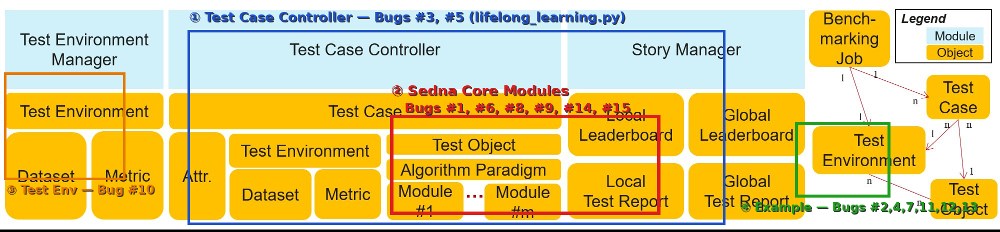
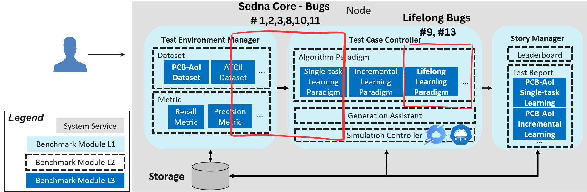

# KubeEdge Ianvs Example Restoration

## Examples Being Restored

1. Cityscapes-Synthia Lifelong Learning — Curb Detection
2. Cityscapes-Synthia Lifelong Learning — Semantic Segmentation
3. LLM-Agent
4. LLM-Edge-Benchmark-Suite

---

## Background

Edge computing emerges as a promising technical framework to overcome the
challenges in cloud computing. In this machine-learning era, AI applications
have become one of the most critical workloads on the edge. Driven by
increasing computation power of edge devices and the growing volume of data
generated at the edge, distributed synergy AI benchmarking has become
essential for evaluating edge AI performance across device, edge, and cloud
intelligence layers.

Ianvs serves as KubeEdge SIG AI's distributed benchmark toolkit. As more
contributors participate, KubeEdge Ianvs now has **25+ examples** and the
number continues to grow. However, Ianvs faces mounting usability issues due
to dependency evolution and the lack of systematic validation mechanisms. As
Python versions, third-party libraries, and Ianvs features advance, several
historical examples have ceased to execute correctly. This has led to surging
user-reported issues from confused contributors, untested PRs breaking core
functionality, and severely outdated documentation misaligning with actual
capabilities.

This proposal focuses on the complete restoration of four examples that
collectively expose bugs spanning the example layer, the Sedna core library,
and the Ianvs paradigm core controller:

- **Cityscapes-Synthia Lifelong Learning — Curb Detection**: 12 confirmed
  bugs across example, Sedna core, and Ianvs paradigm layers blocking
  end-to-end execution.
- **Cityscapes-Synthia Lifelong Learning — Semantic Segmentation**: 15
  confirmed bugs across the same three layers completely preventing the
  evaluation phase from running.
- **LLM-Agent**: Multiple critical issues including missing dependencies,
  incomplete documentation, configuration path mismatches, and dataset schema
  inconsistencies causing 5+ hours of debug time for new users.
- **LLM-Edge-Benchmark-Suite**: Dependency conflicts, hard-coded model
  configurations, and missing multi-algorithm comparison support preventing
  out-of-the-box execution.

Without systematic intervention, these examples risk becoming obsolete for
edge-AI developers and especially newcomers. A comprehensive restoration and
validation framework is needed to ensure reliable benchmarking capabilities
and optimize the contributor experience.

---

## Goals

### Primary Goals (Core Deliverables)

- **Complete end-to-end restoration of Cityscapes-Synthia Lifelong Learning
  — Curb Detection**
  - Fix all 12 confirmed bugs spanning example code, Sedna core
    (`core/lib/sedna/`), and the Ianvs paradigm core controller
    (`core/testcasecontroller/`)
  - Apply defensive coding patterns (null checks, type guards, graceful
    fallbacks) to Sedna core modules to prevent silent failures
  - Validate 100% execution success rate across Python 3.8, 3.9, and 3.10
  - Deliver comprehensive documentation with step-by-step setup, execution
    guide, and troubleshooting playbook

- **Complete end-to-end restoration of Cityscapes-Synthia Lifelong Learning
  — Semantic Segmentation**
  - Fix all 15 confirmed bugs spanning the same three layers
  - Add defensive coding patterns and configuration documentation for unseen
    task processing and task definition modules
  - Validate 100% execution success rate across Python 3.8, 3.9, and 3.10
  - Deliver comprehensive documentation and debugging playbook

- **Complete end-to-end restoration of LLM-Agent**
  - Add missing `requirements.txt` to eliminate trial-and-error dependency
    installation
  - Fix configuration path mismatches and dataset schema inconsistencies
  - Automate model download and add actionable error handling
  - Reduce new user setup time from 5+ hours to under 30 minutes
  - Deliver a fully rewritten README with prerequisites, setup steps, dataset
    schema, and troubleshooting guide

- **Complete end-to-end restoration of LLM-Edge-Benchmark-Suite**
  - Make the base model configurable via hyperparameters to enable
    multi-algorithm comparison
  - Create separate algorithm YAML configurations for each model
  - Update the benchmarking job to register and compare multiple algorithms
  - Deliver updated documentation demonstrating multi-model benchmarking
---

## Proposal

### Core Scope (Primary Focus)

- **Cityscapes-Synthia Curb Detection restoration** targeting the complete
  bug chain across three layers:
  - Example-level fixes in `rfnet/`, `cityscapes.py`,
    `task_allocation_by_origin.py`, and `summaries.py`
  - Sedna core fixes in `core/lib/sedna/algorithms/`,
    `core/lib/sedna/datasources/`, and
    `core/lib/sedna/core/lifelong_learning/`
  - Ianvs paradigm core fixes in
    `core/testcasecontroller/algorithm/paradigm/lifelong_learning/lifelong_learning.py`
  - Complete documentation, debugging guides, and validated test environment
    configurations

- **Cityscapes-Synthia Semantic Segmentation restoration** targeting the
  same three layers with 15 distinct bugs:
  - Example-level fixes in `cityscapes.py`, `accuracy.py`, `metrics.py`,
    and `basemodel.py`
  - Sedna core fixes in `unseen_task_processing.py`,
    `seen_task_learning.py`, `task_definition.py`, and
    `task_remodeling.py`
  - Ianvs core fixes in `lifelong_learning.py` and `dataset.py`

- **LLM-Agent restoration** targeting all example-level issues:
  - Add `requirements.txt` with all dependencies explicitly declared
  - Fix dataset schema inconsistency via dual-key `testenv.yaml`
  - Automate model download via helper script
  - Improve error handling in `basemodel.py` with actionable messages
  - Fully rewrite README with complete setup and troubleshooting guide

- **LLM-Edge-Benchmark-Suite restoration** targeting configuration and
  multi-algorithm support:
  - Refactor `basemodel.py` to accept `model_id` via hyperparameters
  - Create per-model algorithm YAML configurations
  - Update `benchmarkingjob.yaml` to register multiple algorithms
  - Add guard against division by zero in metric logic
  - Update documentation to demonstrate multi-model comparison

**Out of scope:**
- Complete restoration of all 25+ examples (additional examples are
  designated as future work)
- Re-invention of existing Ianvs core architecture
- Re-invention of existing KubeEdge platform or edge-cloud synergy
  frameworks

---

## Design Details

### Architecture and Modules

#### Core Architecture (Primary Focus)

**🔧 Core Ianvs Components (Unchanged):**
- **Test Environment Manager**: Handles test environment configuration
- **Test Case Controller**: Manages test case execution and simulation
- **Story Manager**: Generates leaderboards and test reports

**✅ Restoration Targets:**

**Cityscapes-Synthia (Both Tasks)**

The restoration touches three distinct layers of the stack:

- **Example layer** — `rfnet/`, `cityscapes.py`,
  `task_allocation_by_origin.py`, `accuracy.py`, `metrics.py`,
  `summaries.py`, `basemodel.py`
- **Sedna core layer** — `core/lib/sedna/algorithms/seen_task_learning/`,
  `core/lib/sedna/algorithms/unseen_task_processing/`,
  `core/lib/sedna/datasources/`,
  `core/lib/sedna/core/lifelong_learning/knowledge_management/`
- **Ianvs paradigm core layer** —
  `core/testcasecontroller/algorithm/paradigm/lifelong_learning/lifelong_learning.py`
  and `core/testenvmanager/dataset/dataset.py`

The bugs fixed per layer are summarised below:

| File | Bugs Fixed | Layer |
|------|------------|-------|
| `core/lib/sedna/algorithms/seen_task_learning/seen_task_learning.py` | Curb: 1,2,3,8 — Seg: 6,9 | Sedna Core |
| `core/lib/sedna/algorithms/seen_task_learning/task_remodeling/task_remodeling.py` | Curb: 8 — Seg: 14 | Sedna Core |
| `core/lib/sedna/algorithms/seen_task_learning/task_definition/task_definition.py` | Seg: 8 | Sedna Core |
| `core/lib/sedna/algorithms/unseen_task_processing/unseen_task_processing.py` | Seg: 1,15 | Sedna Core |
| `core/lib/sedna/core/lifelong_learning/knowledge_management/cloud_knowledge_management.py` | Curb: 10 | Sedna Core |
| `core/lib/sedna/datasources/__init__.py` | Curb: 11 | Sedna Core |
| `core/testcasecontroller/algorithm/paradigm/lifelong_learning/lifelong_learning.py` | Curb: 9,13 — Seg: 3,5 | Ianvs Core |
| `core/testenvmanager/dataset/dataset.py` | Seg: 10 | Ianvs Core |
| `examples/cityscapes-synthia/.../task_allocation_by_origin.py` | Curb: 4,12 | Example |
| `examples/cityscapes-synthia/.../cityscapes.py` | Curb: 5 — Seg: 2,4 | Example |
| `examples/cityscapes-synthia/.../summaries.py` | Curb: 7 | Example |
| `examples/cityscapes-synthia/.../accuracy.py` | Seg: 7,11 | Example |
| `examples/cityscapes-synthia/.../metrics.py` | Seg: 12,13 | Example |
| `examples/cityscapes-synthia/.../basemodel.py` | Seg: 7 | Example |





**LLM-Agent**

All changes are example-level, with zero risk of regression to other
benchmarks:

| File | Change | Layer |
|------|--------|-------|
| `requirements.txt` | New file — all dependencies declared | Example |
| `testenv/testenv.yaml` | Dual-key schema fix (`train_data` + `train_url`) | Example |
| `scripts/download_model.sh` | New file — automated model download | Example |
| `testalgorithms/.../basemodel.py` | Actionable error handling and model validation | Example |
| `README.md` | Complete rewrite with prerequisites and troubleshooting | Example |

**LLM-Edge-Benchmark-Suite**

All changes are configuration-driven with no core modifications:

| File | Change | Layer |
|------|--------|-------|
| `testalgorithms/gen/basemodel.py` | Accept `model_id` via hyperparameters | Example |
| `testalgorithms/gen/gen_qwen_05b.yaml` | New algorithm config for Qwen 0.5B | Example |
| `testalgorithms/gen/gen_qwen_15b.yaml` | New algorithm config for Qwen 1.5B | Example |
| `benchmarkingjob.yaml` | Register multiple algorithms for comparison | Example |
| `testenv/acc.py` | Guard against division by zero | Example |
| `README.md` | Updated to demonstrate multi-model benchmarking | Example |

---

### File Structure
```
ianvs/
├── core/
│   ├── testcasecontroller/algorithm/paradigm/lifelong_learning/
│   │   └── lifelong_learning.py         [Curb: 9,13 | Seg: 3,5]
│   ├── testenvmanager/dataset/
│   │   └── dataset.py                   [Seg: 10]
│   └── lib/sedna/
│       ├── algorithms/seen_task_learning/
│       │   ├── seen_task_learning.py    [Curb: 1,2,3,8 | Seg: 6,9]
│       │   ├── task_definition/
│       │   │   └── task_definition.py  [Seg: 8]
│       │   └── task_remodeling/
│       │       └── task_remodeling.py  [Curb: 8 | Seg: 14]
│       ├── algorithms/unseen_task_processing/
│       │   └── unseen_task_processing.py [Seg: 1,15]
│       ├── core/lifelong_learning/knowledge_management/
│       │   └── cloud_knowledge_management.py [Curb: 10]
│       └── datasources/
│           └── __init__.py              [Curb: 11]
├── examples/
│   ├── cityscapes-synthia/lifelong_learning_bench/
│   │   ├── curb-detection/              [Fully Restored]
│   │   │   ├── README_RESTORED.md
│   │   │   ├── DEBUGGING_GUIDE.md
│   │   │   ├── requirements_fixed.txt
│   │   │   └── testalgorithms/rfnet/
│   │   │       ├── task_allocation_by_origin.py  [Curb: 4,12]
│   │   │       ├── RFNet/dataloaders/datasets/
│   │   │       │   └── cityscapes.py             [Curb: 5]
│   │   │       └── RFNet/utils/
│   │   │           └── summaries.py              [Curb: 7]
│   │   └── semantic-segmentation/       [Fully Restored]
│   │       ├── README_RESTORED.md
│   │       ├── DEBUGGING_GUIDE.md
│   │       ├── requirements_fixed.txt
│   │       └── testalgorithms/rfnet/
│   │           ├── basemodel.py                  [Seg: 7]
│   │           ├── RFNet/accuracy.py             [Seg: 7]
│   │           ├── RFNet/dataloaders/datasets/
│   │           │   └── cityscapes.py             [Seg: 2,4]
│   │           └── RFNet/utils/
│   │               └── metrics.py               [Seg: 12,13]
│   ├── LLM-Agent-Benchmark/             [Fully Restored]
│   │   ├── README.md                    [Rewritten]
│   │   ├── requirements.txt             [New]
│   │   ├── scripts/
│   │   │   └── download_model.sh        [New]
│   │   └── singletask_learning_bench/
│   │       ├── testalgorithms/
│   │       │   └── basemodel.py         [Error handling]
│   │       └── testenv/
│   │           └── testenv.yaml         [Dual-key schema fix]
│   └── llm_simple_qa/                   [Fully Restored]
│       ├── README.md                    [Updated]
│       ├── testalgorithms/gen/
│       │   ├── basemodel.py             [Configurable model_id]
│       │   ├── gen_qwen_05b.yaml        [New]
│       │   ├── gen_qwen_15b.yaml        [New]
│       │   └── op_eval.py
│       ├── testenv/
│       │   ├── acc.py                   [Division by zero guard]
│       │   └── testenv.yaml
│       └── benchmarkingjob.yaml         [Multi-algorithm registration]
├── .github/workflows/
│   ├── example_validation.yml
│   ├── pr_validation.yml
│   └── multi_python_test.yml
└── maintenance/                         [Optional — Time Permitting]
    ├── tools/
    │   ├── dependency_manager.py
    │   ├── health_monitor.py
    │   └── doc_generator.py
    ├── dashboard/
    │   ├── app.py
    │   └── templates/
    └── docs/
        ├── restoration_methodology.md
        └── extension_guide.md
```

---

### Roadmap

#### Phase 1: Cityscapes-Synthia Curb Detection Restoration (Weeks 1-2)

- **Week 1**: Apply all example-level fixes (Bugs 3, 4, 5, 7, 12) to the
  main repository. Verify training phase runs end-to-end on the main branch
  across Python 3.8, 3.9, and 3.10.
- **Week 2**: Apply all Sedna core fixes (Bugs 1, 2, 8, 10, 11) and Ianvs
  paradigm core fixes (Bugs 9, 13). Verify full evaluation phase runs
  successfully. Finalize README, debugging playbook, and validated test
  environment configuration.

#### Phase 2: Cityscapes-Synthia Semantic Segmentation Restoration (Weeks 3-4)

- **Week 3**: Apply all example-level fixes (Bugs 2, 4, 7, 11, 12, 13) to
  the main repository. Verify training phase runs end-to-end on the main
  branch.
- **Week 4**: Apply all Sedna core fixes (Bugs 1, 6, 8, 9, 14, 15) and
  Ianvs core fixes (Bugs 3, 5, 10). Verify full evaluation phase runs
  successfully. Add configuration documentation for unseen task processing.
  Finalize README and debugging playbook.

#### Phase 3: LLM-Agent and LLM-Edge-Benchmark-Suite Restoration (Weeks 5-7)

- **Week 5**: Restore LLM-Agent — add `requirements.txt`, fix dataset
  schema inconsistency, automate model download via helper script, and
  improve error handling in `basemodel.py`. Verify clean-environment setup
  completes in under 30 minutes.
- **Week 6**: Restore LLM-Edge-Benchmark-Suite — refactor `basemodel.py`
  for configurable `model_id`, create per-model algorithm YAML files, update
  `benchmarkingjob.yaml` for multi-algorithm registration, and add division
  by zero guard in `acc.py`.
- **Week 7**: Validate end-to-end execution of both LLM examples.
  Finalize README updates and execution guides for both examples.

---

### Success Metrics

#### Primary Success Metrics

- Four fully functional examples with 100% execution success rate:
  Cityscapes-Synthia curb detection, Cityscapes-Synthia semantic
  segmentation, LLM-Agent, and LLM-Edge-Benchmark-Suite
- All 27 confirmed bugs (12 curb detection + 15 semantic segmentation)
  fixed and verified in the main repository
- LLM-Agent new user setup time reduced from 5+ hours to under 30 minutes
- LLM-Edge-Benchmark-Suite successfully comparing multiple models
  (Qwen 0.5B vs Qwen 1.5B) in a single benchmarking run
- Complete documentation package including restoration methodology and
  debugging playbooks for all four examples
