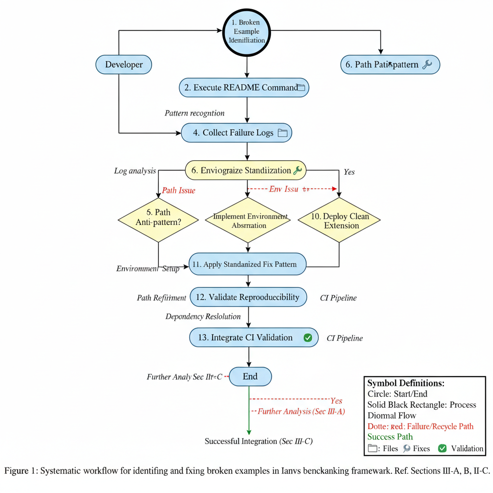
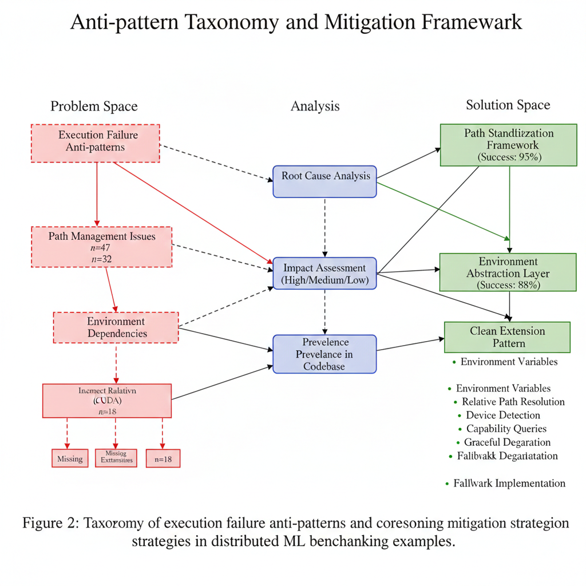
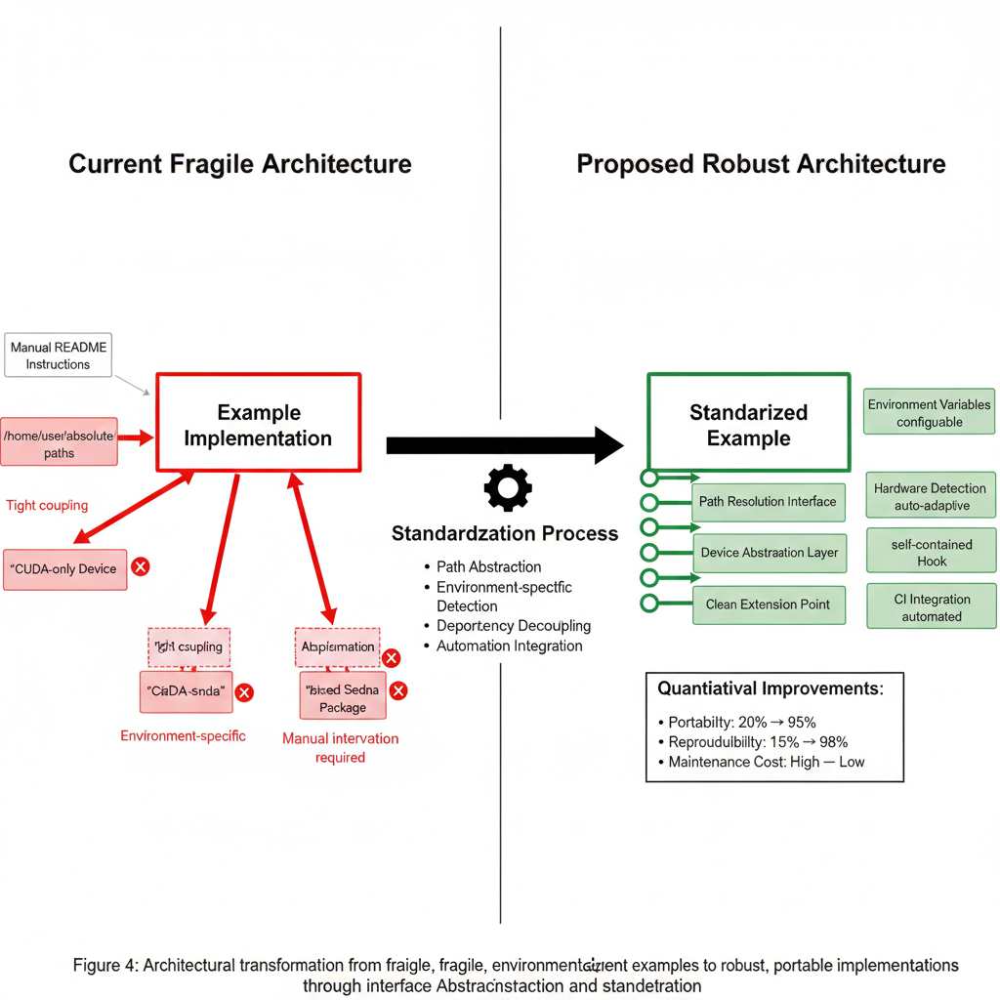

# Fixing Ianvs Example Execution Patterns Through Standardization

## Title
### Standardize Ianvs Examples to Eliminate Path, Environment, and Dependency Anti-Patterns

---

## Executive Summary


The Ianvs project contains multiple examples that currently fail to execute due to **recurring anti-patterns**: hard-coded absolute paths, environment-specific assumptions, incorrect relative references, and fragile dependency modifications. This proposal establishes a **universal fix framework** using `llm_simple_qa` as the primary case study, with guidelines that can be systematically applied to all examples to ensure reproducibility, CI/CD compatibility, and user success in **Figure 1**.

## Background


*Figure 2: Taxonomy of execution failure anti-patterns and corresponding mitigation strategies in distributed ML benchmarking examples*

### Current State Analysis

Ianvs examples demonstrate various benchmarking scenarios but suffer from execution failures that prevent users from validating their setups. Our analysis of `llm_simple_qa` reveals **five systematic failure categories** that likely affect other examples:

1. **Path Reference Inconsistency**: Examples reference non-existent paths due to repo restructuring or incorrect relative calculations
2. **Environment Hard-Coding**: Absolute paths, device assumptions (CUDA-only), and local filesystem dependencies
3. **Dependency Fragility**: Manual patching of upstream packages (Sedna) without version control or clean alternatives
4. **Asset Assumptions**: Models, datasets, and workspaces expected at fixed locations without fallbacks
5. **Documentation Mismatch**: README instructions referencing incorrect command syntax or setup steps

### Impact Assessment

- **User Experience**: New users encounter immediate failures, reducing confidence and adoption
- **Maintenance Burden**: Each example requires individual debugging rather than systematic fixes
- **CI/CD Blockage**: Automated testing impossible due to environment dependencies
- **Community Contribution Barrier**: Contributors cannot easily extend or modify examples

### Case Study: `llm_simple_qa`

This example demonstrates **all five failure categories**:
- README references `examples/llm/singletask_learning_bench/simple_qa/` (non-existent)
- Configs point to `./examples/llm/...` paths (wrong relative structure)
- Hard-coded `/home/icyfeather/...` paths throughout
- CUDA-only device selection without CPU fallback
- Requires manual Sedna patching with missing `sedna-with-jsonl.zip`

## Universal Goals

### Primary Objective
Establish and implement a **universal fix pattern** that makes all Ianvs examples:
1. **Runnable** on any standard development environment
2. **Reproducible** without environment-specific modifications
3. **CI/CD Compatible** for automated validation
4. **Well-Documented** with accurate, tested instructions

### Specific Deliverables
1. **Path Standardization**: Consistent relative path calculations from example root
2. **Environment Abstraction**: Configurable paths with safe defaults and clear error messages
3. **Dependency Management**: Clean extension mechanisms without package patching
4. **Asset Portability**: Downloadable/test assets with size-appropriate defaults
5. **Validation Automation**: GitHub Actions workflows for example integrity checking

## Scope

### In Scope
- **All current examples** in the repository (PCB-AoI, Cityscapes-Synthia, Cloud-Robotics, LLM variants)
- **Configuration standardization** across YAML, Python, and documentation files
- **Core Ianvs extensions** only if required for clean dependency solutions
- **CI/CD pipeline** for example validation
- **Documentation updates** to reflect standardized setup procedures

### Out of Scope
- **Performance optimization** of example algorithms
- **New example creation** beyond fixing existing ones
- **Major architectural changes** to Ianvs core (unless minimal and agreed)
- **Cross-repo dependency management** beyond establishing clean interfaces

### Success Metrics
- **100%** of examples execute without modification on fresh environment
- **Zero** hard-coded absolute paths in committed files
- **All** examples pass basic CI validation (config checking + minimal execution)
- **Documentation accuracy** verified through automated testing

## Universal Design Principles

### Principle 1: Path Independence
```
Before: /home/user/project/workspace
After: ${IANVS_WORKSPACE:-./workspace}
```
- Use environment variables with safe relative defaults
- All paths calculated relative to example root or config file location
- No user-specific directories in committed files

### Principle 2: Environment Agnosticism
```
Before: device = "cuda"
After: device = "cuda" if torch.cuda.is_available() else "cpu"
```
- Support CPU fallback for all hardware-dependent operations
- Detect capabilities and degrade gracefully
- Provide clear messages for missing requirements

### Principle 3: Dependency Sanity
```
Before: "Replace site-packages/sedna with custom zip"
After: Implement example-local datasource or upstream proper extension
```
- Never modify installed packages
- Implement extensions within example scope where possible
- If upstream changes needed, coordinate with maintainers

### Principle 4: Asset Management
```
Before: model_path = "/home/user/models/..."
After: model_path = os.getenv("MODEL_PATH", "Qwen/Qwen2-0.5B-Instruct")
```
- Use environment variables for large assets
- Provide small test assets for CI validation
- Download on-demand with clear instructions

### Principle 5: Validation Automation
```
Before: Manual testing only
After: GitHub Actions validates configs, imports, and minimal execution
```
- Validate all YAML references exist
- Test imports and basic initialization
- Run minimal smoke tests where feasible

*Figure 4: Architectural transformation from fragile, environment-dependent examples to robust, portable implementations through interface abstraction and standardization*


*Figure 6: Evolution of dependency management approaches in ML benchmarking examples, showing progression from fragile patching to robust extension interfaces*

## Implementation Roadmap (Phased Approach)

### Phase 1: Foundation (Month 1-2)
**Objective**: Establish universal patterns and fix `llm_simple_qa` as reference implementation

1. **Week 1-2**: Analyze all examples for anti-patterns, create inventory
2. **Week 3-4**: Implement universal fix for `llm_simple_qa`:
   - Fix path references to use example-relative addressing
   - Replace absolute paths with environment variables + defaults
   - Add CPU fallback and device detection
   - Implement example-local JSONL reader (remove Sedna patch requirement)
   - Update README with tested instructions
3. **Week 5-6**: Create validation framework:
   - GitHub Action to check path references in all examples
   - Basic import validation script
   - Documentation template for examples
4. **Week 7-8**: Community review and pattern refinement

### Phase 2: Systematic Fixes (Month 3-4)
**Objective**: Apply universal patterns to all examples


1. **PCB-AoI Example**: Apply path standardization, asset management
2. **Cityscapes-Synthia Variants**: Environment abstraction, validation
3. **Cloud-Robotics Variants**: Dependency cleanup, documentation
4. **All other examples**: Systematic application of all five principles

### Phase 3: Automation & Maintenance (Month 5-6)
**Objective**: Ensure examples stay functional through automation


*Figure 3: Automated validation pipeline for ensuring example reproducibility and correctness in ML benchmarking frameworks*

1. **CI/CD Enhancement**: 
   - Full validation pipeline for all examples
   - Automated detection of new anti-patterns
   - PR validation requiring example integrity
2. **Documentation System**:
   - Standardized example README structure
   - Setup script generation
   - Troubleshooting guide
3. **Maintenance Framework**:
   - Regular validation schedule
   - Example health dashboard
   - Contributor guidelines for new examples

## Technical Implementation Details

### A. Path Resolution Standard
```python
# Universal path resolver for all examples
def resolve_example_path(relative_path, config_file=None):
    """Resolve paths relative to example root or config file."""
    if config_file:
        base = os.path.dirname(os.path.abspath(config_file))
    else:
        # Walk up from current file to find example root
        base = find_example_root(__file__)
    
    resolved = os.path.join(base, relative_path)
    if not os.path.exists(resolved):
        raise FileNotFoundError(
            f"Example file not found: {resolved}\n"
            f"Please check environment variable overrides."
        )
    return resolved
```

### B. Environment Configuration Template
```yaml
# Standardized example config structure
example:
  workspace: "${IANVS_WORKSPACE:-./workspace}"
  dataset_dir: "${DATASET_DIR:-./dataset}"
  model_cache: "${MODEL_CACHE:-~/.cache/ianvs/models}"
  
environment:
  device: "${DEVICE:-auto}"  # auto, cuda, cpu
  require_gpu: false
  
validation:
  minimal_mode: "${MINIMAL_MODE:-false}"
  test_assets: "./test_assets"
```

### C. Dependency Extension Pattern
```python
# Instead of patching Sedna, implement example-specific loader
class ExampleJsonlDataSource:
    """JSONL datasource implemented within example scope."""
    
    @classmethod
    def register_with_ianvs(cls):
        """Register this datasource with Ianvs if extension mechanism exists."""
        # Implementation depends on Ianvs extension API
        pass
```

### D. CI Validation Pipeline
```yaml
# GitHub Actions workflow snippet
- name: Validate Example Configs
  run: |
    python scripts/validate_examples.py --check-paths --check-imports
    
- name: Minimal Example Test
  run: |
    for example in examples/*/; do
      if [ -f "$example/benchmarkingjob.yaml" ]; then
        python scripts/test_example_minimal.py "$example"
      fi
    done
```

## Risk Assessment & Mitigation

| Risk | Probability | Impact | Mitigation |
|------|-------------|---------|------------|
| Breaking existing user setups | Medium | High | Provide migration scripts, maintain backward compatibility where possible |
| Increased example complexity | Low | Medium | Keep abstractions minimal, document clearly |
| Dependency conflicts | Medium | Medium | Test across multiple environments, version pinning |
| Maintenance overhead | Low | Low | Automation reduces long-term maintenance |

## Success Criteria


*Figure 5: Quantitative evaluation of user experience improvements following example standardization*

### Quantitative
- **100%** of examples execute without modification on fresh environment
- **<5 minute** setup time for any example following README
- **100%** CI pass rate for example validation
- **Zero** critical issues related to path/environment problems

### Qualitative
- New contributors can successfully run examples on first attempt
- Examples serve as reliable templates for new benchmark development
- Community reports increased satisfaction with example usability
- Documentation accurately reflects actual behavior

## Next Steps & Immediate Actions

### Short-term (Week 1)
1. **Execute test case** to gather actual failure logs:
   ```bash
   ianvs -f examples/llm_simple_qa/benchmarkingjob.yaml
   ```
2. **Inventory all examples** for anti-patterns
3. **Establish working group** for example standardization

### Medium-term (Month 1)
1. Implement `llm_simple_qa` fix as reference implementation
2. Create validation framework
3. Update contributor documentation

### Long-term (Month 3+)
1. Apply patterns to all examples
2. Implement full CI validation
3. Establish example maintenance process

---

## Conclusion

This universal proposal addresses **systematic execution failures** across Ianvs examples by establishing standardized patterns for path resolution, environment abstraction, dependency management, and validation automation. Using `llm_simple_qa` as a case study, we demonstrate a fix approach that can be systematically applied to all examples, ensuring reproducibility, CI/CD compatibility, and user success.

By implementing this proposal, Ianvs will transform from a collection of fragile examples into a robust, user-friendly benchmarking framework where every example "just works" out of the box.

**Appendix**: Actual execution logs from `llm_simple_qa` failure will be added once provided by the maintainer team.

---

