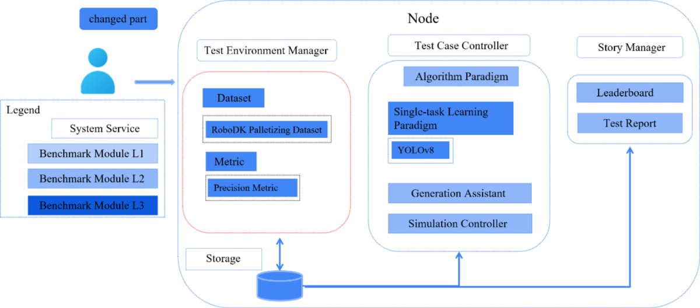

 # **Embodied Intelligence Benchmarking Framework for Industrial Manufacturing with KubeEdge**

Under the background of accelerated evolution of intelligent industrial manufacturing, industrial robots, flexible production lines and intelligent testing equipment continue to be innovated iteratively. With its efficient data processing and real-time response ability, **cloud edge collaboration technology** has become the core technology engine to drive the application of **embodied intelligence** systems in complex industrial scenes.  

Based on the **kubeedge ianvs collaborative AI benchmarking framework**, this project plans to build a complete system including industrial scenario test datasets, simulation test environment and multi-dimensional performance indicators, aiming to build professional and industry-level specific intelligent testing capabilities suitable for the industrial manufacturing field.  

It is noteworthy that the current industrial demand for embodied intelligent services has developed in depth in the direction of high-precision perception decision-making, dynamic real-time response, cross device collaborative control, etc.   

**However**, the existing universal embodied intelligence benchmark system is difficult to meet the needs of accurate assessment due to the **lack of targeted consideration of the unique needs of industrial scenarios and equipment characteristics**, which has become a key bottleneck restricting the development of industrial embodied intelligence technology.

## **Goals**

1. Introduce industrial datasets in the field of embodied intelligence, classify and reorganize the existing datasets according to four categories of standardized tasks: perception (such as multi view surface quality inspection), movement (such as material box handling, stacking, disassembling and stacking), operation (such as precision assembly, precision insertion, multi process flexible assembly, multi category flexible assembly, reel transfer, equipment in box packaging, mixed goods sorting), composition (such as electronic equipment flexibility test, power patrol inspection), and output the dataset Research Report.

2. Select at least one of the above scenarios in kubeedge ianvs to provide a standardized test suite, including datasets, test environments, and test indicators, and sort out the datasets in a standardized and unified data format.

3. Implement embodied intelligent baseline algorithm based on standardized test suite in kubeedge ianvs.

## **Design Details**

### **Dataset map**

| Dataset | Scenarios | Introduction | Link |
| :-----| :----- | :----- | :----: |
| Agibot World | Operation/Perception/Composite | The AgiBot World dataset was born from Zhiyuan's self built large-scale data collection factory and application experimental base, with a total space area of over 4000 square meters and containing more than 3000 real objects. On the one hand, it provides a venue for large-scale data training of robots, and on the other hand, it realistically replicates the five core scenarios of home, catering, industry, supermarkets, and office, fully covering the typical application needs of robots in production and life. | [Link](https://huggingface.co/datasets/agibot-world/AgiBotWorld-Alpha) |
| ARIO (All Robots in One), 2024 | Operation/Locomotion | ARIO is a comprehensive benchmark dataset designed to unify robot data across different implementation examples and task types. It covers over 20 real and simulated robot platforms, including tasks ranging from basic movements to complex tool usage and manipulation. Each robot is equipped with sensors such as RGB cameras, IMUs, and joint encoders, allowing agents to promote and transfer skills between platforms.In industrial environments where multiple robots must collaborate, such as wheeled bases for transporting parts and arms for performing assembly, ARIO's structure reflects the heterogeneity of these systems and the need for unified intelligence among them. | [Link](https://imaei.github.io/project_pages/ario/) |
| Open X-Embodiment, 2023 | Operation/Locomotion | 1 million fragments x 22 types of robots, covering 500+skills (including industrial sorting and assembly). | [Link](https://github.com/google-deepmind/open_x_embodiment) |
| RH20T-P (Robotic Hands Dataset with Primitive Skills), 2024 | Operation | For industries that focus on micro assembly or small part operations, such as gears, screws, and PCBs, RH20T-P provides valuable data for teaching robots precise and accurate interaction. | [Link](https://sites.google.com/view/rh20t-primitive/main) |
| ALOHA 2, 2024 | Operation | ALOHA 2 extends the original ALOHA dataset to include more complex dual arm coordination tasks. With improved physical realism and aligned RGB-D visual flow, it simulates tasks such as stacking, folding, and object alignment. This dataset captures the complexity of manual operation, which is crucial in many packaging and palletizing environments. | [Link](https://aloha-2.github.io/) |
| Baxter_UR5_95_Objects_Dataset, 2023 | Operation | This dataset includes RGB-D images of 95 industrial and household objects captured using Baxter and UR5 robotic arms. It has 3D grasping annotations, segmentation masks, and object poses. The inclusion of real robots and industrial like parts makes it particularly valuable to train and manipulate models under physical reality conditions.Its diversity and settings simulate the practical picking, component sorting, and mastery plan challenges often faced in warehouse automation systems. | [Link](https://tufts.app.box.com/s/t4apxhxtti6tlo9p875xtp823rhx1x9i) |
| YCB Object and Model Set | Operation | The YCB object and model set was created by the Yale Carnegie Mellon Berkeley collaboration to provide benchmark testing for robot operation, prosthetic design, and rehabilitation research. This dataset contains 73 everyday objects with different shapes, sizes, textures, weights, and rigidity, as well as some widely used operational tests. The dataset provides high-resolution RGBD scans, physical properties, and geometric models of objects, making it easy to integrate into operational and planning software platforms. In addition, the dataset also includes a series of standard task protocol frameworks and example protocols, as well as experimental implementations aimed at quantitatively evaluating various operational methods including planning, learning, mechanical design, control, and more. | [Link](http://rll.eecs.berkeley.edu/ycb/) |
| Human-Robot Collaboration Dataset | Operation/Locomotion | This synthetic dataset aims to simulate real data in industrial or service robot environments where humans and robots work side by side. | [Link](https://www.kaggle.com/datasets/adilshamim8/humanrobot-collaborative-work-dataset) |
| SmartAssemblySim-V2 | Operation | SmartAssemblySim-V2 is a conceptual subset of the BridgeData V2 dataset designed to simulate target condition robot operation tasks related to industrial manufacturing. The tasks include inserting parts, placing objects, and interacting with drawers, all supported by RGB videos, status data, and target commands. | [Link](https://rail.eecs.berkeley.edu/datasets/bridge_release/data/) |
| NEU Surface Defect Database | Perception | The NEU surface defect database is a widely used benchmark for evaluating surface defect classification in the steel industry. It includes 1800 grayscale images of hot-rolled steel strips, classified into six types of defects such as silver lines, inclusions, patches, rough surfaces, rolled oxide scales, and scratches. This dataset is compact and efficient, suitable for rapid prototyping and algorithm testing. It is commonly used to develop models in quality assurance systems, where rapid defect identification is crucial. | [Link](https://www.kaggle.com/datasets/kaustubhdikshit/neu-surface-defect-database/data) |
| ISDD - Industrial Surface Defect Detection Dataset | Perception | This dataset addresses the challenge of multi view defect detection in small industrial components such as nuts, gears, and screws. It is built on the MANTA dataset and provides five different perspectives of images for each object instance. | [Link](https://drive.google.com/drive/folders/12JERdTIy_3WWRyjP2gm040TDYnmRxrxy?usp=sharing) |
| Severstal: Steel Defect Detection | Perception | The Severstal dataset provides a large number of 12568 grayscale images of steel surfaces and detailed pixel level annotations for four types of defects. It is designed specifically for Kaggle competitions, promoting the development of advanced segmentation algorithms that can not only identify the presence of defects but also accurately locate them. Its well annotated structure makes it particularly suitable for training deep learning models used on automated steel inspection lines where spatial accuracy is crucial. | [Link](https://www.kaggle.com/c/severstal-steel-defect-detection) |
| BSData: Ball Screw Surface Defect Dataset | Perception | BSData is a domain specific dataset that focuses on inspecting key components in ball screw drives - CNC machine tools and automation equipment. This dataset contains over 21000 RGB images and detailed annotations of pitting defects, supporting supervised training of classification and detection models. It has been applied to evaluate how computer vision systems recognize local and subtle surface anomalies, providing valuable benchmarks for predictive maintenance systems in industrial environments. | [Link](https://github.com/2Obe/BSData) |
| Kolektor Surface-Defect Dataset | Perception | KolektorSDD and its subsequent SDD2 are datasets composed of high-resolution images of electric commutators. Each image is annotated to indicate the presence of surface defects such as scratches, dents, and contamination. These datasets are primarily used for binary and multi class classification, known for simulating real-world industrial constraints such as data imbalance and subtle defect patterns. They support research on rapid detection solutions that require high sensitivity to the minimum deviation of component surfaces. | [Link](https://www.vicos.si/Downloads/KolektorSDD) |
| Gear Inspection Dataset (GID) | Perception | GID contains grayscale images of industrial gears with defect labels. This dataset supports object detection and semantic segmentation tasks in industrial machine vision applications. It is particularly useful for training models aimed at real-time evaluation of gear quality, such as during online inspections on automotive or mechanical assembly lines. The focusing range of gears makes them an ideal choice for researching specific part defect detection in high-precision environments. | [Link](https://drive.google.com/file/d/1CZo-Ab5BXkTjV-b1-NIFzYMjfJQMl4nG/view?usp=share_link) |
| Real-IAD: Real-world Multi-View Industrial Anomaly Detection Dataset | Perception | Real IAD is a comprehensive benchmark designed to evaluate anomaly detection systems in real-world industrial environments. It includes 150000 high-resolution images of 30 different types of components, each taken from five different viewpoints. This dataset covers eight common types of defects, including cracks, dents, contamination, and misalignment. The design of Real IAD considers unsupervised anomaly detection, reflecting the challenges of high-throughput production lines where anomalies are rare but crucial for accurate identification. It supports research on anomaly localization, detection robustness, and multi view detection strategies, particularly suitable for quality assurance pipelines. | [Link](https://realiad4ad.github.io/Real-IAD/) |
| ISP-AD: Industrial Screen Printing Anomaly Detection Dataset | Perception | ISP-AD is a domain specific dataset for anomaly detection in screen printing processes. It includes examples of synthetic and real-world defects such as ink stains, missing prints, ghosting, and registration errors. The structure of this dataset supports classification and pixel segmentation, making it suitable for various industrial defect detection pipelines. Its main application scenarios include automatic visual inspection in the production of printed electronic products, labels, and packaging, ensuring consistent printing quality is crucial for product performance and brand. | [Link](https://paperswithcode.com/dataset/isp-ad) |
| MVTEC AD | Perception | The MVTec dataset contains 5354 high-resolution color images of different targets and texture types. It contains normal (i.e. defect free) images for training and abnormal images for testing. There are 70 different types of defects in anomalies, such as scratches, dents, contamination, and various structural changes. | [Link]( https://www.mvtec.com/company/research/datasets/mvtec-ad) |
| RoboMIND | Composite | This dataset contains 107000 real-world demonstration trajectories involving 96 unique objects across 479 different tasks.The RoboMIND dataset collects operational data from various robot platforms, including 52926 Franka Emika Panda single arm robot trajectories, 19152 "Tiangong" humanoid robot trajectories, 10629 AgileX Cobot Magic V2.0 dual arm robot trajectories, and 25170 UR-5e single arm robot trajectory data. | [Link](https://data.flopsera.com/data-detail/21181956226031626?type=open) |

### **ianvs**

The architectures and related concepts are shown in the below figure. The ianvs is designed to run within a single node. Critical components include  

&emsp;**Test Environment Manager:** the CRUD of test environments serving for global usage.  

&emsp;**Test Case Controller:** control the runtime behavior of test cases like instance generation and vanish.  

&emsp;&emsp;**Generation Assistant:** assist users to generate test cases based on certain rules or constraints, e.g., the range of parameters.  

&emsp;&emsp;**Simulation Controller:** control the simulation process of edge-cloud synergy AI, including the instance generation and vanishment of simulation containers.  

&emsp;**Story Manager:** the output management and presentation of the test case, e.g., leaderboards.  



And currently, what I need to set up are the dataset in the Test Environment Manager section and the evaluation metrics section. At the same time, in the Test Case Controller section, use the Single task Learning Paradigm in Algorithm Paradigm to perform corresponding benchmark tests on the uploaded dataset.

### Pre-assembly of Injection Mold Inserts dataset

**Pybullet**

PyBullet is developed based on the well-known open-source physics engine Bullet and packaged as a module in Python for robot simulation and learning. PyBullet supports loading various robot description files such as URDF, SDF, MJCF, and provides functions such as forward/reverse kinematics, forward/reverse dynamics, collision detection, and ray intersection query. In addition, many robot routines and practical debugging tools (sliders, buttons, text) are also provided.


**Industrial Scenario: Pre-assembly of Injection Mold Inserts**

In the field of injection mold manufacturing, the pre assembly of mold inserts is a key process to ensure mass production efficiency. This scenario requires installing a cylindrical guide sleeve (diameter 40 ± 0.1mm, height 100mm) into the mold substrate (slot diameter 44mm, depth 50mm) to achieve:  

&emsp;Quick positioning: achieve quick installation within 5 seconds through gap fit (H8/d9). 

&emsp;Thermal expansion compensation: Reserve 0.4mm radial clearance to cope with thermal deformation at 150 ℃ working condition.  

&emsp;Error prevention design: distinguish 4 symmetrical workstations to avoid incorrect installation.  

Traditional manual installation has the problem of inaccurate positioning leading to mold edge flying. The simulation system based on PyBullet can improve installation efficiency and reduce mold scrap rate through collision dynamics optimization.  

This design can be effectively used for:  

&emsp;1. Robot installation path planning.  

&emsp;2. Tolerance fitting simulation verification.  

&emsp;3. Research on thermal deformation compensation.  

&emsp;4. Development of rapid changeover system.  

Through the PyBullet physics engine, it is possible to accurately simulate the contact mechanics behavior during the installation process of mold inserts, providing a reliable digital twin platform for actual production lines.

**The overall process of dataset generation**
Use the pandas robotic arm model provided by Pybullet, while **fixing the camera at the end effector of the robotic arm**. The arm is equipped with a simple fixture and a simulated force/torque sensor at the wrist or fixture.  

Firstly, design corresponding cylindrical guide sleeve and Mold substrate that can hold cylindrical components. View the URDF results on this website ([Link](https://danidask.github.io/urdf_editor/frontend/)):


Secondly, establish an industrial scenario - Pre-assembly of Injection Mold Inserts:

**Dataset generation process**


**Robot arm control sequence**


**Data capture**


The ultimate dataset form:
```yaml
mold_Inserts_dataset/
├─ test_data/
|  ├─ data.json    # Contains queries, expected responses, task metadata
|  └─ metadata.json # Task dimensions and description
└─ train_data/
|   └─ data.json    
```

**Directory Structure: (examples/Pre-assembly of Injection Mold Inserts)**
```yaml
Pre-assembly of Injection Mold Inserts
└── singletask_learning_bench
    ├── benchmarkingjob.yaml
    ├── testalgorithms
    │   ├── basemodel.py
    │   ├── fpn_algorithm.yaml
    │   ├── op_eval.py
    └── testenv
        ├── acc.py
        └── testenv.yaml
```

For the dataset, its URL address should be written out in the configuration file `testenv.yaml`:
```yaml
testenv:
 # dataset configuration
 dataset:
     # the url address of train dataset index; string type;
     train data:"./dataset/Pre-assembly of Injection Mold Inserts/train data/data.json"
     # the url address of test dataset index; string type;
     test data info:"./dataset/Pre-assembly of Injection Mold Inserts/test data/metadata.json"
 # metrics configuration for test case's evaluation; list type;
 metrics:
     # metric name; string type;
     - name:"Accuracy"
      # the url address of python file
      url:"./examples/Pre-assembly of Injection Mold Inserts/singletask_learning_bench/testenv/accuracy.py"
    # other metrics
    ...
```

### **Single Task Learning**

Single task learning is a traditional learning pooling all data together to train a single model. It typically includes a specialist model laser-focused on a single task and requires large amounts of task-specific labeled data, which is not always available on early stage of a distributed synergy AI project.  

As shown in the following figure, the single task learning works as procedures below:  

&emsp;1.Developer implements and deploys the application based on single task learning.  

&emsp;2.The application runs and launches single task learning.  

&emsp;3.The application uploads samples to the cloud.  

&emsp;4.Labeling service labels the uploaded samples.  

&emsp;5.Training learns the samples to generate a new model.  

&emsp;6.The system updates the model on the edge.  

&emsp;7.The model conducts inference given test samples where the inference result is send to the application which ends the process.  


    
The specific implementation of Pre-assembly of Injection Mold Inserts single task learning algorithm in `algorithm.yaml`.

The URL address of the algorithm is filled in the configuration file `benchmarkingjob.yaml` (an example is as follows).

```yaml
# the configuration of test object
test_object:
  # test type; string type;
  # currently the option of value is "algorithms",the others will be added in succession.
  type: "algorithms"
  # test algorithm configuration files; list type;
  algorithms:
    # algorithm name; string type;
    - name: "fpn_singletask_learning"
      # the url address of test algorithm configuration file; string type;
      # the file format supports yaml/yml
      url: "./examples/Pre-assembly of Injection Mold Inserts/singletask_learning_bench/testalgorithms/fpn_algorithm.yaml"
```

## **Road Map**

**1.** **From July to Mid-August**, conduct research on the currently available embodied intelligent datasets and output corresponding reports. At the same time, continue to follow up and improve the proposal. Besides, learn to use the pybullet platform, build the scene of Pre-assembly of Injection Mold Inserts on the pybullet platform.  

**2.** **From Mid-August to Mid-September**, obtain the corresponding dataset. The test environment and test indicators were built in kubeedge ianvs, and the datasets were sorted out in a standardized and unified data format. At the same time, the specific intelligent baseline algorithm was implemented in kubeedge ianvs based on the standardized test suite.  

**3.** **From Mid-September to End of September**, summarize the previous two stages, think about what can be further improved or supplemented, and output the corresponding documents. If time and energy allow, consider carrying out standardized test suite in agibot world and Genie SIM, a smart metadata simulation platform, including indicators and examples.

## **Acknowledge**
This project refers to **Ronak Raj's FPC_Assembly work** shared in Issue #197 of the *Embodied Intelligence Benchmarking Framework for Industrial Manufacturing with KubeEdge ianvs* project. I sincerely thank **Ronak Raj** for his generous sharing.
