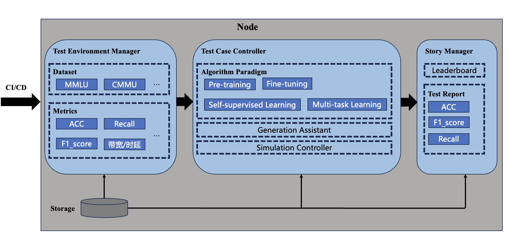

## Large Language Model Edge Benchmark Suite: Implementation on KubeEdge-lanvs 
## 大语言模型边侧基准测试套件：基于KubeEdge-Ianvs实现


## 目标
主要目标是使用KubeEdge-Ianvs平台开发一个针对边缘设备上的大语言模型（LLMs）的基准测试套件。此套件将便于测试和验证LLMs在性能、准确性和资源利用上的表现。


### 1. 灵活性和可扩展性
确保测试环境管理器能够灵活处理多种数据集和性能指标，以满足不同的测试需求和场景。

### 2. 全面的算法评估
覆盖包括预训练、微调、自监督学习和多任务学习在内的多种机器学习算法范式的测试。

### 3. 自动化与持续集成
整合CI/CD流程，自动化测试环境和测试案例的管理与持续更新。

### 4. 集成OpenCompass
通过集成OpenCompass (https://opencompass.org.cn/home)项目，实现对大语言模型（LLMs）的基础能力和性能评测。OpenCompass支持多种大模型和丰富的Benchmark，通过简化配置文件即可实现对LLMs的全面评估。

## 设计细节

### 用户流程
用户流程将包括：
1. **Ianvs准备**：设置Ianvs环境及所需的LLM基准测试工具。
2. **数据集配置**：为边缘场景特别调整和配置数据集。
3. **基准执行**：运行基准测试套件，测量边缘设备上LLMs的性能指标。
4. **结果分析**：分析和可视化结果，优化和改进LLM部署。

### 架构和模块


#### 测试环境管理器
- **数据集**：管理如MMLU和CMMU等不同的数据集，其中目前Ianvs 数据集集中在cv 数据，根据`index.txt`来进行索引，但是nlp大模型可以直接引入`data.json` 文件来引入question和answer,通过对 `core/testenvmanager/dataset/dataset.py` 逻辑进行实现
```
{"question": xxx, "answer": xxx}
{"question": xxx, "answer": xxx}
{"question": xxx, "answer": xxx}
```


- **指标**：跟踪性能指标，如准确度（ACC）、召回率、F1分数等。

#### 测试用例控制器
控制测试用例的设置和执行，确保每个实例正确初始化并结束。


#### 故事管理器 StoryManager
负责测试结果的输出管理：
- **排行榜**：根据不同模型或配置的性能显示排名。
- **测试报告**：包括显示准确度、F1分数和召回率等指标的详细报告，这些都是评估测试模型性能的关键。

### 实例定义

- **基准**：业界或学术界认可的标准化评估协议，专门设计用来评估LLMs在各种配置和工作负载下的性能和可扩展性。
- **基准作业**：负责执行Large Model Benchmarking Suite内特定基准的运营实例。此作业管理从模型加载到性能评估的所有相关组件的生命周期
- **测试对象**：评估中的特定大型语言模型或系统配置。例如，配置了特定任务或数据集的Transformer模型、GPT-3或BERT版本
- **测试环境（Test Env.）**：为基准测试提供必要的计算和数据条件的设置配置。
- **测试用例**：在特定测试环境下评估测试对象性能和可扩展性的可执行场景。

### 模块详细信息

#### 测试环境管理器
- **选择不同架构的LLMs进行测试**：通过`testcasecontroller`中可以配置和管理不同类型的LLM测试用例。

- **数据集管理**：包括如MMLU和CMMU等数据集。
- **指标跟踪**：监测如准确度（ACC）、召回率和F1分数等性能指标。

#### 测试用例控制器
- **测试用例设置与执行**：监督测试用例的有序执行，确保每个测试案例都根据预定义的参数和配置正确初始化和结束。
- **算法配置与实例化**：利用_parse_algorithms_config方法解析配置文件，将其转换为测试环境中的可操作算法实例。

#### 故事管理器
- **排行榜**：显示模型性能排名。
- **测试报告**：生成评估所需的详细报告。

### 路线图

| 开始时间  | 结束时间    | 活动 |
|-------------|-------------|------------|
| 2024-06-04  | 2024-06-11  | 熟悉Ianvs平台并准备开发环境。 |
| 2024-06-12  | 2024-06-25  | 设计项目界面并编写详细用户指南。 |
| 2024-06-26  | 2024-07-03  | 开发支持各类数据集格式和模型调用可视化的功能。 |
| 2024-07-04  | 2024-07-18  | 测试各种LLMs并生成详细的基准测试报告。 |
| 2024-07-19  | 2024-08-02  | 实现并发任务执行和自动请求与结果收集的功能。 |
| 2024-08-03  | 2024-08-17  | 将基准测试套件集成到模型训练过程中，进行实时评估和优化。 |
| 2024-08-18  | 2024-09-01  | 进行全面测试，
