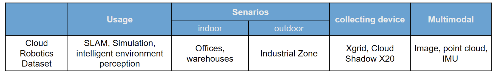
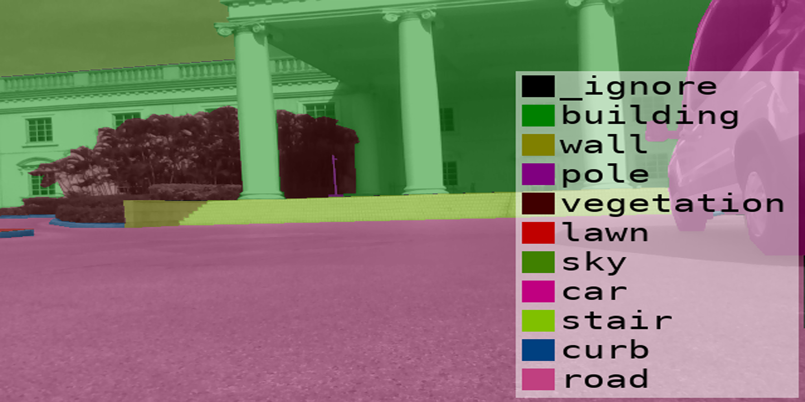
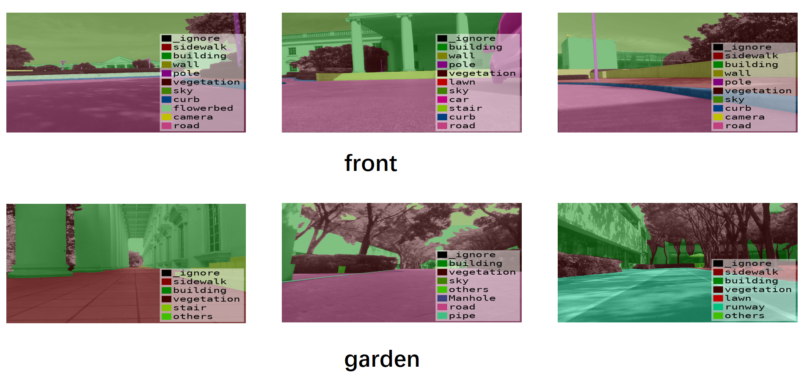

<<<<<<< HEAD
# Cloud-Robotics Lifelong Learning Dataset

Download link: [Kaggle](https://www.kaggle.com/datasets/kubeedgeianvs/cloud-robotics/)

## Authors

- KubeEdge/Ianvs: Shijing Hu, Sitong Mao, Siqi Luo, Zhiwei Huang, Zimu Zheng, Jie Pu, Feng Wang

## Background

In the past few years, robotic technology has developed rapidly, and the practical application of intelligent robots such as the Cloud Shadow X20 has become increasingly widespread. For robotic applications, model training requires a large amount of data, and the ability of models to learn throughout their lifetime has become increasingly important due to the complex and ever-changing real environment. However, currently there are relatively few open-source datasets in the field of robotics, making it difficult for developers in the robotics field to obtain high-quality data for model training.

Therefore, we have jointly released the **Cloud-Robotics** dataset on KubeEdge-Ianvs to provide better support for robot learning. The Cloud-Robotics dataset not only provides high-quality data support for robotic tasks but also offers more possibilities for testing the lifelong learning ability of robot application models. We believe that this dataset will become one of the important tools in the field of robot learning and application development.

Cloud-Robotics is a multimodal robot dataset collected by an intelligent robotic dog in the Huawei Shenzhen Industrial Park. Currently, the outdoor image semantic segmentation dataset of Cloud-Robotics has been open-sourced. In the future, we will open-source other modalities of Cloud-Robotics datasets, including but not limited to point clouds and IMU, etc.



### Examples

Original Image:- 
 
Segmented Image:- 

Original Image:- 
 
Segmented Image:- 


## Data Explorer

### Dataset Structure

After decompression, the data organization is listed as follows:

```
"Cloud-Robotics": {
Cloud-Robotics_dataset
├── gtFine
│   ├── test
│   │   ├── 20220420_front
│   │   └── 20220420_garden
│   ├── train
│   │   ├── 20220420_front
│   │   └── 20220420_garden
│   └── val
│       ├── 20220420_front
│       └── 20220420_garden
├── rgb
│   ├── test
│   │   ├── 20220420_front
│   │   └── 20220420_garden
│   ├── train
│   │   ├── 20220420_front
│   │   └── 20220420_garden
│   └── val
│       ├── 20220420_front
│       └── 20220420_garden
└── viz
    ├── test
    │   ├── 20220420_front
    │   └── 20220420_garden
    ├── train
    │   ├── 20220420_front
    │   └── 20220420_garden
    └── val
        ├── 20220420_front
        └── 20220420_garden
}
```

### Dataset Partition Description

Cloud-Robotics dataset has 7 groups of 30 classes. The partition of dataset is as follow:

| **Group**      | **Classes**                                                                 |
|----------------|-----------------------------------------------------------------------------|
| **flat**       | road, sidewalk, ramp, runway                                                |
| **human**      | person, rider                                                               |
| **vehicle**    | car, truck, bus, train, motorcycle, bicycle                                 |
| **construction**| building, wall, fence, stair, curb, flowerbed, door                        |
| **object**     | pole, traffic sign, traffic light, CCTV camera, Manhole, hydrant, belt, dustbin |
| **nature**     | vegetation, terrain                                                         |
| **sky**        | sky                                                                         |


### Data Statistics

**Features**

- Polygonal annotations
    - Dense semantic segmentation
    - Instance segmentation for vehicle and people
- Complexity
    - 30 classes
- Diversity
    - Daytime
    - Manually selected frames
        - Large number of dynamic objects
        - Varying scene layout
        - Varying background
    - Volume
        - 2600 annotated real-world images
    - Benchmark suite and evaluation server
        - Pixel-level semantic labeling

### Data Format

The format of json annotation is as follows:

```
"gtFine_polygons.json": {
        "imgHeight": <int>        -- Height of the image
        "imgWidth": <int>         -- Width of the image
        "objects": <list>         -- List of the objects
        "label": <str>            -- Name of the label
        "polygon": <list>         -- Boundary point coordinates
}
```

### Data Annotation

Below are examples of high quality dense pixel annotations of 2500 real-world images. Overlayed colors encode semantic classes. Note that single instances of traffic participants are annotated individually.


=======
version https://git-lfs.github.com/spec/v1
oid sha256:7e2ff74f3679c6b416d53364c44a4d078da42eb8ad4aeefe8fca66922905f164
size 5084
>>>>>>> 9676c3e (ya toh aar ya toh par)
