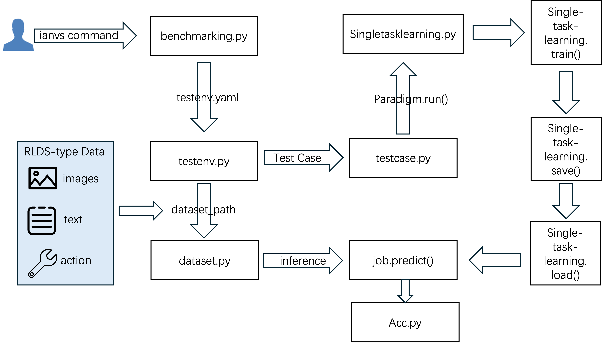
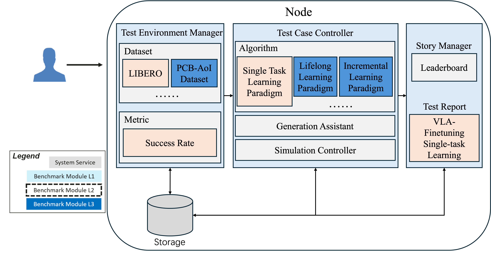

# VLA Fine-Tuning Data Ratio Optimizer based on KubeEdge-Ianvs

## background

- Vision-Language-Action (VLA) models are widely used in embodied intelligence and robotic manipulation, yet their performance is constrained by the multi-source heterogeneous data allocation strategies during training. **Current approaches primarily rely on static weighting or uniformly mixed data, failing to adapt to the varying modal data requirements of different tasks, which results in limited generalization capability in complex scenarios.** Furthermore, the VLA field lacks systematic research, with data allocation strategies significantly lagging behind those in CV and NLP domains—particularly in cross-modal alignment, dynamic adaptability, and computational efficiency. Existing solutions struggle to balance the discrepancies between simulated and real-world data and fail to optimize multimodal collaborative training, ultimately compromising the inference performance and robustness of models on edge devices.

- The key challenge lies in designing dynamic data allocation strategies that can adaptively weigh the contributions of multi-source heterogeneous data (e.g., simulated/real-world data, multi-task data) during training while establishing interpretable correlations with downstream VLA task performance. This is crucial for enhancing model generalization and deployment efficiency.

- **As a cutting-edge platform for edge AI benchmarking in VLA-based robotics, KubeEdge-Ianvs still faces the following key challenges:**
  1. **Lack of VLA training algorithm for VLA models** -  A significant gap exists within Ianvs for a unified training framework tailored to VLAs. This absence forces a fragmented training approach, complicating model development and reproducibility due to reliance on disparate external codebases.
  2. **Lack of adaptive data scheduling for VLA models** -  Current implementations rely on fixed multi-source data ratios, lacking adaptive scheduling for diverse robotic tasks and platforms.
  3. **Absence of standardized VLA evaluation protocols** - While supporting basic metrics, the framework lacks dedicated test suites for critical VLA performance dimensions like cross-platform generalization and failure-case robustness.
  
- **This proposal enhances Ianvs with:**
  - Dynamic data ratio optimization
  - VLA fine-tuning algorithm 
  - Task-aware benchmarking kits
  - Automated analysis tools

## Goal

- **The project is committed to building a VLA fine-tuning data ratio optimization framework for robotic manipulation in the KubeEdge open-source community.**

  1. **Provide dynamic multi-source data scheduling algorithms** for the challenge of manually configuring vision-language-action data ratios in VLA model training

  2. **Deliver standardized VLA evaluation kits** addressing the lack of task-specific metrics (generalization ability, worst-case performance) and configurable test environments

  3. **Generate automated benchmarking reports** solving the difficulty in quantifying how data ratio strategies affect VLA model performance across different robot platforms and scenarios

## Proposal

This project, built on the KubeEdge-Ianvs open platform, targets single-task learning for Vision-Language-Action (VLA) models. It develops a system integrating dynamic data ratio optimization and standardized evaluation. By leveraging intelligent multi-source data scheduling and weighting mechanisms, the project addresses challenges of limited generalization and worst-case performance degradation caused by platform, task, and scenario heterogeneity, ultimately enhancing both the average performance and robustness of VLA models in downstream tasks.



### Design Details
1. Establishing the VLA Fine-tuning Framework and Algorithmic Baseline 
   
   **Objective:** Develop a functional foundational framework and algorithmic baseline that supports dynamic scheduling of multi-source heterogeneous data.

   **Task:** 
   - VLA Model Integration: Integrate a mainstream open-source VLA model into the Ianvs single-task learning framework, establishing the pipeline for training, fine-tuning, and inference. The current baseline model is OpenVLA-7B.
   - Multi-Source Data Modeling and Wrapping: Design a unified data interface to partition datasets by task type (e.g., grasping, placing, drawer opening) and scenario conditions (e.g., lighting variations, background noise). 
   - Dataset Support: Implement a unified training pipeline based on the RLDS format to support multi-source heterogeneous datasets, using LIBERO as the primary training dataset.
2. Development of a Standardized Testing Suite
  
   **Objective:** 
      
    Within the KubeEdge-Ianvs single-task learning framework, we build a reproducible standardized testing suite based on **OpenVLA + LIBERO + MuJoCo**. The suite not only provides dataset partitioning, a unified success rate metric, and one-click environment configuration scripts for evaluating VLA fine-tuning, but also leverages a **physics-based simulation environment (MuJoCo)** to realistically reproduce robot interactions under diverse tasks and scenarios, forming a comparable and extensible baseline.

   **Architectural Framework**

    ```| Layer      | Components                                              |
    |------------|----------------------------------------------------------|
    | Analysis   | Result visualization (plots) + Statistical analysis (stats) |
    | Evaluation | Automated testing framework (runners) + Metric computation (success rate) |
    | Model      | OpenVLA pretrained model + Fine-tuning adapters (LoRA/Adapter) |
    | Environment| MuJoCo physics engine + LIBERO task suite                |
    | Foundation | KubeEdge-Ianvs orchestration (edge-cloud training/inference) |
    ```

   **metric：** 

      Task Success Rate (SR):
      $$SR = \frac{\#\text{Success Episodes}}{\#\text{Total Episodes}}$$
      Success is determined by the environment’s built-in success flag or explicit thresholds (e.g., drawer opening distance). Only SR and sample size N are reported.
   **Implementation Workflow**

      Environment & Data: One-click scripts to install/validate MuJoCo, LIBERO, and dependencies; prepare LIBERO task datasets generated from physical simulation

      Model & Fine-tuning：Load OpenVLA pretrained weights; enable LoRA/Adapter; launch fine-tuning with fixed seeds and hyperparameters.

      Evaluation Execution:Generate N physics-based episodes in MuJoCo (with light domain randomization); run automated inference and record results.

      Result Output:

      Compute and report SR (%) with sample size N; produce a minimal report (SR value + simple plot) for baseline comparison.
3. Action-Based Data Ratio Strategy

    In RLDS streaming data, invalid or low-value samples (e.g., near-zero actions, outliers, or irrelevant subsets) dilute gradients and increase training instability. To improve data efficiency and convergence, lightweight deterministic filtering should be applied before batch formation.

   **Objective**

    This project improves training data quality through sample filtering and data ratio strategies. It removes near-zero action samples that cause ineffective updates, filters corrupted data with NaN/Inf or abnormal magnitudes, and applies dataset-level selection to focus on high-value subsets. These measures increase gradient density, reduce noise, and accelerate convergence for better model performance.
   **Task：** 

      This task focuses on improving the quality and effectiveness of training data in RLDS streams through a unified action-based filtering strategy. The core objectives are to increase the ratio of valid samples, reduce training noise, and enable targeted dataset-level selection.

      - Sample-level action filtering:

        Remove low-value samples by applying an action strength threshold, where the maximum frame-wise L2 norm within a window is used as the metric.

        Prioritize pose dimensions (first 6 DOF) to avoid misclassifying valid samples with only gripper motion as near-zero actions.

        Perform numerical health checks, discarding any sample containing NaN/Inf values or exceeding predefined absolute magnitude limits.

      - Dataset-level filtering:
        Implement whitelist/blacklist mechanisms based on dataset_name to focus training on high-value subsets while excluding irrelevant or noisy datasets.

4. Systematic Evaluation and Benchmark Report 

   **Objective**

    Leverage the standardized testing suite to conduct large-scale and systematic evaluations of baseline algorithms, and generate authoritative benchmark reports that quantitatively reveal the impact of data ratio strategies.

   **Tasks**

    - Experimental Design：
      ```
      Baseline 1: Fine-tuning with the full dataset.

      Baseline 2: Proportional sampling by task type.
      
      Proposed: Action-based data filtering strategy developed in this project.```
    - Automated Evaluation with Ianvs

      Integrate with Ianvs hyperparameter search tools to perform grid search over key parameters of each strategy.

      For every strategy–parameter combination, execute the complete training–evaluation pipeline within the standardized suite.

      Collect and record the predefined evaluation metric (success rate) across all runs for systematic comparison.
    - Benchmark Report Generation

      Aggregate results into structured benchmark reports, including comparative tables and success rate summaries.

      Highlight the relative effects of different data ratio strategies, providing a reproducible reference baseline.


## Project Structure
- **Ianvs architecture：**

- **Directory:** `examples/cloud_VLA_finetune`
```
cloud_VLA_finetune
└── singletask_learning_bench
    ├── benchmarkingjob.yaml
    └── testalgorithms
    │   └── vla_dataselect
            ├── vla_component ── ……
    │       ├── basemodel.py
    │       ├── generation.py
    |       ├── finetuning.py
    |       ├── vla_algorithm.yaml
    └── testenv
            ├── test_data.json
            ├── test_data.txt
            ├── test_data.jsonl
            ├── acc.py
            └── testenv.yaml 
```
- **Example RLDS Dataset** 
```
rlds_batch = {
  "dataset_name": "libero_10_no_noops",  # str
  "action": np.ndarray of shape (1, A),  # float32，A≈7
   # 例：array([[ 0.03, -0.02, 0.00, 0.01, ... ]], dtype=float32)
  "observation": {
    "image_primary": np.ndarray of shape (1, H, W, 3),
      # 例：array([[[[ 12,  8,  4], ... ]]], dtype=uint8)
  },
  "task": {
    "language_instruction": b"put the red block on the green bowl",  # bytes
  },
}
```
- **Example LLM Input:** 
```
sample = {
    "pixel_values": torch.FloatTensor,  # shape: (3, H, W)，The image has been normalized.
    "input_ids": torch.LongTensor,  # shape: (L,)，tokenizer The sequence of prompt tokens generated by the tokenizer.
    "labels": torch.LongTensor,  # shape: (L,)，The labels are mostly -100, and only the action tokens are supervised.
    "dataset_name": str  # dataset name
}
```
## Road Map

The roadmap would be as follows

- **Phase 1: Foundation & Baseline Establishment (Early August)**
  - Aug 01 - Aug 10
  1. Core Framework Integration: Integrate the OpenVLA-7B model into the Ianvs single-task learning framework, establishing the foundational training, fine-tuning, and inference pipeline.
  2. Data Pipeline Development: Implement the unified RLDS data interface and wrapper, completing integration and validation with the primary LIBERO dataset.
  3. Baseline Reproduction: Successfully reproduce the baseline performance of the original model on the LIBERO task suite within the MuJoCo environment.

- **Phase 2: Evaluation Suite & Initial Strategy Implementation (Mid-August)**
  - Aug 11 - Aug 20
  1. Standardized Testing Suite: Build the automated evaluation framework within Ianvs, integrating MuJoCo environment setup, task success rate (SR) metric computation, and one-click execution scripts
  2. Action-Based Filtering (V1): Implement the core sample-level filtering logic, including near-zero action detection (L2 norm threshold) and numerical health checks (NaN/Inf).
  3. Initial Benchmarking: Conduct preliminary evaluation of the baseline model (full dataset) to establish the performance benchmark.

- **Phase 3: Strategy Optimization & Systematic Evaluation (Late August to Mid-September)**
  - Aug 21 - Sep 10
  1. Strategy Enhancement: Optimize the action-filtering algorithm (e.g., adjusting thresholds, incorporating pose dimension prioritization) and implement dataset-level whitelist/blacklist mechanisms.
  2. Comparative Experiment Setup: Formally implement the two baseline strategies (full dataset, proportional sampling) and the proposed action-based filtering strategy within the Ianvs framework.
  3. Large-Scale Automated Evaluation: Utilize Ianvs's hyperparameter search tools to perform grid searches and execute large-scale, systematic training-evaluation cycles for all strategies.
- **Phase 4: Analysis, Reporting & Integration (Late September)**
    - Sep 11 - Sep 20
  1. Benchmark Report Generation: Aggregate all experimental results, generate comprehensive benchmark reports with comparative tables and success rate summaries, and analyze the impact of different data ratio strategies.
  2. Code Refinement & Documentation: Perform final code optimization, ensure overall system stability, and complete detailed documentation for the framework, APIs, and usage instructions.
  - Sep 21 - Sep 30
  1. Finalize Pull Request: Prepare all materials for the final pull request, including code, documentation, benchmark reports, and usage examples.
  2. Project Summary & Community Handover: Create a project summary report and prepare materials for the final community review and handover.