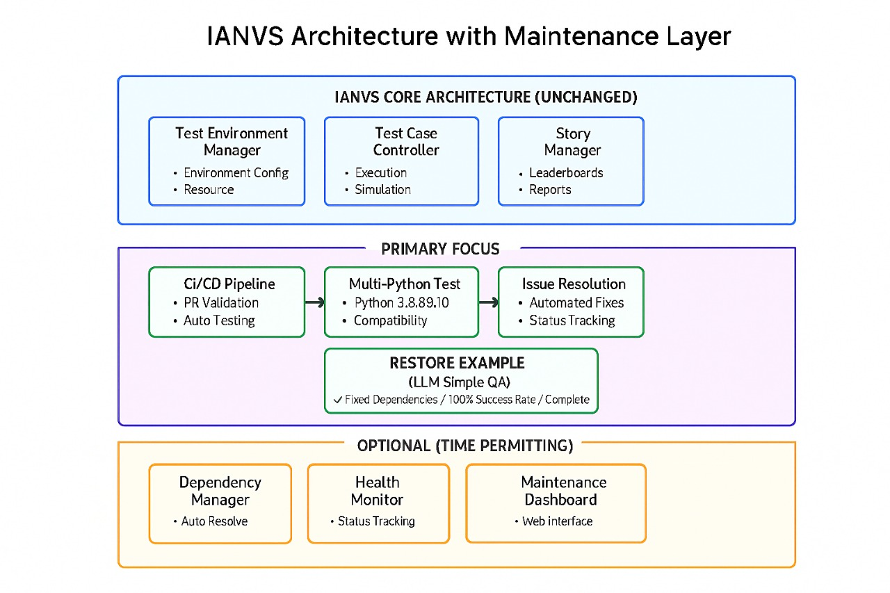

# KubeEdge Ianvs Example Restoration 

Focused Example Restoration and CI/CD Pipeline Development for Distributed Synergy AI Benchmarking

---

## Background

Edge computing emerges as a promising technical framework to overcome the challenges in cloud computing. In this machine-learning era, the AI application becomes one of the most critical types of applications on the edge. Driven by the increasing computation power of edge devices and the increasing amount of data generated from the edge, distributed synergy AI benchmarking has become essential for evaluating edge AI performance across device, edge, and cloud intelligence layers.

Ianvs serves as KubeEdge SIG AI distributed benchmark toolkit. As more and more contributors running, KubeEdge Ianvs now has **25+ examples** and the number is still increasing. KubeEdge Ianvs then faces mounting usability issues due to dependency evolution and validation mechanisms. As Python versions, third-party libraries, and Ianvs features advance, partial historical examples fail to execute. This has led to surging user-reported Issues from confused contributors, untested PRs breaking core functionality of legacy features, severely outdated documentation misaligning with actual capabilities.

Without systematic intervention, the examples risk becoming obsolete for edge-AI developers and especially newcomers. According to recent developer surveys, contributors suffer from the lack of support on reliable examples and consistent execution environments; while new users are lost in the sea of broken dependencies and outdated configurations. That limits the wide application of distributed synergy AI techniques and hinders a prosperous ecosystem development. A comprehensive example restoration and validation framework is thus needed to ensure reliable benchmarking capabilities and optimize the contributor experience.

This proposal provides a systematic restoration approach for one complete distributed synergy AI example, so that contributors and maintainers can benefit from efficient maintenance support and consistent benchmark execution.

## Goals

For contributors and maintainers of distributed synergy AI solutions, the goals of the example restoration project are:

### **Primary Goals (Core Deliverables):**
- **Complete end-to-end restoration of one lifelong learning example** 
    - Full dependency resolution and compatibility fixing across Python versions (3.8, 3.9, 3.10)
    - Comprehensive documentation with step-by-step execution guide and troubleshooting playbook
    - Validated execution with 100% success rate and performance baseline establishment

- **Establish CI/CD pipeline infrastructure for automated validation**
    - GitHub Actions workflow for automated testing of the restored example
    - Multi-Python version compatibility testing and dependency validation
    - Failure detection, reporting, and clear feedback mechanisms for contributors

### **Optional Goals (Time Permitting - Maintenance Layer):**
- **Advanced maintenance automation tools** for contributors by providing
    - Automated dependency checking and conflict resolution tools
    - Example health monitoring dashboard and alert systems  
    - Documentation synchronization and auto-generation capabilities

- **Systematic maintenance framework** for maintainers by establishing
    - Template framework for extending restoration to additional examples
    - Automated maintenance task scheduling and execution tracking
    - Community contribution guidelines and validation standards

## Proposal

The distributed synergy AI example restoration project aims to resurrect the usability of one complete example and establish a CI/CD pipeline framework, with optional advanced maintenance tools if time permits.

### **Core Scope (Primary Focus):**
- **Complete restoration of one lifelong learning example** covering the most complex distributed-synergy AI use case
    - Manual dependency resolution and compatibility fixing
    - Complete documentation and debugging guides
    - Comprehensive testing and validation across multiple environments
- **CI/CD pipeline development** to support ongoing example sustainability
    - Automated testing pipeline for the restored example
    - Integration with GitHub Actions for PR validation
    - Framework extensible to other examples in the future

### **Optional Scope (Maintenance Layer - Time Permitting):**
- **Automated maintenance tools** in separate maintenance directory
    - Advanced dependency management and health monitoring systems
    - Automated documentation generation and synchronization tools
    - Example health dashboards and alerting mechanisms

**Targeting users:**
- **Contributors**: Submit working examples and modifications with confidence through CI/CD validation
- **Maintainers**: Monitor example health efficiently through automated pipeline reports
- **Future Contributors**: (Optional) Use advanced maintenance tools for efficient development

**The scope of restoration does NOT include:**
- Complete restoration of all 25+ examples (focus on one lifelong learning example)
- Re-invention of existing Ianvs core architecture
- Re-invention of existing KubeEdge platform or edge-cloud synergy frameworks

## Design Details

### User Flow

#### **Contributor Workflow (Primary Focus):**
1. **Example Reference:**
    - Access fully restored lifelong learning example as reference implementation
    - Follow comprehensive documentation with step-by-step setup and execution guide

2. **Contribution Submission:**
    - Submit PR with automatic CI/CD pipeline validation
    - Receive clear feedback on compatibility, dependency conflicts, and test results

3. **Issue Resolution:**
    - Use debugging playbook based on restored example common failure patterns
    - Apply fixes following established restoration methodology and best practices


#### **Maintainer Workflow (Primary Focus):**
1. **Health Monitoring:**
    - Monitor CI/CD pipeline status and example execution health through automated reports
    - Receive notifications on example functionality and dependency status changes

2. **Issue Analysis:**
    - Access detailed failure logs and root cause analysis from CI/CD pipeline
    - Apply systematic fixes using documented restoration methodology

3. **Framework Extension:**
    - Use established CI/CD framework template to extend monitoring to additional examples
    - Leverage restoration patterns and documentation for future example maintenance


#### **Advanced Workflow (Optional - If Time Permits):**
- **Automated Maintenance Tools**: Access advanced dependency management and health monitoring
- **Auto-Documentation**: Benefit from synchronized documentation and automated tutorial generation

### Architecture and Modules

The architecture maintains core Ianvs unchanged while adding a separate maintenance directory for contributor/maintainer tools:

#### **Core Architecture (Primary Focus):**

**🔧 Core Ianvs Components (Unchanged):**
- **Test Environment Manager**: Handles test environment configuration
- **Test Case Controller**: Manages test case execution and simulation  
- **Story Manager**: Generates leaderboards and test reports

**✅ CI/CD Integration Layer:**
- **Automated Testing Pipeline**: GitHub Actions workflows for validation
- **Documentation Framework**: Comprehensive guides for the restored example
- **Contribution Templates**: Standardized processes following restoration methodology



#### **Optional Maintenance Layer (Time Permitting):**

**🔄 Advanced Maintenance Components (Separate Directory):**
- **Health Monitoring System**: Automated example health tracking and alerting
- **Dependency Management Tools**: Advanced conflict resolution and compatibility checking
- **Auto-Documentation Generator**: Synchronized documentation and tutorial automation

### File Structure

The file structure prioritizes core deliverables with optional maintenance components:

```
ianvs/
├── core/                               # Existing Ianvs core (unchanged)
├── examples/                           # Existing examples
│   ├── lifelong-learning/              # Target example for restoration
│   │   ├── [selected_example]/         # One fully restored example
│   │   │   ├── README_RESTORED.md     # Complete setup and execution guide
│   │   │   ├── DEBUGGING_GUIDE.md     # Comprehensive troubleshooting playbook
│   │   │   ├── requirements_fixed.txt # Resolved dependency specifications
│   │   │   ├── testalgorithms/        # Fixed algorithm implementations
│   │   │   └── testenv_validated.yaml # Validated test environment config
│   └── [other_examples]/              # Existing examples (unchanged)
├── .github/workflows/                  # CI/CD Pipeline (Primary Focus)
│   ├── example_validation.yml          # Automated example testing
│   ├── pr_validation.yml               # PR submission validation
│   └── multi_python_test.yml           # Python 3.8, 3.9, 3.10 compatibility
└── maintenance/                        # Optional Maintenance Layer (Time Permitting)
    ├── tools/                          # Advanced maintenance tools
    │   ├── dependency_manager.py       # Automated dependency resolution
    │   ├── health_monitor.py           # Example health tracking
    │   └── doc_generator.py            # Documentation synchronization
    ├── dashboard/                      # Maintenance web interface
    │   ├── app.py                     # Health monitoring dashboard
    │   └── templates/                 # Dashboard UI templates
    └── docs/                          # Maintenance documentation
        ├── restoration_methodology.md  # Complete restoration process
        └── extension_guide.md         # Framework extension guidelines
```

### Roadmap

Focused 12-week roadmap with clear priorities and optional components:

#### **Phase 1: Core Example Restoration (Weeks 1-5)**
- **Week 1-2**: Lifelong learning example selection and comprehensive failure analysis
    - Analyze dependency conflicts, version incompatibilities, and execution errors
    - Document all failure modes and root causes for comprehensive understanding
- **Week 3-5**: Complete manual restoration and validation
    - Resolve all dependency conflicts and version compatibility issues
    - Create comprehensive documentation with step-by-step guides and debugging playbook
    - Validate 100% success rate across multiple Python versions (3.8, 3.9, 3.10)

#### **Phase 2: CI/CD Pipeline Development (Weeks 6-9)**  
- **Week 6-7**: GitHub Actions workflow development and testing
    - Implement automated testing pipeline for the restored example
    - Create multi-Python version compatibility testing framework
- **Week 8-9**: Integration and failure detection mechanisms
    - Develop failure detection, reporting, and clear feedback systems
    - Create contribution templates and guidelines based on restoration methodology

#### **Phase 3: Documentation and Validation (Weeks 10-11)**
- **Week 10**: Complete documentation package and community guidelines
    - Finalize comprehensive restoration methodology and debugging playbook
    - Create standardized contribution templates and validation requirements  
- **Week 11**: End-to-end validation and community integration testing
    - Validate complete workflow with community feedback and real-world testing
    - Ensure CI/CD pipeline integration works seamlessly with existing repository

#### **Phase 4: Optional Maintenance Layer (Week 12 - Time Permitting)**
- **Week 12**: Advanced maintenance tools development (if time permits)
    - Implement automated dependency management and health monitoring tools
    - Create maintenance dashboard for advanced example health tracking
    - Document framework for potential extension to additional examples

### Success Metrics

#### **Primary Success Metrics:**
- One fully functional lifelong learning example with 100% execution success rate
- Working CI/CD pipeline with automated testing across Python versions 3.8, 3.9, 3.10
- Complete documentation package including restoration methodology and debugging playbook
- Standardized contribution framework ready for community adoption

#### **Optional Success Metrics (Time Permitting):**
- Functional maintenance layer with automated health monitoring and dependency management
- Advanced dashboard for maintainer efficiency and automated maintenance workflows
- Template framework validated and ready for extension to additional examples