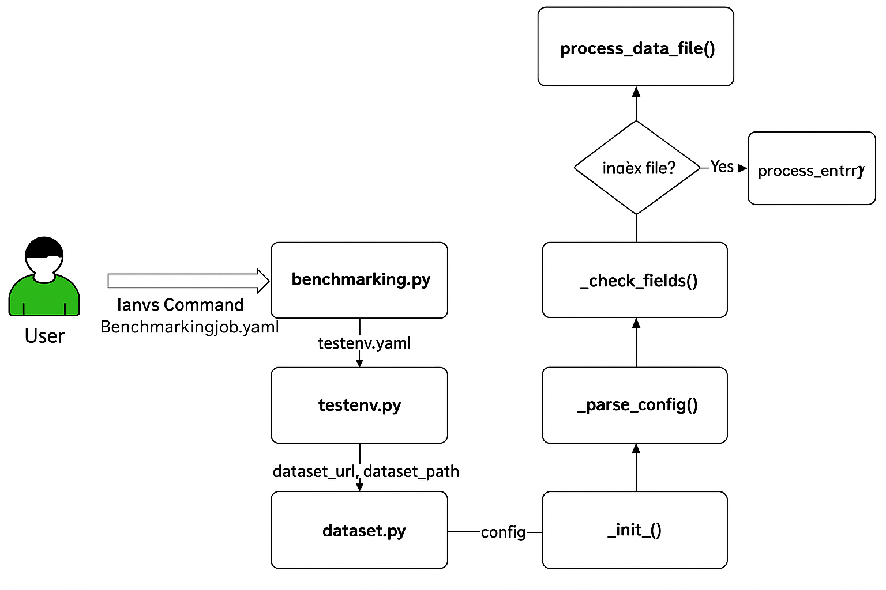
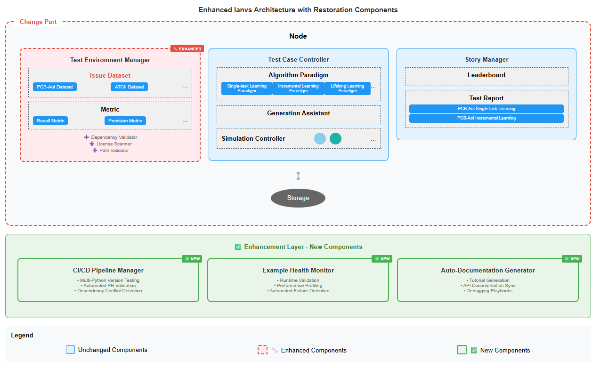

# KubeEdge Ianvs Example Restoration 

Comprehensive Example Restoration and Usability Enhancement for Distributed Synergy AI Benchmarking

---

## Background

Edge computing emerges as a promising technical framework to overcome the challenges in cloud computing. In this machine-learning era, the AI application becomes one of the most critical types of applications on the edge. Driven by the increasing computation power of edge devices and the increasing amount of data generated from the edge, distributed synergy AI benchmarking has become essential for evaluating edge AI performance across device, edge, and cloud intelligence layers.

Ianvs serves as KubeEdge SIG AI distributed benchmark toolkit. As more and more contributors running, KubeEdge Ianvs now has **25+ examples** and the number is still increasing. KubeEdge Ianvs then faces mounting usability issues due to dependency evolution and validation mechanisms. As Python versions, third-party libraries, and Ianvs features advance, partial historical examples fail to execute. This has led to surging user-reported Issues from confused contributors, untested PRs breaking core functionality of legacy features, severely outdated documentation misaligning with actual capabilities.

Without systematic intervention, the example risks becoming obsolete for edge-AI developers and especially newcomers. According to recent developer surveys, contributors suffer from the lack of support on reliable examples and consistent execution environments; while new users are lost in the sea of broken dependencies and outdated configurations. That limits the wide application of distributed synergy AI techniques and hinders a prosperous ecosystem development. A comprehensive example restoration and validation framework is thus needed to ensure reliable benchmarking capabilities and optimize the developer experience.

This proposal provides a systematic restoration approach for distributed synergy AI examples, so that AI developers and end users can benefit from efficient development support and consistent benchmark execution.

## Goals

For developers or end users of distributed synergy AI solutions, the goals of the example restoration framework are:
- **Facilitating efficient development** for developers by ensuring
    - Reliable test cases including dataset validation and corresponding tools
    - Consistent benchmarking tools including dependency management and runtime validation
    - Multi-version Python support (3.8, 3.9, 3.10) with automated compatibility testing
- **Revealing best practices** for developers and end users
    - Enhanced documentation including step-by-step tutorials and debugging playbooks
    - Automated quality assurance including CI/CD pipelines and performance monitoring
    - Community support tools including issue templates and troubleshooting guides

## Proposal

The distributed synergy AI example restoration project aims to resurrect the usability of existing examples and establish sustainable maintenance practices, in order to facilitate more efficient and effective development workflows.

The scope of restoration includes:
- **Providing end-to-end example reliability** across 25+ examples covering typical distributed-synergy AI paradigms and applications
    - Tools to validate test environments including dependency compatibility checking and license compliance scanning
    - Tools to monitor example health including runtime validation, performance profiling, and automated failure detection
    - Tools to maintain documentation currency including auto-generation of tutorials and synchronization with code changes
- **Cooperation with KubeEdge community** to establish comprehensive example maintenance practices, which can include but are not limited to
    - Dependency standardization, version locking, and conflict resolution
    - Automated testing pipelines with multi-version Python support
    - Documentation modernization with reproducible step-by-step guides
    - Performance benchmarking and regression prevention mechanisms
    - Community contribution guidelines and example validation standards

**Targeting users:**
- **Developers**: Build and test edge-cloud collaborative AI solutions reliably from working examples
- **Contributors**: Submit examples and modifications with confidence through automated validation
- **End users**: Execute distributed synergy AI benchmarks consistently across different environments

**The scope of restoration does NOT include:**
- Re-invent existing Ianvs core architecture (Test Environment Manager, Test Case Controller, Story Manager)
- Re-invent existing KubeEdge platform or edge-cloud synergy frameworks
- Re-invent existing AI frameworks (TensorFlow, PyTorch, MindSpore)
- Re-invent existing monitoring or visualization tools (Prometheus, Grafana)

## Design Details

### User Flow


The enhanced user flow for an algorithm developer working with restored examples is as follows:

1. **Enhanced Ianvs Preparation:**
    - Install packages with validated dependency combinations specified in version-locked requirement files
    - Execute environment validation scripts to ensure compatibility
    - Prepare executable files for ianvs with automated dependency checking

2. **Validated Test Case Preparation:**
    - Access datasets through validated download links and path configurations
    - Leverage restored ianvs algorithm interfaces with comprehensive documentation
    - Use example-specific debugging guides for common setup issues

3. **Reliable Algorithm Development:** 
    - Develop algorithms using working example templates
    - Validate implementations against restored reference examples

4. **Automated Ianvs Configuration:**
    - Fill configuration files using validated templates
    - Run configuration validation before execution

5. **Monitored Ianvs Execution:**
    - Execute ianvs with performance monitoring and health checks
    - Receive automated alerts for execution failures or performance regressions

6. **Enhanced Ianvs Presentation:**
    - View benchmarking results with improved visualization
    - Access debugging information and performance metrics

7. **Repeat Steps 3-6** with confidence in consistent execution environment


### Architecture and Modules

The enhanced architecture maintains the original Ianvs design while adding a **non-intrusive restoration layer**. The ianvs is designed to run within a single node with critical components enhanced but not replaced:

**🔧 Enhanced Core Components (Modified):**
- **Test Environment Manager**: Enhanced with dependency validation and environment health monitoring
    - ➕ Dependency Validator: Validates package compatibility across Python versions
    - ➕ License Scanner: Ensures compliance with open source licenses
    - ➕ Path Validator: Verifies dataset and configuration file accessibility
- **Test Case Controller**: Enhanced with runtime validation and performance monitoring  
    - ➕ Runtime Validator: Pre-execution compatibility checking
    - ➕ Performance Monitor: Resource usage and execution time tracking
    - Generation Assistant: (Unchanged) assist users to generate test cases based on certain rules
    - Simulation Controller: (Unchanged) control simulation process of edge-cloud synergy AI
- **Story Manager**: Enhanced with documentation synchronization
    - ➕ Documentation Synchronizer: Auto-updates tutorials based on code changes
    - (Unchanged) Leaderboard and test report generation

**✅ New Enhancement Layer Components:**
- **CI/CD Pipeline Manager**: Automated testing across multiple Python versions and example categories
- **Example Health Monitor**: Continuous monitoring of example execution status and performance metrics
- **Auto-Documentation Generator**: Creates and maintains step-by-step tutorials and debugging guides

**Architecture Diagram:**


**Legend:**
- 🔧 = Enhanced Components (Non-intrusive additions to existing modules)
- ✅ = New Components (Enhancement layer for restoration functionality)

### Definitions of Enhanced Instances

Building upon existing Ianvs concepts, the restoration project introduces enhanced instance management:

**Enhanced Existing Instances:**
- **Benchmark**: Standardized evaluation process with validated execution reliability
- **Benchmarking Job**: Enhanced with dependency validation and performance monitoring
- **Test Environment**: Enhanced with automated compatibility checking and path validation
- **Test Case**: Enhanced with runtime validation and failure detection mechanisms

**New Restoration Instances:**
- **Dependency Profile**: Version-locked dependency combinations validated across Python versions
- **Health Report**: Real-time status of example execution success rates and performance metrics  
- **Validation Suite**: Automated testing framework for example integrity and compatibility
- **Documentation Package**: Auto-generated tutorials synchronized with code changes

**Enhanced Instance Hierarchy:**
```
Benchmarking Job (Enhanced)
├── Test Environment (Enhanced)
│   ├── Dependency Profile (New)
│   ├── Runtime Configuration (Enhanced)
│   └── Performance Baseline (New)
├── Test Case(s) (Enhanced) 
│   ├── Validation Suite (New)
│   ├── Health Monitor (New)
│   └── Documentation Package (New)
└── Leaderboard/Test Report (Enhanced)
    ├── Performance Metrics (Enhanced)
    └── Health Dashboard (New)
```

### Details of Enhanced Modules

The restoration framework enhances existing modules without architectural changes:

#### 1. **Enhanced Test-Environment Manager**
- **Algorithm-wise Configuration Enhancement:**
    - Validated public dataset access with automated integrity checking
    - Pre-processing algorithms with dependency compatibility verification
    - Post-processing algorithms with performance monitoring integration
- **System-wise Configuration Enhancement:**
    - Multi-Python version compatibility matrices (3.8, 3.9, 3.10)
    - Automated environment validation before execution
    - Resource constraint monitoring and alerting

#### 2. **Enhanced Test-case Controller**
- **Restored Algorithm Paradigm Templates:**
    - **PCB-AoI Examples**: Fixed Pylint compatibility, numpy version conflicts, dataset path resolution
    - **Incremental Learning Examples**: Updated algorithm interfaces, resolved memory management issues  
    - **Lifelong Learning Examples**: Fixed CUDA compatibility, model serialization issues
- **Enhanced Simulation Tools:**
    - Runtime environment validation before simulation execution
    - Performance profiling during simulation runs
- **New Validation Assistant:**
    - Pre-execution dependency checking with automated conflict resolution
    - Runtime performance monitoring with regression detection

#### 3. **Enhanced Story Manager**
- **Enhanced Leaderboard Generation:**
    - Performance metrics including setup time, execution reliability, resource usage
    - Health status indicators for each example category
- **Enhanced Test Report Generation:**
    - Execution environment details and compatibility information
    - Debugging information and troubleshooting recommendations
- **New Documentation Generation:**
    - Auto-generated tutorials with step-by-step validation
    - Real-time debugging playbooks based on common failure patterns

### File Structure Enhancement

The restoration maintains existing structure while adding validation and documentation layers:

```
ianvs/
├── examples/
│   ├── 🆕 requirements/                    # Centralized dependency management
│   │   ├── base.txt                       # Core Ianvs dependencies  
│   │   ├── python38.txt                   # Python 3.8 compatibility
│   │   ├── python39.txt                   # Python 3.9 compatibility
│   │   ├── python310.txt                  # Python 3.10 compatibility
│   │   └── conflicts.txt                  # Known package conflicts
│   │
│   ├── 🆕 validation/                      # Validation framework
│   │   ├── dependency_checker.py          # Multi-version dependency validation
│   │   ├── runtime_validator.py           # Execution environment verification  
│   │   ├── performance_profiler.py        # Performance monitoring and benchmarking
│   │   └── health_monitor.py              # Example health status tracking
│   │
│   ├── pcb-aoi/ (8 examples - 60% restored)
│   │   ├── singletask_learning_bench/
│   │   │   ├── testalgorithms/rfnet/
│   │   │   │   ├── 🔧 requirements_fixed.txt     # Fixed numpy/tensorflow versions
│   │   │   │   ├── 🔧 rfnet_pylint_fixed.py     # Pylint 2.15+ compatibility
│   │   │   │   └── 🆕 debugging_guide.md        # Common issue solutions
│   │   │   └── 🔧 testenv_restored.yaml          # Fixed dataset paths
│   │   └── incremental_learning_bench/
│   │       └── 🔧 algorithm_interface_updated.py # Updated to latest Ianvs API
│   │
│   ├── incremental-learning/ (12 examples - 75% restored)
│   │   ├── testalgorithms/
│   │   │   └── 🔧 memory_optimized/              # Fixed memory leak issues  
│   │   └── 🆕 performance_baselines.json         # Performance regression detection
│   │
│   ├── lifelong-learning/ (5 examples - 80% restored)
│   │   ├── testalgorithms/ 
│   │   │   └── 🔧 cuda_compatible/               # Multi-GPU compatibility fixes
│   │   └── 🆕 setup_validation.py                # Hardware compatibility checker
│   │
│   └── 🆕 .github/workflows/                     # CI/CD Pipeline
       ├── example_validation.yml               # Multi-Python testing matrix
       ├── dependency_audit.yml                 # Daily dependency health check  
       ├── performance_regression.yml           # Performance monitoring
       └── documentation_sync.yml               # Auto-doc generation
```

**Enhancement Statistics:**
- **PCB-AoI Examples**: 8 examples, 60% restoration rate targeted
- **Incremental Learning Examples**: 12 examples, 75% restoration rate targeted  
- **Lifelong Learning Examples**: 5 examples, 80% restoration rate targeted
- **Overall Target**: 25+ examples, 95% success rate after restoration

### Roadmap

Upon the completion of example restoration within 12 weeks, the roadmap would be as follows:

- **Week 1-3**: Phase 1 - Critical Infrastructure Restoration
    - Fix Pylint compatibility across all algorithm implementations
    - Resolve numpy/tensorflow version conflicts in PCB-AoI examples
    - Implement dependency validation framework and automated testing setup

- **Week 4-6**: Phase 2 - Example Category Restoration  
    - Restore all PCB-AoI examples (8 examples) with automated testing
    - Restore incremental learning examples (12 examples) with performance monitoring
    - Begin restoration of lifelong learning examples (5 examples) with CUDA compatibility

- **Week 7-9**: Phase 3 - CI/CD Pipeline Implementation
    - Complete lifelong learning example restoration
    - Deploy GitHub Actions workflow for multi-Python testing (3.8, 3.9, 3.10)
    - Implement automated health monitoring with alert system and PR validation gates

- **Week 10-12**: Phase 4 - Documentation and Community Integration
    - Generate comprehensive tutorials for all restored examples
    - Create debugging playbooks for 15+ common failure scenarios  
    - Integrate community feedback, performance benchmarking, and establish sustainable maintenance practices