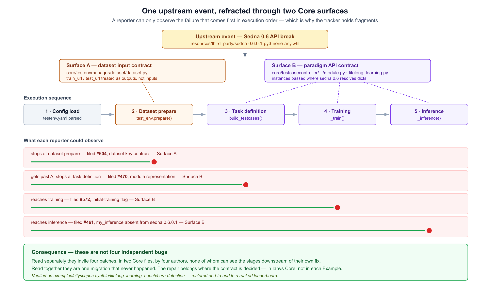
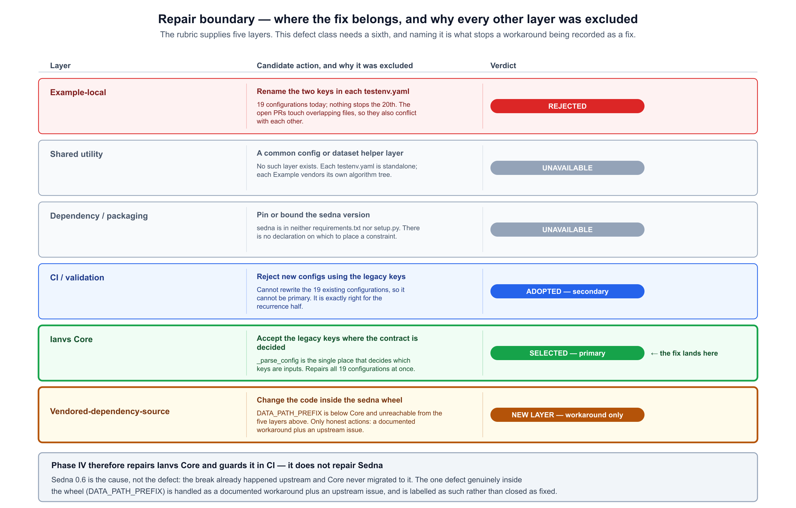
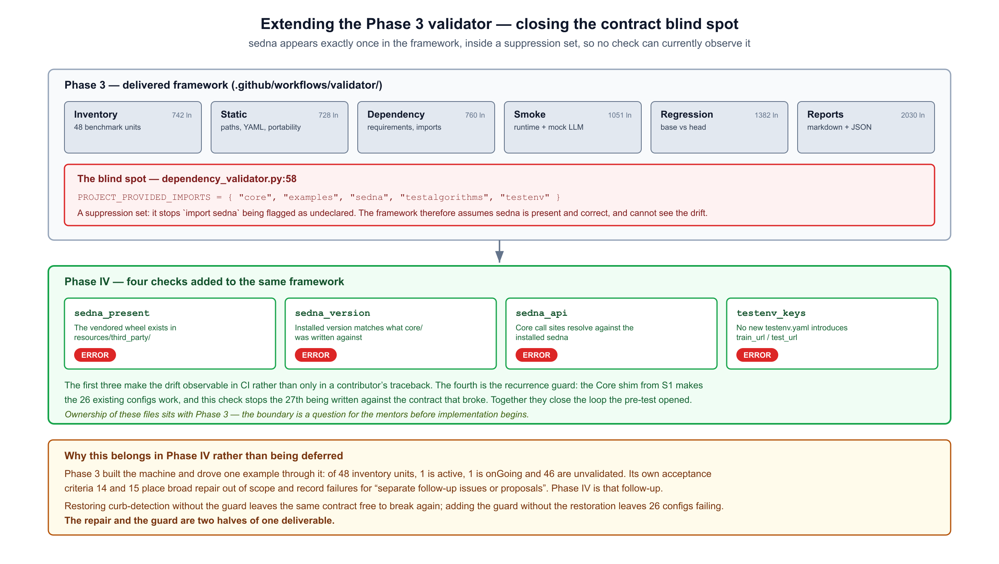
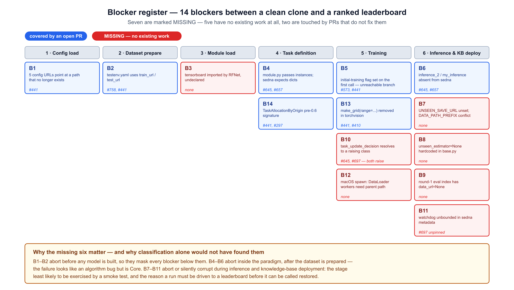
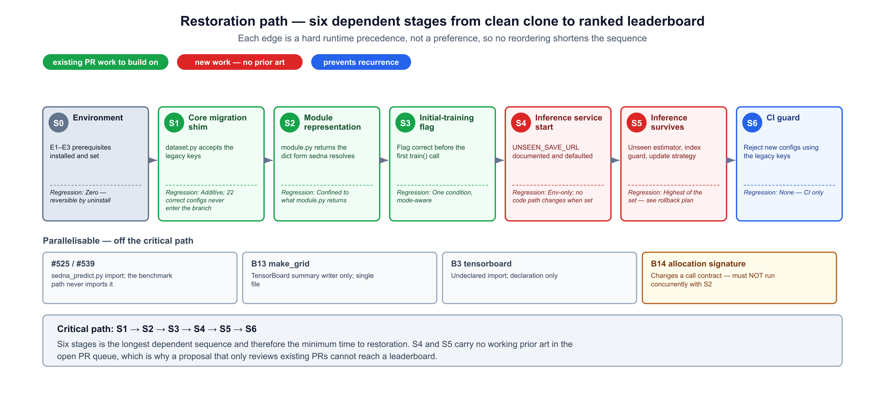

# KubeEdge Ianvs Example Restoration — Phase IV

**LFX Mentorship 2026 Term 3 · CNCF / KubeEdge**
Author: Suhaan ([@suhaan-24](https://github.com/suhaan-24))
Project: Comprehensive Example Restoration for Ianvs: Phase IV — Simulator for Edge-cloud Collaborative AI

---

## Cited targets — state verified 2026-08-29

| Target | State | Role in this proposal |
|---|---|---|
| [#604](https://github.com/kubeedge/ianvs/issues/604) | **closed** (completed, 2026-08-27) | Surface A — dataset input contract. Closed, but the behaviour persists at `main`; see Problem Statement. |
| [#470](https://github.com/kubeedge/ianvs/issues/470) | open | Surface B — `module.py` passes instances where sedna resolves dicts |
| [#461](https://github.com/kubeedge/ianvs/issues/461) | open | Surface B — `my_inference` absent from sedna 0.6.0.1 |
| [#572](https://github.com/kubeedge/ianvs/issues/572) | open | Surface B — initial-training flag set on the first call |
| [#743](https://github.com/kubeedge/ianvs/issues/743) | open | CI check for broken example config paths — the recurrence guard relates to this |
| [#758](https://github.com/kubeedge/ianvs/pull/758) | open PR | Warn on deprecated dataset fields — the alternative to the Core shim |
| [#645](https://github.com/kubeedge/ianvs/pull/645) | open PR | Sedna API mismatches and module objects |
| [#697](https://github.com/kubeedge/ianvs/pull/697) | open PR | Restores the curb-detection benchmark at the example layer |

Code state verified against `origin/main` at commit `95016db` (2026-08-27).

---

## Background

Ianvs ships benchmarking examples across edge AI, cloud-edge collaboration, federated and lifelong
learning, LLM benchmarking and robotics. Three prior mentorship phases have worked on keeping them
runnable:

| Phase | Term | What it delivered |
|---|---|---|
| [Phase 1](../phase-1-2025-term-3/example-restoration.md) ([#263](https://github.com/kubeedge/ianvs/pull/263)) | 2025 T3 | Restoration direction, methodology and roadmap |
| [Phase 2](../phase-2-2026-term-1/Example_Restoration.md) ([#375](https://github.com/kubeedge/ianvs/pull/375)) | 2026 T1 | Concrete repair plan for named broken examples |
| [Phase 3](../phase-3-2026-term-2/proposal.md) ([#541](https://github.com/kubeedge/ianvs/pull/541)) | 2026 T2 | Example Classification CI Validation Framework |

Phase 3 built the machinery — an inventory, tiered validation, regression-aware pull-request
comparison and published health reporting — and drove exactly one example through it end to end.
The inventory records the result plainly:

| Status | Benchmark units |
|---|---|
| `active` | 1 (`simple_qa_singletask_learning`) |
| `onGoing` | 1 (`execution_yaml_pending`) |
| `unvalidated` | **46** |

Phase 3's own acceptance criteria 14 and 15 place broad repair out of scope and require that
"failures requiring repair outside `examples/llm_simple_qa` are recorded for separate follow-up
issues or proposals."

**Phase IV is that follow-up.** It takes one of the largest unvalidated groups — the
lifelong-learning family — establishes why it fails, repairs it in the layer where the defect
actually lives, and adds the CI checks that stop the same break recurring.

---

## Goals

1. Identify the root cause behind the lifelong-learning example failures, rather than treating the
   open issues as independent defects.
2. Restore `examples/cityscapes-synthia/lifelong_learning_bench/curb-detection` from a clean clone
   to a ranked leaderboard.
3. Place each repair in the layer where the defect is decided, with the boundary decision
   justified and every rejected layer recorded.
4. Extend the Phase 3 validator so the contract that broke becomes observable in CI instead of only
   in a contributor's traceback.
5. Prevent recurrence: make it impossible to merge a new configuration written against the broken
   contract.
6. Record honestly what is repaired, what is worked around, and what must go upstream — so a
   workaround is never closed as a fix.

---

## Problem Statement

### 1. The open issues look independent, and are being fixed that way

Four open issues describe the lifelong-learning failure:

| Issue | Reported symptom |
|---|---|
| [#604](https://github.com/kubeedge/ianvs/issues/604) | `train_url`/`test_url` in `testenv.yaml` are not read by core — *closed as completed 2026-08-27, but see below* |
| [#470](https://github.com/kubeedge/ianvs/issues/470) | `module.py` passes instances where sedna expects dicts |
| [#461](https://github.com/kubeedge/ianvs/issues/461) | `my_inference` does not exist in sedna 0.6.0.1 |
| [#572](https://github.com/kubeedge/ianvs/issues/572) | `HAS_COMPLETED_INITIAL_TRAINING` set wrongly on the first call |

Several open pull requests address them, mostly by editing example directories. Read separately, they
invite separate patches in two Core files by different authors, none of whom can see the stages
downstream of their own fix.

**#604 is closed, and the behaviour it describes is still present.** It was closed as *completed* on
2026-08-27. Verified against `origin/main` at commit `95016db` (2026-08-27):
`_parse_config` still assigns only attributes already present in `__dict__`, and `_check_fields`
still raises `NotImplementedError('not one of train_index/train_data/train_data_info')`. The pull
request that would have warned on the deprecated fields,
[#758](https://github.com/kubeedge/ianvs/pull/758), remains open and unmerged. Nineteen example
configurations still declare `train_url`/`test_url` with no modern key alongside — none declares
both. The issue is closed; the defect is not.

### 2. They are one defect, refracted

Ianvs vendors and installs `resources/third_party/sedna-0.6.0.1-py3-none-any.whl`, but `core/` was
written against a **pre-0.6 Sedna API**. That is a single upstream event — the Sedna 0.6 API break —
which Ianvs Core never migrated to. It surfaces on two independent Core surfaces that fail in a
fixed order:

- **Surface A — dataset input contract.** `core/testenvmanager/dataset/dataset.py` treats
  `train_url`/`test_url` as outputs it computes, and requires `train_index`/`train_data`/
  `train_data_info` as inputs. Every lifelong-learning example still declares the old keys.
- **Surface B — paradigm API contract.** `core/testcasecontroller/algorithm/module/module.py` hands
  sedna live Python instances where sedna 0.6.0.1 resolves `{"method": ..., "param": ...}` dicts;
  `paradigm/lifelong_learning/lifelong_learning.py` calls `my_inference` / `my_evaluate` /
  `inference_2`, which sedna 0.6.0.1 does not expose.

Because execution is sequential, a reporter can only ever observe the failure that comes **first**.
That is precisely why the tracker holds fragments rather than one issue.



### 3. Nothing prevents the next occurrence

Core silently discards unknown configuration keys. Renaming the keys in the nineteen affected
configurations repairs them once and does nothing about the twentieth, written later against the old
contract. There is no check anywhere in the repository that would notice.

### 4. The CI framework cannot currently see any of this

Phase 3's validator is inventory-driven and thorough, but the string `sedna` appears exactly **once**
in its entire source — in `dependency_validator.py:58`, inside `PROJECT_PROVIDED_IMPORTS`, a
suppression set whose purpose is to stop `import sedna` being flagged as an undeclared dependency.
The framework therefore assumes Sedna is present and correct, and has no check that could observe a
version or contract mismatch.

---

## Proposal

Phase IV restores one example completely and closes the contract loop behind it:

1. **Migrate the contract in Core.** Accept the legacy dataset keys in
   `core/testenvmanager/dataset/dataset.py`, where the decision about which keys are inputs is made.
   This repairs every affected configuration at once, without editing any of them.
2. **Repair the paradigm surface.** Correct the module representation, the initial-training flag,
   and the stale Sedna method names in the lifelong-learning paradigm.
3. **Carry the run to a leaderboard.** Resolve the inference and knowledge-base blockers that no
   open pull request currently addresses — the stages a smoke test never reaches.
4. **Extend the Phase 3 validator** with four checks that make the contract observable and reject
   new configurations written against the broken one.
5. **Record the residue.** Document the one defect that lives inside the vendored wheel as a
   workaround plus an upstream issue, explicitly not as a fix.

---

## Scope

### In scope

- `examples/cityscapes-synthia/lifelong_learning_bench/curb-detection`, restored from a clean clone
  to a ranked leaderboard.
- `core/testenvmanager/dataset/dataset.py` — the dataset input contract.
- `core/testcasecontroller/algorithm/module/module.py` and
  `core/testcasecontroller/algorithm/paradigm/lifelong_learning/lifelong_learning.py` — the paradigm
  API contract.
- Four new checks in `.github/workflows/validator/`, plus the inventory entry updates they require.
- Documentation of the environment prerequisites the restored run depends on.
- An upstream Sedna issue for the defect inside the wheel.

### Out of scope

- **Repairing Sedna.** Sedna 0.6 is the cause, not the defect. The break already happened upstream;
  what is broken in this repository is Core's failure to migrate to it. See *Position on the Phase 2
  precedent* below.
- **Rebuilding or repacking the vendored wheel.**
- **The other 45 unvalidated benchmark units.** Phase IV establishes the pattern and the guard;
  applying them across the fleet is follow-on work, and is listed under Future Work.
- **Restoring examples whose datasets are not publicly resolvable.** `mdil-ss` has no resolvable
  public direct link and BDD100K is Baidu-Pan gated; both are recorded as blocked rather than
  attempted.
- **Rewriting the open pull requests that address these issues.** Phase IV's Core migration is designed so they can land
  independently, whenever convenient.

---

## Target Users

### Ianvs maintainers

Today a maintainer reviewing any of the open pull requests on these issues has to decide, per pull request,
whether an example-level rename is the right fix — without a stated position on where the contract
belongs. After Phase IV the boundary is documented, the Core migration makes the renames optional
rather than urgent, and CI answers the recurrence question automatically.

### Contributors

A contributor who clones Ianvs and runs a lifelong-learning example currently hits a failure whose
traceback points at an algorithm file, when the cause is a Core contract. After Phase IV the
example runs; if it does not, the validator names the contract mismatch directly.

### Developers and enterprise users evaluating Ianvs

The lifelong-learning examples are the demonstration of Ianvs's distinguishing capability. An
evaluator who cannot run one has no way to assess the framework. Phase IV makes at least one of them
reproducible from a clean checkout, with the environment prerequisites written down.

---

## Design Details

### Repair boundary — where each fix belongs

The decisive question is not *what* is broken but *which layer owns it*. Every candidate layer was
enumerated and either selected or excluded with a stated reason.



**Example-local — rejected.** This is the current de facto consensus across the open pull requests.
It fails on three counts. It does not scale: the same two-key rename must be made correctly in every
lifelong-learning configuration, and nothing prevents the next one being written against the old
contract. It self-obstructs: measured on 2026-08-22 across the eight pull requests reviewed during the
pre-test, 30 of the 58 files they touch were touched by more than one of them, so they conflict with
each other as well as with the problem. And it leaves no enforcement, because Core
silently discards unknown keys.

**Shared utility — unavailable.** There is no shared config or dataset-helper layer between
examples. Each `testenv.yaml` is standalone and each example vendors its own algorithm tree.
Introducing such a layer to resolve a two-key rename would be a large architectural change that
would still not remove the need for Core to accept the contract.

**Dependency / packaging — unavailable.** `sedna` is declared in neither `requirements.txt` nor
`setup.py`. It exists only as a vendored wheel installed by hand per the README. There is no
declaration on which to place a version bound, so this layer has no handle on the defect at all.

**CI / validation — adopted, secondary.** A validator cannot rewrite existing configurations, so it
cannot be the primary boundary. It is exactly right for the recurrence half.

**Ianvs Core — selected, primary.** `_parse_config` is the single place that decides which keys are
inputs. Fixing the decision where it is made repairs every affected configuration at once and makes
the next one impossible.

### The sixth layer

One defect in this example is genuinely *below* Ianvs Core. Reaching a completed run requires
setting `UNSEEN_SAVE_URL` explicitly, because `DATA_PATH_PREFIX` has no satisfying value:

| `DATA_PATH_PREFIX` | Task-index paths | Unseen-sample directory |
|---|---|---|
| `/home/data` (sedna default) | ok | unwritable where `/home` is autofs-managed |
| a real writable directory | `FileOps.join_path` strips leading separators, doubling the absolute index path | ok |
| `/` | ok | `mkdir /unseen_samples` at filesystem root → `OSError: [Errno 30]` |

The line responsible is in
`sedna/core/lifelong_learning/knowledge_management/edge_knowledge_management.py`, reading
`BaseConfig.data_path_prefix`. It is not in an example directory and not in Ianvs Core — it is
inside the vendored wheel. An example-local fix can only export an environment variable; a Core fix
can only set that variable on the example's behalf; and the dependency layer has no declaration to
constrain.

A boundary analysis of this repository therefore needs a **Vendored-dependency-source** row, whose
only true repairs are an upstream Sedna change or replacing the wheel, and whose only *available*
action today is a documented workaround plus an upstream issue. Naming that layer explicitly is what
stops a workaround being recorded as a fix.

### Position on the Phase 2 precedent

[Phase 2](../phase-2-2026-term-1/Example_Restoration.md) took a different position, and it is merged
into this repository. It committed to patching Sedna and shipping a repacked wheel — "This proposal
produces a new Sedna wheel versioned 0.4.1.1, created by patching the existing
`sedna-0.4.1-py3-none-any.whl` in-place" — justified on the grounds that:

> Sedna is **not an external third-party dependency** — it is Ianvs's own built-in algorithm library,
> located at `core/lib/sedna/` within the Ianvs repository itself.

**That premise does not hold at the current `main`.** There is no `core/lib/` directory, no
`core/lib/sedna` anywhere in the history, and the only Sedna present is
`resources/third_party/sedna-0.6.0.1-py3-none-any.whl` — declared in neither `requirements.txt` nor
`setup.py`.

Phase IV therefore does not adopt the wheel-patching strategy. Where Sedna's own code is implicated,
the deliverable is a documented workaround plus an upstream issue, labelled as such. This is a
deliberate divergence from Phase 2 rather than an oversight, and it is offered for the mentors'
review: if the maintainers prefer the Phase 2 approach, the wheel-level defect can be reclassified,
but the justification would need restating against the current repository layout.

### Relationship to the Phase 3 CI framework



Phase IV adds four checks to the framework Phase 3 delivered:

| Check | Rule | Level |
|---|---|---|
| `sedna_present` | The vendored wheel exists in `resources/third_party/`. | `ERROR` |
| `sedna_version` | The installed Sedna version matches what `core/` is written against. | `ERROR` |
| `sedna_api` | Core call sites resolve against the installed Sedna. | `ERROR` |
| `testenv_keys` | No `examples/**/testenv*.yaml` introduces `train_url:` or `test_url:`. | `ERROR` |

The first three make the drift observable in CI rather than only in a contributor's traceback. The
fourth is the recurrence guard, and relates to open issue
[#743](https://github.com/kubeedge/ianvs/issues/743).

These land in `.github/workflows/validator/`, which is Phase 3's territory. **Ownership is a question
for the mentors before implementation begins**, and Phase IV is prepared to deliver them either as
merged code or as a written specification handed to the framework's maintainer.

---

## Blocker register

Fourteen blockers stand between a clean clone and a ranked leaderboard for the covered example.
Seven are covered by open pull requests. Seven are marked MISSING: five have no existing work
anywhere in the queue, and two are touched by pull requests that do not fix them.



| ID | Blocker | Stage blocked | Existing work | Status |
|---|---|---|---|---|
| B1 | Five config URLs point at a path that no longer exists | config load | #441 | open |
| B2 | `testenv.yaml` uses `train_url`/`test_url` | `test_env.prepare()` | #758, #441 | open |
| B3 | `tensorboard` imported by RFNet, undeclared | module load | none | **MISSING** |
| B4 | `module.py` passes instances; sedna expects dicts | `build_testcases()` | #645, #657 | open |
| B5 | `HAS_COMPLETED_INITIAL_TRAINING` set on the first call | `_train()` | #573, #441 | open |
| B6 | `inference_2` / `my_inference` / `my_evaluate` absent from sedna 0.6.0.1 | `_inference()` | #645, #657 | open |
| B7 | `UNSEEN_SAVE_URL` unset; `DATA_PATH_PREFIX` cannot satisfy both consumers | inference service start | none | **MISSING** |
| B8 | `unseen_estimator=None` hardcoded in `base.py` | unseen-sample predict | none | **MISSING** |
| B9 | Round-1 eval index has `data_url=None` | KB deploy to edge | none | **MISSING** |
| B10 | `task_update_decision` default resolves to a class that raises `TypeError` | `_train()` | #645, #697 both land on the raising class | **MISSING** |
| B11 | `watchdog` unbounded in sedna's own metadata | inference service start | #697 adds it unpinned | **MISSING** |
| B12 | macOS spawn: DataLoader workers need RFNet's parent on `PYTHONPATH` | training | none | **MISSING** (env/doc) |
| B13 | `make_grid(range=...)` removed in torchvision | training | #441, #410, #488, #555 | open |
| B14 | `TaskAllocationByOrigin.__call__` uses a pre-0.6 signature | task allocation | #441, #297, #567 | open |

**Why the missing ones cluster.** B1–B2 abort before any model is built, so they mask every blocker
below them. B4–B6 abort inside the paradigm, after the dataset is prepared — the failure looks like
an algorithm bug but is Core. B7–B11 abort or silently corrupt during inference and knowledge-base
deployment: the stage least likely to be exercised by a smoke test, and the reason a run must be
driven all the way to a leaderboard before it can be called restored.

---

## Restoration path



### Fix order

| Stage | Fix | Dependency justification | Regression risk |
|---|---|---|---|
| S0 | Environment prerequisites | Imports fail without them; no repository state changes | Zero — reversible by uninstall |
| S1 | Core migration shim in `dataset.py` | `testenv` must resolve before anything else runs | Additive; configurations already using the modern keys never enter the branch |
| S2 | Module representation in `module.py` | Task definition must resolve before training | Scoped to the nine lifelong-only module types; `BASEMODEL` untouched — see below |
| S3 | Initial-training flag | The flag must be correct before the first `train()` | One condition, mode-aware |
| S4 | `UNSEEN_SAVE_URL` documented and defaulted | The inference service must start before inference | Environment-only; no code path changes when already set |
| S5 | Unseen estimator, index guard, update-strategy module | Inference must survive to produce results | Highest of the set — see rollback below |
| S6 | CI guard and documentation | Nothing depends on it; it protects everything before it | None — CI only |

### Critical path

**S1 → S2 → S3 → S4 → S5 → S6.** Six stages is the longest dependent sequence and therefore the
minimum time to restoration; no reordering shortens it, because each edge is a hard runtime
precedence rather than a preference. S4 and S5 carry no working prior art in the open pull request
queue, which is why a plan built only on reviewing existing pull requests cannot reach a leaderboard.

### Parallelisable work

| Item | Independent because |
|---|---|
| #525 / #539 | Touch `sedna_predict.py`, a standalone script the benchmark path never imports |
| B13 `make_grid` | Fires only when TensorBoard summaries are written; single file |
| B3 `tensorboard` | A declaration change only |
| B14 allocation signature | Single file — **but it changes a call contract and must not run concurrently with S2** |

### Rollback

S5 carries the highest regression risk because it introduces new behaviour rather than restoring
old. Each of its three changes is independently revertible, and the acceptance criterion for the
stage is that reverting any one of them returns the run to the failure it previously produced, not
to a different one.

---

## Module Details

### 1. Core migration shim — `core/testenvmanager/dataset/dataset.py`

The contract change is absorbed where the decision is made, in `_parse_config`. Legacy keys are
mapped to their modern equivalents rather than rejected, so existing configurations run unedited
while a deprecation warning names the correct key:

```python
_LEGACY_INPUT_MAP = {"train_url": "train_index", "test_url": "test_index"}

for attr, value in config.items():
    if attr in self._LEGACY_INPUT_MAP:
        target = self._LEGACY_INPUT_MAP[attr]
        if not config.get(target):
            LOGGER.warning(
                "dataset field `%s` is deprecated as an input; treating it as `%s`. "
                "Update the config — this shim will be removed.", attr, target)
            self.__dict__[target] = value
        continue
    ...
```

**Behaviour change.** Configurations supplying `train_url` proceed instead of raising
`NotImplementedError`, and log a deprecation warning. Configurations already using `train_index` are
unaffected — the branch is never reached. Configurations supplying both are not a concern: none
exist in the repository.

**Why a shim rather than a hard rejection.** [#758](https://github.com/kubeedge/ianvs/pull/758)
proposes warn-and-continue, which surfaces the problem without resolving it. Mapping the key repairs
every affected configuration at once and lets the open pull requests land on their own schedule
rather than becoming prerequisites.

### 2. Paradigm surface repairs

- **Module representation** (`module.py`): return the `{"method": ..., "param": ...}` form sedna
  0.6.0.1 resolves, rather than live instances.

  **Scoping, which is the regression argument.**
  `core/testcasecontroller/algorithm/paradigm/base.py` builds a single `module_instances` dict and
  distributes it into four paradigms — single-task, incremental, joint inference and lifelong. A
  general change to what `module.py` returns would therefore reach three paradigms this proposal
  does not test. The change is instead scoped to the nine module types only the lifelong branch
  consumes: `task_definition`, `task_relationship_discovery`, `task_allocation`, `task_remodeling`,
  `inference_integrate`, `task_update_decision`, `unseen_task_allocation`,
  `unseen_sample_recognition` and `unseen_sample_re_recognition`. `BASEMODEL` continues to return an
  instance, because single-task returns it directly and incremental and joint inference pass it as
  `estimator=`.

  The single-task and incremental examples that pass today are the control group: they must behave
  identically before and after.

  `module.py` already returns the dict form in two places — the `ClassType.HEM` branch returns
  `{"method": self.name, "param": self.hyperparameters}`, and the fall-through returns
  `{"method": ...}` with an optional `param`. The defect is confined to the `if self.url:` branch,
  which instantiates via `(**self.hyperparameters)` instead. This change makes that branch
  consistent with the two beside it rather than introducing a new representation.
- **Initial-training flag** (`lifelong_learning.py`): set `HAS_COMPLETED_INITIAL_TRAINING` so the
  initial-training branch is reachable on the first call.
- **Method names** (`lifelong_learning.py`): replace `my_inference` / `my_evaluate` / `inference_2`
  with the interfaces sedna 0.6.0.1 exposes.

### 3. Inference and knowledge-base repairs — the missing work

These have no working prior art and constitute the new engineering content of Phase IV:

- **`UNSEEN_SAVE_URL`** — documented as a required variable and given a sane default, with the
  `DATA_PATH_PREFIX` conflict recorded rather than papered over.
- **Unseen estimator** — `unseen_estimator=None` is hardcoded in `base.py`; the unseen-sample
  predict path cannot succeed while it is.
- **Round-1 eval index guard** — the first-round evaluation index carries `data_url=None`, which
  fails knowledge-base deployment to the edge.
- **Update-strategy module** — the `task_update_decision` default resolves to a class that raises
  `TypeError`. Both #645 and #697 land on that same raising class, so neither resolves it.

### 4. Validator extension — `.github/workflows/validator/`

The four checks described above, implemented against the existing static and dependency validator
contracts so they report through the same result levels, the same JSON and Markdown reports, and the
same tiered CI selection. Inventory entries for the covered example are updated so the unit moves
from `unvalidated` to a validated status backed by evidence.

---

## Functional Requirements

| ID | Requirement |
|---|---|
| FR-1 | Core MUST accept `train_url`/`test_url` as dataset inputs, mapping them to `train_index`/`test_index`, and MUST log a deprecation warning naming the correct key. |
| FR-2 | Core MUST NOT alter behaviour for configurations already using the modern keys. |
| FR-3 | The lifelong-learning paradigm MUST resolve modules through the representation sedna 0.6.0.1 accepts. |
| FR-4 | The initial-training branch MUST be reachable on the first training call. |
| FR-5 | The paradigm MUST call only interfaces the installed Sedna exposes. |
| FR-6 | The covered example MUST run from a clean clone to a ranked leaderboard with documented prerequisites. |
| FR-7 | CI MUST fail when the vendored Sedna wheel is absent. |
| FR-8 | CI MUST fail when the installed Sedna version does not match what Core is written against. |
| FR-9 | CI MUST fail when a Core call site cannot resolve against the installed Sedna. |
| FR-10 | CI MUST reject any `examples/**/testenv*.yaml` introducing `train_url:` or `test_url:`. |
| FR-11 | Defects that can only be worked around MUST be recorded as workarounds with an upstream issue reference, and MUST NOT be reported as fixed. |

---

## Expected Impact

**Maintainers.** The competing pull requests stop being mutually blocking. With the Core migration in
place, each example-level rename becomes optional cleanup that can land whenever convenient, instead
of a prerequisite that conflicts with its neighbours.

**Contributors.** A failure in a lifelong-learning example currently produces a traceback pointing
at an algorithm file. After Phase IV, either the example runs, or CI names the contract mismatch
directly.

**Evaluators.** At least one lifelong-learning example — the capability that distinguishes Ianvs —
becomes reproducible from a clean checkout.

**The framework.** Phase 3's validator gains the one class of check it structurally could not
perform, and one more inventory unit moves out of `unvalidated` with evidence behind it.

---

## Roadmap

Dates are indicative and will be aligned to the official LFX Term 3 calendar at kickoff.

### Early phase — weeks 1–4

- Reproduce the failure from a clean clone on a second machine, independent of the pre-test
  environment, and publish the transcript.
- Land S0 documentation and S1, the Core migration shim, with tests.
- Open the upstream Sedna issue for the `DATA_PATH_PREFIX` conflict.
- Agree validator ownership with the mentors.

### Middle phase — weeks 5–8

- Land S2 and S3, the paradigm surface repairs.
- Implement S4 and S5 — the missing inference and knowledge-base work — each independently
  revertible.
- Drive the covered example to a ranked leaderboard and publish the run evidence.

### Late phase — weeks 9–12

- Land S6: the four validator checks and the recurrence guard.
- Move the covered inventory unit out of `unvalidated`.
- Document the residue: what was repaired, what was worked around, what went upstream.
- Record follow-up issues for the lifelong-learning units Phase IV did not cover.

---

## Acceptance Criteria

Phase IV is successful if:

1. A clean-clone reproduction of the failure is published, independent of the pre-test environment.
2. The root cause is documented as a single contract drift across two Core surfaces, with the
   execution ordering that produces the fragmented issue reports.
3. The repair boundary decision is recorded, with every rejected layer and its reason.
4. Core accepts the legacy dataset keys and warns, per FR-1.
5. Configurations using the modern keys are demonstrably unaffected, per FR-2.
6. The paradigm surface repairs land, per FR-3 to FR-5.
7. `examples/cityscapes-synthia/lifelong_learning_bench/curb-detection` runs from a clean clone to a
   ranked leaderboard, with every prerequisite documented.
8. Each stage-5 change is independently revertible, and reverting one returns the run to its prior
   failure rather than a new one.
9. The four validator checks are implemented and passing, per FR-7 to FR-10.
10. A new configuration introducing `train_url:` is rejected by CI.
11. The covered inventory unit no longer reads `unvalidated`.
12. The `DATA_PATH_PREFIX` defect is recorded as a workaround with an upstream Sedna issue, and is
    not reported as fixed.
13. Blockers not resolved within the term are recorded as follow-up issues with their stage and
    evidence.
14. The divergence from the Phase 2 wheel-patching strategy is documented and reviewed by the
    mentors.

---

## Risk Analysis

**Risk 1 — the Core shim masks a genuine misconfiguration.** A configuration supplying only
`train_url` now proceeds where it previously failed loudly.
*Mitigation:* the shim warns on every use and names the correct key; FR-10's CI guard prevents new
configurations relying on it; the shim is documented as temporary.

**Risk 2 — validator ownership is contested.** The four checks land in Phase 3's directory.
*Mitigation:* raised with the mentors before implementation. If ownership stays with Phase 3, the
deliverable becomes a written specification and a reference implementation offered as a pull request
to that project instead.

**Risk 3 — the open pull requests conflict with the Core migration.** Several touch the same files.
*Mitigation:* the migration is additive and touches only `_parse_config`. It is deliberately designed
so those pull requests remain independently mergeable in any order.

**Risk 4 — stage 5 introduces new behaviour rather than restoring old.** The unseen estimator, index
guard and update-strategy work have no prior art to check against.
*Mitigation:* each change is independently revertible with a stated expected failure on revert; the
work is scheduled in the middle phase so there is time to reverse course.

**Risk 5 — the environment is hard to reproduce.** The pre-test run was on macOS/Apple Silicon with
CPU/MPS; B12 is a platform-specific blocker.
*Mitigation:* an independent clean-clone reproduction is the first deliverable, and platform-specific
blockers are documented as such rather than folded into the general path.

**Risk 6 — datasets are unavailable for the cross-example confirmations.** `mdil-ss` has no
resolvable public direct link and BDD100K is Baidu-Pan gated.
*Mitigation:* those two are already out of scope and recorded as blocked; the covered example's
dataset is resolvable.

**Risk 7 — the upstream Sedna issue is not acted on.** Phase IV cannot control upstream timelines.
*Mitigation:* the workaround is self-contained and documented; the upstream issue is a record, not a
dependency of any acceptance criterion.

**Risk 8 — the mentors prefer the Phase 2 wheel-patching approach.**
*Mitigation:* the divergence is stated explicitly rather than assumed, with the evidence for it, and
is raised for review early enough to change course.

---

## Future Work

- Apply the same boundary analysis and guard pattern to the remaining lifelong-learning units
  (`rfnet_lifelong_learning` variants, `erfnet_lifelong_learning`, `sam_rfnet_lifelong_learning`).
- Drive the remaining unvalidated inventory units through the framework and classify them.
- Extend the contract checks to paradigms beyond lifelong learning.
- Resolve the vendored Sedna question properly: either declare it as a dependency with a version
  bound, or adopt an upstream release.
- Historical example-health tracking, so contract drift is visible as it happens rather than after
  an example breaks.

---

## Summary

Four open issues describing the lifelong-learning failure are not four defects. They are one
migration that never happened — Ianvs Core still written against a pre-0.6 Sedna API while the
repository vendors and installs 0.6.0.1 — observed at four different points in a sequential
execution.

Phase IV repairs that where the contract is decided, in Ianvs Core, and carries one example the
whole way to a ranked leaderboard, including seven blockers that no open pull request currently
addresses. It then closes the loop by giving the Phase 3 validator the checks it structurally could
not perform, so the contract cannot break the same way again.

Where a defect genuinely belongs to Sedna rather than to Ianvs, Phase IV documents a workaround and
files upstream — and says so, rather than closing it as fixed.
