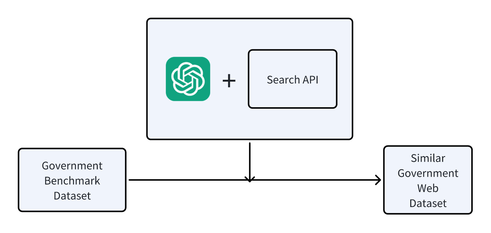
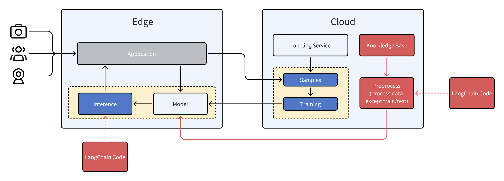

<<<<<<< HEAD
# Project Proposal: Domain-Specific Large Model Benchmarking for Edge-Based E-Government Services

## 1. Abstract

With the rapid development of large language models (LLMs), the demand for personalized, compliant, and real-time services has given rise to edge computing-based LLMs. Among various domains, government services represent a critical scenario where edge models can play a pivotal role. Government operations require high levels of data privacy and real-time responsiveness, making edge deployment an ideal solution.

However, most existing benchmarks focus on general capabilities or specific academic tasks, lacking comprehensive evaluation datasets for vertical domains like Chinese government services. To address this gap, we previously proposed the "Chinese Government Affairs Understanding Evaluation Benchmark" (CGAUE). This benchmark provides an open, community-driven evaluation framework that tests both objective and subjective capabilities of LLMs, and has been tested with common LLMs in Ianvs.

Yet our preliminary work still has room for improvement: we directly invoked LLMs without fine-tuning or implementing Retrieval-Augmented Generation (RAG); most existing LLMs haven't been sufficiently trained on government data; moreover, government data updates rapidly while LLMs cannot acquire new knowledge after training, resulting in suboptimal performance on government data. Addressing this issue is precisely the goal of our current work.

## 2. Research Motivation

### 2.1 Preliminary Research and Experiments

Previous research shows that existing LLMs without edge optimization face significant challenges when handling Chinese government domain tasks. For example, models like GPT-4 that haven't been trained on specialized government data perform poorly in tasks such as policy interpretation and public service consultation, often generating incorrect responses due to lack of domain knowledge and inability to access localized data in real-time.

### 2.2 Edge Deployment Requirements for Government Scenarios

Key drivers for deploying edge LLMs in Chinese government scenarios include:

- **Market Size**: China's AI government solutions market is projected to reach $15 billion by 2025, driven by accelerated AI and edge computing adoption in public administration
- **Typical Cases**: Shenzhen has deployed edge LLMs to optimize efficiency in public consultation and policy communication; Guangzhou has integrated edge LLMs into smart city infrastructure to provide localized public service responses
- **Data Sensitivity**: Government data like social security involves sensitive information requiring localized processing to prevent leaks and ensure compliance
- **Low Latency Requirements**: Government services like policy consultation demand real-time responses, where edge models outperform cloud solutions
- **Regional Knowledge**: Significant policy variations across regions make edge deployment ideal for adapting LLMs to local policies

### 2.3 Technical Rationale for RAG Adoption

Given the need for localized, real-time, and compliant processing of government data, Retrieval-Augmented Generation (RAG) technology is crucial. RAG enhances LLM capabilities by integrating external knowledge sources, ensuring models can access the latest regional policies—particularly beneficial for edge deployments requiring operation on local data.

## 3. Project Objectives

1. Build a **cross-provincial government knowledge base** for RAG-enhanced LLM benchmarking
2. Design **four testing modes**:
   - *Type 1: No-RAG mode*
   - *Type 2: Using only data relevant to the tested edge node as RAG knowledge base*
   - *Type 3: Using all edge node data as RAG knowledge base*
   - *Type 4: Using all data irrelevant to the tested edge node as RAG knowledge base*
3. Implement and compare mainstream RAG architectures in Ianvs

## 4. Methodology

### 4.1 Data Collection and Processing

We need to collect government data from the internet (this data may not necessarily relate to our Benchmark), then clean and extract relevant data using the following method:


For locations where collected data remains insufficient after cleaning, we can use LLMs and search APIs to specifically search and generate data:



This process yields cleaned data relevant to each province's Benchmark queries. For province Pᵢ, we obtain corresponding knowledge base data Kᵢ through cleaning or generation.

### 4.2 RAG Integration Solution

RAG can be divided into several modules:
1. Python libraries for RAG
2. Knowledge base processing module (embedding and storage in vector database)
3. Retrieval module (query-based retrieval from vector database)

For **Part 1 (RAG Python libraries)**, we recommend LangChain—the most commonly used LLM RAG library with extensive functionality. Since we won't modify LangChain itself, no whl packaging is needed. LangChain won't be called in Ianvs Core, only in `examples/path/testalgorithms/path/xxx.py`, so it won't affect the global `requirements.txt` and can be pip-installed separately for specific scenarios.

For **Part 2 (Knowledge base processing)**, we believe the knowledge base shouldn't be placed in yaml configuration files processed via `core\testenvmanager\dataset\dataset.py` because:
1. LLM scenarios constitute only a small portion of Ianvs projects, and not all LLM scenarios require RAG
2. Knowledge bases differ fundamentally from Ianvs' original "data" concept (train/test data vs. knowledge base)
3. RAG knowledge bases can take various formats that are difficult to process uniformly
4. Knowledge base processing should remain flexible for developer customization

For **Part 3**, similar reasoning applies—vectorization, storage, and retrieval should be implemented in scenario-specific algorithm files rather than Core.

The modified Ianvs structure is shown below:


While Core framework remains unchanged, we'll add RAG Knowledge Base and processed vector database concepts stored in Local Storage.

However, Algorithm processing requires changes. Previous LLM Scenarios used Single Task Learning paradigm with only train and inference steps. We propose adding a preprocess step for knowledge base initialization:



## 4.3 Knowledge Base Vectorization and Retrieval Solution

As mentioned, knowledge bases can be complex:

```
├── /product_docs/
│   ├── user_manual_v2.3.pdf
│   ├── API_reference.md
│   └── version_history/
│       ├── v1.0-release-notes.txt
│       └── v2.0-beta-notes.docx
├── /customer_support/
│   ├── FAQ.json
│   └── ticket_records.db
└── config.yaml
```

LangChain handles this through:

### 4.3.1 File Loading and Preprocessing
```python
from langchain.document_loaders import (
    DirectoryLoader,
    TextLoader,
    PyPDFLoader,
    JSONLoader,
    UnstructuredFileLoader
)

# Configure multi-format loaders
loaders = {
    '.pdf': PyPDFLoader,
    '.md': TextLoader,
    '.txt': TextLoader,
    '.json': JSONLoader,
    '.yaml': TextLoader,
    '.docx': UnstructuredFileLoader,  # Requires unstructured
    '.db': None  # Requires custom handling
}

# Recursive directory loading
def load_documents(root_path):
    documents = []
    for item in Path(root_path).rglob('*'):
        if item.is_file():
            ext = item.suffix.lower()
            if ext in loaders and loaders[ext]:
                loader = loaders[ext](str(item))
                documents.extend(loader.load())
    return documents
```

### 4.3.2 Intelligent Document Splitting
#### Text Files (MD/TXT/YAML)
```python
from langchain.text_splitter import RecursiveCharacterTextSplitter

text_splitter = RecursiveCharacterTextSplitter(
    chunk_size=1000,
    chunk_overlap=200,
    separators=["\n\n", "\n", "。", "！", "？", "……", " "]
)
```

#### Structured Data (JSON/DB)
```python
# JSON-specific processing
json_splitter = RecursiveCharacterTextSplitter.from_tiktoken_encoder(
    chunk_size=500,
    separators=["}\n{", ",\n", "\n"]  # Split by JSON structure
)

# Database file processing
def process_db(file_path):
    import sqlite3
    conn = sqlite3.connect(file_path)
    tables = conn.execute("SELECT name FROM sqlite_master WHERE type='table'").fetchall()
    text_content = []
    for table in tables:
        text_content.append(f"## Table Structure: {table[0]}")
        data = conn.execute(f"SELECT * FROM {table[0]} LIMIT 10").fetchall()
        text_content.append(str(data))
    return "\n".join(text_content)
```

#### PDF/DOCX Documents
```python
from unstructured.partition.auto import partition

def process_complex_file(file_path):
    elements = partition(filename=file_path)
    return "\n\n".join([str(el) for el in elements])
```

### 4.3.3 Hybrid Splitting Process
```python
def split_documents(docs):
    final_splits = []
    for doc in docs:
        content = doc.page_content
        metadata = doc.metadata
        
        if metadata['source'].endswith('.json'):
            splits = json_splitter.split_text(content)
        elif metadata['source'].endswith('.db'):
            content = process_db(metadata['source'])
            splits = text_splitter.split_text(content)
        else:
            splits = text_splitter.split_text(content)
            
        for split in splits:
            new_doc = Document(
                page_content=split,
                metadata=metadata
            )
            final_splits.append(new_doc)
    return final_splits
```

### 4.3.4 Vectorization and Storage
```python
from langchain.embeddings import HuggingFaceEmbeddings
from langchain.vectorstores import FAISS

# Embedding model
embedding = HuggingFaceEmbeddings(
    model_name="GanymedeNil/text2vec-large-chinese",
    encode_kwargs={'normalize_embeddings': True}
)

# Processing and storage
loaded_docs = load_documents("./knowledge_base")
splitted_docs = split_documents(loaded_docs)
vector_db = FAISS.from_documents(splitted_docs, embedding)

# Save index
vector_db.save_local("./vector_store")
```

## 4.4 Testing Solution

For experimental design, we need three comparisons for LLM+RAG performance on government data:
1. LLM only
2. LLM + RAG (only relevant knowledge data)
3. LLM + RAG (all knowledge data)
4. LLM + RAG (only irrelevant knowledge data)

Using "Beijing" as example test edge node:

| Type | Test Node | Knowledge Base | Capability Measured |
| --- | --- | --- | --- |
| Type 1 | Beijing | No knowledge base | LLM baseline capability |
| Type 2 | Beijing | Beijing-relevant knowledge | LLM learning capability |
| Type 3 | Beijing | All provinces' knowledge | LLM search/retrieval capability |
| Type 4 | Beijing | All non-Beijing knowledge | LLM generalization capability |

Type 1 has been tested previously. Types 2-4 are new RAG-enhanced comparisons.

We'll use Accuracy scores averaged across all four types as final government capability score for each region.

**Note: This benchmark has limitations and only partially reflects LLM capabilities for regional government questions.**

Code implementation requires careful handling of knowledge base switching during cross-testing. These changes will be confined to `example` directory without modifying Core code.

## 5. Limitations and Future Work

Current proposal focuses on RAG introduction but leaves several directions unexplored:
- **Incremental training**: Untested capability to adapt to new data
- **Fine tuning**: Unevaluated domain adaptation through fine-tuning
- **Few-shot learning**: Requires further validation in specialized domains

Future research should develop and test complete methodologies for domain-specific scenarios.

## 6. Project Timeline
| Phase | Timeline |
|-----|-----|
| Data Collection | 3.3-3.21 |
| RAG Integration | 3.24-4.11 |
| Benchmark Testing | 4.14-5.2 |
| Performance Optimization | 5.5-5.23 |
| Project Finalization | 5.26-5.30 |
=======
version https://git-lfs.github.com/spec/v1
oid sha256:5d5e1fca8cac438e69d991b3d3f213527eeadc2d9a46495a2206f1c6b5322d15
size 12052
>>>>>>> 9676c3e (ya toh aar ya toh par)
