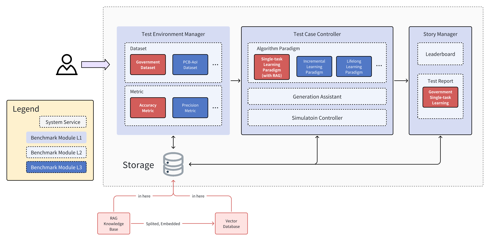

# 项目提案：面向边缘电子政务服务的领域专用大模型基准测试

## 1. 摘要

随着大语言模型（LLMs）的快速发展，对个性化、合规化、实时化服务的需求催生了基于边缘计算的LLMs。其中，政务领域是边缘模型发挥关键作用的重要场景。政府工作要求高度的数据隐私性和实时响应能力，这使得边缘部署成为理想解决方案。

然而，现有基准测试大多关注通用能力或特定学术任务，缺乏针对中文政务等垂直领域的全面评估数据集。为填补这一空白，我们先前提出了"中文政务理解评估基准"（CGAUE）。该基准提供了开放、社区驱动的评估框架，可测试LLMs的客观和主观能力，并已在Ianvs中与常用LLMs进行了测试。

但我们前期工作仍有改进空间：我们直接调用LLMs而未经微调或实现检索增强生成（RAG）；且现有LLMs大多未经过政务数据充分训练；此外政务数据更新迅速，而LLMs训练完成后无法获取新知识，导致LLMs在政务数据上表现欠佳。解决这个问题正是我们当前工作的目标。

## 2. 研究动机

### 2.1 前期研究与实验

前期研究表明，未经边缘优化的现有LLMs在处理中文政务领域任务时面临重大挑战。例如GPT-4等未经政务专业数据训练的模型，在政策解读、民生服务咨询等任务中表现不佳，常因缺乏领域知识且无法实时获取本地化数据而生成错误应答。

### 2.2 政务场景的边缘部署需求

中国政务场景部署边缘LLMs的驱动因素包括：

- **市场规模**：中国AI政务解决方案市场预计2025年达150亿美元，增长动力来自公共管理领域AI与边缘计算的加速应用
- **典型案例**：深圳已部署边缘LLM优化民生咨询和政策传达效率；广州将边缘LLM融入智慧城市基建，提供本地化民生应答
- **数据敏感性**：社保等政务数据涉及敏感信息，需本地化处理以防泄露并确保合规
- **低延迟要求**：政策咨询等政务服务需实时响应，边缘模型比云端方案更快
- **地域性知识**：各地政策差异显著，边缘部署可使LLMs适配本地政策

### 2.3 采用RAG的技术依据

鉴于政务数据需要本地化、实时化、合规化处理，检索增强生成（RAG）技术至关重要。RAG通过整合外部知识源增强LLMs能力，确保模型能获取各地最新政策，这对需要基于本地数据运行的边缘部署尤为有益。

## 3. 项目目标

1. 构建**跨省份政务知识库**用于RAG增强的LLM基准测试
2. 设计**两种测试模式**：
   - *省内模式*：仅使用本省数据生成应答
   - *跨省模式*：整合全国数据生成响应
3. 在Ianvs中实现并对比主流RAG架构

## 4. 方法

### 4.1 数据采集与处理

我们需要从互联网上收集一些政务数据（这些数据不一定和我们的Benchmark相关），然后，我们使用如下的方法清洗出来一批和Benchmark相关的数据：


当然，难免会存在对于某个地点，我们从互联网上收集爬取的政务数据，在清洗之后数量过少的情况。对于这种情况，我们可以通过下面的方法，使用大模型和搜索API来针对性的搜索、生成数据：


通过这种方式，我们可以清洗得到和各个省份的Benchmark里面的Query相关的数据。对于省份$P_i$，我们通过清洗或者生成，来得到相对应的知识库数据$K_i$。

### 4.2 RAG 集成方案

首先，RAG可以拆分为以下几个需要考虑的模块：
1. RAG的相关Python库
3. RAG的知识库处理模块（Embedding化然后存储到向量数据库中）
3. RAG的检索模块（根据Query，从向量数据库中检索出来）

对于**第1部分（RAG的相关Python库）**，我认为可以使用LangChain这个库，LangChain是目前最常用的LLM RAG数据库，集成了非常丰富的功能，我们不需要改动LangChain本身的内容，所以不需要打包成whl文件。另外，LangChain也不会在Ianvs Core中被调用，只会在 `examples/path/testalgorithms/path/xxx.py` 文件中被调用，所以也不会影响全局的 `requirements.txt` 文件，在 specific scenario 中单独 pip install 即可。

对于**第2部分（RAG的知识库处理模块）**，我认为知识库不太适合放到 yaml 文件中作为配置文件，通过 `core\testenvmanager\dataset\dataset.py` 文件来读取处理，原因如下：

1. 对于Ianvs项目而言，LLM相关的场景只占其中一小部分，而LLM的场景也不一定需要用到RAG，同时，知识库不同于Ianvs中原有“数据”的概念，原有的更多是 train/test data 的概念，而非知识库的概念

2. Ianvs中的 yaml 文件中配置的数据，是需要Core部分进行处理，然后处理成一条一条数据投入model的，这与知识库的处理方式截然不同。

3. 对于RAG中的知识库而言，形式可以多种多样，难以编写处理类进行统一处理，例如文档的格式可以是如下这种，难以编写统一的处理类来进行处理，而如果放到  `examples/path/testalgorithms/path/xxx.py` 文件中交给 LangChain 进行处理，则可以比较方便的调用 LangChain 中的各个数据形式的处理逻辑：

   ```
   ├── /产品文档/
   │   ├── 用户手册_v2.3.pdf
   │   ├── API参考.md
   │   └── 版本历史/
   │       ├── v1.0-release-notes.txt
   │       └── v2.0-beta-notes.docx
   ├── /客户支持/
   │   ├── 常见问题解答.json
   │   └── 工单记录.db
   └── config.yaml
   ```

   而对于这种数据，LangChain本身就有比较好的方法进行处理，我会放在后面的章节进行详细讲解。

4. RAG的知识库的处理，更应该根据开发者的个人需求灵活调整。LangChain项目目前还在更新，还有一些新的功能涉及到文档的切分、向量化处理、检索等等。如果要把知识库的位置配置到 yaml 文件中，意味着要在 Core 中编写处理的相关代码，如果后续要用到新更新的功能，需要再次修改Core中的代码，会导致不必要的麻烦。

综上所述，每个人要处理的知识库类型可能是不一样且复杂的，为了让开发者更容易进行调整，我认为应该把知识库的处理放到 `examples/path/testalgorithms/path/xxx.py` 文件中。

对于第3部分，和第2部分同理，我认为数据库的向量化处理存储，以及相应的检索，都不应放到现有的Core中，写到对应场景的算法文件中即可。

根据上面的设计，Ianvs的结构示意图如下：



整体的Core的框架不变，但是会新增一个 RAG Knowledge Base 以及处理之后的向量数据库的概念，存储在 Local Storage 之中。

然而，虽然 Core 的核心框架没有变，但是对于 Algorithm 的处理流程，则需要产生变化。

在之前的 LLM Scenario 中，我们都使用的是 Single Task Learning 范式，然而，Single Task Learning 范式的流程只有 train 和 inference 两个步骤，训练数据通过 train 的部分引入，测试数据通过 inference 的部分引入，对于知识库数据，没有合适的引入方式。

我的想法是在 Single Task Learning 中引入一个新的部分，称作 preprocess 预处理部分。如图所示：


我们可以在 preprocess 部分增加对知识库的切分、向量化等初始化操作，同时如果未来有类似的情况需要进行预处理，也可以使用这个模块。

## 4.3 知识库的向量化与检索方案

前面提到知识库的形式可能多种多样，非常复杂，例如：

```
├── /产品文档/
│   ├── 用户手册_v2.3.pdf
│   ├── API参考.md
│   └── 版本历史/
│       ├── v1.0-release-notes.txt
│       └── v2.0-beta-notes.docx
├── /客户支持/
│   ├── 常见问题解答.json
│   └── 工单记录.db
└── config.yaml
```

对于这种情况，LangChain可以通过下面的方法解决：


### 4.3.1 文件加载与预处理
LangChain通过`Document Loaders`支持多种文件格式：
```python
from langchain.document_loaders import (
    DirectoryLoader,
    TextLoader,
    PyPDFLoader,
    JSONLoader,
    UnstructuredFileLoader
)

# 配置多格式加载器
loaders = {
    '.pdf': PyPDFLoader,
    '.md': TextLoader,
    '.txt': TextLoader,
    '.json': JSONLoader,
    '.yaml': TextLoader,
    '.docx': UnstructuredFileLoader,  # 需要安装unstructured
    '.db': None  # 需要自定义处理
}

# 递归加载目录
def load_documents(root_path):
    documents = []
    for item in Path(root_path).rglob('*'):
        if item.is_file():
            ext = item.suffix.lower()
            if ext in loaders and loaders[ext]:
                loader = loaders[ext](str(item))
                documents.extend(loader.load())
    return documents
```

---

### 4.3.2 智能文档切分策略
根据文件类型采用不同的切分方式：

#### 文本类文件（MD/TXT/YAML
```python
from langchain.text_splitter import RecursiveCharacterTextSplitter

text_splitter = RecursiveCharacterTextSplitter(
    chunk_size=1000,
    chunk_overlap=200,
    separators=["\n\n", "\n", "。", "！", "？", "……", " "]
)
```

#### 结构化数据（JSON/DB）
```python
# 对JSON的特殊处理
json_splitter = RecursiveCharacterTextSplitter.from_tiktoken_encoder(
    chunk_size=500,
    separators=["}\n{", ",\n", "\n"]  # 按JSON结构切分
)

# 数据库文件需要先提取为文本
def process_db(file_path):
    import sqlite3
    conn = sqlite3.connect(file_path)
    # 提取表结构和示例数据
    tables = conn.execute("SELECT name FROM sqlite_master WHERE type='table'").fetchall()
    text_content = []
    for table in tables:
        text_content.append(f"## 表结构: {table[0]}")
        # 获取前10行示例数据
        data = conn.execute(f"SELECT * FROM {table[0]} LIMIT 10").fetchall()
        text_content.append(str(data))
    return "\n".join(text_content)
```

#### PDF/DOCX文档
```python
# 使用Unstructured处理复杂文档
from unstructured.partition.auto import partition

def process_complex_file(file_path):
    elements = partition(filename=file_path)
    return "\n\n".join([str(el) for el in elements])
```

---

### 4.3.3 混合切分流程
```python
def split_documents(docs):
    final_splits = []
    for doc in docs:
        content = doc.page_content
        metadata = doc.metadata
        
        # 根据元数据选择切分器
        if metadata['source'].endswith('.json'):
            splits = json_splitter.split_text(content)
        elif metadata['source'].endswith('.db'):
            content = process_db(metadata['source'])
            splits = text_splitter.split_text(content)
        else:
            splits = text_splitter.split_text(content)
            
        for split in splits:
            new_doc = Document(
                page_content=split,
                metadata=metadata
            )
            final_splits.append(new_doc)
    return final_splits
```

---

### 4.3.4 向量化与存储
```python
from langchain.embeddings import HuggingFaceEmbeddings
from langchain.vectorstores import FAISS

# 选择嵌入模型
embedding = HuggingFaceEmbeddings(
    model_name="GanymedeNil/text2vec-large-chinese",
    encode_kwargs={'normalize_embeddings': True}
)

# 处理并存储
loaded_docs = load_documents("./知识库")
splitted_docs = split_documents(loaded_docs)
vector_db = FAISS.from_documents(splitted_docs, embedding)

# 保存索引
vector_db.save_local("./vector_store")
```


## 4.4 测试方案

对于 LLM + RAG 的方案在 Government 数据上的效果，我认为需要有三个对比：

1. LLM only
2. LLM + RAG(only knowledge data relevant to edge question)
3. LLM + RAG(all knowledge data)

1的实验之前的工作已经做过。2和3都是加入RAG机制之后的对比试验。

要把2和3区分开，是因为在政务数据方面，对于每个地区来说都是一个独立的边缘节点，每个地区可能有自己独立的政务数据。

我们想要观测当RAG的知识库中仅包含该地区政务知识库 vs 包含全量混淆的政务知识库的情况下，在政务数据集上面的测试效果会显示出什么样的区别。

基于上述考虑，我们代码的编写需要格外注意：当切换边缘节点进行这种交叉测试时，如何快速便捷的切换需要检索的数据库范围？

好在这部分测试的设计不会影响到整体的结构，我们只需要在预处理知识库的时候，给不同边缘节点的对应的知识库分开存储，然后在 inference 的时候设计一个传入的参数，可以选择参考哪些知识库即可。

上述的这些代码设计都只会限于 `example` 目录下的代码，不会涉及到 Core 部分的代码更改。


## 5. 项目进度规划
| 阶段 | 时间 |
|-----|-----|
| 数据采集 | 3.3-3.21 |
| RAG集成 | 3.24-4.11 |
| 基准测试 | 4.14-5.2 |
| 性能优化 | 5.5-5.23 |
| 项目收尾 | 5.26-5.30 |