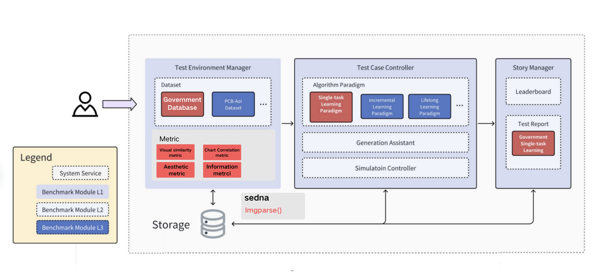

# Background

With the rapid development of cloud-edge collaborative large models, their application potential in governmental scenarios is becoming increasingly prominent. Currently, the intelligent upgrade of government services urgently requires support for three core application domains: **internal government collaboration**, **public services**, and **enterprise services**. However, existing LLM evaluation systems generally lack standardized methods tailored for government-specific tasks, making it difficult to effectively assess model performance in real-world governmental environments.

Specifically, general-purpose LLMs often struggle with **low accuracy**, **poor adaptability**, and **weak compliance** when applied to tasks such as governmental knowledge Q&A, official document generation, and city event perception—significantly hindering practical deployment. The root cause lies in the **lack of evaluation pipelines, datasets, and benchmarks adapted to governmental task characteristics**.

# Goals

1. Introduce domain-specific governmental datasets and categorize them into three standard task types:  
   - **Government Services** (e.g., public service guides, business facilitation, hotline responses)  
   - **Internal Governmental Affairs** (e.g., policy Q&A, document extraction, official document drafting)  
   - **Urban Governance** (e.g., urban data analysis, event detection and dispatch)

2. Build standardized evaluation suites for at least one of the above scenarios within the **KubeEdge-Ianvs** platform, including datasets, evaluation environments, and metrics, while unifying dataset formats.

3. Implement a baseline evaluation algorithm for government agents within the Ianvs platform, based on the standardized evaluation suite.

# Proposal

This project focuses on evaluating government service agents in the scenario of **"transforming official policy files or service guides into public-facing visual posters."**


## Dataset Construction

### 1. Data Sources

- **Official Government Portals**: Policy announcements, interpretations, and guides from national and local government websites (e.g., State Council of China).
- **Open Government Document Datasets**: Publicly available datasets from GitHub, HuggingFace, etc.
- **Social Media Platforms**: Government WeChat or Weibo accounts, collecting screenshots of visual posters for evaluation alignment.

### 2. Data Modalities

| Modality   | Format          | Examples                                      |
|------------|------------------|-----------------------------------------------|
| Text       | `.txt`           | Policy body text, FAQs, service procedure text |
| PDF        | `.pdf`           | Policy notices, regulations, implementation guides |
| Image      | `.jpg/.png`      | Scans, photos, infographic posters, long web posters |
| Poster     | `.jpg/.png`      | Booklets, banners, visual leaflets             |

### 3. Data Classification by Rule Type

To address structural and stylistic variation among documents, all collected data is classified by **`rule_type`**, which governs layout templates and evaluation criteria. Classification is automated using **LLM + Prompt** techniques. Each rule_type corresponds to a different structured template and evaluation rubric.

| Rule Type     | Example Keywords                 | Suggested Use Case                |
|---------------|----------------------------------|-----------------------------------|
| Guiding Policy | “opinions”, “plans”, “resolutions” | Policy direction infographics     |
| Implementation | “methods”, “regulations”, “details” | Bullet-pointed posters            |
| Service Guide  | “guide”, “steps”, “process”        | Procedure diagrams/booklets       |
| Notices        | “announcements”, “notices”, “statements” | Public service notices/post copy |
| FAQ            | “frequently asked questions”, “consultations” | Question-based poster cards       |
| Legal Documents| “laws”, “articles”, “regulations” | Structural tree or simplification |

**Structured JSON example**:
```json
{
  "input": {
    "file_type": "pdf",
    "rule_type": "notice",
    "file_path": "recruitment_notice_2025.pdf"
  },
  "reference_poster": "recruitment_poster.jpg",
  "structured_output": {
    "title": "Notice on the 2025 Military Recruitment Campaign",
    "sections": [...]
  }
}
```

## Evaluation Metrics

The project adopts **LLM as Judge** as the core evaluation method.

Each `rule_type` is paired with custom **evaluation dimensions**. Example criteria:

| Rule Type     | Evaluation Dimensions                               |
|---------------|-----------------------------------------------------|
| Notices       | Completeness, Formal Style, Emphasis of Key Info    |
| Service Guides| Step Clarity, Material Accuracy, Visual Relevance   |
| Research Reports| Logic, Data Credibility, Strength of Conclusion    |
| All Types     | Visual Consistency, Aesthetic Quality, Policy Alignment, Language Compliance |

**Example LLM Prompt**:
```
You are a compliance officer reviewing a government promotional poster.

[Original Document Type]: Notice  
[Original Document Content]: …  
[Generated Poster Content]: … (text or structured JSON)

Evaluate on the following 10-point scale:

1. Are core policy points preserved?
2. Is the language formal and public-friendly?
3. Does it conform to the expected style of a notice?
4. Is the visual consistent, clear, and attractive?
5. Is overall readability and policy alignment adequate?

Return the result in this format:
{
  "core_policy_coverage": 8,
  "style_appropriateness": 9,
  "rule_alignment": 8,
  "visual_consistency": 7,
  "overall_readability": 9,
  "comments": "Accurate overall, but some parts are overly complex. Visuals could be better aligned."
}
```

LLMs with strong long-text comprehension and structured output ability (e.g., from HuggingFace) will be used. Evaluation results are compiled into formal scoring reports.

**Overall Evaluation Flow**:

```
Government Document + Generated Poster
               ↓
     LLM Evaluation Module (Judge)
               ↓
    Output: Score, Comments, Explanation (JSON)
```

## Project Structure

Directory: `examples/government_agent`

```
government_agent
└── government_agent_learning_bench
    └── government_agent_bench
        ├── benchmarkingjob.yaml
        ├── testalgorithms
        │   └── gen
        │       ├── basemodel.py
        │       ├── gen_algorithm.yaml
        |       ├── gov_metrics.py
        └── testenv
            ├── acc.py
            └── testenv.yaml 
```

Modified Ianvs architecture:



Workflow Diagram:

```
 Government Document (PDF/TXT/Image)
               ↓
      Rule Type Classification
         ↘           ↙
 Structured Extraction    →    Poster Generation
               ↓                  ↓
        LLM-Based Rule Checker
               ↓
     Template Rule Scoring Module
```

## Development Phases

### Early Phase (July Early - July Late)
Collect various formats of government documents, classify by `rule_type`, and define associated compliance rules and prompts. Create a structured dataset labeled with `rule_type`, key elements, and content segments. This serves as the foundation for evaluation and model training.

### Mid Phase (August Early - August Mid)
Develop a fully automated evaluation pipeline under Ianvs: multimodal input processing, structured extraction, poster generation, and multi-metric evaluation. Integrate traditional metrics (CLIP similarity, QA accuracy, perplexity) and LLM-based subjective evaluation (“LLM as Judge”) aligned to `rule_type`-specific rubrics.

### Late Phase (August Late - September Mid)
Test and refine the multimodal pipeline, optimize model outputs, and tune LLM scoring prompts. Complete integration into Ianvs and demonstrate full functionality with visualized results, model outputs, and scoring reports.

## Project Timeline (Roadmap)

| Time Period            | Phase                          | Key Tasks |
|------------------------|--------------------------------|-----------|
| **Early July – Late July** | **Early Phase: Document & Rule Design** | • Collect government policy documents (PDF, Word, images)<br>• Extract and standardize key content<br>• Define common `rule_type` categories (e.g., Notice, Report, Speech)<br>• Construct compliance rules and prompts per rule type<br>• Build a structured dataset with rule-type labels |
| **Early August – Mid August** | **Mid Phase: Pipeline Implementation** | • Develop evaluation workflow under Ianvs<br>• Implement structured content extraction and poster generation<br>• Integrate metrics: CLIP (visual), QA (info), PPL (language)<br>• Add LLM-as-Judge scoring with rule-specific prompts |
| **Late August – Mid September** | **Late Phase: Optimization & Deployment** | • Debug multimodal processing pipeline<br>• Tune extraction and poster modules for consistency<br>• Optimize evaluation prompts and scoring criteria<br>• Deploy under Ianvs and validate system performance<br>• Deliver outputs: samples, scores, final evaluation report |