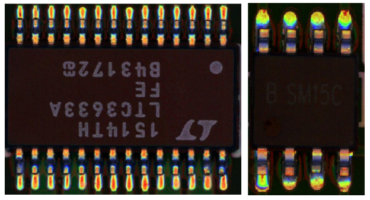

# Industrial defect detection: the PCB-AoI dataset 

Download link: [Kaggle](https://www.kaggle.com/datasets/kubeedgeianvs/pcb-aoi), [Huawei OBS](https://kubeedge.obs.cn-north-1.myhuaweicloud.com:443/ianvs/pcb-aoi/dataset.zip)

## Authors
- China Telcom Research Institute: Dongdong Li, Dan Liu, Yun Shen, Yaqi Song 
- Raisecom Technology Co.,ltd.: Liangliang Luo

## Background
Surface-mount technology (SMT) is a technology that automates electronic circuits production in which components are mounted or placed onto the surface of printed circuit boards. Solder paste printing (SPP) is the most delicate stage in SMT. It prints solder paste on the pads of an electronic circuit panel. Thus, SPP is followed by a solder paste inspection (SPI) stage to detect defects. SPI scans the printed circuit board for missing/less paste, bridging between pads, miss alignments, and so forth. Boards with anomaly must be detected, and boards in good condition should not be disposed of. Thus SPI requires high precision and a high recall. 

The PCB-AoI dataset is a part of the open-source distributed synergy AI benchmarking project KubeEdge-Ianvs.  Ianvs is honored to be the ``First`` site that this dataset is released and the Ianvs working group put it on Kaggle as [The PCB-AoI public dataset](https://www.kaggle.com/datasets/kubeedgeianvs/pcb-aoi). It is released by KubeEdge SIG AI members from China Telecom and Raisecom Technology. 

Below shows two example figures in the dataset. 




## Data Explorer
In this dataset, more than 230 boards are collected and the number of images is enhanced to more than 1200. Detailedly, the dataset include two parts, i.e., the train and the test set. The train set includes 173 boards while the test set includes 60 boards. That is, the train-test ratio is around 3:1 in terms of PCB boards. Data augmentation is conducted, boosting the train-test ratio to 1211:60 (about 20:1) in term of images. Both directories of train_data and test_data include the ``index`` file which recodes the mapping between the raw images and the label of annotation. 

The directories of this dataset is as follows: 
```
├── PCB-AoI Dataset
│   ├── train_data
│       ├── Annotation
│       ├── JPEGImages
│       ├── index.txt
│   ├── test_data
│       ├── Annotation
│       ├── JPEGImages
│       ├── index.txt
│   ├── train_data_augmentation
│       ├── Annotation
│       ├── JPEGImages
│       ├── index.txt
```

The following is part of `index.txt`:
```shell
./JPEGImages/20161019-SPI-AOI-1.jpeg ./Annotations/20161019-SPI-AOI-1.xml
./JPEGImages/20161020-SPI-AOI-5.jpeg ./Annotations/20161020-SPI-AOI-5.xml
./JPEGImages/20161021-SPI-AOI-13.jpeg ./Annotations/20161021-SPI-AOI-13.xml
./JPEGImages/20161021-SPI-AOI-14.jpeg ./Annotations/20161021-SPI-AOI-14.xml
./JPEGImages/20161021-SPI-AOI-15.jpeg ./Annotations/20161021-SPI-AOI-15.xml
```

Column 1 stands for the file path of the raw image, and column 2 is the file path of corresponding annotation file.In this dataset, the xml annotation follows Pascal VOC XML format.  you can find more description of Pascal VOC XML at [here](https://roboflow.com/formats/pascal-voc-xml).
