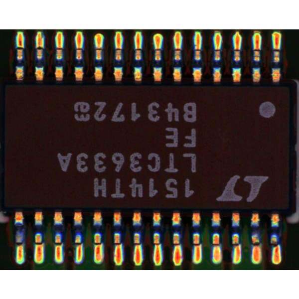
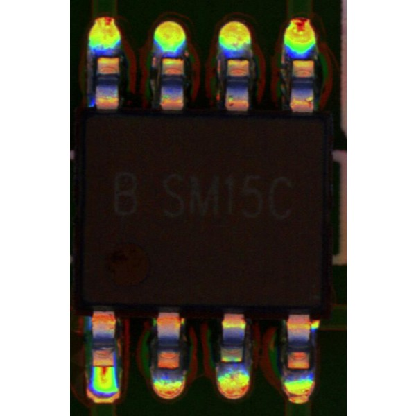

# Industrial defect detection: the PCB-AoI dataset 

Download link: [Kaggle](https://www.kaggle.com/datasets/kubeedgeianvs/pcb-aoi)

Author: 
- China Telcom Research Institute: Dongdong Li, Dan Liu, Yun Shen, Yaqi Song 
- Raisecom Technology Co.,ltd.: Liangliang Luo

Surface-mount technology (SMT) is a technology that automates electronic circuits production in which components are mounted or placed onto the surface of printed circuit boards. Solder paste printing (SPP) is the most delicate stage in SMT. It prints solder paste on the pads of an electronic circuit panel. Thus, SPP is followed by a solder paste inspection (SPI) stage to detect defects. SPI scans the printed circuit board for missing/less paste, bridging between pads, miss alignments, and so forth. Boards with anomaly must be detected, and boards in good condition should not be disposed of. Thus SPI requires high precision and a high recall. 

In this datset, more than 230 boards is collected and enhanced to 1200+ images. Detailedly, the train set includes 173 boards while the test set includes 60 boards. That is, the train-test ratio is around 3:1. Data augmentation is done, boosting the train-test ratio to 1211:60 (about 20:1).

 [The PCB-AoI dataset](https://www.kaggle.com/datasets/kubeedgeianvs/pcb-aoi) is part of the open-source distributed synergy AI benchmarking project KubeEdge-Ianvs.  Ianvs is honored to be the ``First`` site that this dataset is released. It is released by KubeEdge SIG AI members from China Telecom and Raisecom Technology. Below shows two example figures in the dataset. 

    

