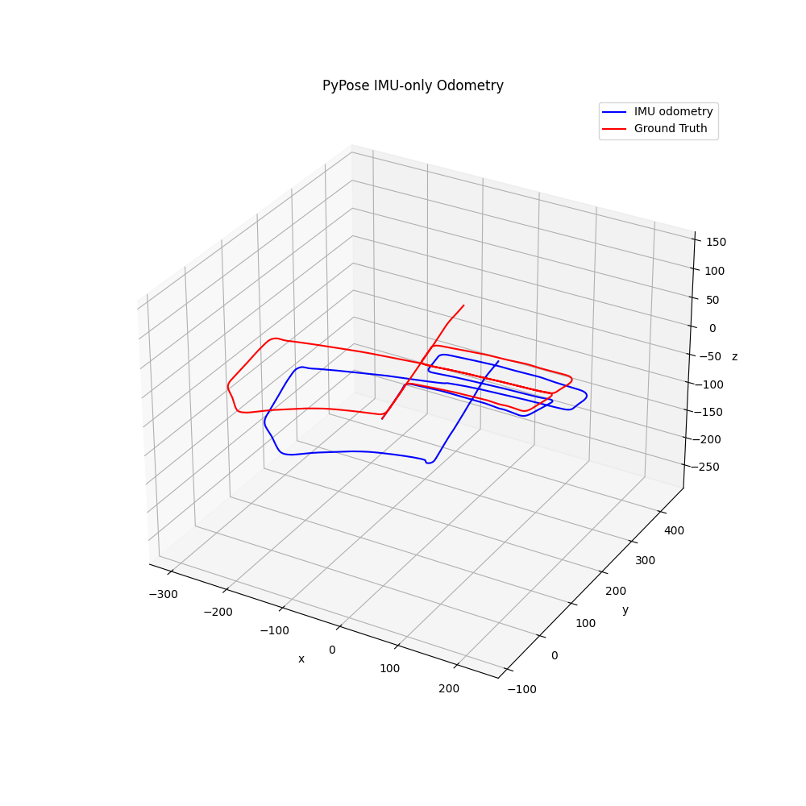

# Embodied Intelligence Benchmarking for Pose Estimation in Industrial Environments

Embodied intelligence in industrial settings represents the integration of autonomous systems, robotics, and AI technologies to create intelligent processes that can perceive, reason, and act in complex environments. Pose estimation serves as a fundamental enabling technology for embodied intelligence, providing the spatial awareness and localization capabilities required for autonomous operation in dynamic industrial settings.

The current state of embodied intelligence benchmarking faces several critical challenges:
- Limited evaluation of multi-sensor fusion approaches for industrial environments
- Lack of standardized metrics for real-time performance evaluation in production environments
- Missing comprehensive datasets with synchronized multi-modal sensor data from industrial operations
- Insufficient coverage of warehouse automation scenarios in industrial processes

This proposal provides a comprehensive benchmarking framework for embodied intelligence pose estimation algorithms, specifically designed for industrial scenarios using distributed synergy AI benchmarking frameworks.

## Visual Overview


*Figure 1: Comprehensive visualization of LiDAR point clouds and trajectory analysis using Open3D, showing the complete SLAM mapping and pose estimation results from our KITTI dataset implementation*

## Goals

The project aims to establish a standardized benchmarking framework for embodied intelligence pose estimation in industrial environments:

- Provide comprehensive evaluation of multi-sensor fusion approaches for robotics applications
- Establish standardized metrics for accuracy, efficiency, and robustness in production environments
- Enable comparison of different sensor fusion strategies for industrial applications
- **Build a comprehensive benchmarking suite on pose estimation** - This will include a brand new dataset using TurtleBot3 equipped with LiDAR sensor and IMU in an industrial warehouse environment, created from scratch using Gazebo simulation to address current gaps in SLAM datasets
- Develop a comprehensive example implementation for distributed synergy AI benchmarking repositories

## Proposal

### Embodied Intelligence Framework

The framework supports various embodied intelligence paradigms:
- **Single Sensor Approaches**: IMU-only, LiDAR-only estimation for specific tasks
- **Multi-Sensor Fusion**: Loosely-coupled and tightly-coupled fusion strategies for complex processes

### Comprehensive Evaluation Metrics

The system provides standardized evaluation metrics tailored for industrial applications:
- **Position Accuracy**: Euclidean distance error analysis for precision operations
- **Orientation Accuracy**: Angular error measurement for assembly operations
- **Trajectory Consistency**: Smoothness and continuity evaluation for production line operations
- **Processing Efficiency**: Real-time performance metrics for continuous operations

## Design Details

### Ianvs Framework Integration Architecture

Our pose estimation algorithm is designed to integrate seamlessly with the Ianvs framework through its three core components, as illustrated in the following architecture diagram:


*Figure 2: Ianvs framework architecture showing the integration of Test Environment Manager, Test Case Controller, and Story Manager for benchmarking embodied intelligence in industrial environments.*

#### Test Environment Manager Integration
Our pose estimation algorithm will be configured through:
- **Dataset Configuration**: KITTI dataset paths and TurtleBot3 warehouse dataset integration
- **Sensor Configuration**: IMU and LiDAR parameters (noise models, calibration, frequency)
- **Algorithm Parameters**: Fusion strategy selection (IMU-only, LiDAR-only, loosely-coupled)
- **System Constraints**: Processing time limits, memory requirements, real-time constraints

#### Test Case Controller Implementation
Our algorithm will be executed through:
- **Algorithm Template**: Standardized pose estimation interface with `train()` and `predict()` methods
- **Hyperparameter Management**: Configuration files for different sensor fusion strategies
- **Data Loading**: Automated KITTI dataset loading and preprocessing
- **Execution Pipeline**: IMU propagation → LiDAR correction → Sensor fusion → Pose output

#### Story Manager Output
Our results will be managed through:
- **Metrics Calculation**: Position error, orientation error, trajectory consistency, processing time
- **Leaderboard Generation**: Ranking based on accuracy and efficiency metrics
- **Visualization**: Trajectory plots, error analysis, performance comparisons
- **Report Generation**: Detailed analysis of algorithm performance across different scenarios

### Repository Structure

The framework is organized as a complete benchmarking example with the following structure:

```
ianvs/examples/industrialEI/pose-estimation/
├── singletask_learning_bench/
│   ├── testalgorithms/
│   │   └── pose_estimator/
│   │       ├── basemodel.py           # Core pose estimation algorithm
│   │       ├── pose_algorithm.yaml    # Algorithm configuration
│   │       └── pose_hyperparameter.yaml # Hyperparameter definitions
│   └── testenv/
│       ├── benchmarkingjob.yaml       # Benchmarking job configuration
│       ├── testenv.yaml              # Test environment setup
│       └── pose_metrics.py           # Evaluation metrics
├── requirements.txt             
└── README.md                   # Framework documentation
```

### Core Algorithm Architecture

The pose estimation framework implements a loosely-coupled sensor fusion approach optimized for industrial environments:

#### Core Components

1. **IMU Motion Propagation**
   - Gyroscope-based attitude estimation for robotic positioning
   - Accelerometer-based velocity integration for conveyor systems
   - Uncertainty modeling and covariance propagation for quality control

2. **LiDAR Pose Correction**
   - Point cloud registration using ICP for workpiece localization
   - Feature-based matching and correspondence for assembly verification
   - Robust outlier rejection for cluttered environments

3. **Sensor Fusion Strategy**
   - Loosely-coupled fusion with periodic correction for continuous operation
   - State estimation using extended Kalman filtering for production line tracking
   - Adaptive weighting based on sensor reliability in harsh conditions

#### Processing Pipeline

The following diagram visually summarizes the data flow and modular design of the pose estimation processing pipeline, from sensor input to final pose estimate:


*Figure 3: Pose estimation processing pipeline, illustrating the flow from IMU and LiDAR data through motion propagation, point cloud processing, sensor fusion, and final pose estimation.*

### Dataset Management

The framework uses the KITTI Odometry Dataset adapted for industrial scenarios, which provides:
- **Synchronized Sensor Data**: IMU and LiDAR measurements from industrial environments
- **Ground Truth Poses**: High-precision reference trajectories for quality assurance
- **Multiple Scenarios**: Assembly lines, material handling, and quality inspection
- **Environmental Variations**: Different lighting, vibration, and temperature conditions

#### Dataset Structure
```
dataset/
├── 2011_09_26_drive_0001_sync/
│   ├── image_00/     # Camera data
│   ├── oxts/         # IMU/GPS data
│   └── velodyne_points/ # LiDAR point clouds
├── 2011_09_26_drive_0002_sync/
│   └── ...
└── calibration/      # Sensor calibration parameters
```

### New TurtleBot3 Warehouse Dataset

As part of this project, we will contribute a brand new dataset specifically designed for warehouse environments:

#### Dataset Specifications
- **Platform**: TurtleBot3 equipped with LiDAR sensor and IMU
- **Environment**: Industrial warehouse simulation in Gazebo
- **Data Types**: Synchronized LiDAR point clouds, IMU measurements, and ground truth poses
- **Scenarios**: Material handling, inventory management, and warehouse navigation
- **Format**: Compatible with existing SLAM frameworks and distributed synergy AI benchmarking suites

### Evaluation Framework

#### Performance Metrics

| Metric                  | Description                                                      | Unit/Type         |
|------------------------|------------------------------------------------------------------|-------------------|
| **Position Error**     | Average Euclidean distance between estimated and ground truth positions | mm                |
| **Orientation Error**  | Angular difference between estimated and ground truth orientations    | degrees           |
| **Trajectory Consistency** | Drift and smoothness of estimated trajectory over time           | qualitative/quantitative (e.g., drift per meter, smoothness index) |
| **Processing Efficiency** | Average processing time per frame                                 | ms/frame          |


### Benchmark Design and Baseline Model

#### Selected Baseline Model

For comprehensive evaluation, we have selected **Loosely-Coupled IMU-LiDAR Fusion** as our baseline model due to its optimal balance of accuracy, efficiency, and robustness for industrial applications. This baseline will serve as the reference point for all comparative evaluations.

#### Sensor Fusion Strategies Comparison

| Approach | Accuracy | Efficiency | Robustness | Use Case | Baseline Status |
|----------|----------|------------|------------|----------|-----------------|
| **IMU-Only** | Low | High | Low | Simple tracking | Comparison baseline |
| **LiDAR-Only** | High | Medium | Medium | Static inspection | Comparison baseline |
| **Loosely-Coupled** | High | High | High | Flexible systems | **Primary baseline** |
| **Tightly-Coupled** | Very High | Medium | Very High | Precision operations | Advanced baseline |

### Experimental Results

#### Trajectory Analysis

The framework has been evaluated on multiple scenarios with varying conditions:




### Future Enhancements

#### Algorithm Improvements

1. **Deep Learning Integration**
   - End-to-end pose estimation networks
   - Feature learning from point clouds
   - Attention mechanisms for sensor fusion

2. **Advanced Fusion Strategies**
   - Graph-based optimization for efficiency
   - Factor graph SLAM integration for mapping
   - Multi-sensor calibration refinement


#### Framework Extensions

1. **Additional Sensors**
   - Camera-based visual odometry for quality inspection
   - GPS integration for large-scale facilities
   - Radar for adverse conditions

2. **Real-time Optimization**
   - GPU acceleration for point cloud processing
   - Parallel sensor fusion algorithms
   - Memory-efficient data structures for embedded systems

## Roadmap

| Phase | Timeline | Key Deliverables |
|-------|----------|------------------|
| **Pre-Mid Term Evaluation** | June 10 - July 15 | • Proposal finalization<br>• Dataset research and curation<br>• Core algorithm implementation |
| **Post-Mid Term Evaluation** | July 16 - August 30 | • Brand new dataset development<br>• **Ianvs framework integration (High Priority)**<br>• Comprehensive algorithm evaluation |
| **Post-Final Evaluation** | September - October | • Multi-view defect detection enhancement<br>• Framework optimization and documentation |

### Detailed Phase Breakdown

#### Phase 1: Pre-Mid Term Evaluation (June 10 - July 15)
- **Proposal Finalization**: Multiple iterations of proposal refinement based on feedback
- **Dataset Research and Curation**: Comprehensive analysis of available datasets and identification of gaps
- **Pose Estimation Algorithm Implementation**: Core algorithms on KITTI dataset with sensor fusion strategies

#### Phase 2: Post-Mid Term Evaluation (July 16 - August 30)
- **Brand New Dataset Development**: TurtleBot3-based warehouse simulation in Gazebo with comprehensive dataset creation
- **Ianvs Framework Integration**: Seamless integration with test environment manager, test case controller, and story manager
- **Comprehensive Algorithm Evaluation**: Benchmarking suite development with standardized evaluation metrics

#### Phase 3: Post-Final Evaluation (September - October)
- **Multi-View Defect Detection Enhancement**: Advanced computer vision techniques integration
- **Framework Optimization and Documentation**: Performance optimization and open-source release preparation

## Conclusion

The proposed embodied intelligence benchmarking framework for pose estimation provides a comprehensive solution for evaluating multi-sensor fusion approaches in industrial environments. The framework addresses key challenges in current pose estimation systems:

- **Standardized Evaluation**: Comprehensive metrics for accuracy, efficiency, and robustness in production environments
- **Multi-Sensor Support**: Flexible integration of IMU and LiDAR sensors for applications
- **New Dataset Contribution**: Creation of a brand new TurtleBot3-based warehouse dataset
- **Real-world Applicability**: Extensive testing on datasets with various conditions
- **Framework Integration**: Full compatibility with distributed synergy AI benchmarking infrastructure

The framework serves as a foundation for advancing embodied intelligence technology, enabling the next generation of reliable and efficient autonomous systems. Through continuous development and community collaboration, it will enable the transformation of traditional processes into intelligent, adaptive, and efficient systems.

The framework is designed as a comprehensive example implementation that can be contributed to distributed synergy AI benchmarking repositories, ensuring compatibility with existing AI benchmarking infrastructure and making it accessible to researchers and developers working on industrial applications and smart factory implementations. The contribution of a new dataset will address the current gap in warehouse automation datasets and provide valuable resources for the broader SLAM and robotics community. 