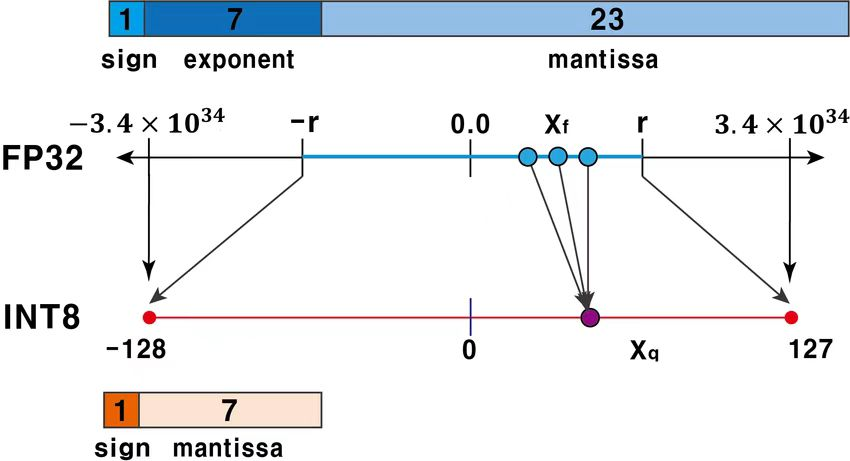
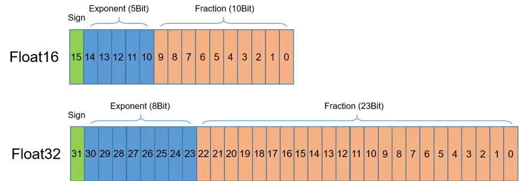
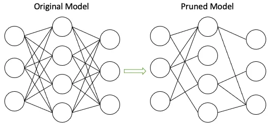

# Large Language Model Edge Benchmark Suite: Implementation on KubeEdge-lanvs 


## 1 Motivation

Due to model size and data scale, LLMs are often trained in the cloud. At the same time, since the use of large language models often involves business secrets or user privacy, deploying LLMs on **edge devices** has gradually become a research hotspot. LLMs quantization technology is enabling LLMs **edge inference**. However, the limited resources of **edge devices** have an impact on the inference latency and accuracy of cloud-trained LLMs. Ianvs aims to leverage container resource management capabilities and edge-cloud collaboration capabilities to perform **edge-side** deployment benchmarking for cloud-trained LLMs.

## 2 Goals

The primary goal is to develop a benchmarking suite for Large Language Models (LLMs) on **edge devices** using the KubeEdge-Ianvs platform. This suite will enable thorough testing and validation of LLMs, focusing on performance, accuracy, and resource utilization on **edge devices**.


### 2.1 Flexibility and Scalability
Ensure the Test Environment Manager can flexibly handle multiple datasets and performance metrics to cater to diverse testing requirements and scenarios.


### 2.2 Comprehensive Algorithm Evaluation
Cover testing across multiple machine learning algorithm paradigms, including pre-training, fine-tuning, self-supervised learning, and multi-task learning.

### 2.3 Automation and Continuous Integration
Integrate CI/CD processes to automate the management and continual updating of test environments and test cases.


## 3 Proposal


The proposal includes developing a benchmark suite that utilizes Ianvs to evaluate the performance of LLMs under various **edge-cloud** configurations. This will include:

### 3.1 Dataset Integration And Accuracy Evaluation
Integrate widely-used benchmark datasets to evaluate the performance of LLMs on **edge devices** across various tasks and domains. Some key datasets to consider:

1. MMLU (Measuring Massive Multitask Language Understanding):
- A comprehensive English benchmark for evaluating the knowledge and reasoning abilities of language models across 57 disciplines, from humanities and social sciences to STEM fields.
- Covers topics ranging from elementary to advanced levels.
- Assesses a model's general intelligence and cognitive capabilities.
- Dataset URL: https://github.com/hendrycks/test

2. CMMLU (Measuring Massive Multitask Language Understanding in Chinese):
- A Chinese-specific benchmark for evaluating language models' knowledge and reasoning abilities in the Chinese language context.
- Includes 67 topics, from basic disciplines to advanced professional levels, with many tasks having China-specific answers.
- Covers natural sciences, humanities, social sciences, and daily life knowledge like Chinese driving rules.
- A fully Chinese-centric testing benchmark for assessing a model's cognitive intelligence in Chinese scenarios.
- Dataset URL: https://github.com/haonan-li/CMMLU


### 3.2 Algorithm Testing

**Objective**: Conduct inference tests on different LLMs, assessing their performance across a variety of metrics and scenarios.

Sure, here's a brief introduction to the Qwen, LLaMA, and ChatGLM models, similar to the MMLU and CMMLU dataset descriptions:

1. Qwen-7B, Qwen-13B, Qwen-30B, Qwen-65B
- A series of Chinese-specific language models with varying parameter sizes (7B, 13B, 30B, 65B).
- Trained on large-scale Chinese corpora, aiming to provide high-quality language understanding and generation capabilities in Chinese.
- Can be used for various natural language processing tasks, such as question answering, text summarization, and sentiment analysis.
- Offers a range of model sizes to accommodate different computational resources and performance requirements.

1. LLaMA-7B, LLaMA-13B, LLaMA-33B, LLaMA-65B
- A collection of open-source language models developed by Facebook, with parameter sizes ranging from 7B to 65B.
- Trained on a vast amount of text data, demonstrating strong performance in various language tasks.
- Designed to be efficient and scalable, allowing for deployment in different environments.
- Provides a foundation for researchers and developers to build upon and adapt for specific use cases.

1. ChatGLM-6B, ChatGLM2-6B, ChatGLM2-130B
- A series of conversational language models specifically designed for chatbot applications.
- Trained on large-scale dialogue datasets to generate human-like responses in conversational contexts.
- Offers models with 6B parameters (ChatGLM-6B and ChatGLM2-6B) and a larger 130B parameter model (ChatGLM2-130B) for more advanced conversational capabilities.
- Can be used to build engaging and interactive chatbots for various domains, such as customer support, virtual assistants, and entertainment.


### 3.3 Benchmarking LLMs on Edge Devices

**Objective**: Evaluate the performance of LLMs on **edge devices** by measuring key metrics such as memory usage, CPU load, and bandwidth consumption. This benchmarking helps in understanding the resource requirements and limitations of deploying LLMs on **edge devices** with constrained resources. While the focus is on single-device performance, the insights gained can provide valuable reference points for designing efficient edge-cloud collaborative inference systems in the future.

#### 3.3.1 Inference Speed 
- Measure the time taken for the LLM to generate responses on **edge devices** for various input lengths and types.

- Compare inference speeds across different model sizes (e.g., 7B vs. 13B vs. 65B) and hardware configurations (e.g., CPU vs. GPU, different memory constraints).

- Analyze the relationship between input length and both total and prefill latency.

- Evaluate the impact of optimization techniques (like INT8 quantization and sparsity method on both latency metrics.

- Consider measuring token generation speed (tokens per second) during the decoding phase to complement the latency metrics:

1. Total Latency
    - Definition: The total time taken from receiving the input to generating the complete output.
    - Measurement: Record the time from when the input is sent to the model until the final token is generated.
    - Importance: Represents the overall responsiveness of the system.
2. Prefill Latency
    - Definition: The time taken to process the initial input (prompt) before generating the first output token.
    - Measurement: Record the time from when the input is sent to the model until it's ready to generate the first token.
    - Importance: Crucial for understanding the model's initial response time, especially important for interactive applications.


#### 3.3.2 Resource Utilization

Efficient resource utilization is critical for running LLMs on edge devices with limited computational capabilities. We'll focus on the following metrics:

1. **Throughput**
- Definition: The number of tokens or inferences the model can process per unit of time.
- Measurement: Calculate tokens generated per second (TPS) or inferences per second (IPS).
- Importance: Indicates the model's efficiency in handling multiple requests or generating longer outputs.
2. **Memory Usage**
- Peak Memory Consumption: The maximum amount of memory used during inference.
- Average Memory Usage: The average memory consumption over the course of inference.
- Memory Efficiency: Ratio of output generated to memory used.
3. **CPU/GPU Utilization**
- Average CPU/GPU Usage: The mean percentage of CPU/GPU utilized during inference.
- CPU/GPU Usage Pattern: Analyze how CPU usage varies during different phases of inference (e.g., prefill vs. decoding).

## 4 Design Details


The architecture of this proposal is shown in the figure below. We leverage the existed TestEnvManager, TestCaseController and StoryManager in Ianvs. 


1. **TestEnvManager**, add MMLU and CMMLU as LLM benchmark and Accuracy, Latency, Throughput, Bandwith as metrics.

2. **TestCaseController**, Incorporate INT8 quantization, FP16 mixed precision, sparsity methods,

3. **StoryManager**, show Leaderboard and Test Report for users.


### 4.1 Opencompass Dataset Integration


The Opencompass dataset provides a comprehensive set of benchmarks for evaluating the performance of various language models. Integrating this dataset will enhance the evaluation capabilities of Ianvs by providing standardized and recognized benchmarks for LLMs

```
├── __init__.py
├── dataset
│   ├── __init__.py
│   └── dataset.py
└── testenv
    ├── __init__.py
    └── testenv.py
```
To integrate the Opencompass dataset, `dataset/dataset.py`

```
from mmengine.config import read_base

with read_base():
    from .datasets.siqa.siqa_gen import siqa_datasets
    from .datasets.winograd.winograd_ppl import winograd_datasets

datasets = [*siqa_datasets, *winograd_datasets]
```

### 4.2 INT8 Quantization And Mixed Preicison

INT8 quantization and FP16 mixed precision are techniques used to optimize the performance of machine learning models:

- INT8 Quantization: Reduces the model size and increases inference speed by converting weights and activations from 32-bit floating point to 8-bit integer.



- FP16 Mixed Precision: Uses 16-bit floating point representation for some operations while keeping others in 32-bit, balancing the trade-off between speed and precision.



### 4.3 Pruning method to get Sparsity LLM

Pruning is a technique used to reduce the number of parameters in a model, thereby increasing efficiency:

Selectively removes weights in the neural network that have little impact on the final output. 
 
This results in a sparse model that requires less computation and memory, improving performance on both GPU and CPU.




### 4.4 GPU and CPU Env

To provide comprehensive benchmarking, it is essential to test models in both GPU and CPU environments:

- **GPU Environment**: Benchmarks the performance of models when executed on GPUs, which are optimized for parallel processing and commonly used for training and inference of large models.The setup includes NVIDIA drivers, Docker, CUDA, and cuDNN.
- **CPU Environment**: Benchmarks the performance of models on CPUs, which are more commonly available and used in various deployment scenarios.

`core/testenvmanager/testenv/testenv.py`
```py
def __init__(self, config):
    self.model_eval = {
        "model_metric": {
            "mode": "",
            "name": "",
            "url": "",
        },
        "threshold": 0.9,
        "operator": ">"
    }
    self.metrics = []
    self.incremental_rounds = 2
    self.dataset = None
    self.use_gpu = False  # default false
    self._parse_config(config)
```

```py
def _parse_config(self, config):
    config_dict = config[str.lower(TestEnv.__name__)]
    for k, v in config_dict.items():
        if k == str.lower(Dataset.__name__):
            self.dataset = Dataset(v)
        elif k == 'use_gpu':
            self.use_gpu = bool(v)  # make sure use_gpu bool value
        else:
            if k in self.__dict__:
                self.__dict__[k] = v
    self._check_fields()
```

`testenv.yaml`

```yaml
testenv:
  use_gpu: true  # or false
```

### 4.5 Building Test Cases (build_testcases Method)

This method accepts a test environment (`test_env`) and a configuration (`test_object`) containing multiple test objects (e.g., different LLMs like Qwen, Llama, ChatGLM, Baichuan).

1. **Parameter Parsing**: First, it parses the `test_object` parameter to extract the configuration containing algorithm information.
2. **Algorithm Configuration Parsing (_parse_algorithms_config Method)**: It iterates through the list of algorithm configurations and creates an `Algorithm` instance for each algorithm.
3. **Instantiating Test Cases**: For each `Algorithm` instance, the method creates a `TestCase` instance and adds it to the controller's `test_cases` list.

### 4.6 Algorithm Configuration Parsing (_parse_algorithms_config Method)

This method is responsible for reading and parsing algorithm configuration files and creating `Algorithm` objects.

1. **Configuration File Reading**: It checks if the configuration file exists locally.
2. **Configuration Conversion**: Uses the `utils.yaml2dict` method to convert the configuration file into a dictionary.
3. **Algorithm Instantiation**: Creates an `Algorithm` instance for each configuration.

### 4.7 Running Test Cases (run_testcases Method)

This method is responsible for executing all configured test cases.

1. **Execution**: Iterates through the `test_cases` list, calling each `TestCase`'s `run` method, which involves the startup and warm-up of the large model.
2. **Error Handling**: Captures any exceptions that may occur during execution and logs the error information.
3. **Result Collection**: Collects the results and execution time for each test case.


## 5 Road Map
| Time  | Activity    | 
|-------|-------------|
| July  | Familiarize with the Ianvs platform and prepare the development environment，Design the project interface and write a detailed user guide. |
| August| Develop functionalities to support various dataset formats and model invocation visualization，Test various LLMs and generate detailed benchmarking reports. |
| Septembter| Integrate the benchmarking suite into the model training process for real-time evaluation and optimization. |


## Reference

- [KubeEdge-Ianvs](https://github.com/kubeedge/ianvs)
- [KubeEdge-Ianvs Benchmark Sample](https://github.com/kubeedge/ianvs/blob/main/examples/robot-cityscapes-synthia/lifelong_learning_bench/semantic-segmentation/README.md)
- [how-to-build-simulation-env](https://github.com/kubeedge/ianvs/blob/main/docs/guides/how-to-build-simulation-env.md)
- [Example LLMs Benchmark List](https://github.com/terryyz/llm-benchmark)
