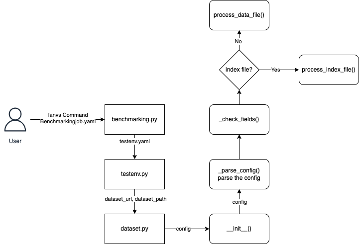
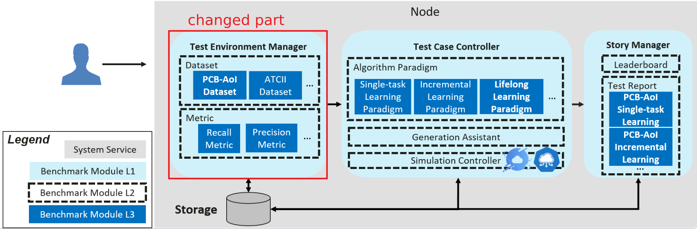
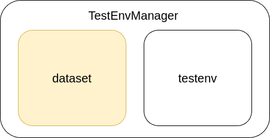
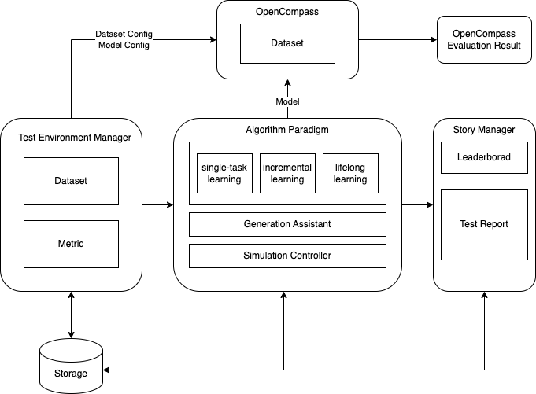

# 行业大模型基准测试套件：基于KubeEdge-Ianvs实现

大模型进入规模化应用时代，云已为大模型提供基础设施和服务，相关客户进一步提出包括个性化、数据合规、实时性等边缘侧的针对性应用需求，而云边协同的人工智能服务成为大趋势。但是，当前在产品定义、服务质量、服务资质、行业影响力等方面，存在通用竞争力和客户信任问题两大挑战，其症结在于，当前大模型基准测试聚焦对通用基础能力的考核，未能从行业角度牵引大模型应用。本项目从大模型产业以及云边协同人工智能角度、藉由行业应用反映大模型真实价值，以行业基准测试牵引大模型应用孵化。本项目基于协同人工智能基准测试套件KubeEdge-Ianvs，补充大模型测试工具接口，配套测试数据集，并构建政务等行业大模型测试套件。

目前Ianvs项目有以下问题需要解决：

1. 缺少灵活的数据集读取方式
Ianvs当前的数据集读取部分是由两年前的[simulation部分](https://github.com/kubeedge/ianvs/blob/main/docs/proposals/simulation/simulation.md)实现引入，目前仅支持少数几种数据集读取方式，例如使用index.txt配置，并且依赖于`sedna.datasources`这个库，如果需要实现新的数据集读取类，不仅需要修改Ianvs项目，还需要对应的修改sedna项目的代码
2. 缺少一个大模型的example
Ianvs项目在之前主要关注于图像处理的模型，对于大规模语言模型并没有相关示例，这可能会对想在Iavns项目上使用大模型的用户造成一些困难，如果能有一个大模型的示例，他们会更容易上手使用
3. 缺少一个大模型benchmark
数据集的格式多种多样，想要对大模型的效果评估进行适配，建立一个大模型的基准测试，需要定义好一个通用的接口，这个过程中需要调研多种模态的数据形式，并找到一个最好的接口设计

## Goals

1. 调研数据集，形成一份较为全面的包括多种行业场景的测试数据集的数据集地图
2. 完成大模型的single task learning的example，帮助想在Ianvs中使用LLM的用户上手使用
3. 集成OpenCompass等开源项目，通过提供模型API地址和Key实现在线大模型调用
4. 比较各种数据集接口的优劣，并指定一个通用的benchmark接口格式
5. 聚焦NLP或多模态类任务，以政务行业为例构筑套件，包括测试集、测试指标、测试环境、使用指南

## Design Details

### Dataset Map

#### Government Affairs

| Dataset Name | Summary | Link |
| --- | --- | --- |
| SUM: A Benchmark Dataset of Semantic Urban Meshes | A new benchmark dataset of semantic urban meshes is introduced, covering an area of approximately 4 square kilometers in Helsinki, Finland, with six classes of objects. A significant amount of labeling work is saved through a semi-automatic annotation framework. | [Link](https://3d.bk.tudelft.nl/projects/meshannotation/) |
| "15-Minute Living Circle" Planning Dataset for Urban Communities | A deep reinforcement learning-based approach for urban community spatial planning is proposed and millions of plans have been conducted in a virtual urban environment, learning urban planning capabilities from a vast amount of data. | [Link](https://github.com/tsinghua-fib-lab/DRL-urban-planning) |
| Walk score of all main Chinese cities | We are sharing the year-2014 “Walk Score” in GIS Shapefiles for more than 700,000 streets in 287 main cities (at or above prefecture-level) in mainland China. The Walk Scores range from 0 to 100, where 100 indicates the highest walkability. Please unzip the following two files and put them in the same directory and in this way you will be able to open the GIS file. Eleven attributes are available in the data, including walk score of the street (WS), ID of the street (STREET_ID), ID of the city (CITY_ID), name of the city in Chinese (NAME), name of the city in pinyin (PINYIN), level of the city (CITY_LEVEL), street segment length in meters (LENGTH_M), width of the road in meters (width_m), function density (function_d), function mix (function_m), as well as junction density (junction_d). | [Link](https://www.beijingcitylab.com/data-released-1/) |
| Urban vacant land of 36 major Chinese cities | The data include two parts: (1) urban vacant land of 36 major Chinese cities (in shapefile format), and (2) codes and data used for automatic vacant land identification. Urban vacant land is a growing issue worldwide. The study is aimed to realize large-scale automatic identification of urban vacant land. A framework based on deep learning techniques is proposed to extract urban vacant land of 36 major Chinese cities through semantic segmentation of high-resolution remote sensing images. The automatic identification framework is proved to be accurate and efficient, with strong robustness. This method is expected to serve as a practical approach in various countries and regions. The data of urban vacant land of 36 cities can be used in further studies. | [Link](https://www.beijingcitylab.com/data-released-1/) |
| Functional urban areas of China | We are sharing the Didi car hailing records derived functional urban areas of China in the format of GIS ShapeFiles. Please cite our paper when you use the data. | [Link](https://www.beijingcitylab.com/data-released-1/) |
| Urban blocks in 63 Chinese cities | We are sharing 141375 street blocks in 63 Chinese cities in 2017 in the format of GIS ShapeFiles. The data depicts street block scale three-dimensional attributes of these Chinese cities. They were computed using the 3.357 million large-scale three-dimensional building data (footprint with floor number). | [Link](https://www.beijingcitylab.com/data-released-1/) |
| OpenStreetMap | An open map dataset that includes global road network information, which can be used for traffic planning and analysis. | [Link](https://www.openstreetmap.org/) |
| Traffic4Cast | This is a dataset for a traffic forecasting challenge, containing traffic images and associated metadata from multiple cities for short-term traffic prediction. | [Link](https://github.com/iarai/NeurIPS2022-traffic4cast) |
| LargeST | This is a large-scale traffic flow forecasting benchmark dataset, encompassing 5 years of temporal coverage from 8,600 sensors in California, and includes comprehensive metadata. | [Link](https://github.com/liuxu77/LargeST) |
| PeMS | The California Department of Transportation's Performance Measurement System (PeMS) provides traffic flow data, which is commonly used for traffic management and forecasting research. | [Link](https://ar5iv.labs.arxiv.org/html/2306.08259) |
| Urban100 | This is an urban building recognition dataset, which includes 100 urban building images for training and evaluating deep learning models. | [Link](https://github.com/jbhuang0604/SelfExSR) |
| Epidemic Situation Government Q&A Dataset | Government Q&A data related to the epidemic.           | [Link](https://aistudio.baidu.com/datasetdetail/23958)    |
| Chinese_Rumor_Dataset        | The data is Chinese rumor data scraped from the Sina Weibo false information reporting platform. | [Link](https://github.com/thunlp/Chinese_Rumor_Dataset) |
| Teddy Cup Government Data    | This dataset contains data from a government messaging system. | [Link](https://github.com/Syucryingstar/NLP_tipdm/blob/master/%E5%85%A8%E9%83%A8%E6%95%B0%E6%8D%AE/%E9%99%84%E4%BB%B63.xlsx) |
| Urban Waste Classification Dataset | This dataset is for urban waste classification, dividing waste into four categories: dry waste, wet waste, hazardous waste, and recyclable waste. The images include plastic bottles, cherry tomatoes, used batteries, wads of toilet paper, and coffee cup lids. The number of images is 457. | [Link](https://aistudio.baidu.com/datasetdetail/22032) |
| Trash Annotations in Context | Garbage annotation in the scene, garbage classification/garbage identification/garbage instance segmentation, using COCO format annotation, compatible with pycocotools, including 1000 images. | [Link](https://aistudio.baidu.com/datasetdetail/103241) |
| Garbage Identification Dataset | Garbage identification dataset consisting of 15,515 images. | [Link](https://aistudio.baidu.com/datasetdetail/163725) |
| Domestic Waste Classification and Identification Project Dataset | Dataset for the domestic waste classification and identification project. | [Link](https://aistudio.baidu.com/datasetdetail/180004) |
| Indoor Trash Bin Identification Example Dataset | This is an example dataset that can be used for the training of AI agents and for data testing in scientific research projects. The dataset includes 100 sets of indoor trash bin images from different types, angles, and distances (1 rendering image + 1 semantic image). | [Link](https://aistudio.baidu.com/datasetdetail/119074) |
| Online Forum Sentiment Analysis           | Sentiment analysis of online forum discussions.           | [Link](https://aistudio.baidu.com/datasetdetail/241555) |
| Weibo Sentiment Data (Including Epidemic Data) | Weibo sentiment data, including data related to the epidemic. | [Link](https://aistudio.baidu.com/datasetdetail/228241) |
| Twitter Threat Sentiment                  | Sentiment analysis of threats on Twitter.                 | [Link](https://aistudio.baidu.com/datasetdetail/101917) |
| Fake News Data                           | Fake news data.                                          | [Link](https://aistudio.baidu.com/datasetdetail/54033) |
| U.S. Fake News Data                      | This data is a labeled fake news dataset, which includes fake news data identified using the Chrome BS Detector extension tool from 244 websites. | [Link](https://aistudio.baidu.com/datasetdetail/69660) |
| Weibo Fake News Dataset                  | Weibo: 4,664 events, (2,313/2,351 Rumor/NonRumor), 3,805,656 posts, 2,746,818 users. Average number of posts per event: 816. Maximum number of posts. | [Link](https://aistudio.baidu.com/datasetdetail/56506) |
| Fake News Detection Dataset              | Determine whether the news is fake by using both text and image data contained in the news. | [Link](https://aistudio.baidu.com/datasetdetail/127722) |
| Internet Fake News Detection During the Epidemic Period | Internet fake news detection during the epidemic period. | [Link](https://aistudio.baidu.com/datasetdetail/31690) |
| Chatgpt Politically Related Dataset      | Politics is considered politically related; everything else is not. Categories include: {'Technology': 0, 'Stocks': 1, 'Sports': 2, 'Entertainment': 3, 'Politics': 4, 'Society': 5, 'Education': 6, 'Finance': 7, 'Home': 8, 'Games': 9, 'Real Estate': 10, 'Fashion': 11, 'Lottery': 12, 'Horoscope': 13}. | [Link](https://aistudio.baidu.com/datasetdetail/199569) |
| Questioning Government Message Dataset   | The dataset contains 9,832 messages, divided into six parts, including "Message ID," "Message User," "Message Subject," "Message Time," "Message Details," and "Primary Classification." | [Link](https://aistudio.baidu.com/datasetdetail/124792) |


#### Industry

| Dataset Name | Summary | Link |
| --- | --- | --- |
| A benchmark dataset with Knowledge Graph generation for Industry 4.0 production lines | This dataset aims to develop a benchmark dataset for the generation of Knowledge Graphs, showcasing the benefits of using ontologies and semantic annotations of data. | [Link](https://www.x-mol.net/paper/article/1757834457582899200) |
| Cityscapes Dataset | A detailed urban street scene dataset containing 5000 videos for assessing the vision systems of autonomous driving vehicles. | [Link](https://www.cityscapes-dataset.com/) |
| ISTD-PDS7 | A benchmark dataset for multi-type pavement distress segmentation from CCD images in complex scenarios. | [Link](https://www.x-mol.net/paper/article/1639539700376416256) |
| OPV2V | The first large-scale open dataset for perception with V2V (Vehicle-to-Vehicle) communication: Provides a comprehensive benchmark with up to 16 models and a complete code framework. | [Link](https://mobility-lab.seas.ucla.edu/opv2v/) |
| Industrial Benchmark Dataset | This dataset is related to industrial control problems and is used to evaluate offline reinforcement learning algorithms. | [Link](https://github.com/siemens/industrialbenchmark) |
| Benchmark datasets incorporating diverse tasks, sample sizes, material systems, and data heterogeneity for materials informatics | A unique repository that includes 50 different datasets of material properties. | [Link](https://www.sciencedirect.com/science/article/pii/S2352340921005461) |
| PDEBench | A comprehensive benchmark for scientific machine learning. | [Link](https://github.com/pdebench/PDEBench) |
| WHU-TLS benchmark dataset | This dataset contains 115 scans with over 17.4 million 3D points from 11 different environments. It provides ground truth transformations, transformations calculated by Dong et al. (2018), and registration graphs for researchers. It can be used for applications such as safe railway operation, river survey and management, forest structure assessment, cultural heritage preservation, landslide monitoring, and underground asset management. | [Link](https://3s.whu.edu.cn/ybs/en/benchmark.htm) |
| LandBench 1.0 | A benchmark dataset that includes a large number of hydrological variables to evaluate land cover classification algorithms. | [Link](https://www.sciencedirect.com/science/article/pii/S095741742303419X) |
| NetBench | A large-scale and comprehensive network traffic benchmark dataset that includes multiple datasets and classification tasks for network traffic classification and analysis. | [Link](https://arxiv.org/html/2403.10319v1) |
| Tianchi Intelligent Manufacturing Quality Prediction Dataset | This dataset provides sampling data from the production line, reflecting factors such as machine temperature, gas, liquid flow, power, and manufacturing time. Researchers are required to design models to accurately predict the corresponding characteristic values. This is a typical regression prediction problem. | [Link](https://tianchi.aliyun.com/dataset/140667) |
| Aluminum Profile Surface Defect Recognition Dataset | This dataset comes from actual production monitoring images of aluminum profiles with defects. Each image contains one or more defects, and the sample images for machine learning will clearly identify the types of defects contained in the images. | [Link](https://tianchi.aliyun.com/dataset/140666) |
| Alibaba Cloud Infrastructure Supply Chain Inventory Management Decision Dataset | Supply chain lean management, as a new interdisciplinary field under the scenarios of the Internet and cloud computing, is at the core of Industry 4.0 and is a highly challenging issue for both academia and industry. This dataset focuses on solving at the replenishment unit level (the smallest unit of inventory management), given a period of historical demand data, current inventory data, replenishment lead time, and information related to the replenishment unit (product dimension and geographical dimension), researchers can use technologies such as "time series forecasting" and "operational research optimization" to make corresponding inventory management decisions. The aim is to reduce inventory levels and costs while ensuring that inventory is highly likely to meet demand without interruption. | [Link](https://tianchi.aliyun.com/dataset/138679) |
| Ceramic Tile Defect Detection Dataset | The data comes from a well-known ceramic tile manufacturer in Foshan, Guangdong Province. Data collection was carried out by setting up professional shooting equipment on the production line to capture real data from the manufacturing process, covering all common defects in the ceramic tile production line, including powder clumps, corner cracks, glaze drops, ink breaks, B holes, dirt spots, edge cracks, missing corners, brick debris, and white edges. | [Link](https://tianchi.aliyun.com/dataset/110088) |
| KITTI Autonomous Driving Dataset | KITTI includes a suite of vision tasks built using an autonomous driving platform. The full benchmark contains many tasks such as stereo, optical flow, visual odometry, etc. This dataset contains the object detection dataset, including monocular images and bounding boxes. The dataset contains 7,481 training images annotated with 3D bounding boxes. | [Link](https://tianchi.aliyun.com/dataset/92225) |
| Textile Defect Detection Dataset | The Tianchi platform delved into the textile workshop in Nanhai, Foshan, to collect images of textiles on site, creating and releasing a large-scale, high-quality textile flaw dataset, while also providing detailed annotations to meet the requirements of algorithms. The competition data covers various important flaws in the textile industry, with each image containing one or more flaws. | [Link](https://tianchi.aliyun.com/dataset/79336) |
| Turbine Blade Defect Dataset | This dataset is specifically created for the research of defect detection and identification in aircraft engines. The dataset includes a series of images of turbine blades and related defect annotation information. By using this dataset, researchers and engineers can carry out training, evaluation, and optimization of machine learning and deep learning algorithms for engine defects. | [Link](https://tianchi.aliyun.com/dataset/154228) |
| Industrial Steam Volume Prediction Dataset | Industrial Steam Volume Prediction Dataset | [Link](https://tianchi.aliyun.com/dataset/130516) |

#### Medical

| Dataset Name | Summary | Link |
| --- | --- | --- |
| MedMNIST | A medical image dataset including 10 preprocessed open medical image datasets covering main medical image modalities and a variety of data scales, aiming to provide a lightweight benchmark for AutoML in medical image classification. | [Link](https://www.heywhale.com/mw/dataset/5fa0fc9cca48e0003010a2e7) |
| CMB (Chinese Medical Benchmark) | A comprehensive Chinese medical benchmark test with 280,839 multiple-choice questions and 74 complex case consultation questions, covering all clinical medical specialties and various professional levels, to evaluate a model's medical knowledge and clinical consultation capabilities holistically. | [Link](https://cmedbenchmark.llmzoo.com/) |
| MedicalGPT Wiki | Provides a 2.4 million Chinese medical dataset, including pre-training, instruction fine-tuning, and reward datasets, as well as a 220,000 Chinese medical dialogue dataset. | [Link](https://github.com/shibing624/MedicalGPT/wiki/Data-Collection) |
| ChestX-ray14 | A medical imaging dataset with 112,120 frontal-view X-ray images of 30,805 unique patients, labeled with fourteen common disease categories derived from radiological reports using NLP techniques, expanding on ChestX-ray8 by adding six additional thorax diseases. | [Link](https://nihcc.app.box.com/v/ChestXray-NIHCC/file/220660789610) |
| MIMIC | A large, freely-available database containing deidentified health-related data from patients admitted to the critical care units of the Beth Israel Deaconess Medical Center. | [Link](https://mimic.mit.edu/) |
| ISIC (International Skin Imaging Collaboration) | A dataset containing images of skin lesions for skin cancer detection and classification. | [Link](https://www.isic-archive.com/) |
| Chinese Medical Information Processing Evaluation Benchmark CBLUE | Includes various datasets such as Chinese medical named entity recognition and Chinese medical text entity relationship extraction. | [Link](https://tianchi.aliyun.com/dataset/95414?lang=zh-cn) |
| CHIP2022-Medical Text Diagnostic Decision Tree Extraction Task | Clinical diagnostic and treatment processes are core medical knowledge and play an important role in building clinical auxiliary diagnostic and treatment systems, automatic medical consultation robots, and other applications. The Text2DT task defined in this dataset aims to model the clinical diagnostic and treatment process as a diagnostic decision tree, which is a tree structure composed of condition nodes and decision nodes. | [Link](https://tianchi.aliyun.com/dataset/135065) |
| CHIP2022-Medical List Invoice OCR Element Extraction Task | The dataset includes four types of medical records: outpatient invoices, inpatient invoices, medication tax invoices, and discharge summaries. The main focus is on extracting data from life scene images and generating electronic structured data. | [Link](https://tianchi.aliyun.com/dataset/131815) |
| Chinese Medical Named Entity Recognition Dataset (CMeEE) | The dataset includes 504 common pediatric diseases, 7,085 body parts, 12,907 clinical manifestations, 4,354 medical procedures, and other nine major categories of medical entities, with a training set of 15,000 entries, a validation set of 5,000 entries, and a test set of 3,000 entries. | [Link](https://tianchi.aliyun.com/dataset/144495) |

### LLM Single-Task-Learning Example

`examples/llm` 目录结构：

```
llm
└── singletask_learning_bench
    └── simple_qa
        ├── benchmarkingjob.yaml
        ├── testalgorithms
        │   └── gen
        │       ├── basemodel.py
        │       ├── gen_algorithm.yaml
        │       ├── op_eval.py
        └── testenv
            ├── acc.py
            └── testenv.yaml
```

simple_qa 是我设计的一个简单的QA问答任务，测试集部分内容如下：

```
{"question": "如果小明有5个苹果，他给了小华3个，那么小明还剩下多少个苹果？\nA. 2个\nB. 3个\nC. 4个\nD. 5个", "answer": "A"}
{"question": "下列哪个数是最小的质数？\nA. 0\nB. 1\nC. 2\nD. 4", "answer": "C"}
{"question": "一个长方形的长是10厘米，宽是5厘米，它的周长是多少厘米？\nA. 20厘米\nB. 30厘米\nC. 40厘米\nD. 50厘米", "answer": "B"}
{"question": "下列哪个分数是最接近1的？\nA. 1/2\nB. 3/4\nC. 4/5\nD. 5/6", "answer": "D"}
{"question": "如果一个数加上10等于30，那么这个数是多少？\nA. 20\nB. 21\nC. 22\nD. 23", "answer": "A"}
```

通过LLM来回答所选答案，提取回答中的答案的方式，来与正确答案进行比对，计算acc准确率

另外这里不同于一般的使用 `index.txt` 索引文件的方式，我实现了另外一套机制，如图。





具体在core里面修改的部分 `core/testenvmanager/dataset`：



值得注意的是，该设计同时也兼容对旧版的index数据的支持。仅仅只需要将旧版的train_url和test_url字段改成train_index和test_index即可。

在之前的项目中，我们需要在 `testenv.yaml` 文件中配置 `train_url` 和 `test_url` 索引文件的路径，索引文件中会放 (输入x, 期望输出y) 的文件路径，这个设计是存在一些局限性的。

以往的ianvs项目似乎是以cv为主，对于nlp的example似乎没有，所以数据集读取方面，一般采用的方式是写一个index.txt，这个文件里面放（数据，标注）对，然后又有一个放数据的文件夹，一个放标注的文件夹，一个文件就是一个数据。一张图片一个数据，这在cv领域是可以理解的，但是如果换到nlp领域，没法做到一个txt文件只放一个数据，一般的做法是连index文件都不需要，直接一个data.json/jsonl/文件就把数据和标签都写进去了，例如

```
{"question": xxx, "answer": xxx}
{"question": xxx, "answer": xxx}
{"question": xxx, "answer": xxx}
```

综上所述，我认为 Ianvs 项目需要添加不需要索引文件，而是直接提供数据文件的处理机制。考虑到需要尽可能对原来的 example 产生较小的影响，我通过以下的机制实现。

在 `core/testenvmanager/dataset/dataset.py` 中，把 `process_dataset()` 的逻辑改成：如果发现配置文件中配置了 `train_index` 或者 `test_index`，则采用原来 index 的处理方法处理数据集，如果是配置了 `train_data` 或者 `test_data`，则直接作为数据来处理。

另外，我在 `DatasetFormat` 中添加了 JSONL 格式，并在 `sedna.datasources` 中添加了对 JSONL 格式的处理代码 `JsonlDataParse`，读取 JSONL 文件的 `question` 和 `answer` 字段作为 x, y。


### OpenCompass 集成

#### 为什么需要集成 OpenCompass / 集成的必要性

首先给出 OpenCompass 官方的一些资料：

- [OpenCompass 官网](https://opencompass.org.cn/home)
- [OpenCompass Github](https://github.com/open-compass/opencompass)

OpenCompass 是一个大语言模型/多模态模型的一站式评测项目，里面已经实现了对上百个 BenchMark 的支持，也给出了常见主流大模型的配置方法。通过编写配置文件，选择 datasets 和 models（也即  BenchMark 和运行评测的模型）即可直接运行评测，支持一次性在多个模型上跑多个 BenchMark 的评测。

例如 OpenCompass 示例中的 [eval_demo.py](https://github.com/open-compass/opencompass/blob/main/configs/eval_demo.py)，只需要下面的几行代码就可以实现评测：

```python
from mmengine.config import read_base

with read_base():
    # 导入数据集配置，这个部分直接用就行了
    from .datasets.siqa.siqa_gen import siqa_datasets
    from .datasets.winograd.winograd_ppl import winograd_datasets
    # 导入模型配置，这个部分可以改成自己的模型
    from .models.opt.hf_opt_125m import opt125m
    from .models.opt.hf_opt_350m import opt350m

# 把要评测的 BenchMark 放在 datasets 中
datasets = [*siqa_datasets, *winograd_datasets]
# 把要评测的模型放在 models 中
models = [opt125m, opt350m]
```

Ianvs 项目现阶段想要实现对大模型的使用以及评估，在大模型本身基础能力方面，可以复用 OpenCompass 这个项目的成果，通过把 OpenCompass 集成进 Ianvs 项目的方式，实现相应大模型的一些基础能力的评测。

#### 集成的方案设计

OpenCompass 是一个评估大模型效果的项目，目前适配了很多的大模型和不同的benchmark。考虑到OpenCompass项目本身也一直在更新，为了防止OpenCompass的版本更新产生的影响，把OpenCompass打包成whl文件，然后通过 `pip install opencompass-xxx.whl` 的方式来安装。

通过这样的方式引入 OpenCompass 项目之后，我又在 `core` 目录下添加了原 OpenCompass 项目 `configs` 目录下的配置文件，并转换成 python 包的形式。这一步的目的是仍然能使用原来 OpenCompass 中的数据集配置文件。另外，我仿照 OpenCompass 的启动方式，在 Ianvs 项目根目录中添加了 `run_op.py` 来调用 OpenCompass 的 `opencompass.cli.main` 里面的 `main()` 函数启动评测。

整理的结构设计如图：



评测数据集方面，依然需要按照 [OpenCompass Doc](https://opencompass.readthedocs.io/zh-cn/latest/get_started/installation.html#id2) 的方法下载解压数据集。

集成之后，想要对在 Ianvs 项目中的模型进行评测，只需要额外写一个 python 的配置文件，例如在 `testalgorithms` 目录下的模型文件同级目录下写一个 `op_eval.py`：

```python
from mmengine.config import read_base
from opencompass.models import HuggingFacewithChatTemplate

with read_base():
    from core.op_extra.datasets.cmmlu.cmmlu_gen import cmmlu_datasets
    
datasets = [*cmmlu_datasets]

models = [
    dict(
        type=HuggingFacewithChatTemplate,
        # 模型别名
        abbr='qwen1.5-1.8b-chat-hf',
        # path 参数和 Ianvs 算法文件中的模型路径保持一致即可
        path='/home/icyfeather/models/Qwen1.5-1.8B-Chat',
        max_out_len=1024,
        batch_size=2,
        run_cfg=dict(num_gpus=1),
        stop_words=['<|im_end|>', '<|im_start|>'],
    )
]
```

此处的 models 配置，可以参考 OpenCompass 中的[`configs/models`](https://github.com/open-compass/opencompass/tree/main/configs/models) 中的内容，找到对应的模型示例进行编写。

最后，运行 `python run_op.py examples/llm/singletask_learning_bench/simple_qa/testalgorithms/gen/op_eval.py` 即可开启评测。

评测成功会输出这样的 summary：

```bash
dataset                                      version    metric    mode      qwen1.5-1.8b-chat-hf
-------------------------------------------  ---------  --------  ------  ----------------------
cmmlu-agronomy                               4c7f2c     accuracy  gen                      43.20
cmmlu-anatomy                                ea09bf     accuracy  gen                      33.78
cmmlu-ancient_chinese                        f7c97f     accuracy  gen                      32.32
cmmlu-arts                                   dd77b8     accuracy  gen                      66.88
cmmlu-astronomy                              1e49db     accuracy  gen                      33.94
cmmlu-business_ethics                        dc78cb     accuracy  gen                      55.02
cmmlu-chinese_civil_service_exam             1de82c     accuracy  gen                      45.00
cmmlu-chinese_driving_rule                   b8a42b     accuracy  gen                      77.86
cmmlu-chinese_food_culture                   2d568a     accuracy  gen                      41.91
cmmlu-chinese_foreign_policy                 dc2427     accuracy  gen                      62.62
cmmlu-chinese_history                        4cc7ed     accuracy  gen                      65.33
cmmlu-chinese_literature                     af3c41     accuracy  gen                      41.18
cmmlu-chinese_teacher_qualification          87de11     accuracy  gen                      60.34
cmmlu-clinical_knowledge                     c55b1d     accuracy  gen                      43.46
cmmlu-college_actuarial_science              d3c360     accuracy  gen                      19.81
cmmlu-college_education                      df8790     accuracy  gen                      66.36
cmmlu-college_engineering_hydrology          673f23     accuracy  gen                      44.34
cmmlu-college_law                            524c3a     accuracy  gen                      46.30
cmmlu-college_mathematics                    e4ebad     accuracy  gen                      23.81
cmmlu-college_medical_statistics             55af35     accuracy  gen                      39.62
cmmlu-college_medicine                       702f48     accuracy  gen                      45.79
cmmlu-computer_science                       637007     accuracy  gen                      51.47
cmmlu-computer_security                      932b6b     accuracy  gen                      53.80
cmmlu-conceptual_physics                     cfc077     accuracy  gen                      68.03
cmmlu-construction_project_management        968a4a     accuracy  gen                      46.04
cmmlu-economics                              ddaf7c     accuracy  gen                      56.60
cmmlu-education                              c35963     accuracy  gen                      69.94
cmmlu-electrical_engineering                 70e98a     accuracy  gen                      52.91
cmmlu-elementary_chinese                     cbcd6a     accuracy  gen                      45.24
cmmlu-elementary_commonsense                 a67f37     accuracy  gen                      53.03
cmmlu-elementary_information_and_technology  d34d2a     accuracy  gen                      68.49
cmmlu-elementary_mathematics                 a9d403     accuracy  gen                      28.26
cmmlu-ethnology                              31955f     accuracy  gen                      54.07
cmmlu-food_science                           741d8e     accuracy  gen                      40.56
cmmlu-genetics                               c326f7     accuracy  gen                      34.66
cmmlu-global_facts                           0a1236     accuracy  gen                      46.31
cmmlu-high_school_biology                    2be811     accuracy  gen                      46.15
cmmlu-high_school_chemistry                  d63c05     accuracy  gen                      42.42
cmmlu-high_school_geography                  5cd489     accuracy  gen                      45.76
cmmlu-high_school_mathematics                6b2087     accuracy  gen                      36.59
cmmlu-high_school_physics                    3df353     accuracy  gen                      43.64
cmmlu-high_school_politics                   7a88d8     accuracy  gen                      53.85
cmmlu-human_sexuality                        54ac98     accuracy  gen                      43.65
cmmlu-international_law                      0f5d40     accuracy  gen                      36.76
cmmlu-journalism                             a4f6a0     accuracy  gen                      46.51
cmmlu-jurisprudence                          7843da     accuracy  gen                      50.12
cmmlu-legal_and_moral_basis                  f906b0     accuracy  gen                      85.51
cmmlu-logical                                15a71b     accuracy  gen                      33.33
cmmlu-machine_learning                       bc6ad4     accuracy  gen                      35.25
cmmlu-management                             e5e8db     accuracy  gen                      53.33
cmmlu-marketing                              8b4c18     accuracy  gen                      49.44
cmmlu-marxist_theory                         75eb79     accuracy  gen                      80.42
cmmlu-modern_chinese                         83a9b7     accuracy  gen                      35.34
cmmlu-nutrition                              adfff7     accuracy  gen                      44.83
cmmlu-philosophy                             75e22d     accuracy  gen                      49.52
cmmlu-professional_accounting                0edc91     accuracy  gen                      50.29
cmmlu-professional_law                       d24af5     accuracy  gen                      41.71
cmmlu-professional_medicine                  134139     accuracy  gen                      39.36
cmmlu-professional_psychology                ec920e     accuracy  gen                      59.48
cmmlu-public_relations                       70ee06     accuracy  gen                      48.85
cmmlu-security_study                         45f96f     accuracy  gen                      65.19
cmmlu-sociology                              485285     accuracy  gen                      48.23
cmmlu-sports_science                         838cfe     accuracy  gen                      46.06
cmmlu-traditional_chinese_medicine           3bbf64     accuracy  gen                      38.38
cmmlu-virology                               8925bf     accuracy  gen                      48.52
cmmlu-world_history                          57c97c     accuracy  gen                      65.84
cmmlu-world_religions                        1d0f4b     accuracy  gen                      46.25
07/02 18:37:34 - OpenCompass - INFO - write summary to /home/icyfeather/project/ianvs/outputs/default/20240702_180158/summary/summary_20240702_180158.txt
07/02 18:37:34 - OpenCompass - INFO - write csv to /home/icyfeather/project/ianvs/outputs/default/20240702_180158/summary/summary_20240702_180158.csv
```

### 不同 BenchMark 的格式分析

| 领域 | 典型举例 | 题型 | 答案验证方法 |
| ---- | -------- | ---- | ------------ |
| NLP | MMLU、CMMLU、C-EVAL、CCPM etc. | 多项选择题，要求输出选项 | 利用 few-shot 学会输出格式，提取答案进行比较 |
| NLP | GSM8K | 小学数学题，推理计算并输出答案 | 利用 few-shot 学会输出格式，提取答案进行比较 |
| NLP | HumanEval | 编程题，要求完成python代码 | 进行单元测试 |
| NLP | AlignBench、MTBench | 开放式、主观评价的问题 | 用GPT-4来打分 |
| NLP | Flores | 多语言翻译 | 计算 BLUE 指标 |


### BenchMark 中的 Prompt 分析

| 类别 |  Prompt |
| ---- | ------ |
| 任务+格式+题干(Zeroshot) | Read the following function signature and docstring, and fully implement the function described. Your response should only contain the code for this function.\n{prompt} |
| 角色+要求+题干(Zeroshot) | You are an intelligent programming assistant to produce Python algorithmic solutions.\nCan you complete the following Python function?\n```python\n{prompt}\n``` |
| 题干+Let's think step by step(Zeroshot/Fewshot) | Question: {question}\nLet's think step by step\nAnswer: |
| 题干(Fewshot/Zeroshot) | Translate the following {_src_inst} statements to {_tgt_inst}.\n{{sentence_{_flores_source}}} |
| 题干+直接输出答案(Zeroshot) | 以下是中国{{exam_type}}中{{exam_class}}考试的一道{{question_type}}，不需要做任何分析和解释，直接输出答案选项。\n{{question}}\n{{option_str}} \n 答案: |
| Judge Prompt - 给出打分方向 + 直接对答案打分 | [指导]请充当一个公正的评委，评估AI助手对以下用户问题的回应质量。您的评估应考虑回应的实用性、相关性、准确性、深度、创造性和详细程度等因素。开始您的评估，提供简要解释。请尽量客观。在提供解释后，您必须按照以下格式严格给出对回应的评分，使用这个格式：“[[评分]]”，例如：“评分：[[5]]”。[问题]{问题}[助手回答的开始]{回答}[助手回答的结束] |
| Judge Prompt - 给出打分方向+参考答案+答案进行参考式打分 | 你是一个擅长评价文本质量的助手。\n请你以公正的评判者的身份，评估一个AI助手对于用户提问的回答的质量。由于您评估的回答类型是专业能力，因此你需要从下面的几个维度对回答进行评估:\n1. 事实正确性: 回答中提供的信息是否准确无误，是否基于可信的事实和数据。\n2. 满足用户需求: 回答是否满足了用户提出问题的目的和需求，是否对问题进行了全面而恰当的回应。\n3. 清晰度: 回答是否表达清晰、易懂，是否使用了简洁的语言和结构，以便用户可以轻松理解。\n4. 完备性: 回答是否提供了足够的信息和细节，以满足用户的需求，是否遗漏了重要的方面。\n我们会给您提供用户的提问，高质量的参考答案，和需要你评估的AI助手的答案。当你开始你的评估时，你需要按照遵守以下的流程：\n1. 将AI助手的答案与参考答案进行比较，指出AI助手的答案有哪些不足，并进一步解释。\n2. 从不同维度对AI助手的答案进行评价，在每个维度的评价之后，给每一个维度一个1～10的分数。\n3. 最后，综合每个维度的评估，对AI助手的回答给出一个1～10的综合分数。\n4. 你的打分需要尽可能严格，并且要遵守下面的评分规则：总的来说，模型回答的质量越高，则分数越高。其中，事实正确性和满足用户需求这两个维度是最重要的，这两个维度的分数主导了最后的综合分数。当模型回答存在与问题不相关，或者有本质性的事实错误，或生成了有害内容时，总分必须是1到2分；当模型回答没有严重错误而且基本无害，但是质量较低，没有满足用户需求，总分为3到4分；当模型回答基本满足用户要求，但是在部分维度上表现较差，质量中等，总分可以得5到6分；当模型回答质量与参考答案相近，在所有维度上表现良好，总分得7到8分；只有当模型回答质量显著超过参考答案，充分地解决了用户问题和所有需求，并且在所有维度上都接近满分的情况下，才能得9到10分。作为示例，参考答案可以得到8分。\n请记住，你必须在你打分前进行评价和解释。在你对每个维度的解释之后，需要加上对该维度的打分。之后，在你回答的末尾，按照以下字典格式（包括括号）返回你所有的打分结果，并确保你的打分结果是整数：\n{'维度一': 打分, '维度二': 打分, ..., '综合得分': 打分}，例如：{'事实正确性': 9, '满足用户需求': 6, ..., '综合得分': 7}。\n用户的提问： 高音单簧管和高音萨克斯的调性相同吗？如果相同，请说出他们的调性，如果不同，请分别说出他们的调性\n[参考答案开始]\n高音单簧管和高音萨克斯的调性不同。高音单簧管的调性通常为E♭，而高音萨克斯的调性则为B♭。\n\n[参考答案结束]\n[助手的答案开始]\n两种乐器的调性是不同的。高音单簧管的调性是bB（B-flat），而高音萨克斯（Soprano saxophone）的调性是B（B）。\n[助手的答案结束] 


### BenchMark 中的数据生成方法

| 类别 | 详细描述 |
| ---- | -------- |
| 人工收集 | 从网上公开的考试、资料中收集题目 |
| 人工编写 | 全部手动编写 |
| 种子问题+人工 | 写好一些种子问题，找承包商参考种子问题构造数据 |
| 相似样例随机替换 | 检索相似度在(0.5, 0.8)之间的（相似但是不那么相似）数据作为负样例混淆选项 |
| 相似样例 + 随机样例 | 候选选项列表由三部分组成：正确答案、 相似答案、随机答案 |
| GPT生成 + 人工修改 | 先利用GPT4生成，然后再人工精细修改答案 |

### BenchMark 难度

从效果上来说，BenchMark 需要能起到区分模型能力的作用，所以 BenchMark 必须具有一定的难度，综合来看，基本上是大模型只能拿个20%-60%分数的水平。

从设计上来说，BenchMark 需要覆盖多个维度的能力评估、有的还会分不同的难度等级，客观上本身就存在难度，所以大模型得分不高是意料之中的事情。

### BenchMark 总结 - 接口设计方法

结合上面对 BenchMark 的调研分析，以及对 OpenCompass 项目中集成不同的 BenchMark 的方法参考，总结认为 BenchMark 的接口应该提供以下信息：

1. 推理部分

    1.1 data

    这个部分就是数据集本身，但是有一个要求，那就是数据必须要分字段，例如对于 jsonl 格式的数据，可以是 {"question": "xxx", "answer": "xxx"} 这样

    1.2 Prompt Template

    这个部分需要和 1.1 data 相结合使用，prompt 中有的部分需要替换成 data 中的字段，例如：The Question is {question}. The Answer is {answer} 这样

    1.3 Retriever

    这个 Retriever 提供检索的相关内容，可以是 Zeroshot、OneShot、Fewshot，其中对于Fewshot，又可以分为FixKRetriever（固定的几个样例）、RandomRetriever（随机的样例）、TopkRetriever（例如可以通过SentenceTransformer和faiss来计算相似度，检索出来最相似的K个样例）等

2. 评估部分

    2.1 客观评估

        2.1.1 字符串处理

        由于模型的回答可能除了真正的答案，还有很多不相关的部分，需要从回答中提取出来真正需要的答案

        2.1.2 评估打分

        给出打分的算法，算法需要直接返回分数，分数是一个json，可以有多个维度的分数

    2.2 主观评估

        2.2.1 Prompt Template

        这个 Template 是 GPT-4 这种 Judge Model 的 Prompt，需要留一个 infer_result 的字段。Judge Model 会根据这个 Prompt 来打分。

        2.2.2 获取分数

        从 Judge Model 的结果中获取分数，分数是一个json，可以有多个维度的分数


### BenchMark 格式示例

BenchMark 的相关信息数据都需要设计成单独存储，以保持稳定性。

`data.json`

只保存和数据本身有关的部分。

```json
{
    "keys": ["key1", "key2", "answer_key"],
    "answer_key": "answer_key",
    "data": [{"key1": "xxx", "key2": "xxx", "answer_key": "xxx"}, {"key1": "xxx", "key2": "xxx", "answer_key": "xxx"}],
}
```

`prompt.json`

提供 model infer 的 prompt 模版。例如：

```json
{
    "infer_system_prompt": "You ara a xxxx assistant.",
    "infer_user_template": "Question: The question type is {type}, the question is {question}, What is the answer?",
    "infer_answer_template": "The Answer is {answer_key}",
    "eval_prompt_template": "The model infer answer is {infer_answer}, the reference data is {ref}, Please give a score between 1 to 10."
}
```

这里的数据是可扩展的，包括keys和prompts，如果需要有别的信息也可以加进去。

至于是使用 ZeroShot/OneShot/FewShot，其实都是用增加 chat message history 的方式，这部分由不同模型自己实现即可。

chat history：

```
chat = [
   {"role": "user", "content": "Hello, how are you?"},
   {"role": "assistant", "content": "I'm doing great. How can I help you today?"},
   {"role": "user", "content": "I'd like to show off how chat templating works!"},
]
```

可以看到在这一轮 user 的问题之前，已经有了一轮 user 和 assistant 的对话。这整个 chat 是直接传给模型的。
模型可以根据上下文进行学习。

举个例子，如果是 3-shot，以 HuggingFace 上的 zephyr-7b-beta 模型为例：

```python
from transformers import AutoModelForCausalLM, AutoTokenizer

checkpoint = "HuggingFaceH4/zephyr-7b-beta"
tokenizer = AutoTokenizer.from_pretrained(checkpoint)
model = AutoModelForCausalLM.from_pretrained(checkpoint)

messages = [
    {"role": "system","content": "You are an expert at solving problems."},
    {"role": "user", "content": "以下是关于{_ch_name}的单项选择题，请直接给出正确答案的选项。\n题目：{{question}}\nA. {{A}}\nB. {{B}}\nC. {{C}}\nD. {{D}}"},
    {"role": "assistant", "content": "答案是{answer}。"}
    {"role": "user", "content": "以下是关于{_ch_name}的单项选择题，请直接给出正确答案的选项。\n题目：{{question}}\nA. {{A}}\nB. {{B}}\nC. {{C}}\nD. {{D}}"},
    {"role": "assistant", "content": "答案是{answer}。"}
    {"role": "user", "content": "以下是关于{_ch_name}的单项选择题，请直接给出正确答案的选项。\n题目：{{question}}\nA. {{A}}\nB. {{B}}\nC. {{C}}\nD. {{D}}"},
    {"role": "assistant", "content": "答案是{answer}。"}
    {"role": "user", "content": "以下是关于{_ch_name}的单项选择题，请直接给出正确答案的选项。\n题目：{{question}}\nA. {{A}}\nB. {{B}}\nC. {{C}}\nD. {{D}}"},
]
tokenized_chat = tokenizer.apply_chat_template(messages, tokenize=True, add_generation_prompt=True, return_tensors="pt")
print(tokenizer.decode(tokenized_chat[0]))
```


## 时间规划

- **6月到7月中旬**
实现 OpenCompass 项目的集成，在 Ianvs 上实现 LLM single task learning 样例
- **7月中旬到8月中旬**
以政务数据集为例，构建一套测试集、测试指标、测试环境、使用指南
- **8月中旬到9月中旬**
优化 Ianvs 上的评估，实现任务监控、可视化等功能
- **9月中旬到9月底**
如果有时间精力，看情况实现工业/医疗大模型测试套件，包括指标和样例


