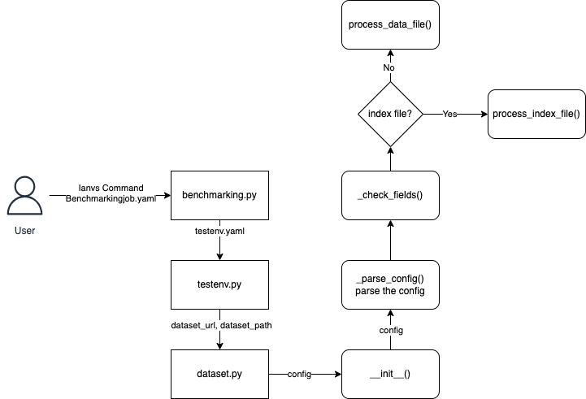
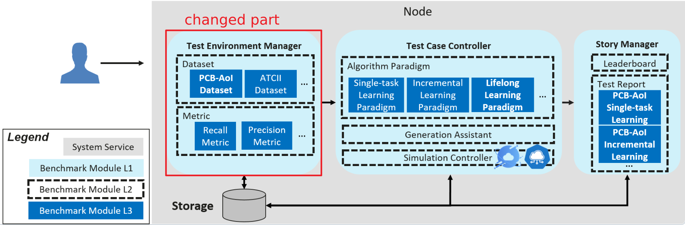

# Industry Large-Scale Model Benchmarking Suite: Implemented Based on KubeEdge-Ianvs

As large-scale models enter the era of large-scale application, the cloud has provided infrastructure and services for large-scale models. Related customers have further proposed targeted application demands on the edge side, including personalization, data compliance, and real-time capabilities, and cloud-edge collaborative artificial intelligence services have become a major trend. However, there are currently two major challenges in terms of product definition, service quality, service qualifications, and industry influence: general competitiveness and customer trust issues. The crux lies in the fact that the current large-scale model benchmarking focuses on the assessment of general basic capabilities and has not driven the application of large-scale models from an industry perspective. This project reflects the real value of large-scale models from the perspective of the large-scale model industry and cloud-edge collaborative artificial intelligence, and drives the incubation of large-scale model applications through industry benchmarking. This project is based on the collaborative artificial intelligence benchmarking suite KubeEdge-Ianvs, supplements the large-scale model testing tool interface, supports the testing dataset, and constructs a large-scale model testing suite for industries such as government affairs.

The Ianvs project currently has the following issues that need to be resolved:

1. Lack of a Flexible Dataset Reading Method
The current dataset reading part of Ianvs is implemented by the [simulation part](https://github.com/kubeedge/ianvs/blob/main/docs/proposals/simulation/simulation.md) introduced two years ago, which currently only supports a few ways of reading datasets, such as using the index.txt configuration, and depends on the 'sedna.datasources' library. If a new dataset reading class needs to be implemented, not only does the Ianvs project need to be modified, but also the corresponding code of the sedna project needs to be modified.

2. Lack of a Large-Scale Model Example
The Ianvs project has mainly focused on image processing models in the past, and there are no related examples for large-scale language models. This may cause some difficulties for users who want to use large-scale models on the Ianvs project. If there is an example of a large-scale model, they will find it easier to get started.

3. Lack of a Large-Scale Model Benchmark
The format of the dataset is diverse, and to adapt to the evaluation of the effect of large-scale models, it is necessary to establish a large-scale model benchmark test. It is necessary to define a common interface in this process, which requires researching various forms of modal data and finding the best interface design.


## Goals

1. Investigate datasets to form a comprehensive dataset map that includes various industry scenarios for testing datasets.
2. Complete an example of single task learning for large models to help users who want to use Large Language Models (LLMs) in Ianvs to get started.
3. Integrate open-source projects such as OpenCompass to enable online calling of large models by providing model API addresses and keys.
4. Compare the advantages and disadvantages of various dataset interfaces and specify a common benchmark interface format.
5. Focus on NLP or multimodal tasks, taking the government affairs industry as an example to build a suite, including test datasets, test metrics, testing environments, and user guides.


## Design Details

### Dataset Map

#### Government Affairs

| Dataset Name | Summary | Link |
| --- | --- | --- |
| SUM: A Benchmark Dataset of Semantic Urban Meshes | A new benchmark dataset of semantic urban meshes is introduced, covering an area of approximately 4 square kilometers in Helsinki, Finland, with six classes of objects. A significant amount of labeling work is saved through a semi-automatic annotation framework. | [Link](https://3d.bk.tudelft.nl/projects/meshannotation/) |
| "15-Minute Living Circle" Planning Dataset for Urban Communities | A deep reinforcement learning-based approach for urban community spatial planning is proposed and millions of plans have been conducted in a virtual urban environment, learning urban planning capabilities from a vast amount of data. | [Link](https://github.com/tsinghua-fib-lab/DRL-urban-planning) |
| Walk score of all main Chinese cities | We are sharing the year-2014 “Walk Score” in GIS Shapefiles for more than 700,000 streets in 287 main cities (at or above prefecture-level) in mainland China. The Walk Scores range from 0 to 100, where 100 indicates the highest walkability. Please unzip the following two files and put them in the same directory and in this way you will be able to open the GIS file. Eleven attributes are available in the data, including walk score of the street (WS), ID of the street (STREET_ID), ID of the city (CITY_ID), name of the city in Chinese (NAME), name of the city in pinyin (PINYIN), level of the city (CITY_LEVEL), street segment length in meters (LENGTH_M), width of the road in meters (width_m), function density (function_d), function mix (function_m), as well as junction density (junction_d). | [Link](https://www.beijingcitylab.com/data-released-1/) |
| Urban vacant land of 36 major Chinese cities | The data include two parts: (1) urban vacant land of 36 major Chinese cities (in shapefile format), and (2) codes and data used for automatic vacant land identification. Urban vacant land is a growing issue worldwide. The study is aimed to realize large-scale automatic identification of urban vacant land. A framework based on deep learning techniques is proposed to extract urban vacant land of 36 major Chinese cities through semantic segmentation of high-resolution remote sensing images. The automatic identification framework is proved to be accurate and efficient, with strong robustness. This method is expected to serve as a practical approach in various countries and regions. The data of urban vacant land of 36 cities can be used in further studies. | [Link](https://www.beijingcitylab.com/data-released-1/) |
| Functional urban areas of China | We are sharing the Didi car hailing records derived functional urban areas of China in the format of GIS ShapeFiles. Please cite our paper when you use the data. | [Link](https://www.beijingcitylab.com/data-released-1/) |
| Urban blocks in 63 Chinese cities | We are sharing 141375 street blocks in 63 Chinese cities in 2017 in the format of GIS ShapeFiles. The data depicts street block scale three-dimensional attributes of these Chinese cities. They were computed using the 3.357 million large-scale three-dimensional building data (footprint with floor number). | [Link](https://www.beijingcitylab.com/data-released-1/) |
| OpenStreetMap | An open map dataset that includes global road network information, which can be used for traffic planning and analysis. | [Link](https://www.openstreetmap.org/) |
| Traffic4Cast | This is a dataset for a traffic forecasting challenge, containing traffic images and associated metadata from multiple cities for short-term traffic prediction. | [Link](https://github.com/iarai/NeurIPS2022-traffic4cast) |
| LargeST | This is a large-scale traffic flow forecasting benchmark dataset, encompassing 5 years of temporal coverage from 8,600 sensors in California, and includes comprehensive metadata. | [Link](https://github.com/liuxu77/LargeST) |
| PeMS | The California Department of Transportation's Performance Measurement System (PeMS) provides traffic flow data, which is commonly used for traffic management and forecasting research. | [Link](https://ar5iv.labs.arxiv.org/html/2306.08259) |
| Urban100 | This is an urban building recognition dataset, which includes 100 urban building images for training and evaluating deep learning models. | [Link](https://github.com/jbhuang0604/SelfExSR) |
| Epidemic Situation Government Q&A Dataset | Government Q&A data related to the epidemic.           | [Link](https://aistudio.baidu.com/datasetdetail/23958)    |
| Chinese_Rumor_Dataset        | The data is Chinese rumor data scraped from the Sina Weibo false information reporting platform. | [Link](https://github.com/thunlp/Chinese_Rumor_Dataset) |
| Teddy Cup Government Data    | This dataset contains data from a government messaging system. | [Link](https://github.com/Syucryingstar/NLP_tipdm/blob/master/%E5%85%A8%E9%83%A8%E6%95%B0%E6%8D%AE/%E9%99%84%E4%BB%B63.xlsx) |
| Urban Waste Classification Dataset | This dataset is for urban waste classification, dividing waste into four categories: dry waste, wet waste, hazardous waste, and recyclable waste. The images include plastic bottles, cherry tomatoes, used batteries, wads of toilet paper, and coffee cup lids. The number of images is 457. | [Link](https://aistudio.baidu.com/datasetdetail/22032) |
| Trash Annotations in Context | Garbage annotation in the scene, garbage classification/garbage identification/garbage instance segmentation, using COCO format annotation, compatible with pycocotools, including 1000 images. | [Link](https://aistudio.baidu.com/datasetdetail/103241) |
| Garbage Identification Dataset | Garbage identification dataset consisting of 15,515 images. | [Link](https://aistudio.baidu.com/datasetdetail/163725) |
| Domestic Waste Classification and Identification Project Dataset | Dataset for the domestic waste classification and identification project. | [Link](https://aistudio.baidu.com/datasetdetail/180004) |
| Indoor Trash Bin Identification Example Dataset | This is an example dataset that can be used for the training of AI agents and for data testing in scientific research projects. The dataset includes 100 sets of indoor trash bin images from different types, angles, and distances (1 rendering image + 1 semantic image). | [Link](https://aistudio.baidu.com/datasetdetail/119074) |
| Online Forum Sentiment Analysis           | Sentiment analysis of online forum discussions.           | [Link](https://aistudio.baidu.com/datasetdetail/241555) |
| Weibo Sentiment Data (Including Epidemic Data) | Weibo sentiment data, including data related to the epidemic. | [Link](https://aistudio.baidu.com/datasetdetail/228241) |
| Twitter Threat Sentiment                  | Sentiment analysis of threats on Twitter.                 | [Link](https://aistudio.baidu.com/datasetdetail/101917) |
| Fake News Data                           | Fake news data.                                          | [Link](https://aistudio.baidu.com/datasetdetail/54033) |
| U.S. Fake News Data                      | This data is a labeled fake news dataset, which includes fake news data identified using the Chrome BS Detector extension tool from 244 websites. | [Link](https://aistudio.baidu.com/datasetdetail/69660) |
| Weibo Fake News Dataset                  | Weibo: 4,664 events, (2,313/2,351 Rumor/NonRumor), 3,805,656 posts, 2,746,818 users. Average number of posts per event: 816. Maximum number of posts. | [Link](https://aistudio.baidu.com/datasetdetail/56506) |
| Fake News Detection Dataset              | Determine whether the news is fake by using both text and image data contained in the news. | [Link](https://aistudio.baidu.com/datasetdetail/127722) |
| Internet Fake News Detection During the Epidemic Period | Internet fake news detection during the epidemic period. | [Link](https://aistudio.baidu.com/datasetdetail/31690) |
| Chatgpt Politically Related Dataset      | Politics is considered politically related; everything else is not. Categories include: {'Technology': 0, 'Stocks': 1, 'Sports': 2, 'Entertainment': 3, 'Politics': 4, 'Society': 5, 'Education': 6, 'Finance': 7, 'Home': 8, 'Games': 9, 'Real Estate': 10, 'Fashion': 11, 'Lottery': 12, 'Horoscope': 13}. | [Link](https://aistudio.baidu.com/datasetdetail/199569) |
| Questioning Government Message Dataset   | The dataset contains 9,832 messages, divided into six parts, including "Message ID," "Message User," "Message Subject," "Message Time," "Message Details," and "Primary Classification." | [Link](https://aistudio.baidu.com/datasetdetail/124792) |


#### Industry

| Dataset Name | Summary | Link |
| --- | --- | --- |
| A benchmark dataset with Knowledge Graph generation for Industry 4.0 production lines | This dataset aims to develop a benchmark dataset for the generation of Knowledge Graphs, showcasing the benefits of using ontologies and semantic annotations of data. | [Link](https://www.x-mol.net/paper/article/1757834457582899200) |
| Cityscapes Dataset | A detailed urban street scene dataset containing 5000 videos for assessing the vision systems of autonomous driving vehicles. | [Link](https://www.cityscapes-dataset.com/) |
| ISTD-PDS7 | A benchmark dataset for multi-type pavement distress segmentation from CCD images in complex scenarios. | [Link](https://www.x-mol.net/paper/article/1639539700376416256) |
| OPV2V | The first large-scale open dataset for perception with V2V (Vehicle-to-Vehicle) communication: Provides a comprehensive benchmark with up to 16 models and a complete code framework. | [Link](https://mobility-lab.seas.ucla.edu/opv2v/) |
| Industrial Benchmark Dataset | This dataset is related to industrial control problems and is used to evaluate offline reinforcement learning algorithms. | [Link](https://github.com/siemens/industrialbenchmark) |
| Benchmark datasets incorporating diverse tasks, sample sizes, material systems, and data heterogeneity for materials informatics | A unique repository that includes 50 different datasets of material properties. | [Link](https://www.sciencedirect.com/science/article/pii/S2352340921005461) |
| PDEBench | A comprehensive benchmark for scientific machine learning. | [Link](https://github.com/pdebench/PDEBench) |
| WHU-TLS benchmark dataset | This dataset contains 115 scans with over 17.4 million 3D points from 11 different environments. It provides ground truth transformations, transformations calculated by Dong et al. (2018), and registration graphs for researchers. It can be used for applications such as safe railway operation, river survey and management, forest structure assessment, cultural heritage preservation, landslide monitoring, and underground asset management. | [Link](https://3s.whu.edu.cn/ybs/en/benchmark.htm) |
| LandBench 1.0 | A benchmark dataset that includes a large number of hydrological variables to evaluate land cover classification algorithms. | [Link](https://www.sciencedirect.com/science/article/pii/S095741742303419X) |
| NetBench | A large-scale and comprehensive network traffic benchmark dataset that includes multiple datasets and classification tasks for network traffic classification and analysis. | [Link](https://arxiv.org/html/2403.10319v1) |
| Tianchi Intelligent Manufacturing Quality Prediction Dataset | This dataset provides sampling data from the production line, reflecting factors such as machine temperature, gas, liquid flow, power, and manufacturing time. Researchers are required to design models to accurately predict the corresponding characteristic values. This is a typical regression prediction problem. | [Link](https://tianchi.aliyun.com/dataset/140667) |
| Aluminum Profile Surface Defect Recognition Dataset | This dataset comes from actual production monitoring images of aluminum profiles with defects. Each image contains one or more defects, and the sample images for machine learning will clearly identify the types of defects contained in the images. | [Link](https://tianchi.aliyun.com/dataset/140666) |
| Alibaba Cloud Infrastructure Supply Chain Inventory Management Decision Dataset | Supply chain lean management, as a new interdisciplinary field under the scenarios of the Internet and cloud computing, is at the core of Industry 4.0 and is a highly challenging issue for both academia and industry. This dataset focuses on solving at the replenishment unit level (the smallest unit of inventory management), given a period of historical demand data, current inventory data, replenishment lead time, and information related to the replenishment unit (product dimension and geographical dimension), researchers can use technologies such as "time series forecasting" and "operational research optimization" to make corresponding inventory management decisions. The aim is to reduce inventory levels and costs while ensuring that inventory is highly likely to meet demand without interruption. | [Link](https://tianchi.aliyun.com/dataset/138679) |
| Ceramic Tile Defect Detection Dataset | The data comes from a well-known ceramic tile manufacturer in Foshan, Guangdong Province. Data collection was carried out by setting up professional shooting equipment on the production line to capture real data from the manufacturing process, covering all common defects in the ceramic tile production line, including powder clumps, corner cracks, glaze drops, ink breaks, B holes, dirt spots, edge cracks, missing corners, brick debris, and white edges. | [Link](https://tianchi.aliyun.com/dataset/110088) |
| KITTI Autonomous Driving Dataset | KITTI includes a suite of vision tasks built using an autonomous driving platform. The full benchmark contains many tasks such as stereo, optical flow, visual odometry, etc. This dataset contains the object detection dataset, including monocular images and bounding boxes. The dataset contains 7,481 training images annotated with 3D bounding boxes. | [Link](https://tianchi.aliyun.com/dataset/92225) |
| Textile Defect Detection Dataset | The Tianchi platform delved into the textile workshop in Nanhai, Foshan, to collect images of textiles on site, creating and releasing a large-scale, high-quality textile flaw dataset, while also providing detailed annotations to meet the requirements of algorithms. The competition data covers various important flaws in the textile industry, with each image containing one or more flaws. | [Link](https://tianchi.aliyun.com/dataset/79336) |
| Turbine Blade Defect Dataset | This dataset is specifically created for the research of defect detection and identification in aircraft engines. The dataset includes a series of images of turbine blades and related defect annotation information. By using this dataset, researchers and engineers can carry out training, evaluation, and optimization of machine learning and deep learning algorithms for engine defects. | [Link](https://tianchi.aliyun.com/dataset/154228) |
| Industrial Steam Volume Prediction Dataset | Industrial Steam Volume Prediction Dataset | [Link](https://tianchi.aliyun.com/dataset/130516) |

#### Medical

| Dataset Name | Summary | Link |
| --- | --- | --- |
| MedMNIST | A medical image dataset including 10 preprocessed open medical image datasets covering main medical image modalities and a variety of data scales, aiming to provide a lightweight benchmark for AutoML in medical image classification. | [Link](https://www.heywhale.com/mw/dataset/5fa0fc9cca48e0003010a2e7) |
| CMB (Chinese Medical Benchmark) | A comprehensive Chinese medical benchmark test with 280,839 multiple-choice questions and 74 complex case consultation questions, covering all clinical medical specialties and various professional levels, to evaluate a model's medical knowledge and clinical consultation capabilities holistically. | [Link](https://cmedbenchmark.llmzoo.com/) |
| MedicalGPT Wiki | Provides a 2.4 million Chinese medical dataset, including pre-training, instruction fine-tuning, and reward datasets, as well as a 220,000 Chinese medical dialogue dataset. | [Link](https://github.com/shibing624/MedicalGPT/wiki/Data-Collection) |
| ChestX-ray14 | A medical imaging dataset with 112,120 frontal-view X-ray images of 30,805 unique patients, labeled with fourteen common disease categories derived from radiological reports using NLP techniques, expanding on ChestX-ray8 by adding six additional thorax diseases. | [Link](https://nihcc.app.box.com/v/ChestXray-NIHCC/file/220660789610) |
| MIMIC | A large, freely-available database containing deidentified health-related data from patients admitted to the critical care units of the Beth Israel Deaconess Medical Center. | [Link](https://mimic.mit.edu/) |
| ISIC (International Skin Imaging Collaboration) | A dataset containing images of skin lesions for skin cancer detection and classification. | [Link](https://www.isic-archive.com/) |
| Chinese Medical Information Processing Evaluation Benchmark CBLUE | Includes various datasets such as Chinese medical named entity recognition and Chinese medical text entity relationship extraction. | [Link](https://tianchi.aliyun.com/dataset/95414?lang=zh-cn) |
| CHIP2022-Medical Text Diagnostic Decision Tree Extraction Task | Clinical diagnostic and treatment processes are core medical knowledge and play an important role in building clinical auxiliary diagnostic and treatment systems, automatic medical consultation robots, and other applications. The Text2DT task defined in this dataset aims to model the clinical diagnostic and treatment process as a diagnostic decision tree, which is a tree structure composed of condition nodes and decision nodes. | [Link](https://tianchi.aliyun.com/dataset/135065) |
| CHIP2022-Medical List Invoice OCR Element Extraction Task | The dataset includes four types of medical records: outpatient invoices, inpatient invoices, medication tax invoices, and discharge summaries. The main focus is on extracting data from life scene images and generating electronic structured data. | [Link](https://tianchi.aliyun.com/dataset/131815) |
| Chinese Medical Named Entity Recognition Dataset (CMeEE) | The dataset includes 504 common pediatric diseases, 7,085 body parts, 12,907 clinical manifestations, 4,354 medical procedures, and other nine major categories of medical entities, with a training set of 15,000 entries, a validation set of 5,000 entries, and a test set of 3,000 entries. | [Link](https://tianchi.aliyun.com/dataset/144495) |

### LLM Single-Task-Learning Example

`examples/llm` directory structure：

```
llm
└── singletask_learning_bench
    └── simple_qa
        ├── benchmarkingjob.yaml
        ├── testalgorithms
        │   └── gen
        │       ├── basemodel.py
        │       ├── gen_algorithm.yaml
        │       ├── op_eval.py
        └── testenv
            ├── acc.py
            └── testenv.yaml
```

simple_qa is a simple QA task designed by me，the content is as follows：

```
{"question": "If Xiao Ming has 5 apples and gives 3 to Xiao Hua, how many apples does Xiao Ming have left?
A. 2
B. 3
C. 4
D. 5", "answer": "A"}
{"question": "Which of the following numbers is the smallest prime number?
A. 0
B. 1
C. 2
D. 4", "answer": "C"}
{"question": "If the length of a rectangle is 10 centimeters and the width is 5 centimeters, what is its perimeter in centimeters?
A. 20 centimeters
B. 30 centimeters
C. 40 centimeters
D. 50 centimeters", "answer": "B"}
{"question": "Which of the following fractions is closest to 1?
A. 1/2
B. 3/4
C. 4/5
D. 5/6", "answer": "D"}
{"question": "If a number plus 10 equals 30, what is the number?
A. 20
B. 21
C. 22
D. 23", "answer": "A"}
```

Using LLM to answer selected questions, extract the answer from the response, and compare it with the correct answer to calculate the accuracy rate.

Additionally, this is different from the usual method of using an `index.txt` index file. I have implemented another mechanism, as shown in the figure.





I modified `core/testenvmanager/dataset` in core：


It should be noticed that, this design is compatible to older version data-reading, you only need to change train_url and test_url to train_index and test_index.

In previous projects, we needed to configure the paths of the `train_url` and `test_url` index files in the `testenv.yaml` file. The index files would contain file paths for (input x, expected output y) pairs, and this design has some limitations.

The previous Ianvs projects seem to be focused on computer vision (CV), and there do not appear to be examples for natural language processing (NLP), so in terms of dataset reading, the common approach is to write an `index.txt` file that contains (data, annotation) pairs. There would also be a folder for data, a folder for annotations, and each file represents a single piece of data. An image corresponds to a single data point, which is understandable in the CV field. However, if you switch to the NLP field, you can't have a single text file contain just one piece of data. The common practice is to not even need an index file, but to write both data and labels directly into a data.json or jsonl file. For example:


```
{"question": xxx, "answer": xxx}
{"question": xxx, "answer": xxx}
{"question": xxx, "answer": xxx}
```

In summary, I believe that the Ianvs project needs to add a processing mechanism that does not require an index file, but instead directly provides the data file. Considering the need to make as little impact as possible on the original examples, I have implemented the following mechanism.

In `core/testenvmanager/dataset/dataset.py`, I have changed the logic of `process_dataset()` to: if it detects that the `train_index` or `test_index` is configured in the configuration file, it will use the original index processing method to handle the dataset. If it is configured with `train_data` or `test_data`, it will be processed directly as data.

Additionally, I have added the JSONL format in `DatasetFormat` and added the handling code for the JSONL format `JsonlDataParse` in `sedna.datasources`, which reads the `question` and `answer` fields from the JSONL file as x and y.


### OpenCompass Integration

#### Why Integrate OpenCompass / The Necessity of Integration

Let's start with some official information about OpenCompass:

- [OpenCompass Official Website](https://opencompass.org.cn/home)
- [OpenCompass Github](https://github.com/open-compass/opencompass)

OpenCompass is a one-stop evaluation project for large language models/multimodal models, which has already implemented support for hundreds of BenchMarks and has also provided configuration methods for common mainstream large models. By writing configuration files, selecting datasets and models (i.e., BenchMarks and models for running evaluations), you can directly run evaluations, supporting the evaluation of multiple BenchMarks on multiple models at once.

For example, in the OpenCompass example [eval_demo.py](https://github.com/open-compass/opencompass/blob/main/configs/eval_demo.py), you can achieve evaluation with just a few lines of code:

```python
from mmengine.config import read_base

with read_base():
    # Import dataset configuration, this part can be used directly
    from .datasets.siqa.siqa_gen import siqa_datasets
    from .datasets.winograd.winograd_ppl import winograd_datasets
    # Import model configuration, this part can be changed to your own model
    from .models.opt.hf_opt_125m import opt125m
    from .models.opt.hf_opt_350m import opt350m

# Put the BenchMarks to be evaluated in datasets
datasets = [*siqa_datasets, *winograd_datasets]
# Put the models to be evaluated in models
models = [opt125m, opt350m]
```

The Ianvs project currently wants to implement the use and evaluation of large models. In terms of the basic capabilities of the large models themselves, it can reuse the achievements of the OpenCompass project. By integrating OpenCompass into the Ianvs project, it can achieve the evaluation of some basic capabilities of the corresponding large models.

#### Integration Plan Design

OpenCompass is a project for evaluating the effectiveness of large models and has been adapted to many large models and various benchmarks. Considering that the OpenCompass project itself is constantly being updated, to prevent the impact of version updates, OpenCompass is packaged into a .whl file and installed using the command `pip install opencompass-xxx.whl`.

After introducing the OpenCompass project in this way, I added the configuration files from the original OpenCompass project's `configs` directory under the `core` directory and converted them into a Python package. The purpose of this step is to continue using the original dataset configuration files from OpenCompass. In addition, following the startup method of OpenCompass, I added `run_op.py` in the root directory of the Ianvs project to call the `main()` function inside `opencompass.cli.main` to start the evaluation.

The organized structural design is shown in the figure:


For the evaluation dataset, it is still necessary to download and unzip the datasets according to the method described in [OpenCompass Doc](https://opencompass.readthedocs.io/zh-cn/latest/get_started/installation.html#id2).

After integration, to evaluate the models in the Ianvs project, you only need to write an additional Python configuration file, for example, write an `op_eval.py` in the same directory level as the model file in the `testalgorithms` directory:

```python
from mmengine.config import read_base
from opencompass.models import HuggingFacewithChatTemplate

with read_base():
    from core.op_extra.datasets.cmmlu.cmmlu_gen import cmmlu_datasets
    
datasets = [*cmmlu_datasets]

models = [
    dict(
        type=HuggingFacewithChatTemplate,
        # Model alias
        abbr='qwen1.5-1.8b-chat-hf',
        # The path parameter should be consistent with the model path in the Ianvs algorithm file
        path='/home/icyfeather/models/Qwen1.5-1.8B-Chat',
        max_out_len=1024,
        batch_size=2,
        run_cfg=dict(num_gpus=1),
        stop_words=['<|im_end|>', '<|im_start|>'],
    )
]
```

The model configuration here can refer to the content in OpenCompass's [`configs/models`](https://github.com/open-compass/opencompass/tree/main/configs/models) to find the corresponding model example for writing.

Finally, running `python run_op.py examples/llm/singletask_learning_bench/simple_qa/testalgorithms/gen/op_eval.py` will start the evaluation.

The evaluation will output a summary like this: 


```bash
dataset                                      version    metric    mode      qwen1.5-1.8b-chat-hf
-------------------------------------------  ---------  --------  ------  ----------------------
cmmlu-agronomy                               4c7f2c     accuracy  gen                      43.20
cmmlu-anatomy                                ea09bf     accuracy  gen                      33.78
cmmlu-ancient_chinese                        f7c97f     accuracy  gen                      32.32
cmmlu-arts                                   dd77b8     accuracy  gen                      66.88
cmmlu-astronomy                              1e49db     accuracy  gen                      33.94
cmmlu-business_ethics                        dc78cb     accuracy  gen                      55.02
cmmlu-chinese_civil_service_exam             1de82c     accuracy  gen                      45.00
cmmlu-chinese_driving_rule                   b8a42b     accuracy  gen                      77.86
cmmlu-chinese_food_culture                   2d568a     accuracy  gen                      41.91
cmmlu-chinese_foreign_policy                 dc2427     accuracy  gen                      62.62
cmmlu-chinese_history                        4cc7ed     accuracy  gen                      65.33
cmmlu-chinese_literature                     af3c41     accuracy  gen                      41.18
cmmlu-chinese_teacher_qualification          87de11     accuracy  gen                      60.34
cmmlu-clinical_knowledge                     c55b1d     accuracy  gen                      43.46
cmmlu-college_actuarial_science              d3c360     accuracy  gen                      19.81
cmmlu-college_education                      df8790     accuracy  gen                      66.36
cmmlu-college_engineering_hydrology          673f23     accuracy  gen                      44.34
cmmlu-college_law                            524c3a     accuracy  gen                      46.30
cmmlu-college_mathematics                    e4ebad     accuracy  gen                      23.81
cmmlu-college_medical_statistics             55af35     accuracy  gen                      39.62
cmmlu-college_medicine                       702f48     accuracy  gen                      45.79
cmmlu-computer_science                       637007     accuracy  gen                      51.47
cmmlu-computer_security                      932b6b     accuracy  gen                      53.80
cmmlu-conceptual_physics                     cfc077     accuracy  gen                      68.03
cmmlu-construction_project_management        968a4a     accuracy  gen                      46.04
cmmlu-economics                              ddaf7c     accuracy  gen                      56.60
cmmlu-education                              c35963     accuracy  gen                      69.94
cmmlu-electrical_engineering                 70e98a     accuracy  gen                      52.91
cmmlu-elementary_chinese                     cbcd6a     accuracy  gen                      45.24
cmmlu-elementary_commonsense                 a67f37     accuracy  gen                      53.03
cmmlu-elementary_information_and_technology  d34d2a     accuracy  gen                      68.49
cmmlu-elementary_mathematics                 a9d403     accuracy  gen                      28.26
cmmlu-ethnology                              31955f     accuracy  gen                      54.07
cmmlu-food_science                           741d8e     accuracy  gen                      40.56
cmmlu-genetics                               c326f7     accuracy  gen                      34.66
cmmlu-global_facts                           0a1236     accuracy  gen                      46.31
cmmlu-high_school_biology                    2be811     accuracy  gen                      46.15
cmmlu-high_school_chemistry                  d63c05     accuracy  gen                      42.42
cmmlu-high_school_geography                  5cd489     accuracy  gen                      45.76
cmmlu-high_school_mathematics                6b2087     accuracy  gen                      36.59
cmmlu-high_school_physics                    3df353     accuracy  gen                      43.64
cmmlu-high_school_politics                   7a88d8     accuracy  gen                      53.85
cmmlu-human_sexuality                        54ac98     accuracy  gen                      43.65
cmmlu-international_law                      0f5d40     accuracy  gen                      36.76
cmmlu-journalism                             a4f6a0     accuracy  gen                      46.51
cmmlu-jurisprudence                          7843da     accuracy  gen                      50.12
cmmlu-legal_and_moral_basis                  f906b0     accuracy  gen                      85.51
cmmlu-logical                                15a71b     accuracy  gen                      33.33
cmmlu-machine_learning                       bc6ad4     accuracy  gen                      35.25
cmmlu-management                             e5e8db     accuracy  gen                      53.33
cmmlu-marketing                              8b4c18     accuracy  gen                      49.44
cmmlu-marxist_theory                         75eb79     accuracy  gen                      80.42
cmmlu-modern_chinese                         83a9b7     accuracy  gen                      35.34
cmmlu-nutrition                              adfff7     accuracy  gen                      44.83
cmmlu-philosophy                             75e22d     accuracy  gen                      49.52
cmmlu-professional_accounting                0edc91     accuracy  gen                      50.29
cmmlu-professional_law                       d24af5     accuracy  gen                      41.71
cmmlu-professional_medicine                  134139     accuracy  gen                      39.36
cmmlu-professional_psychology                ec920e     accuracy  gen                      59.48
cmmlu-public_relations                       70ee06     accuracy  gen                      48.85
cmmlu-security_study                         45f96f     accuracy  gen                      65.19
cmmlu-sociology                              485285     accuracy  gen                      48.23
cmmlu-sports_science                         838cfe     accuracy  gen                      46.06
cmmlu-traditional_chinese_medicine           3bbf64     accuracy  gen                      38.38
cmmlu-virology                               8925bf     accuracy  gen                      48.52
cmmlu-world_history                          57c97c     accuracy  gen                      65.84
cmmlu-world_religions                        1d0f4b     accuracy  gen                      46.25
07/02 18:37:34 - OpenCompass - INFO - write summary to /home/icyfeather/project/ianvs/outputs/default/20240702_180158/summary/summary_20240702_180158.txt
07/02 18:37:34 - OpenCompass - INFO - write csv to /home/icyfeather/project/ianvs/outputs/default/20240702_180158/summary/summary_20240702_180158.csv
```

### Analysis of Formats for Different Benchmarks

| Domain | Typical Examples | Question Type | Answer Verification Method |
| ------- | --------------- | ------------- | -------------------------- |
| NLP     | MMLU, CMMLU, C-EVAL, CCPM etc. | Multiple choice questions, requiring the output of options | Utilize few-shot learning to master the output format, extract the answer for comparison |
| NLP     | GSM8K           | Elementary school math problems, infer and calculate the answer | Utilize few-shot learning to master the output format, extract the answer for comparison |
| NLP     | HumanEval       | Programming problems, requiring the completion of Python code | Conduct unit testing |
| NLP     | AlignBench, MTBench | Open-ended, subjective evaluation questions | Score using GPT-4 |
| NLP     | Flores           | Multilingual translation | Calculate BLEU score |


### Analysis of Prompts in Benchmarks

| Category | Prompt |
| -------- | ------ |
| Task + Format + Question Stem (Zeroshot) | Read the following function signature and docstring, and fully implement the function described. Your response should only contain the code for this function.\n{prompt} |
| Role + Requirements + Question Stem (Zeroshot) | You are an intelligent programming assistant tasked with producing Python algorithmic solutions.\nCan you complete the following Python function?\n```python\n{prompt}\n``` |
| Question Stem + Let's think step by step (Zeroshot/Fewshot) | Question: {question}\nLet's think step by step.\nAnswer: |
| Question Stem (Fewshot/Zeroshot) | Translate the following {_src_inst} statements to {_tgt_inst}.\n{{sentence_{_flores_source}}} |
| Question Stem + Direct Answer Output (Zeroshot) | Below is a {question_type} from the {exam_class} {exam_type} in China. No analysis or explanation is needed; just output the answer option directly.\n{question}\n{option_str} \n Answer: |
| Judge Prompt - Provide Scoring Direction + Directly Score the Answer | [Guidance] Please act as an impartial judge to assess the quality of the AI assistant's response to the following user question. Your assessment should consider factors such as practicality, relevance, accuracy, depth, creativity, and level of detail in the response. Begin your assessment and provide a brief explanation. Please be as objective as possible. After providing your explanation, you must strictly give a score to the response in the following format: "[[Score]]", for example: "Score: [[5]]". [Question]{question}[Start of the assistant's response]{response}[End of the assistant's response] |
| Judge Prompt - Provide Scoring Direction + Reference Answer + Reference-Style Scoring | You are an assistant skilled in evaluating the quality of text. Please act as an impartial judge to assess the quality of an AI assistant's response to a user's question. Since the type of response you are evaluating is professional ability, you need to assess the response from the following dimensions: 1. Factual Accuracy: Whether the information provided in the response is accurate and based on credible facts and data. 2. Meeting User Needs: Whether the response meets the purpose and needs of the user's question and whether it has responded comprehensively and appropriately to the question. 3. Clarity: Whether the response is expressed clearly and understandably, using concise language and structure so that users can easily understand. 4. Completeness: Whether the response provides sufficient information and details to meet the user's needs, and whether important aspects have been omitted. We will provide you with the user's question, high-quality reference answers, and the AI assistant's answer that you need to evaluate. When you start your assessment, you need to follow the following process: 1. Compare the AI assistant's answer with the reference answer, point out the shortcomings of the AI assistant's answer, and further explain. 2. Evaluate the AI assistant's answer from different dimensions, and give a score of 1 to 10 for each dimension after the evaluation. 3. Finally, give a comprehensive score of 1 to 10 for the AI assistant's answer based on the assessment of each dimension. 4. Your scoring must be as strict as possible and follow the scoring rules below: Generally speaking, the higher the quality of the model's response, the higher the score. Among them, factual accuracy and meeting user needs are the most important dimensions, and the scores of these two dimensions dominate the final comprehensive score. When the model's response is irrelevant to the question, or there are fundamental factual errors, or harmful content is generated, the total score must be 1 to 2 points; when the model's response has no serious errors and is basically harmless, but the quality is low and does not meet user needs, the total score is 3 to 4 points; when the model's response basically meets user requirements, but performs poorly in some dimensions, the quality is medium, and the total score can be 5 to 6 points; when the model's response quality is similar to the reference answer, and performs well in all dimensions, the total score is 7 to 8 points; only when the model's response quality significantly exceeds the reference answer, fully solves the user's problem and all needs, and approaches full marks in all dimensions, can it get 9 to 10 points. As an example, the reference answer can get 8 points. Remember, you must evaluate and explain before you score. After your explanation for each dimension, you need to add the score for that dimension. After your response, return all your scoring results in the following dictionary format (including parentheses), and make sure your scoring results are integers: {'Dimension One': Score, 'Dimension Two': Score, ..., 'Comprehensive Score': Score}, for example: {'Factual Accuracy': 9, 'Meeting User Needs': 6, ..., 'Comprehensive Score': 7}. The user's question: Are the clarinet and the soprano saxophone in the same key? If so, state their key. If not, state their keys separately. [Start of the reference answer] The clarinet and the soprano saxophone are not in the same key. The clarinet is usually in the key of E♭, while the soprano saxophone is in the key of B♭. [End of the reference answer] [Start of the assistant's answer] The keys of the two instruments are different. The clarinet is in the key of B-flat (B♭), and the soprano saxophone is in the key of B (B). [End of the assistant's answer] |


### Data Generation Methods in Benchmarks

| Category | Detailed Description |
| -------- | -------------------- |
| Manual Collection | Collecting questions from publicly available online exams and materials |
| Manual Writing | Entirely hand-written |
| Seed Questions + Human | Some seed questions are written and contractors are asked to construct data by referring to these seed questions |
| Similar Examples with Random Replacement | Searching for data with similarity between (0.5, 0.8) as negative examples to confuse the options |
| Similar Examples + Random Examples | The candidate option list consists of three parts: the correct answer, similar answers, and random answers |
| GPT Generation + Human Modification | First, use GPT4 to generate, and then manually fine-tune the answers |


### Benchmark Difficulty

In terms of effectiveness, a Benchmark must serve to differentiate the capabilities of models, hence it must possess a certain level of difficulty. Overall, it is generally at a level where large models can only score between 20%-60%.

From a design perspective, a Benchmark needs to encompass assessments across multiple dimensions, and some even have varying levels of difficulty. Objectively, there is inherent difficulty, so it is expected that large models will not score very high.


### Benchmark Summary - Interface Design Approach

Based on the research and analysis of Benchmarks mentioned above, and referring to the methods of integrating different Benchmarks in the OpenCompass project, it is concluded that the interface of a Benchmark should provide the following information:

1. Inference Section

    1.1 Data

    This part is the dataset itself, but there is a requirement that the data must be field-separated. For example, for data in jsonl format, it could be {"question": "xxx", "answer": "xxx"}.

    1.2 Prompt Template

    This part needs to be used in conjunction with 1.1 Data. Some parts of the prompt need to be replaced with fields from the data, such as: The Question is {question}. The Answer is {answer}.

    1.3 Retriever

    This Retriever provides the content for retrieval and can be Zeroshot, OneShot, or Fewshot. For Fewshot, it can be further divided into FixKRetriever (a fixed number of examples), RandomRetriever (random examples), TopkRetriever (for example, using SentenceTransformer and faiss to calculate similarity and retrieve the top K most similar examples), etc.

2. Evaluation Section

    2.1 Objective Assessment

        2.1.1 String Processing

        Since the model's response may contain a lot of irrelevant parts in addition to the actual answer, it is necessary to extract the real answer needed from the response.

        2.1.2 Scoring Algorithm

        Provide an algorithm for scoring. The algorithm should directly return a score, which is a JSON and can have scores for multiple dimensions.

    2.2 Subjective Assessment

        2.2.1 Prompt Template

        This Template is for the Prompt of a Judge Model like GPT-4, and it should have a field for infer_result. The Judge Model will score based on this Prompt.

        2.2.2 Obtaining Scores

        Obtain scores from the results of the Judge Model. The scores are in JSON format and can have scores for multiple dimensions.


### Benchmark Format Example

All relevant data for the Benchmark should be designed for separate storage to maintain stability.

`data.json`

Only the parts related to the data itself are saved.

```json
{
    "keys": ["key1", "key2", "answer_key"],
    "answer_key": "answer_key",
    "data": [{"key1": "xxx", "key2": "xxx", "answer_key": "xxx"}, {"key1": "xxx", "key2": "xxx", "answer_key": "xxx"}],
}
```

`prompt.json`

Provide a prompt template for model inference. For example:


```json
{
    "infer_system_prompt": "You ara a xxxx assistant.",
    "infer_user_template": "Question: The question type is {type}, the question is {question}, What is the answer?",
    "infer_answer_template": "The Answer is {answer_key}",
    "eval_prompt_template": "The model infer answer is {infer_answer}, the reference data is {ref}, Please give a score between 1 to 10."
}
```

The data here is extendable, you can add more prompts or keys if you want to or need to.

If there is a need for additional prompt information, it can also be incorporated.

As for whether to use ZeroShot/OneShot/FewShot, it essentially involves adding to the chat message history, and this part can be implemented by different models themselves.


chat history：

```
chat = [
   {"role": "user", "content": "Hello, how are you?"},
   {"role": "assistant", "content": "I'm doing great. How can I help you today?"},
   {"role": "user", "content": "I'd like to show off how chat templating works!"},
]
```

It can be observed that before this round of the user's question, there has already been a round of dialogue between the user and the assistant. This entire chat is directly passed to the model.
The model can learn based on the context.

For example, if it's a 3-shot, taking the zephyr-7b-beta model on HuggingFace as an example:


```python
from transformers import AutoModelForCausalLM, AutoTokenizer

checkpoint = "HuggingFaceH4/zephyr-7b-beta"
tokenizer = AutoTokenizer.from_pretrained(checkpoint)
model = AutoModelForCausalLM.from_pretrained(checkpoint)

messages = [
    {"role": "system", "content": "You are an expert at solving problems."},
    {"role": "user", "content": "Below is a single-choice question about {_ch_name}. Please directly provide the option of the correct answer.\nQuestion: {{question}}\nA. {{A}}\nB. {{B}}\nC. {{C}}\nD. {{D}}"},
    {"role": "assistant", "content": "The answer is {answer}."}
    {"role": "user", "content": "Below is a single-choice question about {_ch_name}. Please directly provide the option of the correct answer.\nQuestion: {{question}}\nA. {{A}}\nB. {{B}}\nC. {{C}}\nD. {{D}}"},
    {"role": "assistant", "content": "The answer is {answer}."}
    {"role": "user", "content": "Below is a single-choice question about {_ch_name}. Please directly provide the option of the correct answer.\nQuestion: {{question}}\nA. {{A}}\nB. {{B}}\nC. {{C}}\nD. {{D}}"},
    {"role": "assistant", "content": "The answer is {answer}."}
    {"role": "user", "content": "Below is a single-choice question about {_ch_name}. Please directly provide the option of the correct answer.\nQuestion: {{question}}\nA. {{A}}\nB. {{B}}\nC. {{C}}\nD. {{D}}"},
]
tokenized_chat = tokenizer.apply_chat_template(messages, tokenize=True, add_generation_prompt=True, return_tensors="pt")
print(tokenizer.decode(tokenized_chat[0]))
```


## RoadMap

- **June to Mid-July**
  Implement the integration of the OpenCompass project, and realize the LLM single task learning example on Ianvs.
- **Mid-July to Mid-August**
  Taking the government affairs dataset as an example, construct a set of test suites, test metrics, testing environments, and user guides.
- **Mid-August to Mid-September**
  Optimize the evaluation on Ianvs, and implement task monitoring, visualization, and other features.
- **Mid-September to End of September**
  If time and energy permit, consider implementing an industrial/medical large model testing suite, including metrics and examples.


